# 基础信息

|      |      |
|------|------|
| 名称 | SysAnnouncementSendController |
| 编码语言 | .java |
| 代码路径 | JeecgBoot/jeecg-boot/jeecg-module-system/jeecg-system-biz/src/main/java/org/jeecg/modules/system/controller/SysAnnouncementSendController.java |
| 包名 | org.jeecg.modules.system.controller |
| 依赖项 | ['java.util.Arrays', 'java.util.Date', 'javax.servlet.http.HttpServletRequest', 'org.apache.commons.lang3.StringUtils', 'org.apache.shiro.SecurityUtils', 'org.jeecg.common.api.vo.Result', 'org.jeecg.common.constant.CommonConstant', 'org.jeecg.common.constant.DataBaseConstant', 'org.jeecg.common.constant.WebsocketConst', 'org.jeecg.common.system.vo.LoginUser', 'org.jeecg.common.util.SqlInjectionUtil', 'org.jeecg.common.util.oConvertUtils', 'org.jeecg.modules.message.websocket.WebSocket', 'org.jeecg.modules.system.entity.SysAnnouncementSend', 'org.jeecg.modules.system.model.AnnouncementSendModel', 'org.jeecg.modules.system.service.ISysAnnouncementSendService', 'org.springframework.beans.factory.annotation.Autowired', 'org.springframework.web.bind.annotation.DeleteMapping', 'org.springframework.web.bind.annotation.GetMapping', 'org.springframework.web.bind.annotation.PostMapping', 'org.springframework.web.bind.annotation.PutMapping', 'org.springframework.web.bind.annotation.RequestBody', 'org.springframework.web.bind.annotation.RequestMapping', 'org.springframework.web.bind.annotation.RequestParam', 'org.springframework.web.bind.annotation.RestController', 'com.alibaba.fastjson.JSONObject', 'com.baomidou.mybatisplus.core.conditions.query.QueryWrapper', 'com.baomidou.mybatisplus.core.conditions.update.LambdaUpdateWrapper', 'com.baomidou.mybatisplus.core.conditions.update.UpdateWrapper', 'com.baomidou.mybatisplus.core.metadata.IPage', 'com.baomidou.mybatisplus.extension.plugins.pagination.Page', 'lombok.extern.slf4j.Slf4j'] |
| 概述说明 | 控制器实现公告的增删改查、批量操作、状态更新及消息获取功能。 |

# 说明

该控制器实现了公告管理的多项功能，包括分页查询公告、添加新公告、编辑现有公告、删除单个公告、批量删除公告、查询特定公告、更新公告的阅读状态、获取消息详情以及一键将所有公告标记为已读。这些功能全面覆盖了公告的创建、修改、删除和状态管理，提供了完整的公告处理解决方案。

# 类列表 Class Summary

| 名称   | 类型  | 说明 |
|-------|------|-------------|
| SysAnnouncementSendController | class | 控制器实现公告发送的分页查询、添加、编辑、删除、批量删除、查询、阅读状态更新、获取消息、一键已读等功能。 |


## 类 SysAnnouncementSendController

|      |      |
|------|------|
| 访问范围 | @RestController;@RequestMapping("/sys/sysAnnouncementSend");@Slf4j;public |
| 类型 | class |
| 名称 | SysAnnouncementSendController |
| 说明 | 控制器实现公告发送的分页查询、添加、编辑、删除、批量删除、查询、阅读状态更新、获取消息、一键已读等功能。 |


### UML类图

```mermaid
classDiagram
    class SysAnnouncementSendController {
        -ISysAnnouncementSendService sysAnnouncementSendService
        -WebSocket webSocket
        +queryPageList(SysAnnouncementSend sysAnnouncementSend, Integer pageNo, Integer pageSize, HttpServletRequest req) Result~IPage~SysAnnouncementSend~~
        +add(SysAnnouncementSend sysAnnouncementSend) Result~SysAnnouncementSend~
        +eidt(SysAnnouncementSend sysAnnouncementSend) Result~SysAnnouncementSend~
        +delete(String id) Result~SysAnnouncementSend~
        +deleteBatch(String ids) Result~SysAnnouncementSend~
        +queryById(String id) Result~SysAnnouncementSend~
        +editById(JSONObject json) Result~SysAnnouncementSend~
        +getMyAnnouncementSend(AnnouncementSendModel announcementSendModel, Integer pageNo, Integer pageSize) Result~IPage~AnnouncementSendModel~~
        +readAll() Result~SysAnnouncementSend~
        +getOne(String sendId) Result~AnnouncementSendModel~
    }

    class ISysAnnouncementSendService {
        <<Interface>>
        +page(Page~SysAnnouncementSend~ page, QueryWrapper~SysAnnouncementSend~ queryWrapper) IPage~SysAnnouncementSend~
        +save(SysAnnouncementSend sysAnnouncementSend) boolean
        +getById(String id) SysAnnouncementSend
        +updateById(SysAnnouncementSend sysAnnouncementSend) boolean
        +removeById(String id) boolean
        +removeByIds(List~String~ ids) boolean
        +update(SysAnnouncementSend sysAnnouncementSend, LambdaUpdateWrapper~SysAnnouncementSend~ updateWrapper) boolean
        +getMyAnnouncementSendPage(Page~AnnouncementSendModel~ page, AnnouncementSendModel announcementSendModel) Page~AnnouncementSendModel~
        +getOne(String sendId) AnnouncementSendModel
    }

    class WebSocket {
        +sendMessage(String message) void
    }

    class Result~T~ {
        +boolean success
        +String message
        +T result
        +setSuccess(boolean success) void
        +setMessage(String message) void
        +setResult(T result) void
    }

    class Page~T~ {
        +int current
        +int size
        +List~T~ records
        +long total
    }

    class QueryWrapper~T~ {
        +orderByAsc(String column) void
        +orderByDesc(String column) void
    }

    class LambdaUpdateWrapper~T~ {
        +set(Column~T~ column, Object value) void
        +eq(Column~T~ column, Object value) void
    }

    class SysAnnouncementSend {
        +String id
        +String anntId
        +String userId
        +String readFlag
        +Date readTime
    }

    class AnnouncementSendModel {
        +String userId
        +String sendTimeBegin
        +String sendTimeEnd
        +int pageNo
        +int pageSize
        +setUserId(String userId) void
        +setSendTimeBegin(String sendTimeBegin) void
        +setSendTimeEnd(String sendTimeEnd) void
        +setPageNo(int pageNo) void
        +setPageSize(int pageSize) void
    }

    class JSONObject {
        +getString(String key) String
        +put(String key, Object value) void
        +toJSONString() String
    }

    class LoginUser {
        +String id
        +getId() String
    }

    class SecurityUtils {
        +getSubject() Subject
    }

    class Subject {
        +getPrincipal() Object
    }

    class SqlInjectionUtil {
        +getSqlInjectSortField(String column) String
    }

    class oConvertUtils {
        +isNotEmpty(String str) boolean
    }

    class DataBaseConstant {
        +String SQL_ASC
    }

    class CommonConstant {
        +String HAS_READ_FLAG
    }

    class WebsocketConst {
        +String MSG_CMD
        +String CMD_TOPIC
    }

    SysAnnouncementSendController --> ISysAnnouncementSendService : 依赖
    SysAnnouncementSendController --> WebSocket : 依赖
    ISysAnnouncementSendService --> Page~SysAnnouncementSend~ : 依赖
    ISysAnnouncementSendService --> QueryWrapper~SysAnnouncementSend~ : 依赖
    ISysAnnouncementSendService --> LambdaUpdateWrapper~SysAnnouncementSend~ : 依赖
    ISysAnnouncementSendService --> AnnouncementSendModel : 依赖
    SysAnnouncementSendController --> Result~IPage~SysAnnouncementSend~~ : 依赖
    SysAnnouncementSendController --> Result~SysAnnouncementSend~ : 依赖
    SysAnnouncementSendController --> Result~IPage~AnnouncementSendModel~~ : 依赖
    SysAnnouncementSendController --> Result~AnnouncementSendModel~ : 依赖
    SysAnnouncementSendController --> JSONObject : 依赖
    SysAnnouncementSendController --> LoginUser : 依赖
    SysAnnouncementSendController --> SecurityUtils : 依赖
    SysAnnouncementSendController --> SqlInjectionUtil : 依赖
    SysAnnouncementSendController --> oConvertUtils : 依赖
    SysAnnouncementSendController --> DataBaseConstant : 依赖
    SysAnnouncementSendController --> CommonConstant : 依赖
    SysAnnouncementSendController --> WebsocketConst : 依赖
```

### 描述：
`SysAnnouncementSendController` 是一个Spring Boot控制器，负责处理系统公告发送相关的HTTP请求。它依赖于`ISysAnnouncementSendService`和`WebSocket`服务，提供了分页查询、添加、编辑、删除、批量删除、查询单个记录、更新阅读状态、获取我的消息、一键已读等功能。控制器通过`Result`类封装返回结果，使用`Page`类进行分页处理，并通过`QueryWrapper`和`LambdaUpdateWrapper`构建查询和更新条件。此外，控制器还处理了SQL注入防护和WebSocket消息发送。


### 内部方法调用关系图

```mermaid
graph TD
    A["类SysAnnouncementSendController"]
    B["属性: ISysAnnouncementSendService sysAnnouncementSendService"]
    C["属性: WebSocket webSocket"]
    D["方法: queryPageList(SysAnnouncementSend sysAnnouncementSend, Integer pageNo, Integer pageSize, HttpServletRequest req)"]
    E["方法: add(@RequestBody SysAnnouncementSend sysAnnouncementSend)"]
    F["方法: eidt(@RequestBody SysAnnouncementSend sysAnnouncementSend)"]
    G["方法: delete(@RequestParam(name='id',required=true) String id)"]
    H["方法: deleteBatch(@RequestParam(name='ids',required=true) String ids)"]
    I["方法: queryById(@RequestParam(name='id',required=true) String id)"]
    J["方法: editById(@RequestBody JSONObject json)"]
    K["方法: getMyAnnouncementSend(AnnouncementSendModel announcementSendModel, Integer pageNo, Integer pageSize)"]
    L["方法: readAll()"]
    M["方法: getOne(@RequestParam(name='sendId',required=true) String sendId)"]

    A --> B
    A --> C
    A --> D
    A --> E
    A --> F
    A --> G
    A --> H
    A --> I
    A --> J
    A --> K
    A --> L
    A --> M
```



这段代码定义了一个名为 `SysAnnouncementSendController` 的控制器类，用于处理系统公告发送的相关请求。控制器类中包含了多个方法，分别用于分页查询公告发送记录、添加公告、编辑公告、删除公告、批量删除公告、通过ID查询公告、更新用户系统消息阅读状态、获取用户的消息列表、一键已读以及根据消息发送记录ID获取消息内容。每个方法都通过不同的HTTP请求方式（如GET、POST、PUT、DELETE）来处理相应的业务逻辑，并返回操作结果。

### 字段列表 Field List

| 名称  | 类型  | 说明 |
|-------|-------|------|
| sysAnnouncementSendService | ISysAnnouncementSendService | 自动注入公告发送服务实例。 |
| webSocket | WebSocket | 自动注入WebSocket实例。 |

### 方法列表 Method List

| 名称  | 类型  | 说明 |
|-------|-------|------|
| queryPageList | Result<IPage<SysAnnouncementSend>> | 获取公告发送列表，支持分页和排序。 |
| readAll | Result<SysAnnouncementSend> | 更新用户公告为已读状态并发送WebSocket通知。 |
| getOne | Result<AnnouncementSendModel> | 通过sendId查询并返回公告发送模型。 |
| queryById | Result<SysAnnouncementSend> | 通过ID查询公告发送信息，返回结果或错误提示。 |
| delete | Result<SysAnnouncementSend> | 通过ID删除公告，若存在则删除并返回成功，否则返回未找到实体。 |
| editById | Result<SysAnnouncementSend> | 通过anntId和userId更新SysAnnouncementSend的读取状态和时间。 |
| eidt | Result<SysAnnouncementSend> | PUT请求处理公告编辑，检查实体存在后更新并返回结果。 |
| deleteBatch | Result<SysAnnouncementSend> | 批量删除系统公告，检查参数后调用服务删除并返回结果。 |
| add | Result<SysAnnouncementSend> | 添加公告接口，成功返回成功信息，失败返回错误信息。 |
| getMyAnnouncementSend | Result<IPage<AnnouncementSendModel>> | 获取用户公告发送列表，支持分页和时间范围查询。 |


