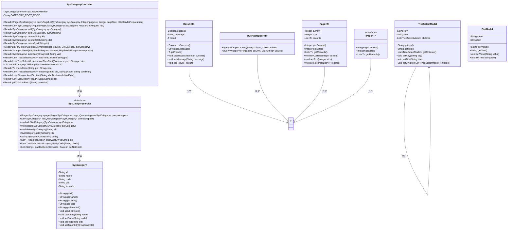

# 基础信息

|      |      |
|------|------|
| 名称 | SysCategoryController |
| 编码语言 | .java |
| 代码路径 | JeecgBoot/jeecg-boot/jeecg-module-system/jeecg-system-biz/src/main/java/org/jeecg/modules/system/controller/SysCategoryController.java |
| 包名 | org.jeecg.modules.system.controller |
| 依赖项 | ['com.alibaba.fastjson.JSON', 'com.baomidou.mybatisplus.core.conditions.query.LambdaQueryWrapper', 'com.baomidou.mybatisplus.core.conditions.query.QueryWrapper', 'com.baomidou.mybatisplus.core.metadata.IPage', 'com.baomidou.mybatisplus.extension.plugins.pagination.Page', 'lombok.extern.slf4j.Slf4j', 'org.apache.commons.lang.StringUtils', 'org.apache.shiro.SecurityUtils', 'org.jeecg.common.api.vo.Result', 'org.jeecg.common.config.TenantContext', 'org.jeecg.common.constant.CommonConstant', 'org.jeecg.common.system.query.QueryGenerator', 'org.jeecg.common.system.vo.DictModel', 'org.jeecg.common.system.vo.LoginUser', 'org.jeecg.common.util.ImportExcelUtil', 'org.jeecg.common.util.ReflectHelper', 'org.jeecg.common.util.oConvertUtils', 'org.jeecg.config.mybatis.MybatisPlusSaasConfig', 'org.jeecg.modules.system.entity.SysCategory', 'org.jeecg.modules.system.model.TreeSelectModel', 'org.jeecg.modules.system.service.ISysCategoryService', 'org.jeecgframework.poi.excel.ExcelImportUtil', 'org.jeecgframework.poi.excel.def.NormalExcelConstants', 'org.jeecgframework.poi.excel.entity.ExportParams', 'org.jeecgframework.poi.excel.entity.ImportParams', 'org.jeecgframework.poi.excel.view.JeecgEntityExcelView', 'org.springframework.beans.factory.annotation.Autowired', 'org.springframework.web.bind.annotation', 'org.springframework.web.multipart.MultipartFile', 'org.springframework.web.multipart.MultipartHttpServletRequest', 'org.springframework.web.servlet.ModelAndView', 'javax.servlet.http.HttpServletRequest', 'javax.servlet.http.HttpServletResponse', 'java.io.IOException', 'java.util', 'java.util.stream.Collectors'] |
| 概述说明 | SysCategoryController负责分类字典的增删改查、分页查询、导出导入及树结构加载操作。 |

# 说明

SysCategoryController负责管理分类字典的各项操作，包括新增、删除、修改和查询等基本功能。此外，它还支持分页查询，以便高效处理大量数据。该控制器还提供了数据导出和导入功能，方便数据的迁移和备份。同时，SysCategoryController能够加载和处理树形结构数据，确保分类字典的层次关系清晰可见。通过这些功能，SysCategoryController实现了对分类字典的全面管理和操作。

# 类列表 Class Summary

| 名称   | 类型  | 说明 |
|-------|------|-------------|
| SysCategoryController | class | SysCategoryController处理分类字典的增删改查、分页查询、导出导入、树结构加载等操作。 |

## 类 SysCategoryController

|      |      |
|------|------|
| 访问范围 | @RestController;@RequestMapping("/sys/category");@Slf4j;public |
| 类型 | class |
| 名称 | SysCategoryController |
| 说明 | SysCategoryController处理分类字典的增删改查、分页查询、导出导入、树结构加载等操作。 |

### UML类图

**描述：**
`SysCategoryController` 是一个用于管理系统分类的控制器，提供了分页查询、添加、编辑、删除、导入导出等功能。它依赖于 `ISysCategoryService` 接口来实现具体的业务逻辑。`SysCategory` 是分类的实体类，包含了分类的基本信息。`Result` 是一个通用的返回结果类，用于封装操作结果。`QueryWrapper` 和 `Page` 是用于构建查询条件和分页信息的工具类。`TreeSelectModel` 和 `DictModel` 是用于树形结构和字典数据的模型类。

### 内部方法调用关系图

```mermaid
graph TD
    A["类SysCategoryController"]
    B["属性: ISysCategoryService sysCategoryService"]
    C["常量: CATEGORY_ROOT_CODE = '0'"]
    D["方法: Result<IPage<SysCategory>> queryPageList(SysCategory sysCategory, Integer pageNo, Integer pageSize, HttpServletRequest req)"]
    E["方法: Result<List<SysCategory>> queryPageList(SysCategory sysCategory, HttpServletRequest req)"]
    F["方法: Result<SysCategory> add(@RequestBody SysCategory sysCategory)"]
    G["方法: Result<SysCategory> edit(@RequestBody SysCategory sysCategory)"]
    H["方法: Result<SysCategory> delete(@RequestParam String id)"]
    I["方法: Result<SysCategory> deleteBatch(@RequestParam String ids)"]
    J["方法: Result<SysCategory> queryById(@RequestParam String id)"]
    K["方法: ModelAndView exportXls(HttpServletRequest request, SysCategory sysCategory)"]
    L["方法: Result<?> importExcel(HttpServletRequest request, HttpServletResponse response)"]
    M["方法: Result<SysCategory> loadOne(@RequestParam String field, @RequestParam String val)"]
    N["方法: Result<List<TreeSelectModel>> loadTreeChildren(@RequestParam String pid)"]
    O["方法: Result<List<TreeSelectModel>> loadTreeRoot(@RequestParam Boolean async, @RequestParam String pcode)"]
    P["方法: void loadAllCategoryChildren(List<TreeSelectModel> ls)"]
    Q["方法: Result<?> checkCode(@RequestParam String pid, @RequestParam String code)"]
    R["方法: Result<List<TreeSelectModel>> loadDict(@RequestParam String pid, @RequestParam String pcode, @RequestParam String condition)"]
    S["方法: Result<List<String>> loadDictItem(@RequestParam String ids, @RequestParam boolean delNotExist)"]
    T["方法: Result<List<DictModel>> loadAllData(@RequestParam String code)"]
    U["方法: Result getChildListBatch(@RequestParam String parentIds)"]

    A --> B
    A --> C
    A --> D
    A --> E
    A --> F
    A --> G
    A --> H
    A --> I
    A --> J
    A --> K
    A --> L
    A --> M
    A --> N
    A --> O
    A --> P
    A --> Q
    A --> R
    A --> S
    A --> T
    A --> U
```

**流程图描述：**

该流程图展示了`SysCategoryController`类的主要结构及其内部方法。该类是一个Spring Boot控制器，负责处理与系统分类相关的HTTP请求。它包含多个方法，分别用于分页查询、添加、编辑、删除、导出Excel、导入Excel等操作。每个方法都通过HTTP请求的不同路径和参数来处理特定的业务逻辑。流程图清晰地展示了类与属性、常量以及各个方法之间的调用关系，帮助开发者快速理解代码的结构和功能。

### 字段列表 Field List

| 名称  | 类型  | 说明 |
|-------|-------|------|
| CATEGORY_ROOT_CODE = "0" | String | 定义常量CATEGORY_ROOT_CODE，值为字符串"0"。 |
| sysCategoryService | ISysCategoryService | 自动注入系统分类服务实例。 |

### 方法列表 Method List

| 名称  | 类型  | 说明 |
|-------|-------|------|
| queryById | Result<SysCategory> | 通过ID查询系统分类信息，返回结果或错误提示。 |
| queryPageList | Result<List<SysCategory>> | 获取子类列表，支持多租户数据隔离，返回查询结果。 |
| deleteBatch | Result<SysCategory> | 批量删除系统分类，检查参数后执行删除操作并返回结果。 |
| loadAllCategoryChildren | void | 递归加载所有子类目并设置子节点。 |
| loadOne | Result<SysCategory> | GET请求加载数据，验证字段并防止SQL注入，返回查询结果。 |
| loadDictItem | Result<List<String>> | GET请求加载字典项，检查ids非空，查询数据并返回结果。 |
| exportXls | ModelAndView | 导出分类字典Excel，支持多租户数据隔离，按条件查询并过滤选中数据。 |
| add | Result<SysCategory> | POST请求添加系统分类，成功返回成功信息，失败返回错误信息。 |
| loadTreeChildren | Result<List<TreeSelectModel>> | 通过GET请求加载树形子节点，根据父节点ID查询并返回结果。 |
| loadTreeRoot | Result<List<TreeSelectModel>> | GET请求加载树根节点，支持异步加载，返回树结构数据。 |
| loadDict | Result<List<TreeSelectModel>> | GET请求加载树数据，检查pid和pcode参数，查询并返回分类字典树列表。 |
| importExcel | Result<?> | 处理Excel导入，校验分类编码，记录成功与错误行数，返回导入结果。 |
| edit | Result<SysCategory> | 处理PUT/POST请求，更新SysCategory实体，返回操作结果。 |
| delete | Result<SysCategory> | 删除接口，根据ID删除实体，成功返回删除成功，失败返回未找到实体。 |
| getChildListBatch | Result | 通过父ID批量查询子节点列表，返回分页结果，异常时记录日志并返回错误信息。 |
| checkCode | Result<?> | 检查编码是否符合规范，空编码返回错误，空父ID返回成功，编码需以父编码开头。 |
| loadAllData | Result<List<DictModel>> | GET请求加载数据，根据code参数查询SysCategory，返回DictModel列表，处理无数据情况。 |
| queryPageList | Result<IPage<SysCategory>> | GET请求查询分类字典列表，支持分页和多租户数据隔离，处理查询条件后返回结果。 |

