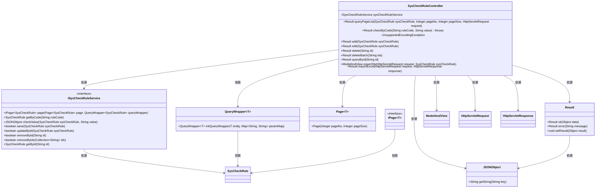
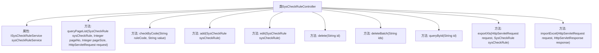

# 基础信息

|      |      |
|------|------|
| 名称 | SysCheckRuleController |
| 编码语言 | .java |
| 代码路径 | JeecgBoot/jeecg-boot/jeecg-module-system/jeecg-system-biz/src/main/java/org/jeecg/modules/system/controller/SysCheckRuleController.java |
| 包名 | org.jeecg.modules.system.controller |
| 依赖项 | ['com.alibaba.fastjson.JSONObject', 'com.baomidou.mybatisplus.core.conditions.query.QueryWrapper', 'com.baomidou.mybatisplus.core.metadata.IPage', 'com.baomidou.mybatisplus.extension.plugins.pagination.Page', 'io.swagger.v3.oas.annotations.Operation', 'io.swagger.v3.oas.annotations.tags.Tag', 'lombok.extern.slf4j.Slf4j', 'org.jeecg.common.api.vo.Result', 'org.jeecg.common.aspect.annotation.AutoLog', 'org.jeecg.common.system.base.controller.JeecgController', 'org.jeecg.common.system.query.QueryGenerator', 'org.jeecg.modules.system.entity.SysCheckRule', 'org.jeecg.modules.system.service.ISysCheckRuleService', 'org.springframework.beans.factory.annotation.Autowired', 'org.springframework.web.bind.annotation', 'org.springframework.web.servlet.ModelAndView', 'javax.servlet.http.HttpServletRequest', 'javax.servlet.http.HttpServletResponse', 'java.io.UnsupportedEncodingException', 'java.net.URLDecoder', 'java.util.Arrays'] |
| 概述说明 | 编码校验规则控制器具备分页查询、增删改查、批量操作及数据导入导出功能。 |

# 说明

编码校验规则控制器是一个功能全面的管理工具，支持多种操作。它允许用户进行分页查询，方便浏览大量数据。用户可以添加新的校验规则，编辑现有规则以满足需求，或删除不再需要的规则。此外，该控制器还支持批量删除功能，提高处理效率。用户可以通过查询功能快速定位特定规则，并通过导出功能将数据保存为外部文件。同时，导入功能使得用户可以轻松地将外部数据加载到系统中。这些功能共同确保了编码校验规则的高效管理和灵活操作。

# 类列表 Class Summary

| 名称   | 类型  | 说明 |
|-------|------|-------------|
| SysCheckRuleController | class | 编码校验规则控制器，支持分页查询、添加、编辑、删除、批量删除、查询、导出和导入功能。 |

## 类 SysCheckRuleController

|      |      |
|------|------|
| 访问范围 | @Slf4j;@Tag(name = "编码校验规则");@RestController;@RequestMapping("/sys/checkRule");public |
| 类型 | class |
| 名称 | SysCheckRuleController |
| 说明 | 编码校验规则控制器，支持分页查询、添加、编辑、删除、批量删除、查询、导出和导入功能。 |

### UML类图

**描述：**  
`SysCheckRuleController` 是一个基于Spring Boot的控制器，负责处理与编码校验规则相关的HTTP请求。它依赖于 `ISysCheckRuleService` 接口来执行具体的业务逻辑，如分页查询、添加、编辑、删除等操作。控制器通过 `Result` 类返回操作结果，并使用 `Page` 和 `QueryWrapper` 类来处理分页和查询条件。此外，它还处理Excel文件的导入和导出，通过 `ModelAndView` 返回视图。整个类图展示了控制器与各个服务类和工具类之间的依赖关系。

### 内部方法调用关系图

这段代码是一个Spring Boot控制器类，名为`SysCheckRuleController`，用于处理与编码校验规则相关的HTTP请求。该类提供了多种方法，包括分页查询、通过编码校验值、添加、编辑、删除、批量删除、通过ID查询、导出Excel和导入Excel等功能。每个方法都通过不同的HTTP请求类型（如GET、POST、PUT、DELETE）来处理相应的业务逻辑，并返回相应的结果。

### 字段列表 Field List

| 名称  | 类型  | 说明 |
|-------|-------|------|
| sysCheckRuleService | ISysCheckRuleService | 自动注入系统检查规则服务实例。 |

### 方法列表 Method List

| 名称  | 类型  | 说明 |
|-------|-------|------|
| importExcel | Result | POST请求处理Excel导入，返回结果。 |
| delete | Result | 通过ID删除编码校验规则，返回删除成功结果。 |
| queryById | Result | 通过ID查询编码校验规则并返回结果。 |
| add | Result | 通过POST请求添加编码校验规则，成功后返回添加成功信息。 |
| edit | Result | 编码校验规则编辑接口，支持PUT和POST请求，返回编辑成功结果。 |
| exportXls | ModelAndView | 通过RequestMapping映射导出Xls文件，调用父类方法处理请求。 |
| queryPageList | Result | 编码校验规则分页查询接口，支持页码和页数参数，返回分页结果。 |
| deleteBatch | Result | 编码校验规则批量删除接口，通过传入ID列表实现批量删除操作。 |
| checkByCode | Result | 通过Code校验传入值，返回校验结果或错误信息。 |

