# 基础信息

|      |      |
|------|------|
| 名称 | SysCommentController |
| 编码语言 | .java |
| 代码路径 | JeecgBoot/jeecg-boot/jeecg-module-system/jeecg-system-biz/src/main/java/org/jeecg/modules/system/controller/SysCommentController.java |
| 包名 | org.jeecg.modules.system.controller |
| 依赖项 | ['com.baomidou.mybatisplus.core.conditions.query.QueryWrapper', 'com.baomidou.mybatisplus.core.metadata.IPage', 'com.baomidou.mybatisplus.extension.plugins.pagination.Page', 'io.swagger.v3.oas.annotations.Operation', 'io.swagger.v3.oas.annotations.tags.Tag', 'lombok.extern.slf4j.Slf4j', 'org.apache.shiro.SecurityUtils', 'org.jeecg.common.api.dto.DataLogDTO', 'org.jeecg.common.api.vo.Result', 'org.jeecg.common.constant.CommonConstant', 'org.jeecg.common.system.api.ISysBaseAPI', 'org.jeecg.common.system.base.controller.JeecgController', 'org.jeecg.common.system.query.QueryGenerator', 'org.jeecg.common.system.vo.LoginUser', 'org.jeecg.modules.system.entity.SysComment', 'org.jeecg.modules.system.service.ISysCommentService', 'org.jeecg.modules.system.vo.SysCommentFileVo', 'org.jeecg.modules.system.vo.SysCommentVO', 'org.springframework.beans.factory.annotation.Autowired', 'org.springframework.beans.factory.annotation.Value', 'org.springframework.web.bind.annotation', 'org.springframework.web.servlet.ModelAndView', 'javax.servlet.http.HttpServletRequest', 'javax.servlet.http.HttpServletResponse', 'java.util.Arrays', 'java.util.List'] |
| 概述说明 | 系统评论回复控制器支持查询、添加、删除、编辑及文件管理。 |

# 说明

系统评论回复表控制器是一个功能全面的管理工具，主要用于处理评论相关的操作。它支持评论的查询、添加、删除和编辑，确保用户能够灵活管理评论内容。此外，该控制器还具备文件管理功能，便于用户在处理评论时进行相关文件的上传、下载或删除操作。通过这一控制器，用户可以高效地维护和管理系统中的评论数据及其相关文件。

# 类列表 Class Summary

| 名称   | 类型  | 说明 |
|-------|------|-------------|
| SysCommentController | class | 系统评论回复表控制器，提供评论查询、添加、删除、编辑及文件管理功能。 |

## 类 SysCommentController

|      |      |
|------|------|
| 访问范围 | @Tag(name = "系统评论回复表");@RestController;@RequestMapping("/sys/comment");@Slf4j;public |
| 类型 | class |
| 名称 | SysCommentController |
| 说明 | 系统评论回复表控制器，提供评论查询、添加、删除、编辑及文件管理功能。 |

### UML类图

```mermaid
classDiagram
    class SysCommentController {
        -ISysCommentService sysCommentService
        -ISysBaseAPI sysBaseAPI
        -String onlinePreviewDomain
        +Result~IPage~SysCommentVO~~ queryListByForm(SysComment sysComment)
        +Result~IPage~SysCommentFileVo~~ queryFileList(SysComment sysComment)
        +Result~String~ addText(@RequestBody SysComment sysComment)
        +Result~String~ addFile(HttpServletRequest request)
        +Result~String~ appAddFile(HttpServletRequest request)
        +Result~String~ deleteOne(@RequestParam(name = "id", required = true) String id)
        +Result~String~ getFileViewDomain()
        +Result~IPage~SysComment~~ queryPageList(SysComment sysComment, Integer pageNo, Integer pageSize, HttpServletRequest req)
        +Result~String~ add(@RequestBody SysComment sysComment)
        +Result~String~ edit(@RequestBody SysComment sysComment)
        +Result~String~ delete(@RequestParam(name = "id", required = true) String id)
        +Result~String~ deleteBatch(@RequestParam(name = "ids", required = true) String ids)
        +Result~SysComment~ queryById(@RequestParam(name = "id", required = true) String id)
        +ModelAndView exportXls(HttpServletRequest request, SysComment sysComment)
        +Result~?~ importExcel(HttpServletRequest request, HttpServletResponse response)
    }

    class ISysCommentService {
        <<Interface>>
        +List~SysCommentVO~ queryFormCommentInfo(SysComment sysComment)
        +List~SysCommentFileVo~ queryFormFileList(String tableName, String tableDataId)
        +String saveOne(SysComment sysComment)
        +void saveOneFileComment(HttpServletRequest request)
        +void appSaveOneFileComment(HttpServletRequest request)
        +void deleteOne(String id)
        +IPage~SysComment~ page(Page~SysComment~ page, QueryWrapper~SysComment~ queryWrapper)
        +boolean save(SysComment sysComment)
        +boolean updateById(SysComment sysComment)
        +boolean removeById(String id)
        +boolean removeByIds(Collection~?~ ids)
        +SysComment getById(String id)
    }

    class ISysBaseAPI {
        <<Interface>>
        +void saveDataLog(DataLogDTO dataLog)
    }

    class SysComment {
        -String id
        -String tableName
        -String tableDataId
        -String commentContent
        -String createBy
        +String getId()
        +String getTableName()
        +String getTableDataId()
        +String getCommentContent()
        +String getCreateBy()
    }

    class SysCommentVO {
        -String id
        -String tableName
        -String tableDataId
        -String commentContent
        +String getId()
        +String getTableName()
        +String getTableDataId()
        +String getCommentContent()
    }

    class SysCommentFileVo {
        -String id
        -String tableName
        -String tableDataId
        -String filePath
        +String getId()
        +String getTableName()
        +String getTableDataId()
        +String getFilePath()
    }

    class DataLogDTO {
        -String tableName
        -String tableDataId
        -String logContent
        -String logType
        +DataLogDTO(String tableName, String tableDataId, String logContent, String logType)
        +String getTableName()
        +String getTableDataId()
        +String getLogContent()
        +String getLogType()
    }

    class LoginUser {
        -String username
        +String getUsername()
    }

    class Result~T~ {
        -T data
        -String msg
        +Result~T~(T data, String msg)
        +T getData()
        +String getMsg()
    }

    class IPage~T~ {
        -List~T~ records
        +List~T~ getRecords()
        +void setRecords(List~T~ records)
    }

    class Page~T~ {
        -int pageNo
        -int pageSize
        +Page~T~()
        +int getPageNo()
        +int getPageSize()
    }

    class QueryWrapper~T~ {
        +QueryWrapper~T~()
        +QueryWrapper~T~ initQueryWrapper(T entity, Map~String, String~ paramMap)
    }

    class ModelAndView {
        +ModelAndView()
    }

    class HttpServletRequest {
        +Map~String, String[]~ getParameterMap()
    }

    class HttpServletResponse {
        +void setContentType(String contentType)
    }

    SysCommentController --> ISysCommentService : 依赖
    SysCommentController --> ISysBaseAPI : 依赖
    SysCommentController --> SysComment : 依赖
    SysCommentController --> SysCommentVO : 依赖
    SysCommentController --> SysCommentFileVo : 依赖
    SysCommentController --> DataLogDTO : 依赖
    SysCommentController --> LoginUser : 依赖
    SysCommentController --> Result~T~ : 依赖
    SysCommentController --> IPage~T~ : 依赖
    SysCommentController --> Page~T~ : 依赖
    SysCommentController --> QueryWrapper~T~ : 依赖
    SysCommentController --> ModelAndView : 依赖
    SysCommentController --> HttpServletRequest : 依赖
    SysCommentController --> HttpServletResponse : 依赖
```

### 描述
该代码实现了一个系统评论回复表的控制器类 `SysCommentController`，它继承了 `JeecgController`，并依赖 `ISysCommentService` 和 `ISysBaseAPI` 接口。控制器提供了多种方法，包括查询评论和文件、添加和删除评论、导出和导入数据等。类图展示了控制器与多个服务类、数据模型类以及工具类之间的依赖关系，反映了系统评论回复表功能模块的整体结构。

### 内部方法调用关系图

```mermaid
graph TD
    A["类SysCommentController"]
    B["属性: ISysCommentService sysCommentService"]
    C["属性: ISysBaseAPI sysBaseAPI"]
    D["属性: String onlinePreviewDomain"]
    E["方法: Result<IPage<SysCommentVO>> queryListByForm(SysComment sysComment)"]
    F["方法: Result<IPage<SysCommentFileVo>> queryFileList(SysComment sysComment)"]
    G["方法: Result<String> addText(@RequestBody SysComment sysComment)"]
    H["方法: Result<String> addFile(HttpServletRequest request)"]
    I["方法: Result<String> appAddFile(HttpServletRequest request)"]
    J["方法: Result<String> deleteOne(@RequestParam(name = 'id', required = true) String id)"]
    K["方法: Result<String> getFileViewDomain()"]
    L["方法: Result<IPage<SysComment>> queryPageList(SysComment sysComment, Integer pageNo, Integer pageSize, HttpServletRequest req)"]
    M["方法: Result<String> add(@RequestBody SysComment sysComment)"]
    N["方法: Result<String> edit(@RequestBody SysComment sysComment)"]
    O["方法: Result<String> delete(@RequestParam(name = 'id', required = true) String id)"]
    P["方法: Result<String> deleteBatch(@RequestParam(name = 'ids', required = true) String ids)"]
    Q["方法: Result<SysComment> queryById(@RequestParam(name = 'id', required = true) String id)"]
    R["方法: ModelAndView exportXls(HttpServletRequest request, SysComment sysComment)"]
    S["方法: Result<?> importExcel(HttpServletRequest request, HttpServletResponse response)"]

    A --> B
    A --> C
    A --> D
    A --> E
    A --> F
    A --> G
    A --> H
    A --> I
    A --> J
    A --> K
    A --> L
    A --> M
    A --> N
    A --> O
    A --> P
    A --> Q
    A --> R
    A --> S
```

这段代码定义了一个名为 `SysCommentController` 的控制器类，用于处理系统评论相关的请求。该类包含了多个方法，分别用于查询评论列表、添加评论、删除评论、导出和导入数据等操作。每个方法都通过不同的HTTP请求类型（如GET、POST、DELETE等）来处理特定的业务逻辑。控制器还依赖于 `ISysCommentService` 和 `ISysBaseAPI` 两个服务类来实现具体的业务功能。

### 字段列表 Field List

| 名称  | 类型  | 说明 |
|-------|-------|------|
| sysCommentService | ISysCommentService | 自动注入系统评论服务实例。 |
| sysBaseAPI | ISysBaseAPI | 自动注入系统基础API接口实例。 |
| onlinePreviewDomain | String | 在线预览域名的配置变量。 |

### 方法列表 Method List

| 名称  | 类型  | 说明 |
|-------|-------|------|
| addText | Result<String> | 系统评论表接口，通过POST请求添加文本并返回评论ID。 |
| queryById | Result<SysComment> | 通过ID查询系统评论回复，返回结果或错误信息。 |
| edit | Result<String> | 系统评论回复表编辑接口，支持PUT和POST请求，更新评论后返回成功信息。 |
| exportXls | ModelAndView | 导出系统评论回复表至Excel文件。 |
| importExcel | Result<?> | 处理POST请求，导入Excel数据并返回结果。 |
| queryListByForm | Result<IPage<SysCommentVO>> | 查询系统评论回复表列表，返回分页结果。 |
| appAddFile | Result<String> | 系统评论表添加文件接口，处理文件上传并返回操作结果。 |
| delete | Result<String> | 通过ID删除系统评论回复表记录。 |
| deleteBatch | Result<String> | 系统评论回复表批量删除接口，通过ID列表删除多条记录。 |
| add | Result<String> | 系统评论回复表添加接口，保存评论并返回成功信息。 |
| queryFileList | Result<IPage<SysCommentFileVo>> | 查询系统评论回复表列表，返回分页结果。 |
| addFile | Result<String> | 系统评论表添加文件接口，处理文件上传并返回结果。 |
| deleteOne | Result<String> | 通过ID删除系统评论，仅管理员或评论创建者可删除，并记录日志。 |
| getFileViewDomain | Result<String> | 该方法通过GET请求返回文件预览域名。 |
| queryPageList | Result<IPage<SysComment>> | 查询系统评论回复表的分页列表，支持自定义页码和每页数量。 |

