# 基础信息

|      |      |
|------|------|
| 名称 | SysDataLogController |
| 编码语言 | .java |
| 代码路径 | JeecgBoot/jeecg-boot/jeecg-module-system/jeecg-system-biz/src/main/java/org/jeecg/modules/system/controller/SysDataLogController.java |
| 包名 | org.jeecg.modules.system.controller |
| 依赖项 | ['java.util.ArrayList', 'java.util.List', 'javax.servlet.http.HttpServletRequest', 'org.jeecg.common.api.vo.Result', 'org.jeecg.common.constant.CommonConstant', 'org.jeecg.common.system.query.QueryGenerator', 'org.jeecg.common.util.oConvertUtils', 'org.jeecg.modules.system.entity.SysDataLog', 'org.jeecg.modules.system.service.ISysDataLogService', 'org.springframework.beans.factory.annotation.Autowired', 'org.springframework.web.bind.annotation.RequestMapping', 'org.springframework.web.bind.annotation.RequestMethod', 'org.springframework.web.bind.annotation.RequestParam', 'org.springframework.web.bind.annotation.RestController', 'com.baomidou.mybatisplus.core.conditions.query.QueryWrapper', 'com.baomidou.mybatisplus.core.metadata.IPage', 'com.baomidou.mybatisplus.extension.plugins.pagination.Page', 'lombok.extern.slf4j.Slf4j'] |
| 概述说明 | SysDataLogController支持日志查询、对比和版本信息获取。 |

# 说明

SysDataLogController是一个功能模块，主要用于数据日志的管理和操作。它提供了数据日志的查询功能，用户可以通过该功能检索特定时间段或条件下的日志记录。此外，该控制器还支持日志对比功能，允许用户比较不同日志版本之间的差异，以便分析数据变化。同时，SysDataLogController还具备获取日志版本信息的能力，用户可以查看日志的历史版本及其相关信息，便于追踪和审计数据变更。这些功能共同构成了一个全面的数据日志管理系统，帮助用户更好地管理和分析日志数据。

# 类列表 Class Summary

| 名称   | 类型  | 说明 |
|-------|------|-------------|
| SysDataLogController | class | SysDataLogController提供数据日志查询、对比和版本信息获取功能。 |


## 类 SysDataLogController

|      |      |
|------|------|
| 访问范围 | @RestController;@RequestMapping("/sys/dataLog");@Slf4j;public |
| 类型 | class |
| 名称 | SysDataLogController |
| 说明 | SysDataLogController提供数据日志查询、对比和版本信息获取功能。 |


### UML类图

```mermaid
classDiagram
    class SysDataLogController {
        -ISysDataLogService service
        +queryPageList(SysDataLog dataLog, Integer pageNo, Integer pageSize, HttpServletRequest req) Result~IPage~SysDataLog~~
        +queryCompareList(HttpServletRequest req) Result~List~SysDataLog~~
        +queryDataVerList(HttpServletRequest req) Result~List~SysDataLog~~
    }

    class ISysDataLogService {
        <<Interface>>
        +page(Page~SysDataLog~ page, QueryWrapper~SysDataLog~ queryWrapper) IPage~SysDataLog~
        +listByIds(List~String~ idList) List~SysDataLog~
        +list(QueryWrapper~SysDataLog~ queryWrapper) List~SysDataLog~
    }

    class Result~T~ {
        +boolean success
        +T result
        +setSuccess(boolean success)
        +setResult(T result)
    }

    class IPage~T~ {
        +int getCurrent()
        +int getSize()
        +List~T~ getRecords()
        +long getTotal()
    }

    class QueryWrapper~T~ {
        +initQueryWrapper(T entity, Map~String, String~ paramMap) QueryWrapper~T~
        +eq(String column, Object value) QueryWrapper~T~
        +orderByDesc(String column) QueryWrapper~T~
    }

    class Page~T~ {
        +Page(Integer pageNo, Integer pageSize)
    }

    class SysDataLog {
        -String type
        +setType(String type)
    }

    class HttpServletRequest {
        +getParameter(String name) String
        +getParameterMap() Map~String, String~
    }

    SysDataLogController --> ISysDataLogService : 依赖
    SysDataLogController --> Result~IPage~SysDataLog~~ : 依赖
    SysDataLogController --> Result~List~SysDataLog~~ : 依赖
    SysDataLogController --> QueryWrapper~SysDataLog~ : 依赖
    SysDataLogController --> Page~SysDataLog~ : 依赖
    SysDataLogController --> SysDataLog : 依赖
    SysDataLogController --> HttpServletRequest : 依赖
    ISysDataLogService --> IPage~SysDataLog~ : 依赖
    ISysDataLogService --> List~SysDataLog~ : 依赖
    QueryWrapper~SysDataLog~ --> SysDataLog : 依赖
    Page~SysDataLog~ --> SysDataLog : 依赖
```

### 描述
该代码定义了一个名为 `SysDataLogController` 的控制器类，用于处理与系统数据日志相关的HTTP请求。该类依赖于 `ISysDataLogService` 接口来执行具体的业务逻辑，如分页查询、对比数据查询和版本信息查询。`Result` 类用于封装返回结果，`IPage` 和 `QueryWrapper` 类分别用于分页和查询条件封装。`SysDataLog` 类表示数据日志实体，`HttpServletRequest` 类用于处理HTTP请求参数。整个类图展示了控制器与各服务类之间的依赖关系。


### 内部方法调用关系图

```mermaid
graph TD
    A["类SysDataLogController"]
    B["属性: ISysDataLogService service"]
    C["方法: queryPageList(SysDataLog dataLog, Integer pageNo, Integer pageSize, HttpServletRequest req)"]
    D["方法: queryCompareList(HttpServletRequest req)"]
    E["方法: queryDataVerList(HttpServletRequest req)"]
    F["构造方法: SysDataLogController()"]
    G["初始化: dataLog.setType(CommonConstant.DATA_LOG_TYPE_JSON)"]
    H["初始化: QueryWrapper<SysDataLog> queryWrapper = QueryGenerator.initQueryWrapper(dataLog, req.getParameterMap())"]
    I["初始化: Page<SysDataLog> page = new Page<SysDataLog>(pageNo, pageSize)"]
    J["调用: IPage<SysDataLog> pageList = service.page(page, queryWrapper)"]
    K["日志: log.info('查询当前页：'+pageList.getCurrent())"]
    L["日志: log.info('查询当前页数量：'+pageList.getSize())"]
    M["日志: log.info('查询结果数量：'+pageList.getRecords().size())"]
    N["日志: log.info('数据总数：'+pageList.getTotal())"]
    O["设置: result.setSuccess(true)"]
    P["设置: result.setResult(pageList)"]
    Q["返回: return result"]
    R["初始化: Result<List<SysDataLog>> result = new Result<>()"]
    S["获取: String dataId1 = req.getParameter('dataId1')"]
    T["获取: String dataId2 = req.getParameter('dataId2')"]
    U["初始化: List<String> idList = new ArrayList<String>()"]
    V["添加: idList.add(dataId1)"]
    W["添加: idList.add(dataId2)"]
    X["调用: List<SysDataLog> list = (List<SysDataLog>) service.listByIds(idList)"]
    Y["设置: result.setResult(list)"]
    Z["设置: result.setSuccess(true)"]
    AA["捕获异常: catch (Exception e)"]
    AB["日志: log.error(e.getMessage(),e)"]
    AC["返回: return result"]
    AD["初始化: Result<List<SysDataLog>> result = new Result<>()"]
    AE["获取: String dataTable = req.getParameter('dataTable')"]
    AF["获取: String dataId = req.getParameter('dataId')"]
    AG["初始化: QueryWrapper<SysDataLog> queryWrapper = new QueryWrapper<SysDataLog>()"]
    AH["设置: queryWrapper.eq('data_table', dataTable)"]
    AI["设置: queryWrapper.eq('data_id', dataId)"]
    AJ["获取: String type = req.getParameter('type')"]
    AK["判断: if (oConvertUtils.isNotEmpty(type))"]
    AL["设置: queryWrapper.eq('type', type)"]
    AM["设置: queryWrapper.orderByDesc('create_time')"]
    AN["调用: List<SysDataLog> list = service.list(queryWrapper)"]
    AO["判断: if(list==null||list.size()<=0)"]
    AP["设置: result.error500('未找到版本信息')"]
    AQ["设置: result.setResult(list)"]
    AR["设置: result.setSuccess(true)"]
    AS["返回: return result"]

    A --> B
    A --> C
    A --> D
    A --> E
    A -.-> F
    C --> G
    C --> H
    C --> I
    C --> J
    C --> K
    C --> L
    C --> M
    C --> N
    C --> O
    C --> P
    C --> Q
    D --> R
    D --> S
    D --> T
    D --> U
    D --> V
    D --> W
    D --> X
    D --> Y
    D --> Z
    D --> AA
    AA --> AB
    D --> AC
    E --> AD
    E --> AE
    E --> AF
    E --> AG
    E --> AH
    E --> AI
    E --> AJ
    E --> AK
    AK --> AL
    E --> AM
    E --> AN
    E --> AO
    AO --> AP
    E --> AQ
    E --> AR
    E --> AS
```



该流程图展示了`SysDataLogController`类的三个主要方法：`queryPageList`、`queryCompareList`和`queryDataVerList`。每个方法从请求参数中获取数据，调用服务层进行数据处理，并返回结果。`queryPageList`方法用于分页查询数据日志，`queryCompareList`方法用于查询对比数据，`queryDataVerList`方法用于查询版本信息。每个方法都包含初始化、数据处理、日志记录和结果返回的步骤，确保流程清晰且逻辑严谨。

### 字段列表 Field List

| 名称  | 类型  | 说明 |
|-------|-------|------|
| service | ISysDataLogService | 自动注入ISysDataLogService服务实例。 |

### 方法列表 Method List

| 名称  | 类型  | 说明 |
|-------|-------|------|
| queryDataVerList | Result<List<SysDataLog>> | 查询数据版本列表，按条件筛选并按时间倒序排列。 |
| queryCompareList | Result<List<SysDataLog>> | 通过GET请求查询两个数据ID的日志列表并返回结果。 |
| queryPageList | Result<IPage<SysDataLog>> | 查询数据日志列表，分页显示，返回结果包含当前页、数量、总数及日志类型。 |


