# 基础信息

|      |      |
|------|------|
| 名称 | SysDataSourceController |
| 编码语言 | .java |
| 代码路径 | JeecgBoot/jeecg-boot/jeecg-module-system/jeecg-system-biz/src/main/java/org/jeecg/modules/system/controller/SysDataSourceController.java |
| 包名 | org.jeecg.modules.system.controller |
| 依赖项 | ['com.alibaba.fastjson.JSONArray', 'com.alibaba.fastjson.JSONObject', 'com.baomidou.dynamic.datasource.DynamicRoutingDataSource', 'com.baomidou.mybatisplus.core.conditions.query.QueryWrapper', 'com.baomidou.mybatisplus.core.metadata.IPage', 'com.baomidou.mybatisplus.extension.plugins.pagination.Page', 'io.swagger.v3.oas.annotations.Operation', 'io.swagger.v3.oas.annotations.tags.Tag', 'lombok.extern.slf4j.Slf4j', 'org.apache.commons.lang.StringUtils', 'org.apache.shiro.authz.annotation.RequiresPermissions', 'org.apache.shiro.authz.annotation.RequiresRoles', 'org.jeecg.common.api.vo.Result', 'org.jeecg.common.aspect.annotation.AutoLog', 'org.jeecg.common.config.TenantContext', 'org.jeecg.common.exception.JeecgBootException', 'org.jeecg.common.system.base.controller.JeecgController', 'org.jeecg.common.system.query.QueryGenerator', 'org.jeecg.common.util.dynamic.db.DataSourceCachePool', 'org.jeecg.common.util.oConvertUtils', 'org.jeecg.common.util.security.JdbcSecurityUtil', 'org.jeecg.config.mybatis.MybatisPlusSaasConfig', 'org.jeecg.modules.system.entity.SysDataSource', 'org.jeecg.modules.system.service.ISysDataSourceService', 'org.jeecg.modules.system.util.SecurityUtil', 'org.springframework.beans.factory.annotation.Autowired', 'org.springframework.web.bind.annotation', 'org.springframework.web.servlet.ModelAndView', 'javax.servlet.http.HttpServletRequest', 'javax.servlet.http.HttpServletResponse', 'javax.sql.DataSource', 'java.util.Arrays', 'java.util.List'] |
| 概述说明 | 多数据源管理控制器支持增删改查、批量操作及数据导入导出功能。 |

# 说明

多数据源管理控制器是一个功能全面的工具，支持多种数据操作。它提供了分页查询功能，便于高效浏览大量数据。用户可以通过该控制器进行数据的添加、编辑和删除操作，同时还支持批量删除，提高处理效率。查询功能允许用户根据特定条件筛选数据。此外，控制器还具备数据导出和导入功能，方便数据的迁移和备份。整体设计旨在简化数据管理流程，提升操作便捷性。

# 类列表 Class Summary

| 名称   | 类型  | 说明 |
|-------|------|-------------|
| SysDataSourceController | class | 多数据源管理控制器，支持分页查询、添加、编辑、删除、批量删除、查询、导出和导入功能。 |

## 类 SysDataSourceController

|      |      |
|------|------|
| 访问范围 | @Slf4j;@Tag(name = "多数据源管理");@RestController;@RequestMapping("/sys/dataSource");public |
| 类型 | class |
| 名称 | SysDataSourceController |
| 说明 | 多数据源管理控制器，支持分页查询、添加、编辑、删除、批量删除、查询、导出和导入功能。 |

### UML类图

```mermaid
classDiagram
    class SysDataSourceController {
        -ISysDataSourceService sysDataSourceService
        +Result~?~ queryPageList(SysDataSource sysDataSource, Integer pageNo, Integer pageSize, HttpServletRequest req)
        +Result~?~ queryOptions(SysDataSource sysDataSource, HttpServletRequest req)
        +Result~?~ add(SysDataSource sysDataSource)
        +Result~?~ edit(SysDataSource sysDataSource)
        +Result~?~ delete(String id)
        +Result~?~ deleteBatch(String ids)
        +Result~?~ queryById(String id)
        +ModelAndView exportXls(HttpServletRequest request, SysDataSource sysDataSource)
        +Result~?~ importExcel(HttpServletRequest request, HttpServletResponse response)
    }

    class ISysDataSourceService {
        <<Interface>>
        +IPage~SysDataSource~ page(Page~SysDataSource~ page, QueryWrapper~SysDataSource~ queryWrapper)
        +List~SysDataSource~ list(QueryWrapper~SysDataSource~ queryWrapper)
        +Result~?~ saveDataSource(SysDataSource sysDataSource)
        +Result~?~ editDataSource(SysDataSource sysDataSource)
        +Result~?~ deleteDataSource(String id)
        +SysDataSource getById(String id)
        +void removeByIds(List~String~ idList)
    }

    class JeecgController~T, S~ {
        +ModelAndView exportXls(HttpServletRequest request, T entity, Class~T~ clazz, String title)
        +Result~?~ importExcel(HttpServletRequest request, HttpServletResponse response, Class~T~ clazz)
    }

    class SysDataSource {
        -String tenantId
        -String dbUrl
        -String dbPassword
        -String code
        -String name
        +void setTenantId(Integer tenantId)
        +String getDbUrl()
        +String getDbPassword()
        +void setDbPassword(String dbPassword)
        +String getCode()
        +String getName()
    }

    class QueryWrapper~T~ {
        +QueryWrapper~T~ initQueryWrapper(T entity, Map~String, String[]~ parameterMap)
    }

    class Page~T~ {
        +Page(Integer pageNo, Integer pageSize)
    }

    class IPage~T~ {
        <<Interface>>
    }

    class Result~T~ {
        +static Result~T~ ok(T data)
        +static Result~T~ error(String message)
    }

    class JSONArray {
        +void add(JSONObject obj)
    }

    class JSONObject {
        +void put(String key, Object value)
    }

    class JdbcSecurityUtil {
        +static void validate(String dbUrl)
    }

    class SecurityUtil {
        +static String jiemi(String encryptedStr)
    }

    class DataSourceCachePool {
        +static void removeCache(String code)
    }

    class MybatisPlusSaasConfig {
        +static boolean OPEN_SYSTEM_TENANT_CONTROL
    }

    class TenantContext {
        +static String getTenant()
    }

    class oConvertUtils {
        +static Integer getInt(String str, Integer defaultValue)
    }

    SysDataSourceController --> ISysDataSourceService : 依赖
    SysDataSourceController --> JeecgController~SysDataSource, ISysDataSourceService~ : 继承
    ISysDataSourceService --> Page~SysDataSource~ : 使用
    ISysDataSourceService --> QueryWrapper~SysDataSource~ : 使用
    ISysDataSourceService --> IPage~SysDataSource~ : 使用
    SysDataSourceController --> Result~?~ : 使用
    SysDataSourceController --> JSONArray : 使用
    SysDataSourceController --> JSONObject : 使用
    SysDataSourceController --> JdbcSecurityUtil : 使用
    SysDataSourceController --> SecurityUtil : 使用
    SysDataSourceController --> DataSourceCachePool : 使用
    SysDataSourceController --> MybatisPlusSaasConfig : 使用
    SysDataSourceController --> TenantContext : 使用
    SysDataSourceController --> oConvertUtils : 使用
```

### 描述
`SysDataSourceController` 是一个用于管理多数据源的控制器，继承自 `JeecgController`，并依赖于 `ISysDataSourceService` 接口。它提供了分页查询、添加、编辑、删除、批量删除、通过ID查询、导出Excel和导入Excel等功能。在处理数据源时，控制器会检查是否开启了多租户数据隔离，并使用了 `JdbcSecurityUtil` 来验证JDBC连接地址的安全性。此外，控制器还使用了 `JSONArray` 和 `JSONObject` 来处理返回数据，并通过 `DataSourceCachePool` 管理数据源缓存。

### 内部方法调用关系图

```mermaid
graph TD
    A["类SysDataSourceController"]
    B["属性: ISysDataSourceService sysDataSourceService"]
    C["方法: queryPageList(SysDataSource sysDataSource, Integer pageNo, Integer pageSize, HttpServletRequest req)"]
    D["方法: queryOptions(SysDataSource sysDataSource, HttpServletRequest req)"]
    E["方法: add(@RequestBody SysDataSource sysDataSource)"]
    F["方法: edit(@RequestBody SysDataSource sysDataSource)"]
    G["方法: delete(@RequestParam(name = 'id') String id)"]
    H["方法: deleteBatch(@RequestParam(name = 'ids') String ids)"]
    I["方法: queryById(@RequestParam(name = 'id') String id)"]
    J["方法: exportXls(HttpServletRequest request, SysDataSource sysDataSource)"]
    K["方法: importExcel(HttpServletRequest request, HttpServletResponse response)"]

    A --> B
    A --> C
    A --> D
    A --> E
    A --> F
    A --> G
    A --> H
    A --> I
    A --> J
    A --> K
```

这段代码定义了一个名为 `SysDataSourceController` 的控制器类，用于管理多数据源的相关操作。类中包含多个方法，分别用于分页查询、查询选项、添加、编辑、删除、批量删除、通过ID查询、导出Excel和导入Excel等功能。每个方法都通过HTTP请求映射到特定的URL路径，并且部分方法还涉及多租户数据隔离和安全验证等逻辑。

### 字段列表 Field List

| 名称  | 类型  | 说明 |
|-------|-------|------|
| sysDataSourceService | ISysDataSourceService | 自动注入系统数据源服务实例。 |

### 方法列表 Method List

| 名称  | 类型  | 说明 |
|-------|-------|------|
| add | Result<?> | 通过POST请求添加多数据源，验证JDBC连接地址后保存数据源。 |
| queryById | Result<?> | 通过ID查询多数据源，解密密码后返回结果。 |
| importExcel | Result<?> | 处理POST请求，导入Excel数据并返回结果。 |
| delete | Result<?> | 多数据源管理接口，通过ID删除数据源。 |
| deleteBatch | Result<?> | 多数据源管理批量删除接口，接收ID列表，删除缓存及数据源。 |
| exportXls | ModelAndView | 该方法处理导出Excel请求，支持多租户数据隔离，返回多数据源管理视图。 |
| queryOptions | Result<?> | 查询系统数据源选项，支持多租户数据隔离，返回JSON格式结果。 |
| edit | Result<?> | 多数据源管理编辑接口，验证JDBC连接地址安全性后更新数据源。 |
| queryPageList | Result<?> | 多数据源管理分页查询，支持多租户隔离，返回分页结果。 |

