# 基础信息

|      |      |
|------|------|
| 名称 | SysDepartController |
| 编码语言 | .java |
| 代码路径 | JeecgBoot/jeecg-boot/jeecg-module-system/jeecg-system-biz/src/main/java/org/jeecg/modules/system/controller/SysDepartController.java |
| 包名 | org.jeecg.modules.system.controller |
| 依赖项 | ['com.alibaba.fastjson.JSONObject', 'com.baomidou.mybatisplus.core.conditions.query.LambdaQueryWrapper', 'com.baomidou.mybatisplus.core.conditions.query.QueryWrapper', 'lombok.extern.slf4j.Slf4j', 'org.apache.commons.lang3.StringUtils', 'org.apache.shiro.SecurityUtils', 'org.apache.shiro.authz.annotation.RequiresPermissions', 'org.jeecg.common.api.vo.Result', 'org.jeecg.common.config.TenantContext', 'org.jeecg.common.constant.CacheConstant', 'org.jeecg.common.constant.CommonConstant', 'org.jeecg.common.system.query.QueryGenerator', 'org.jeecg.common.system.util.JwtUtil', 'org.jeecg.common.system.vo.LoginUser', 'org.jeecg.common.util.ImportExcelUtil', 'org.jeecg.common.util.RedisUtil', 'org.jeecg.common.util.YouBianCodeUtil', 'org.jeecg.common.util.oConvertUtils', 'org.jeecg.config.mybatis.MybatisPlusSaasConfig', 'org.jeecg.modules.system.entity.SysDepart', 'org.jeecg.modules.system.entity.SysUser', 'org.jeecg.modules.system.model.DepartIdModel', 'org.jeecg.modules.system.model.SysDepartTreeModel', 'org.jeecg.modules.system.service.ISysDepartService', 'org.jeecg.modules.system.service.ISysUserDepartService', 'org.jeecg.modules.system.service.ISysUserService', 'org.jeecg.modules.system.vo.SysDepartExportVo', 'org.jeecg.modules.system.vo.lowapp.ExportDepartVo', 'org.jeecgframework.poi.excel.ExcelImportUtil', 'org.jeecgframework.poi.excel.def.NormalExcelConstants', 'org.jeecgframework.poi.excel.entity.ExportParams', 'org.jeecgframework.poi.excel.entity.ImportParams', 'org.jeecgframework.poi.excel.view.JeecgEntityExcelView', 'org.springframework.beans.factory.annotation.Autowired', 'org.springframework.cache.annotation.CacheEvict', 'org.springframework.data.redis.core.RedisTemplate', 'org.springframework.web.bind.annotation', 'org.springframework.web.multipart.MultipartFile', 'org.springframework.web.multipart.MultipartHttpServletRequest', 'org.springframework.web.servlet.ModelAndView', 'javax.servlet.http.HttpServletRequest', 'javax.servlet.http.HttpServletResponse', 'java.io.IOException', 'java.util'] |
| 概述说明 | 部门管理系统支持查询、添加、编辑、删除、导入导出，树形展示和异步加载。 |

# 说明

该部门管理系统实现了多项核心功能，包括部门信息的查询、添加、编辑和删除操作，同时支持数据的导入和导出。系统采用树形结构展示部门层级关系，并具备异步加载能力，确保在处理大量数据时仍能保持高效响应。这些功能共同构成了一个全面且灵活的部门管理解决方案。

# 类列表 Class Summary

| 名称   | 类型  | 说明 |
|-------|------|-------------|
| SysDepartController | class | 该代码实现了一个部门管理系统，包含查询、添加、编辑、删除、导入导出等功能，支持树形结构展示和异步加载。 |

## 类 SysDepartController

|      |      |
|------|------|
| 访问范围 | @RestController;@RequestMapping("/sys/sysDepart");@Slf4j;public |
| 类型 | class |
| 名称 | SysDepartController |
| 说明 | 该代码实现了一个部门管理系统，包含查询、添加、编辑、删除、导入导出等功能，支持树形结构展示和异步加载。 |

### UML类图

```mermaid
classDiagram
    class SysDepartController {
        -ISysDepartService sysDepartService
        -RedisTemplate~String, Object~ redisTemplate
        -ISysUserService sysUserService
        -ISysUserDepartService sysUserDepartService
        -RedisUtil redisUtil
        +Result~List~SysDepartTreeModel~~ queryMyDeptTreeList()
        +Result~List~SysDepartTreeModel~~ queryTreeList(String ids)
        +Result~List~SysDepartTreeModel~~ queryDepartTreeSync(String parentId, String ids, String primaryKey)
        +Result queryParentIds(String departId, String orgCode)
        +Result~SysDepart~ add(SysDepart sysDepart, HttpServletRequest request)
        +Result~SysDepart~ edit(SysDepart sysDepart, HttpServletRequest request)
        +Result~SysDepart~ delete(String id)
        +Result~SysDepart~ deleteBatch(String ids)
        +Result~List~DepartIdModel~~ queryIdTree()
        +Result~List~SysDepartTreeModel~~ searchBy(String keyWord, String myDeptSearch)
        +ModelAndView exportXls(SysDepart sysDepart, HttpServletRequest request)
        +Result~?~ importExcel(HttpServletRequest request, HttpServletResponse response)
        +Result~List~SysDepart~~ listAll(String id)
        +Result~Map~String,Object~~ queryTreeByKeyWord(String keyWord)
        +Result~SysDepart~ getDepartName(String orgCode)
        +Result~List~SysUser~~ getUsersByDepartId(String id)
        +Result~Collection~SysDepart~~ queryByIds(String deptIds)
        +Result~List~SysDepart~~ getMyDepartList()
        +Result~List~SysDepartTreeModel~~ queryBookDepTreeSync(String parentId, Integer tenantId, String departName)
        +Result~List~SysUser~~ getUsersByDepartTenantId(String departId)
        +ModelAndView appExportXls(SysDepart sysDepart, HttpServletRequest request)
        +Result~?~ appImportExcel(HttpServletRequest request, HttpServletResponse response)
    }

    class ISysDepartService {
        <<Interface>>
        +List~SysDepartTreeModel~ queryMyDeptTreeList(String departIds)
        +List~SysDepartTreeModel~ queryTreeList(String ids)
        +List~SysDepartTreeModel~ queryTreeListByPid(String parentId, String ids, String primaryKey)
        +JSONObject queryAllParentIdByDepartId(String departId)
        +JSONObject queryAllParentIdByOrgCode(String orgCode)
        +void saveDepartData(SysDepart sysDepart, String username)
        +boolean updateDepartDataById(SysDepart sysDepart, String username)
        +void deleteDepart(String id)
        +void deleteBatchWithChildren(List~String~ ids)
        +List~DepartIdModel~ queryDepartIdTreeList()
        +List~SysDepartTreeModel~ searchByKeyWord(String keyWord, String myDeptSearch, String departIds)
        +List~SysDepartTreeModel~ queryTreeByKeyWord(String keyWord)
        +List~SysDepartExportVo~ getExportDepart(Integer tenantId, List~String~ idList)
        +void importSysDepart(List~SysDepartExportVo~ listSysDeparts, List~String~ errorMessageList)
        +List~SysDepart~ list(LambdaQueryWrapper~SysDepart~ query)
        +List~SysDepartTreeModel~ queryBookDepTreeSync(String parentId, Integer tenantId, String departName)
        +List~SysUser~ getUsersByDepartTenantId(String departId, Integer tenantId)
        +List~ExportDepartVo~ getExcelDepart(Integer tenantId)
        +void importExcel(List~ExportDepartVo~ listSysDeparts, List~String~ errorMessageList)
    }

    class ISysUserService {
        <<Interface>>
        +List~SysUser~ list(LambdaQueryWrapper~SysUser~ query)
    }

    class ISysUserDepartService {
        <<Interface>>
        +List~SysUser~ queryUserByDepId(String id)
        +List~SysUser~ getUsersByDepartTenantId(String departId, Integer tenantId)
    }

    class RedisTemplate~String, Object~ {
        +void delete(List~String~ keys)
    }

    class RedisUtil {
        +List~String~ scan(String pattern)
    }

    class SysDepart {
        -String id
        -String orgCode
        -String parentId
        -String orgType
        -String orgCategory
        -String delFlag
        -String createBy
        -String updateBy
    }

    class SysDepartTreeModel {
        -String id
        -String orgCode
        -String parentId
        -String orgType
        -String orgCategory
        -String delFlag
        -String createBy
        -String updateBy
    }

    class DepartIdModel {
        -String id
        -String orgCode
        -String parentId
        -String orgType
        -String orgCategory
        -String delFlag
        -String createBy
        -String updateBy
    }

    class SysDepartExportVo {
        -String id
        -String orgCode
        -String parentId
        -String orgType
        -String orgCategory
        -String delFlag
        -String createBy
        -String updateBy
    }

    class ExportDepartVo {
        -String id
        -String orgCode
        -String parentId
        -String orgType
        -String orgCategory
        -String delFlag
        -String createBy
        -String updateBy
    }

    class SysUser {
        -String id
        -String username
        -String realname
        -String delFlag
    }

    class Result~T~ {
        -T result
        -boolean success
        -String message
        +void setResult(T result)
        +void setSuccess(boolean success)
        +void setMessage(String message)
    }

    class ModelAndView {
        +void addObject(String key, Object value)
    }

    class JeecgEntityExcelView {
    }

    class ExportParams {
        +ExportParams(String title, String secondTitle, String sheetName)
    }

    class ImportParams {
        +void setTitleRows(int titleRows)
        +void setHeadRows(int headRows)
        +void setNeedSave(boolean needSave)
    }

    class ExcelImportUtil {
        +static List~T~ importExcel(InputStream inputStream, Class~T~ clazz, ImportParams params)
    }

    class ImportExcelUtil {
        +static Result~?~ imporReturnRes(int errorCount, int successCount, List~String~ errorMessageList)
    }

    class SecurityUtils {
        +static Subject getSubject()
    }

    class Subject {
        +Object getPrincipal()
    }

    class LoginUser {
        -String userIdentity
        -String departIds
        +String getUserIdentity()
        +String getDepartIds()
    }

    class CommonConstant {
        +static String USER_IDENTITY_1
        +static String USER_IDENTITY_2
        +static String DEL_FLAG_0
        +static String NOT_LEAF
    }

    class oConvertUtils {
        +static boolean isNotEmpty(Object obj)
        +static int getInt(Object obj, int defaultValue)
    }

    class StringUtils {
        +static boolean isNotBlank(String str)
    }

    class CollectionUtils {
        +static boolean isEmpty(Collection~?~ collection)
    }

    class LambdaQueryWrapper~T~ {
        +void orderByAsc(SFunction~T, ?~ column)
        +void in(SFunction~T, ?~ column, Collection~?~ values)
        +void eq(SFunction~T, ?~ column, Object value)
        +void and(Consumer~LambdaQueryWrapper~T~~ consumer)
        +void like(SFunction~T, ?~ column, Object value)
    }

    class SFunction~T, R~ {
    }

    class Consumer~T~ {
    }

    class Arrays {
        +static List~T~ asList(T... a)
    }

    class HashMap~K, V~ {
        +void put(K key, V value)
    }

    class List~T~ {
        +void add(T element)
    }

    class Map~K, V~ {
        +V get(K key)
    }

    class MultipartHttpServletRequest {
        +Map~String, MultipartFile~ getFileMap()
    }

    class MultipartFile {
        +InputStream getInputStream()
    }

    class InputStream {
        +void close()
    }

    class IOException {
    }

    class TenantContext {
        +static String getTenant()
    }

    class MybatisPlusSaasConfig {
        +static boolean OPEN_SYSTEM_TENANT_CONTROL
    }

    SysDepartController --> ISysDepartService : 依赖
    SysDepartController --> RedisTemplate~String, Object~ : 依赖
    SysDepartController --> ISysUserService : 依赖
    SysDepartController --> ISysUserDepartService : 依赖
    SysDepartController --> RedisUtil : 依赖
    SysDepartController --> Result~T~ : 依赖
    SysDepartController --> ModelAndView : 依赖
    SysDepartController --> JeecgEntityExcelView : 依赖
    SysDepartController --> ExportParams : 依赖
    SysDepartController --> ImportParams : 依赖
    SysDepartController --> ExcelImportUtil : 依赖
    SysDepartController --> ImportExcelUtil : 依赖
    SysDepartController --> SecurityUtils : 依赖
    SysDepartController --> LoginUser : 依赖
    SysDepartController --> CommonConstant : 依赖
    SysDepartController --> oConvertUtils : 依赖
    SysDepartController --> StringUtils : 依赖
    SysDepartController --> CollectionUtils : 依赖
    SysDepartController --> LambdaQueryWrapper~T~ : 依赖
    SysDepartController --> SFunction~T, R~ : 依赖
    SysDepartController --> Consumer~T~ : 依赖
    SysDepartController --> Arrays : 依赖
    SysDepartController --> HashMap~K, V~ : 依赖
    SysDepartController --> List~T~ : 依赖
    SysDepartController --> Map~K, V~ : 依赖
    SysDepartController --> MultipartHttpServletRequest : 依赖
    SysDepartController --> MultipartFile : 依赖
    SysDepartController --> InputStream : 依赖
    SysDepartController --> IOException : 依赖
    SysDepartController --> TenantContext : 依赖
    SysDepartController --> MybatisPlusSaasConfig : 依赖
    ISysDepartService --> SysDepartTreeModel : 依赖
    ISysDepartService --> DepartIdModel : 依赖
    ISysDepartService --> SysDepartExportVo : 依赖
    ISysDepartService --> ExportDepartVo : 依赖
    ISysUserService --> SysUser : 依赖
    ISysUserDepartService --> SysUser : 依赖
    RedisTemplate~String, Object~ --> List~String~ : 依赖
    RedisUtil --> List~String~ : 依赖
    SysDepart --> SysDepartTreeModel : 依赖
    SysDepartTreeModel --> DepartIdModel : 依赖
    DepartIdModel --> SysDepartExportVo : 依赖
    SysDepartExportVo --> ExportDepartVo : 依赖
    Result~T~ --> T : 依赖
    ModelAndView --> JeecgEntityExcelView : 依赖
    JeecgEntityExcelView --> ExportParams : 依赖
    ExportParams --> ImportParams : 依赖
    ImportParams --> ExcelImportUtil : 依赖
    ExcelImportUtil --> ImportExcelUtil : 依赖
    SecurityUtils --> Subject : 依赖
    Subject --> LoginUser : 依赖
    LoginUser --> CommonConstant : 依赖
    CommonConstant --> oConvertUtils : 依赖
    oConvertUtils --> StringUtils : 依赖
    StringUtils --> CollectionUtils : 依赖
    CollectionUtils --> LambdaQueryWrapper~T~ : 依赖
    LambdaQueryWrapper~T~ --> SFunction~T, R~ : 依赖
    SFunction~T, R~ --> Consumer~T~ : 依赖
    Consumer~T~ --> Arrays : 依赖
    Arrays --> HashMap~K, V~ : 依赖
    HashMap~K, V~ --> List~T~ : 依赖
    List~T~ --> Map~K, V~ : 依赖
    Map~K, V~ --> MultipartHttpServletRequest : 依赖
    MultipartHttpServletRequest --> MultipartFile : 依赖
    MultipartFile --> InputStream : 依赖
    InputStream --> IOException : 依赖
    IOException --> TenantContext : 依赖
    TenantContext --> MybatisPlusSaasConfig : 依赖
```

### 描述
`SysDepartController` 是一个Spring Boot控制器，负责处理与部门相关的HTTP请求。它依赖于多个服务类，如 `ISysDepartService`、`ISysUserService` 和 `ISysUserDepartService`，来处理部门的增删改查操作。控制器还使用了 `RedisTemplate` 和 `RedisUtil` 来管理缓存。通过 `Result` 类返回操作结果，并使用 `ModelAndView` 和 `JeecgEntityExcelView` 来处理Excel文件的导出和导入。控制器还依赖于多个工具类，如 `SecurityUtils`、`oConvertUtils` 和 `StringUtils`，来处理用户身份验证、数据转换和字符串操作。

### 内部方法调用关系图

```mermaid
graph TD
    A["类SysDepartController"]
    B["属性: ISysDepartService sysDepartService"]
    C["属性: RedisTemplate<String, Object> redisTemplate"]
    D["属性: ISysUserService sysUserService"]
    E["属性: ISysUserDepartService sysUserDepartService"]
    F["属性: RedisUtil redisUtil"]
    G["方法: Result<List<SysDepartTreeModel>> queryMyDeptTreeList()"]
    H["方法: Result<List<SysDepartTreeModel>> queryTreeList(String ids)"]
    I["方法: Result<List<SysDepartTreeModel>> queryDepartTreeSync(String parentId, String ids, String primaryKey)"]
    J["方法: Result queryParentIds(String departId, String orgCode)"]
    K["方法: Result<SysDepart> add(SysDepart sysDepart, HttpServletRequest request)"]
    L["方法: Result<SysDepart> edit(SysDepart sysDepart, HttpServletRequest request)"]
    M["方法: Result<SysDepart> delete(String id)"]
    N["方法: Result<SysDepart> deleteBatch(String ids)"]
    O["方法: Result<List<DepartIdModel>> queryIdTree()"]
    P["方法: Result<List<SysDepartTreeModel>> searchBy(String keyWord, String myDeptSearch)"]
    Q["方法: ModelAndView exportXls(SysDepart sysDepart, HttpServletRequest request)"]
    R["方法: Result<?> importExcel(HttpServletRequest request, HttpServletResponse response)"]
    S["方法: Result<List<SysDepart>> listAll(String id)"]
    T["方法: Result<Map<String,Object>> queryTreeByKeyWord(String keyWord)"]
    U["方法: Result<SysDepart> getDepartName(String orgCode)"]
    V["方法: Result<List<SysUser>> getUsersByDepartId(String id)"]
    W["方法: Result<Collection<SysDepart>> queryByIds(String deptIds)"]
    X["方法: Result<List<SysDepart>> getMyDepartList()"]
    Y["方法: Result<List<SysDepartTreeModel>> queryBookDepTreeSync(String parentId, Integer tenantId, String departName)"]
    Z["方法: Result<List<SysUser>> getUsersByDepartTenantId(String departId)"]
    AA["方法: ModelAndView appExportXls(SysDepart sysDepart, HttpServletRequest request)"]
    AB["方法: Result<?> appImportExcel(HttpServletRequest request, HttpServletResponse response)"]

    A --> B
    A --> C
    A --> D
    A --> E
    A --> F
    A --> G
    A --> H
    A --> I
    A --> J
    A --> K
    A --> L
    A --> M
    A --> N
    A --> O
    A --> P
    A --> Q
    A --> R
    A --> S
    A --> T
    A --> U
    A --> V
    A --> W
    A --> X
    A --> Y
    A --> Z
    A --> AA
    A --> AB
```

这段代码是一个Spring Boot的控制器类 `SysDepartController`，用于处理与部门相关的请求。它包含了多个方法，用于查询、添加、编辑、删除部门，以及处理部门的树形结构数据。每个方法都通过 `@RequestMapping` 注解映射到特定的URL路径，并通过 `@Autowired` 注解注入所需的服务类。代码还使用了日志记录和缓存管理，确保系统的稳定性和性能。

### 字段列表 Field List

| 名称  | 类型  | 说明 |
|-------|-------|------|
| redisTemplate | RedisTemplate<String, Object> | 自动注入RedisTemplate用于操作Redis数据库。 |
| sysUserService | ISysUserService | 自动注入系统用户服务接口实例。 |
| sysDepartService | ISysDepartService | 自动注入系统部门服务接口实例。 |
| sysUserDepartService | ISysUserDepartService | 自动注入系统用户部门服务接口实例。 |
| redisUtil | RedisUtil | 使用Autowired注解自动注入RedisUtil实例。 |

### 方法列表 Method List

| 名称  | 类型  | 说明 |
|-------|-------|------|
| queryByIds | Result<Collection<SysDepart>> | 通过部门ID查询部门信息，返回结果集合。 |
| getDepartName | Result<SysDepart> | 通过orgCode查询部门名称并返回结果。 |
| searchBy | Result<List<SysDepartTreeModel>> | GET请求/searchBy，根据关键词和部门搜索条件查询部门树数据。 |
| appImportExcel | Result<?> | 处理Excel导入，清空部门缓存，返回导入结果。 |
| appExportXls | ModelAndView | 处理请求，组装条件，导出部门列表Excel文件。 |
| getUsersByDepartTenantId | Result<List<SysUser>> | 通过部门ID和租户ID获取用户列表并返回结果。 |
| getUsersByDepartId | Result<List<SysUser>> | 通过部门ID获取用户列表并返回结果。 |
| delete | Result<SysDepart> | 删除部门接口，需权限，清缓存，返回结果。 |
| queryTreeList | Result<List<SysDepartTreeModel>> | 通过GET请求查询部门树列表，支持按ID过滤，返回结果集。 |
| add | Result<SysDepart> | 系统部门添加接口，需权限，清除缓存，返回操作结果。 |
| queryIdTree | Result<List<DepartIdModel>> | GET请求获取部门ID树，成功返回列表，失败记录日志。 |
| importExcel | Result<?> | 处理Excel文件导入部门数据，更新缓存并返回导入结果。 |
| getMyDepartList | Result<List<SysDepart>> | 获取用户部门列表的API接口，返回部门信息列表。 |
| queryBookDepTreeSync | Result<List<SysDepartTreeModel>> | GET请求查询部门树结构，参数包括父ID、租户ID和部门名称，返回结果列表。 |
| queryTreeByKeyWord | Result<Map<String,Object>> | 通过关键词查询部门和用户信息，返回结果集合并标记成功状态。 |
| queryDepartTreeSync | Result<List<SysDepartTreeModel>> | GET请求查询部门树，根据父ID、ID列表和主键返回结果，处理异常。 |
| deleteBatch | Result<SysDepart> | 批量删除部门接口，需权限，清缓存，处理ID参数，返回结果。 |
| edit | Result<SysDepart> | 系统部门编辑接口，需权限验证，支持PUT和POST请求，更新部门数据并清除缓存。 |
| queryMyDeptTreeList | Result<List<SysDepartTreeModel>> | 查询用户部门树列表，根据用户身份返回结果。 |
| listAll | Result<List<SysDepart>> | 通过ID查询部门列表，按组织代码排序，返回成功结果。 |
| queryParentIds | Result | 查询部门所有父ID，根据departId或orgCode返回结果，参数为空时报错。 |
| exportXls | ModelAndView | 该方法用于导出部门数据为Excel文件，支持多租户数据隔离和选中记录导出，并遵循特定导入规则。 |

