# 基础信息

|      |      |
|------|------|
| 名称 | SysDepartPermissionController |
| 编码语言 | .java |
| 代码路径 | JeecgBoot/jeecg-boot/jeecg-module-system/jeecg-system-biz/src/main/java/org/jeecg/modules/system/controller/SysDepartPermissionController.java |
| 包名 | org.jeecg.modules.system.controller |
| 依赖项 | ['java.util', 'java.util.stream.Collectors', 'javax.annotation.Resource', 'javax.servlet.http.HttpServletRequest', 'javax.servlet.http.HttpServletResponse', 'com.alibaba.fastjson.JSONObject', 'com.baomidou.mybatisplus.core.conditions.query.LambdaQueryWrapper', 'io.swagger.v3.oas.annotations.Operation', 'io.swagger.v3.oas.annotations.tags.Tag', 'org.apache.shiro.SecurityUtils', 'org.jeecg.common.api.vo.Result', 'org.jeecg.common.constant.CommonConstant', 'org.jeecg.common.system.query.QueryGenerator', 'org.jeecg.common.aspect.annotation.AutoLog', 'org.jeecg.common.system.vo.LoginUser', 'org.jeecg.common.util.oConvertUtils', 'org.jeecg.modules.base.service.BaseCommonService', 'org.jeecg.modules.system.entity.SysDepartPermission', 'org.jeecg.modules.system.entity.SysDepartRolePermission', 'org.jeecg.modules.system.entity.SysPermission', 'org.jeecg.modules.system.entity.SysPermissionDataRule', 'org.jeecg.modules.system.model.TreeModel', 'org.jeecg.modules.system.service.ISysDepartPermissionService', 'com.baomidou.mybatisplus.core.conditions.query.QueryWrapper', 'com.baomidou.mybatisplus.core.metadata.IPage', 'com.baomidou.mybatisplus.extension.plugins.pagination.Page', 'lombok.extern.slf4j.Slf4j', 'org.jeecg.common.system.base.controller.JeecgController', 'org.jeecg.modules.system.service.ISysDepartRolePermissionService', 'org.jeecg.modules.system.service.ISysPermissionDataRuleService', 'org.jeecg.modules.system.service.ISysPermissionService', 'org.springframework.beans.factory.annotation.Autowired', 'org.springframework.web.bind.annotation', 'org.springframework.web.servlet.ModelAndView'] |
| 概述说明 | 部门权限控制器支持分页查询、增删改、批量删除及数据规则管理。 |

# 说明

部门权限控制器实现了多项关键功能，包括分页查询、添加、编辑、删除、批量删除以及数据规则管理。这些功能共同确保了权限管理的高效性和灵活性，支持对部门权限的全面控制和操作。通过分页查询，用户可以便捷地浏览大量数据；添加和编辑功能允许动态调整权限设置；删除和批量删除功能则提供了快速清理或更新权限的能力；数据规则管理功能进一步细化了权限控制，确保数据访问的合规性和安全性。

# 类列表 Class Summary

| 名称   | 类型  | 说明 |
|-------|------|-------------|
| SysDepartPermissionController | class | 部门权限控制器实现分页查询、添加、编辑、删除、批量删除、数据规则管理等功能。 |

## 类 SysDepartPermissionController

|      |      |
|------|------|
| 访问范围 | @Slf4j;@Tag(name="部门权限表");@RestController;@RequestMapping("/sys/sysDepartPermission");public |
| 类型 | class |
| 名称 | SysDepartPermissionController |
| 说明 | 部门权限控制器实现分页查询、添加、编辑、删除、批量删除、数据规则管理等功能。 |

### UML类图

```mermaid
classDiagram
    class SysDepartPermissionController {
        -ISysDepartPermissionService sysDepartPermissionService
        -ISysPermissionDataRuleService sysPermissionDataRuleService
        -ISysPermissionService sysPermissionService
        -ISysDepartRolePermissionService sysDepartRolePermissionService
        -BaseCommonService baseCommonService
        +Result~?~ queryPageList(SysDepartPermission sysDepartPermission, Integer pageNo, Integer pageSize, HttpServletRequest req)
        +Result~?~ add(SysDepartPermission sysDepartPermission)
        +Result~?~ edit(SysDepartPermission sysDepartPermission)
        +Result~?~ delete(String id)
        +Result~?~ deleteBatch(String ids)
        +Result~?~ queryById(String id)
        +ModelAndView exportXls(HttpServletRequest request, SysDepartPermission sysDepartPermission)
        +Result~?~ importExcel(HttpServletRequest request, HttpServletResponse response)
        +Result~?~ loadDatarule(String permissionId, String departId)
        +Result~?~ saveDatarule(JSONObject jsonObject)
        +Result~List~String~~ queryDeptRolePermission(String roleId)
        +Result~String~ saveDeptRolePermission(JSONObject json)
        +Result~Map~String,Object~~ queryTreeListForDeptRole(String departId, HttpServletRequest request)
        -void getTreeModelList(List~TreeModel~ treeList, List~SysPermission~ metaList, TreeModel temp)
    }

    class ISysDepartPermissionService {
        <<Interface>>
        +IPage~SysDepartPermission~ page(Page~SysDepartPermission~ page, QueryWrapper~SysDepartPermission~ queryWrapper)
        +boolean save(SysDepartPermission sysDepartPermission)
        +boolean updateById(SysDepartPermission sysDepartPermission)
        +boolean removeById(String id)
        +boolean removeByIds(Collection~String~ ids)
        +SysDepartPermission getById(String id)
    }

    class ISysPermissionDataRuleService {
        <<Interface>>
        +List~SysPermissionDataRule~ getPermRuleListByPermId(String permissionId)
    }

    class ISysPermissionService {
        <<Interface>>
        +List~SysPermission~ queryDepartPermissionList(String departId)
    }

    class ISysDepartRolePermissionService {
        <<Interface>>
        +List~SysDepartRolePermission~ list(QueryWrapper~SysDepartRolePermission~ queryWrapper)
        +void saveDeptRolePermission(String roleId, String permissionIds, String lastPermissionIds)
    }

    class BaseCommonService {
        +void addLog(String logContent, Integer logType, Integer operatetype)
    }

    class SysDepartPermission {
        -String id
        -String permissionId
        -String departId
        -String dataRuleIds
    }

    class SysPermissionDataRule {
        -String id
        -String permissionId
        -String ruleName
        -String ruleValue
    }

    class SysPermission {
        -String id
        -String parentId
        -String name
        -String ruleFlag
        -boolean isLeaf
    }

    class SysDepartRolePermission {
        -String id
        -String roleId
        -String permissionId
    }

    class TreeModel {
        -String key
        -String parentKey
        -String title
        -String ruleFlag
        -boolean isLeaf
        +List~TreeModel~ children
    }

    SysDepartPermissionController --> ISysDepartPermissionService : 依赖
    SysDepartPermissionController --> ISysPermissionDataRuleService : 依赖
    SysDepartPermissionController --> ISysPermissionService : 依赖
    SysDepartPermissionController --> ISysDepartRolePermissionService : 依赖
    SysDepartPermissionController --> BaseCommonService : 依赖
    ISysDepartPermissionService ..|> SysDepartPermission : 实现
    ISysPermissionDataRuleService ..|> SysPermissionDataRule : 实现
    ISysPermissionService ..|> SysPermission : 实现
    ISysDepartRolePermissionService ..|> SysDepartRolePermission : 实现
```

### 描述
该代码实现了一个部门权限管理控制器 `SysDepartPermissionController`，提供了分页查询、添加、编辑、删除、批量删除、通过ID查询、导出Excel、导入Excel、数据规则管理、角色授权管理等功能。控制器依赖于多个服务接口，包括 `ISysDepartPermissionService`、`ISysPermissionDataRuleService`、`ISysPermissionService`、`ISysDepartRolePermissionService` 和 `BaseCommonService`，这些服务接口分别处理部门权限、权限数据规则、权限、部门角色权限和日志记录等业务逻辑。

### 内部方法调用关系图

```mermaid
graph TD
    A["类SysDepartPermissionController"]
    B["属性: ISysDepartPermissionService sysDepartPermissionService"]
    C["属性: ISysPermissionDataRuleService sysPermissionDataRuleService"]
    D["属性: ISysPermissionService sysPermissionService"]
    E["属性: ISysDepartRolePermissionService sysDepartRolePermissionService"]
    F["属性: BaseCommonService baseCommonService"]
    G["方法: Result<?> queryPageList(SysDepartPermission sysDepartPermission, Integer pageNo, Integer pageSize, HttpServletRequest req)"]
    H["方法: Result<?> add(@RequestBody SysDepartPermission sysDepartPermission)"]
    I["方法: Result<?> edit(@RequestBody SysDepartPermission sysDepartPermission)"]
    J["方法: Result<?> delete(@RequestParam(name='id',required=true) String id)"]
    K["方法: Result<?> deleteBatch(@RequestParam(name='ids',required=true) String ids)"]
    L["方法: Result<?> queryById(@RequestParam(name='id',required=true) String id)"]
    M["方法: ModelAndView exportXls(HttpServletRequest request, SysDepartPermission sysDepartPermission)"]
    N["方法: Result<?> importExcel(HttpServletRequest request, HttpServletResponse response)"]
    O["方法: Result<?> loadDatarule(@PathVariable('permissionId') String permissionId, @PathVariable('departId') String departId)"]
    P["方法: Result<?> saveDatarule(@RequestBody JSONObject jsonObject)"]
    Q["方法: Result<List<String>> queryDeptRolePermission(@RequestParam(name='roleId', required=true) String roleId)"]
    R["方法: Result<String> saveDeptRolePermission(@RequestBody JSONObject json)"]
    S["方法: Result<Map<String,Object>> queryTreeListForDeptRole(@RequestParam(name='departId',required=true) String departId, HttpServletRequest request)"]
    T["方法: void getTreeModelList(List<TreeModel> treeList, List<SysPermission> metaList, TreeModel temp)"]

    A --> B
    A --> C
    A --> D
    A --> E
    A --> F
    A --> G
    A --> H
    A --> I
    A --> J
    A --> K
    A --> L
    A --> M
    A --> N
    A --> O
    A --> P
    A --> Q
    A --> R
    A --> S
    S --> T
```

这段代码是一个Spring Boot控制器类，用于处理部门权限相关的请求。它包含了多个方法，分别用于分页查询、添加、编辑、删除、批量删除、查询、导出Excel、导入Excel、加载数据规则、保存数据规则、查询角色授权、保存角色授权以及查询菜单权限树等功能。这些方法通过调用不同的服务类来实现具体的业务逻辑，并通过返回Result对象来封装处理结果。

### 字段列表 Field List

| 名称  | 类型  | 说明 |
|-------|-------|------|
| sysPermissionService | ISysPermissionService | 自动注入系统权限服务实例。 |
| sysDepartRolePermissionService | ISysDepartRolePermissionService | 自动注入部门角色权限服务实例。 |
| baseCommonService | BaseCommonService | 自动注入BaseCommonService实例。 |
| sysPermissionDataRuleService | ISysPermissionDataRuleService | 自动注入权限数据规则服务实例。 |
| sysDepartPermissionService | ISysDepartPermissionService | 自动注入部门权限服务接口实例。 |

### 方法列表 Method List

| 名称  | 类型  | 说明 |
|-------|-------|------|
| edit | Result<?> | 部门权限表编辑接口，支持PUT和POST请求，更新权限信息并返回成功提示。 |
| getTreeModelList | void | 递归构建树模型列表，根据权限父子关系生成树结构。 |
| delete | Result<?> | 通过ID删除部门权限表记录。 |
| queryById | Result<?> | 通过ID查询部门权限表信息。 |
| exportXls | ModelAndView | 导出部门权限表至Excel的接口。 |
| saveDeptRolePermission | Result<String> | 保存部门角色权限，记录日志并返回结果。 |
| importExcel | Result<?> | SpringMVC POST请求处理Excel导入，返回结果。 |
| add | Result<?> | 部门权限表添加接口，保存数据并返回成功信息。 |
| deleteBatch | Result<?> | 批量删除部门权限表记录，输入ID列表，返回成功信息。 |
| queryPageList | Result<?> | 部门权限表分页查询接口，支持默认页数和每页大小。 |
| saveDatarule | Result<?> | 保存数据规则，校验部门菜单权限，更新数据权限ID。 |
| queryTreeListForDeptRole | Result<Map<String,Object>> | 通过部门ID查询权限树列表并返回树节点数据和权限ID。 |
| queryDeptRolePermission | Result<List<String>> | 通过角色ID查询部门角色权限，返回权限ID列表，处理异常并记录日志。 |
| loadDatarule | Result<?> | 通过权限ID和部门ID查询数据规则并返回结果。 |

