# 基础信息

|      |      |
|------|------|
| 名称 | SysDepartRoleController |
| 编码语言 | .java |
| 代码路径 | JeecgBoot/jeecg-boot/jeecg-module-system/jeecg-system-biz/src/main/java/org/jeecg/modules/system/controller/SysDepartRoleController.java |
| 包名 | org.jeecg.modules.system.controller |
| 依赖项 | ['java.util', 'java.util.stream.Collectors', 'javax.annotation.Resource', 'javax.servlet.http.HttpServletRequest', 'javax.servlet.http.HttpServletResponse', 'com.alibaba.fastjson.JSONObject', 'com.baomidou.mybatisplus.core.conditions.query.LambdaQueryWrapper', 'io.swagger.v3.oas.annotations.Operation', 'io.swagger.v3.oas.annotations.tags.Tag', 'org.apache.shiro.SecurityUtils', 'org.apache.shiro.authz.annotation.RequiresPermissions', 'org.apache.shiro.authz.annotation.RequiresRoles', 'org.jeecg.common.api.vo.Result', 'org.jeecg.common.constant.CommonConstant', 'org.jeecg.common.system.query.QueryGenerator', 'org.jeecg.common.aspect.annotation.AutoLog', 'org.jeecg.common.system.vo.LoginUser', 'org.jeecg.common.util.oConvertUtils', 'org.jeecg.modules.base.service.BaseCommonService', 'org.jeecg.modules.system.entity', 'org.jeecg.modules.system.service', 'com.baomidou.mybatisplus.core.conditions.query.QueryWrapper', 'com.baomidou.mybatisplus.core.metadata.IPage', 'com.baomidou.mybatisplus.extension.plugins.pagination.Page', 'lombok.extern.slf4j.Slf4j', 'org.jeecg.common.system.base.controller.JeecgController', 'org.springframework.beans.factory.annotation.Autowired', 'org.springframework.web.bind.annotation', 'org.springframework.web.servlet.ModelAndView'] |
| 概述说明 | 部门角色管理控制器具备增删改查、角色分配、数据规则管理及Excel导入导出功能。 |

# 说明

部门角色管理控制器是一个功能全面的管理工具，支持多种操作。它提供分页查询功能，便于浏览大量数据。用户可以通过该控制器添加、编辑和删除角色，还支持批量删除操作。此外，该工具支持角色分配和数据规则管理，确保权限控制的精确性。为了方便数据处理，控制器还集成了Excel导入导出功能，便于数据的批量操作和迁移。这些功能共同构成了一个高效、灵活的部门角色管理系统。

# 类列表 Class Summary

| 名称   | 类型  | 说明 |
|-------|------|-------------|
| SysDepartRoleController | class | 部门角色管理控制器，支持分页查询、添加、编辑、删除、批量删除、查询、角色分配、数据规则管理及Excel导入导出功能。 |

## 类 SysDepartRoleController

|      |      |
|------|------|
| 访问范围 | @Slf4j;@Tag(name="部门角色");@RestController;@RequestMapping("/sys/sysDepartRole");public |
| 类型 | class |
| 名称 | SysDepartRoleController |
| 说明 | 部门角色管理控制器，支持分页查询、添加、编辑、删除、批量删除、查询、角色分配、数据规则管理及Excel导入导出功能。 |

### UML类图

```mermaid
classDiagram
    class SysDepartRoleController {
        -ISysDepartRoleService sysDepartRoleService
        -ISysDepartRoleUserService departRoleUserService
        -ISysDepartPermissionService sysDepartPermissionService
        -ISysDepartRolePermissionService sysDepartRolePermissionService
        -ISysDepartService sysDepartService
        -BaseCommonService baseCommonService
        +queryPageList(SysDepartRole sysDepartRole, Integer pageNo, Integer pageSize, String deptId, HttpServletRequest req) Result<?>
        +add(SysDepartRole sysDepartRole) Result<?>
        +edit(SysDepartRole sysDepartRole) Result<?>
        +delete(String id) Result<?>
        +deleteBatch(String ids) Result<?>
        +queryById(String id) Result<?>
        +getDeptRoleList(String departId, String userId) Result<List<SysDepartRole>>
        +deptRoleAdd(JSONObject json) Result<?>
        +getDeptRoleByUserId(String userId, String departId) Result<List<SysDepartRoleUser>>
        +loadDatarule(String permissionId, String departId, String roleId) Result<?>
        +saveDatarule(JSONObject jsonObject) Result<?>
        +exportXls(HttpServletRequest request, SysDepartRole sysDepartRole) ModelAndView
        +importExcel(HttpServletRequest request, HttpServletResponse response) Result<?>
    }

    class ISysDepartRoleService {
        <<Interface>>
        +page(Page~SysDepartRole~ page, QueryWrapper~SysDepartRole~ queryWrapper) IPage~SysDepartRole~
        +save(SysDepartRole sysDepartRole) boolean
        +updateById(SysDepartRole sysDepartRole) boolean
        +removeById(String id) boolean
        +deleteDepartRole(List~String~ ids) void
        +getById(String id) SysDepartRole
        +list(QueryWrapper~SysDepartRole~ queryWrapper) List~SysDepartRole~
    }

    class ISysDepartRoleUserService {
        <<Interface>>
        +deptRoleUserAdd(String userId, String newRoleId, String oldRoleId) void
        +list(QueryWrapper~SysDepartRoleUser~ queryWrapper) List~SysDepartRoleUser~
    }

    class ISysDepartPermissionService {
        <<Interface>>
        +getPermRuleListByDeptIdAndPermId(String departId, String permissionId) List~SysPermissionDataRule~
    }

    class ISysDepartRolePermissionService {
        <<Interface>>
        +getOne(LambdaQueryWrapper~SysDepartRolePermission~ queryWrapper) SysDepartRolePermission
        +updateById(SysDepartRolePermission sysRolePermission) boolean
    }

    class ISysDepartService {
        <<Interface>>
        +getMySubDepIdsByDepId(String departIds) List~String~
        +getSubDepIdsByDepId(String deptId) List~String~
    }

    class BaseCommonService {
        +addLog(String logContent, Integer logType, Integer logLevel) void
    }

    SysDepartRoleController --> ISysDepartRoleService : 依赖
    SysDepartRoleController --> ISysDepartRoleUserService : 依赖
    SysDepartRoleController --> ISysDepartPermissionService : 依赖
    SysDepartRoleController --> ISysDepartRolePermissionService : 依赖
    SysDepartRoleController --> ISysDepartService : 依赖
    SysDepartRoleController --> BaseCommonService : 依赖
```

这段代码定义了一个名为 `SysDepartRoleController` 的控制器类，用于处理部门角色的相关操作。该类依赖于多个服务接口，如 `ISysDepartRoleService`、`ISysDepartRoleUserService` 等，通过这些服务接口实现部门角色的增删改查、分页查询、数据规则管理等功能。控制器类中的方法通过注解与HTTP请求进行映射，处理前端请求并返回相应的结果。

### 内部方法调用关系图

```mermaid
graph TD
    A["类SysDepartRoleController"]
    B["属性: ISysDepartRoleService sysDepartRoleService"]
    C["属性: ISysDepartRoleUserService departRoleUserService"]
    D["属性: ISysDepartPermissionService sysDepartPermissionService"]
    E["属性: ISysDepartRolePermissionService sysDepartRolePermissionService"]
    F["属性: ISysDepartService sysDepartService"]
    G["属性: BaseCommonService baseCommonService"]
    H["方法: Result<?> queryPageList(SysDepartRole sysDepartRole, Integer pageNo, Integer pageSize, String deptId, HttpServletRequest req)"]
    I["方法: Result<?> add(@RequestBody SysDepartRole sysDepartRole)"]
    J["方法: Result<?> edit(@RequestBody SysDepartRole sysDepartRole)"]
    K["方法: Result<?> delete(@RequestParam(name='id',required=true) String id)"]
    L["方法: Result<?> deleteBatch(@RequestParam(name='ids',required=true) String ids)"]
    M["方法: Result<?> queryById(@RequestParam(name='id',required=true) String id)"]
    N["方法: Result<List<SysDepartRole>> getDeptRoleList(@RequestParam(value='departId') String departId,@RequestParam(value='userId') String userId)"]
    O["方法: Result<?> deptRoleAdd(@RequestBody JSONObject json)"]
    P["方法: Result<List<SysDepartRoleUser>> getDeptRoleByUserId(@RequestParam(value='userId') String userId,@RequestParam(value='departId') String departId)"]
    Q["方法: Result<?> loadDatarule(@PathVariable('permissionId') String permissionId,@PathVariable('departId') String departId,@PathVariable('roleId') String roleId)"]
    R["方法: Result<?> saveDatarule(@RequestBody JSONObject jsonObject)"]
    S["方法: ModelAndView exportXls(HttpServletRequest request, SysDepartRole sysDepartRole)"]
    T["方法: Result<?> importExcel(HttpServletRequest request, HttpServletResponse response)"]

    A --> B
    A --> C
    A --> D
    A --> E
    A --> F
    A --> G
    A --> H
    A --> I
    A --> J
    A --> K
    A --> L
    A --> M
    A --> N
    A --> O
    A --> P
    A --> Q
    A --> R
    A --> S
    A --> T
```

**流程图描述：**
该流程图展示了`SysDepartRoleController`类的结构及其主要方法。类中包含了多个自动注入的服务属性，如`ISysDepartRoleService`、`ISysDepartRoleUserService`等。控制器提供了多种HTTP请求处理方法，包括分页查询、添加、编辑、删除、批量删除、查询、获取部门角色列表、设置部门角色、获取用户已设置部门角色、加载数据规则、保存数据规则、导出Excel和导入Excel等功能。每个方法通过HTTP请求映射到相应的业务逻辑处理。

### 字段列表 Field List

| 名称  | 类型  | 说明 |
|-------|-------|------|
| sysDepartRoleService | ISysDepartRoleService | 自动注入系统部门角色服务实例。 |
| sysDepartRolePermissionService | ISysDepartRolePermissionService | 自动注入部门角色权限服务实例。 |
| sysDepartService | ISysDepartService | 自动注入系统部门服务实例。 |
| sysDepartPermissionService | ISysDepartPermissionService | 自动注入系统部门权限服务实例。 |
| departRoleUserService | ISysDepartRoleUserService | 自动注入部门角色用户服务接口实例。 |
| baseCommonService | BaseCommonService | 自动注入BaseCommonService实例。 |

### 方法列表 Method List

| 名称  | 类型  | 说明 |
|-------|-------|------|
| delete | Result<?> | 通过ID删除部门角色，需权限"system:depart:role:delete"，删除成功返回结果。 |
| deleteBatch | Result<?> | 批量删除部门角色，需权限，返回成功信息。 |
| exportXls | ModelAndView | 该方法用于导出部门角色数据为Excel文件。 |
| add | Result<?> | 添加部门角色接口，需权限验证，保存成功后返回提示。 |
| getDeptRoleByUserId | Result<List<SysDepartRoleUser>> | 通过用户ID和部门ID查询用户在该部门的角色信息。 |
| queryById | Result<?> | 通过ID查询部门角色信息并返回结果。 |
| importExcel | Result<?> | 处理POST请求，导入Excel数据，返回结果。 |
| queryPageList | Result<?> | 查询部门角色分页列表，支持按部门ID筛选。 |
| edit | Result<?> | 部门角色编辑接口，需权限，支持PUT和POST方法，返回成功信息。 |
| getDeptRoleList | Result<List<SysDepartRole>> | 通过部门ID和用户ID查询部门角色列表并返回结果。 |
| deptRoleAdd | Result<?> | 接口处理部门角色分配，记录操作日志并返回成功信息。 |
| loadDatarule | Result<?> | 通过权限ID、部门ID和角色ID查询并返回授权数据规则。 |
| saveDatarule | Result<?> | 保存数据规则，校验角色菜单权限，更新数据权限ID，返回结果。 |

