# 基础信息

|      |      |
|------|------|
| 名称 | SysDictController |
| 编码语言 | .java |
| 代码路径 | JeecgBoot/jeecg-boot/jeecg-module-system/jeecg-system-biz/src/main/java/org/jeecg/modules/system/controller/SysDictController.java |
| 包名 | org.jeecg.modules.system.controller |
| 依赖项 | ['com.alibaba.fastjson.JSON', 'com.alibaba.fastjson.JSONObject', 'com.baomidou.mybatisplus.core.conditions.query.LambdaQueryWrapper', 'com.baomidou.mybatisplus.core.conditions.query.QueryWrapper', 'com.baomidou.mybatisplus.core.metadata.IPage', 'com.baomidou.mybatisplus.extension.plugins.pagination.Page', 'lombok.extern.slf4j.Slf4j', 'org.apache.commons.lang.StringUtils', 'org.apache.shiro.SecurityUtils', 'org.apache.shiro.authz.annotation.RequiresPermissions', 'org.apache.shiro.subject.Subject', 'org.jeecg.common.api.vo.Result', 'org.jeecg.common.config.TenantContext', 'org.jeecg.common.constant.CacheConstant', 'org.jeecg.common.constant.CommonConstant', 'org.jeecg.common.constant.SymbolConstant', 'org.jeecg.common.system.query.QueryGenerator', 'org.jeecg.common.system.vo.DictModel', 'org.jeecg.common.system.vo.DictQuery', 'org.jeecg.common.system.vo.LoginUser', 'org.jeecg.common.util', 'org.jeecg.config.mybatis.MybatisPlusSaasConfig', 'org.jeecg.config.shiro.ShiroRealm', 'org.jeecg.modules.system.entity.SysDict', 'org.jeecg.modules.system.entity.SysDictItem', 'org.jeecg.modules.system.model.SysDictTree', 'org.jeecg.modules.system.model.TreeSelectModel', 'org.jeecg.modules.system.service.ISysDictItemService', 'org.jeecg.modules.system.service.ISysDictService', 'org.jeecg.modules.system.vo.SysDictPage', 'org.jeecg.modules.system.vo.lowapp.SysDictVo', 'org.jeecgframework.poi.excel.ExcelImportCheckUtil', 'org.jeecgframework.poi.excel.ExcelImportUtil', 'org.jeecgframework.poi.excel.def.NormalExcelConstants', 'org.jeecgframework.poi.excel.entity.ExportParams', 'org.jeecgframework.poi.excel.entity.ImportParams', 'org.jeecgframework.poi.excel.view.JeecgEntityExcelView', 'org.springframework.beans.BeanUtils', 'org.springframework.beans.factory.annotation.Autowired', 'org.springframework.cache.annotation.CacheEvict', 'org.springframework.data.redis.core.RedisTemplate', 'org.springframework.web.bind.annotation', 'org.springframework.web.multipart.MultipartFile', 'org.springframework.web.multipart.MultipartHttpServletRequest', 'org.springframework.web.servlet.ModelAndView', 'javax.servlet.http.HttpServletRequest', 'javax.servlet.http.HttpServletResponse', 'java.io.UnsupportedEncodingException', 'java.net.URLDecoder', 'java.util'] |
| 概述说明 | 系统字典控制器支持查询、增删改、导入导出及缓存刷新功能。 |

# 说明

系统字典控制器是一个用于管理字典数据的核心组件，提供了一系列功能以支持字典数据的全面操作。其主要功能包括查询字典数据，允许用户根据特定条件检索所需信息；支持对字典数据进行新增、删除和修改操作，确保数据的实时更新与维护；提供数据导入导出功能，便于数据的批量处理与迁移；此外，还具备缓存刷新功能，确保系统在使用字典数据时能够获取最新且一致的信息。该控制器通过高效的管理机制，提升了字典数据处理的灵活性与准确性，满足系统对字典数据的多样化需求。

# 类列表 Class Summary

| 名称   | 类型  | 说明 |
|-------|------|-------------|
| SysDictController | class | 系统字典控制器，提供字典数据的查询、增删改、导入导出、缓存刷新等功能。 |

## 类 SysDictController

|      |      |
|------|------|
| 访问范围 | @RestController;@RequestMapping("/sys/dict");@Slf4j;public |
| 类型 | class |
| 名称 | SysDictController |
| 说明 | 系统字典控制器，提供字典数据的查询、增删改、导入导出、缓存刷新等功能。 |

### UML类图

```mermaid
classDiagram
    class SysDictController {
        <<RestController>>
        -ISysDictService sysDictService
        -ISysDictItemService sysDictItemService
        -RedisTemplate~String, Object~ redisTemplate
        -RedisUtil redisUtil
        -ShiroRealm shiroRealm
        +Result~IPage~SysDict~~ queryPageList(SysDict sysDict, Integer pageNo, Integer pageSize, String keywords, HttpServletRequest req)
        +Result~List~SysDictTree~~ treeList(SysDict sysDict, Integer pageNo, Integer pageSize, HttpServletRequest req)
        +Result~?~ queryAllDictItems(HttpServletRequest request)
        +Result~String~ getDictText(String dictCode, String key)
        +Result~List~DictModel~~ getDictItems(String dictCode, String sign, HttpServletRequest request)
        +Result~List~DictModel~~ loadDict(String dictCode, String keyword, String sign, Integer pageNo, Integer pageSize)
        +Result~List~DictModel~~ loadDictOrderByValue(String dictCode, String keyword, String sign, Integer pageSize)
        +Result~List~String~~ loadDictItem(String dictCode, String keys, String sign, boolean delNotExist, HttpServletRequest request)
        +Result~List~TreeSelectModel~~ loadTreeData(String pid, String pidField, String tableName, String text, String code, String hasChildField, int converIsLeafVal, String condition, String sign, HttpServletRequest request)
        +Result~List~DictModel~~ queryTableData(DictQuery query, Integer pageNo, Integer pageSize, String sign, HttpServletRequest request)
        +Result~SysDict~ add(SysDict sysDict)
        +Result~SysDict~ edit(SysDict sysDict)
        +Result~SysDict~ delete(String id)
        +Result~SysDict~ deleteBatch(String ids)
        +Result~?~ refleshCache()
        +ModelAndView exportXls(SysDict sysDict, HttpServletRequest request)
        +Result~?~ importExcel(HttpServletRequest request, HttpServletResponse response)
        +Result~List~SysDict~~ deleteList(HttpServletRequest request)
        +Result~?~ deletePhysic(String id)
        +Result~?~ back(String id)
        +Result putRecycleBin(JSONObject jsonObject, HttpServletRequest request)
        +Result deleteRecycleBin(String ids)
        +Result~?~ handleSQLException(Exception e)
        +Result~List~SysDictVo~~ getDictListByLowAppId(HttpServletRequest request)
        +Result~String~ addDictByLowAppId(SysDictVo sysDictVo, HttpServletRequest request)
        +Result~String~ editDictByLowAppId(SysDictVo sysDictVo, HttpServletRequest request)
    }

    class ISysDictService {
        <<Interface>>
        +IPage~SysDict~ page(Page~SysDict~ page, QueryWrapper~SysDict~ queryWrapper)
        +List~SysDict~ list(LambdaQueryWrapper~SysDict~ query)
        +Map~String, List~DictModel~~ queryAllDictItems()
        +String queryDictTextByKey(String dictCode, String key)
        +List~DictModel~ getDictItems(String dictCode)
        +List~DictModel~ loadDict(String dictCode, String keyword, Integer pageNo, Integer pageSize)
        +List~String~ queryTableDictByKeys(String tableName, String textField, String codeField, String keys, boolean delNotExist)
        +List~TreeSelectModel~ queryTreeList(Map~String, String~ query, String tableName, String text, String code, String pidField, String pid, String hasChildField, int converIsLeafVal)
        +List~DictModel~ queryDictTablePageList(DictQuery query, Integer pageSize, Integer pageNo)
        +boolean save(SysDict sysDict)
        +boolean updateById(SysDict sysDict)
        +boolean removeById(String id)
        +boolean removeByIds(List~String~ ids)
        +Integer saveMain(SysDict sysDict, List~SysDictItem~ sysDictItemList)
        +List~SysDict~ queryDeleteList(String tenantId)
        +boolean deleteOneDictPhysically(String id)
        +boolean updateDictDelFlag(int delFlag, String id)
        +boolean revertLogicDeleted(List~String~ ids)
        +boolean removeLogicDeleted(List~String~ ids)
        +List~SysDictVo~ getDictListByLowAppId(String lowAppId)
        +void addDictByLowAppId(SysDictVo sysDictVo)
        +void editDictByLowAppId(SysDictVo sysDictVo)
    }

    class ISysDictItemService {
        <<Interface>>
        +List~SysDictItem~ selectItemsByMainId(String mainId)
    }

    class RedisTemplate~K, V~ {
        +void delete(Set~K~ keys)
    }

    class RedisUtil {
        +void removeAll(String pattern)
    }

    class ShiroRealm {
        +void clearCache(PrincipalCollection principals)
    }

    class Result~T~ {
        +boolean success
        +T result
        +void setSuccess(boolean success)
        +void setResult(T result)
        +void error500(String message)
        +void success(String message)
    }

    class SysDict {
        -String id
        -String dictCode
        -String dictName
        -Date createTime
        -Date updateTime
        -int delFlag
        -int tenantId
        +String getDictName()
        +void setTenantId(int tenantId)
        +void setCreateTime(Date createTime)
        +void setDelFlag(int delFlag)
        +void setUpdateTime(Date updateTime)
    }

    class SysDictTree {
        +SysDictTree(SysDict node)
    }

    class DictModel {
        -String value
        -String text
    }

    class TreeSelectModel {
        -String id
        -String label
        -List~TreeSelectModel~ children
    }

    class SysDictPage {
        -List~SysDictItem~ sysDictItemList
        +void setSysDictItemList(List~SysDictItem~ sysDictItemList)
    }

    class SysDictItem {
        -String id
        -String dictId
        -String itemValue
        -String itemText
    }

    class SysDictVo {
        -String lowAppId
        -Integer tenantId
        +void setLowAppId(String lowAppId)
        +void setTenantId(Integer tenantId)
    }

    class DictQuery {
        -String dictCode
    }

    SysDictController --> ISysDictService : 依赖
    SysDictController --> ISysDictItemService : 依赖
    SysDictController --> RedisTemplate~String, Object~ : 依赖
    SysDictController --> RedisUtil : 依赖
    SysDictController --> ShiroRealm : 依赖
    ISysDictService --> SysDict : 依赖
    ISysDictItemService --> SysDictItem : 依赖
    Result~T~ --> T : 泛型
    SysDictTree --> SysDict : 依赖
    SysDictPage --> SysDictItem : 依赖
    SysDictVo --> SysDict : 依赖
```

### 描述
`SysDictController` 是一个基于 Spring Boot 的 REST 控制器，负责处理与系统字典相关的请求。它依赖于 `ISysDictService` 和 `ISysDictItemService` 来执行具体的业务逻辑，同时使用 `RedisTemplate` 和 `RedisUtil` 进行缓存操作。控制器提供了多种方法，包括查询字典列表、树形数据、导出 Excel、导入数据、新增、编辑、删除等操作。`ISysDictService` 接口定义了与字典相关的业务方法，`ISysDictItemService` 则处理字典项的相关操作。`Result` 类用于封装返回结果，`SysDict` 和 `SysDictItem` 分别表示字典和字典项的实体类。

### 内部方法调用关系图

```mermaid
graph TD
    A["类SysDictController"]
    B["属性: ISysDictService sysDictService"]
    C["属性: ISysDictItemService sysDictItemService"]
    D["属性: RedisTemplate<String, Object> redisTemplate"]
    E["属性: RedisUtil redisUtil"]
    F["属性: ShiroRealm shiroRealm"]
    G["方法: queryPageList(SysDict sysDict, Integer pageNo, Integer pageSize, String keywords, HttpServletRequest req)"]
    H["方法: treeList(SysDict sysDict, Integer pageNo, Integer pageSize, HttpServletRequest req)"]
    I["方法: queryAllDictItems(HttpServletRequest request)"]
    J["方法: getDictText(String dictCode, String key)"]
    K["方法: getDictItems(String dictCode, String sign, HttpServletRequest request)"]
    L["方法: loadDict(String dictCode, String keyword, String sign, Integer pageNo, Integer pageSize)"]
    M["方法: loadDictOrderByValue(String dictCode, String keyword, String sign, Integer pageSize)"]
    N["方法: loadDictItem(String dictCode, String keys, String sign, boolean delNotExist, HttpServletRequest request)"]
    O["方法: loadTreeData(String pid, String pidField, String tableName, String text, String code, String hasChildField, int converIsLeafVal, String condition, String sign, HttpServletRequest request)"]
    P["方法: queryTableData(DictQuery query, Integer pageNo, Integer pageSize, String sign, HttpServletRequest request)"]
    Q["方法: add(SysDict sysDict)"]
    R["方法: edit(SysDict sysDict)"]
    S["方法: delete(String id)"]
    T["方法: deleteBatch(String ids)"]
    U["方法: refleshCache()"]
    V["方法: exportXls(SysDict sysDict, HttpServletRequest request)"]
    W["方法: importExcel(HttpServletRequest request, HttpServletResponse response)"]
    X["方法: deleteList(HttpServletRequest request)"]
    Y["方法: deletePhysic(String id)"]
    Z["方法: back(String id)"]
    AA["方法: putRecycleBin(JSONObject jsonObject, HttpServletRequest request)"]
    AB["方法: deleteRecycleBin(String ids)"]
    AC["方法: handleSQLException(Exception e)"]
    AD["方法: getDictListByLowAppId(HttpServletRequest request)"]
    AE["方法: addDictByLowAppId(SysDictVo sysDictVo, HttpServletRequest request)"]
    AF["方法: editDictByLowAppId(SysDictVo sysDictVo, HttpServletRequest request)"]

    A --> B
    A --> C
    A --> D
    A --> E
    A --> F
    A --> G
    A --> H
    A --> I
    A --> J
    A --> K
    A --> L
    A --> M
    A --> N
    A --> O
    A --> P
    A --> Q
    A --> R
    A --> S
    A --> T
    A --> U
    A --> V
    A --> W
    A --> X
    A --> Y
    A --> Z
    A --> AA
    A --> AB
    A --> AC
    A --> AD
    A --> AE
    A --> AF
```

这段代码定义了一个名为 `SysDictController` 的控制器类，用于处理与系统字典相关的请求。该类包含了多个方法，分别用于查询、添加、编辑、删除字典数据，以及处理字典的缓存、导出和导入操作。每个方法都通过 `@RequestMapping` 注解映射到特定的 URL 路径，并通过 `@Autowired` 注入所需的服务类。代码还处理了多租户数据隔离、缓存刷新、异常处理等复杂场景，确保系统的稳定性和安全性。

### 字段列表 Field List

| 名称  | 类型  | 说明 |
|-------|-------|------|
| sysDictService | ISysDictService | 自动注入系统字典服务实例。 |
| redisUtil | RedisUtil | 自动注入RedisUtil工具类实例。 |
| redisTemplate | RedisTemplate<String, Object> | 使用@Autowired注解注入RedisTemplate实例。 |
| sysDictItemService | ISysDictItemService | 自动注入系统字典项服务实例。 |
| shiroRealm | ShiroRealm | 自动注入ShiroRealm实例。 |

### 方法列表 Method List

| 名称  | 类型  | 说明 |
|-------|-------|------|
| deletePhysic | Result<?> | 删除字典实体接口，处理删除请求并返回结果。 |
| treeList | Result<List<SysDictTree>> | 获取字典树列表，支持分页和条件查询。 |
| queryAllDictItems | Result<?> | GET请求查询所有字典项并返回结果。 |
| queryTableData | Result<List<DictModel>> | 已弃用的查询表格数据接口，支持分页和签名验证。 |
| getDictItems | Result<List<DictModel>> | 通过GET请求获取字典项，处理异常并返回结果。 |
| getDictText | Result<String> | 通过GET请求获取字典文本，处理成功返回文本，失败返回错误信息。 |
| queryPageList | Result<IPage<SysDict>> | GET请求查询系统字典列表，支持分页和关键字模糊筛选。 |
| getDictListByLowAppId | Result<List<SysDictVo>> | 通过请求获取低应用ID对应的字典列表并返回结果。 |
| handleSQLException | Result<?> | 处理SQL异常，检查消息含特定关键词返回错误信息。 |
| loadTreeData | Result<List<TreeSelectModel>> | GET请求加载树数据，校验参数后查询并返回树形结构数据。 |
| deleteRecycleBin | Result | 删除系统字典回收站数据，需权限，支持批量删除。 |
| back | Result<?> | PUT请求更新字典状态，成功返回操作成功，失败返回操作失败。 |
| deleteList | Result<List<SysDict>> | 通过GET请求删除列表，返回成功及查询结果。 |
| loadDict | Result<List<DictModel>> | GET请求加载字典数据，处理关键字解码，返回字典表结果。 |
| exportXls | ModelAndView | 导出数据字典Excel，支持多租户隔离和自定义查询条件。 |
| refleshCache | Result<?> | 清除Redis缓存及用户授权缓存，更新缓存处理逻辑。 |
| edit | Result<SysDict> | 系统字典编辑接口，需权限，支持PUT和POST方法，更新字典并返回结果。 |
| putRecycleBin | Result | PUT请求处理回收站还原操作，成功返回"还原成功"，失败返回"操作失败"。 |
| add | Result<SysDict> | 添加系统字典，保存成功返回结果，失败记录错误。 |
| delete | Result<SysDict> | 删除系统字典条目，需权限，清缓存，返回结果。 |
| editDictByLowAppId | Result<String> | 通过请求编辑字典，设置低应用ID并返回成功结果。 |
| deleteBatch | Result<SysDict> | 删除系统字典批量数据，需权限，清缓存，返回结果。 |
| loadDictOrderByValue | Result<List<DictModel>> | GET请求按值排序加载字典，合并首次和分页查询结果。 |
| addDictByLowAppId | Result<String> | 通过请求添加字典数据，设置低应用ID和租户ID，并返回成功结果。 |
| loadDictItem | Result<List<String>> | GET请求加载字典项，校验dictCode格式，调用服务查询并返回结果。 |
| importExcel | Result<?> | 系统字典导入Excel文件，校验并处理数据，返回成功与错误信息。 |

