# 基础信息

|      |      |
|------|------|
| 名称 | SysDictItemController |
| 编码语言 | .java |
| 代码路径 | JeecgBoot/jeecg-boot/jeecg-module-system/jeecg-system-biz/src/main/java/org/jeecg/modules/system/controller/SysDictItemController.java |
| 包名 | org.jeecg.modules.system.controller |
| 依赖项 | ['java.util.Arrays', 'java.util.Date', 'javax.servlet.http.HttpServletRequest', 'com.baomidou.mybatisplus.core.conditions.query.LambdaQueryWrapper', 'io.swagger.v3.oas.annotations.Operation', 'io.swagger.v3.oas.annotations.tags.Tag', 'org.apache.commons.lang.StringUtils', 'org.apache.shiro.authz.annotation.RequiresPermissions', 'org.apache.shiro.authz.annotation.RequiresRoles', 'org.jeecg.common.api.vo.Result', 'org.jeecg.common.constant.CacheConstant', 'org.jeecg.common.system.query.QueryGenerator', 'org.jeecg.common.util.oConvertUtils', 'org.jeecg.modules.system.entity.SysDictItem', 'org.jeecg.modules.system.service.ISysDictItemService', 'org.springframework.beans.factory.annotation.Autowired', 'org.springframework.cache.annotation.CacheEvict', 'org.springframework.web.bind.annotation.RequestBody', 'org.springframework.web.bind.annotation.RequestMapping', 'org.springframework.web.bind.annotation.RequestMethod', 'org.springframework.web.bind.annotation.RequestParam', 'org.springframework.web.bind.annotation.RestController', 'com.baomidou.mybatisplus.core.conditions.query.QueryWrapper', 'com.baomidou.mybatisplus.core.metadata.IPage', 'com.baomidou.mybatisplus.extension.plugins.pagination.Page', 'lombok.extern.slf4j.Slf4j'] |
| 概述说明 | SysDictItemController实现字典数据的增删改查及重复校验。 |

# 说明

SysDictItemController负责处理字典数据的相关操作，包括查询、新增、编辑、删除以及重复校验功能。该控制器确保字典数据的管理高效且准确，通过查询功能获取所需数据，新增功能添加新条目，编辑功能更新现有数据，删除功能移除不再需要的条目，并通过重复校验功能避免数据重复，从而保证字典数据的完整性和一致性。

# 类列表 Class Summary

| 名称   | 类型  | 说明 |
|-------|------|-------------|
| SysDictItemController | class | SysDictItemController实现字典数据的查询、新增、编辑、删除及重复校验功能。 |


## 类 SysDictItemController

|      |      |
|------|------|
| 访问范围 | @Tag(name = "数据字典");@RestController;@RequestMapping("/sys/dictItem");@Slf4j;public |
| 类型 | class |
| 名称 | SysDictItemController |
| 说明 | SysDictItemController实现字典数据的查询、新增、编辑、删除及重复校验功能。 |


### UML类图

```mermaid
classDiagram
    class SysDictItemController {
        -ISysDictItemService sysDictItemService
        +Result~IPage~SysDictItem~~ queryPageList(SysDictItem sysDictItem, Integer pageNo, Integer pageSize, HttpServletRequest req)
        +Result~SysDictItem~ add(SysDictItem sysDictItem)
        +Result~SysDictItem~ edit(SysDictItem sysDictItem)
        +Result~SysDictItem~ delete(String id)
        +Result~SysDictItem~ deleteBatch(String ids)
        +Result~Object~ doDictItemCheck(SysDictItem sysDictItem, HttpServletRequest request)
    }

    class ISysDictItemService {
        <<Interface>>
        +IPage~SysDictItem~ page(Page~SysDictItem~ page, QueryWrapper~SysDictItem~ queryWrapper)
        +boolean save(SysDictItem sysDictItem)
        +SysDictItem getById(String id)
        +boolean updateById(SysDictItem sysDictItem)
        +boolean removeById(String id)
        +boolean removeByIds(Collection~String~ ids)
        +long count(QueryWrapper~SysDictItem~ queryWrapper)
    }

    class Result~T~ {
        +boolean success
        +T result
        +void setSuccess(boolean success)
        +void setResult(T result)
        +void success(String message)
        +void error500(String message)
        +void error(String message)
    }

    class IPage~T~ {
        <<Interface>>
    }

    class Page~T~ {
        +Page(Integer pageNo, Integer pageSize)
    }

    class QueryWrapper~T~ {
        +QueryWrapper~T~ initQueryWrapper(T entity, Map~String, String[]~ parameterMap)
        +QueryWrapper~T~ orderByAsc(String column)
    }

    class LambdaQueryWrapper~T~ {
        +LambdaQueryWrapper~T~ eq(SFunction~T, U~ column, U value)
        +LambdaQueryWrapper~T~ ne(SFunction~T, U~ column, U value)
    }

    class SysDictItem {
        +String id
        +String itemValue
        +String dictId
        +Date createTime
        +Date updateTime
        +void setCreateTime(Date createTime)
        +void setUpdateTime(Date updateTime)
    }

    class HttpServletRequest {
        <<Interface>>
        +Map~String, String[]~ getParameterMap()
    }

    SysDictItemController --> ISysDictItemService : 依赖
    SysDictItemController --> Result~IPage~SysDictItem~~ : 依赖
    SysDictItemController --> Result~SysDictItem~ : 依赖
    SysDictItemController --> Result~Object~ : 依赖
    ISysDictItemService --> IPage~SysDictItem~ : 依赖
    ISysDictItemService --> QueryWrapper~SysDictItem~ : 依赖
    ISysDictItemService --> LambdaQueryWrapper~SysDictItem~ : 依赖
    QueryWrapper~SysDictItem~ --> SysDictItem : 依赖
    LambdaQueryWrapper~SysDictItem~ --> SysDictItem : 依赖
    SysDictItemController --> HttpServletRequest : 依赖
```

这段代码定义了一个名为 `SysDictItemController` 的 Spring Boot 控制器类，用于处理与字典项相关的请求。该类通过 `ISysDictItemService` 接口与数据库进行交互，提供了查询、新增、编辑、删除和批量删除字典项的功能。`Result` 类用于封装返回结果，`QueryWrapper` 和 `LambdaQueryWrapper` 用于构建查询条件。`SysDictItem` 类表示字典项实体，包含字典项的基本信息和操作时间。`HttpServletRequest` 接口用于获取请求参数。


### 内部方法调用关系图

```mermaid
graph TD
    A["类SysDictItemController"]
    B["属性: ISysDictItemService sysDictItemService"]
    C["方法: queryPageList(SysDictItem sysDictItem, Integer pageNo, Integer pageSize, HttpServletRequest req)"]
    D["方法: add(@RequestBody SysDictItem sysDictItem)"]
    E["方法: edit(@RequestBody SysDictItem sysDictItem)"]
    F["方法: delete(@RequestParam String id)"]
    G["方法: deleteBatch(@RequestParam String ids)"]
    H["方法: doDictItemCheck(SysDictItem sysDictItem, HttpServletRequest request)"]

    A --> B
    A --> C
    A --> D
    A --> E
    A --> F
    A --> G
    A --> H

    C --> C1["初始化QueryWrapper<SysDictItem> queryWrapper"]
    C --> C2["设置查询条件并排序"]
    C --> C3["创建Page<SysDictItem> page"]
    C --> C4["调用sysDictItemService.page(page, queryWrapper)"]
    C --> C5["设置结果并返回"]

    D --> D1["设置创建时间"]
    D --> D2["调用sysDictItemService.save(sysDictItem)"]
    D --> D3["设置成功或失败结果并返回"]

    E --> E1["调用sysDictItemService.getById(sysDictItem.getId())"]
    E --> E2["检查实体是否存在"]
    E --> E3["设置更新时间"]
    E --> E4["调用sysDictItemService.updateById(sysDictItem)"]
    E --> E5["设置成功或失败结果并返回"]

    F --> F1["调用sysDictItemService.getById(id)"]
    F --> F2["检查实体是否存在"]
    F --> F3["调用sysDictItemService.removeById(id)"]
    F --> F4["设置成功或失败结果并返回"]

    G --> G1["检查ids参数是否有效"]
    G --> G2["调用sysDictItemService.removeByIds(Arrays.asList(ids.split(',')))"]
    G --> G3["设置成功或失败结果并返回"]

    H --> H1["初始化LambdaQueryWrapper<SysDictItem> queryWrapper"]
    H --> H2["设置查询条件"]
    H --> H3["检查是否编辑页面"]
    H --> H4["调用sysDictItemService.count(queryWrapper)"]
    H --> H5["根据计数结果返回可用或不可用"]
```



这段代码是一个Spring Boot控制器类，名为`SysDictItemController`，用于处理字典项的相关操作。它包含了查询、新增、编辑、删除、批量删除以及字典值重复校验等功能。每个方法都通过调用`sysDictItemService`的不同方法来执行具体的业务逻辑，并返回相应的结果。代码结构清晰，功能明确，适合用于管理字典项数据的场景。

### 字段列表 Field List

| 名称  | 类型  | 说明 |
|-------|-------|------|
| sysDictItemService | ISysDictItemService | 自动注入系统字典项服务实例。 |

### 方法列表 Method List

| 名称  | 类型  | 说明 |
|-------|-------|------|
| add | Result<SysDictItem> | 添加系统字典项，清除缓存，返回操作结果。 |
| queryPageList | Result<IPage<SysDictItem>> | 通过GET请求分页查询SysDictItem列表，返回排序后的结果。 |
| delete | Result<SysDictItem> | 删除系统字典项接口，需权限，清缓存，返回操作结果。 |
| deleteBatch | Result<SysDictItem> | 删除系统字典项，需权限，清缓存，处理批量删除请求。 |
| edit | Result<SysDictItem> | 编辑系统字典项，需权限，清除缓存，返回结果。 |
| doDictItemCheck | Result<Object> | 字典项重复校验接口，检查值是否已存在，返回可用或不可用结果。 |


