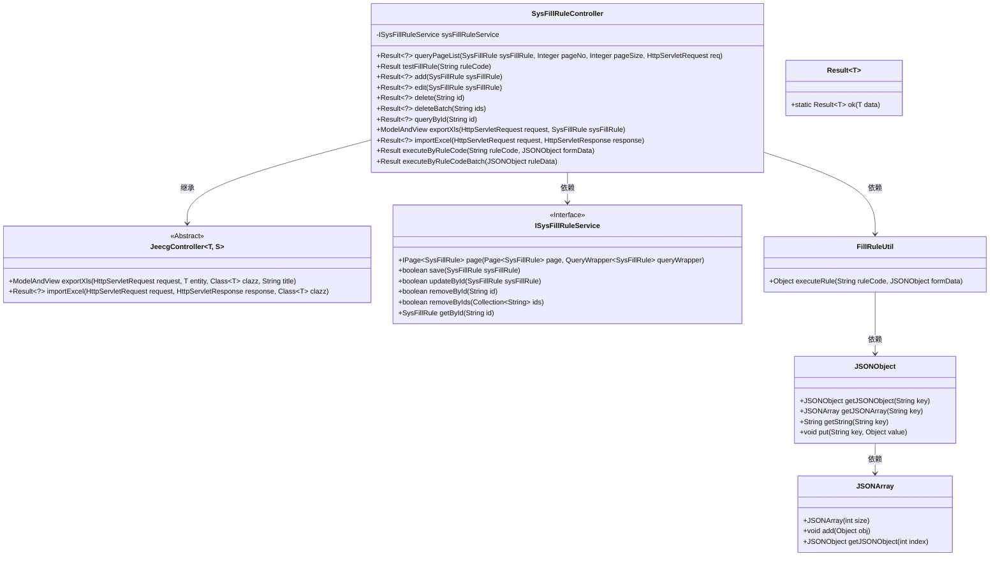

# 基础信息

|      |      |
|------|------|
| 名称 | SysFillRuleController |
| 编码语言 | .java |
| 代码路径 | JeecgBoot/jeecg-boot/jeecg-module-system/jeecg-system-biz/src/main/java/org/jeecg/modules/system/controller/SysFillRuleController.java |
| 包名 | org.jeecg.modules.system.controller |
| 依赖项 | ['com.alibaba.fastjson.JSONArray', 'com.alibaba.fastjson.JSONObject', 'com.baomidou.mybatisplus.core.conditions.query.QueryWrapper', 'com.baomidou.mybatisplus.core.metadata.IPage', 'com.baomidou.mybatisplus.extension.plugins.pagination.Page', 'io.swagger.v3.oas.annotations.Operation', 'io.swagger.v3.oas.annotations.tags.Tag', 'lombok.extern.slf4j.Slf4j', 'org.jeecg.common.api.vo.Result', 'org.jeecg.common.aspect.annotation.AutoLog', 'org.jeecg.common.system.base.controller.JeecgController', 'org.jeecg.common.system.query.QueryGenerator', 'org.jeecg.common.util.FillRuleUtil', 'org.jeecg.modules.system.entity.SysFillRule', 'org.jeecg.modules.system.service.ISysFillRuleService', 'org.springframework.beans.factory.annotation.Autowired', 'org.springframework.web.bind.annotation', 'org.springframework.web.servlet.ModelAndView', 'javax.servlet.http.HttpServletRequest', 'javax.servlet.http.HttpServletResponse', 'java.util.Arrays'] |
| 概述说明 | 控制器管理填值规则的查询、增删改、导入导出及执行操作。 |

# 说明

控制器负责处理填值规则的相关操作，包括分页查询、添加、编辑、删除、导出导入以及规则执行。通过这些功能，用户可以对填值规则进行全面的管理和操作，确保规则的灵活应用和高效执行。

# 类列表 Class Summary

| 名称   | 类型  | 说明 |
|-------|------|-------------|
| SysFillRuleController | class | 控制器处理填值规则的分页查询、添加、编辑、删除、导出导入及规则执行操作。 |

## 类 SysFillRuleController

|      |      |
|------|------|
| 访问范围 | @Slf4j;@Tag(name = "填值规则");@RestController;@RequestMapping("/sys/fillRule");public |
| 类型 | class |
| 名称 | SysFillRuleController |
| 说明 | 控制器处理填值规则的分页查询、添加、编辑、删除、导出导入及规则执行操作。 |

### UML类图

### 描述
`SysFillRuleController` 是一个基于Spring Boot的REST控制器，负责处理与填值规则相关的请求。它继承自 `JeecgController`，并依赖于 `ISysFillRuleService` 和 `FillRuleUtil` 来执行具体的业务逻辑。控制器提供了分页查询、添加、编辑、删除、批量删除、导出Excel、导入Excel、执行单个和批量填值规则等功能。`ISysFillRuleService` 是一个接口，定义了与数据库交互的方法。`FillRuleUtil` 是一个工具类，用于执行具体的填值规则。`Result` 是一个通用的返回结果类，`JSONObject` 和 `JSONArray` 用于处理JSON数据。

### 内部方法调用关系图

```mermaid
graph TD
    A["类SysFillRuleController"]
    B["属性: ISysFillRuleService sysFillRuleService"]
    C["方法: Result<?> queryPageList(SysFillRule sysFillRule, Integer pageNo, Integer pageSize, HttpServletRequest req)"]
    D["方法: Result testFillRule(String ruleCode)"]
    E["方法: Result<?> add(SysFillRule sysFillRule)"]
    F["方法: Result<?> edit(SysFillRule sysFillRule)"]
    G["方法: Result<?> delete(String id)"]
    H["方法: Result<?> deleteBatch(String ids)"]
    I["方法: Result<?> queryById(String id)"]
    J["方法: ModelAndView exportXls(HttpServletRequest request, SysFillRule sysFillRule)"]
    K["方法: Result<?> importExcel(HttpServletRequest request, HttpServletResponse response)"]
    L["方法: Result executeByRuleCode(String ruleCode, JSONObject formData)"]
    M["方法: Result executeByRuleCodeBatch(JSONObject ruleData)"]

    A --> B
    A --> C
    A --> D
    A --> E
    A --> F
    A --> G
    A --> H
    A --> I
    A --> J
    A --> K
    A --> L
    A --> M
```

该流程图展示了 `SysFillRuleController` 类的结构及其内部方法。`SysFillRuleController` 是一个控制器类，负责处理与填值规则相关的请求。类中包含多个方法，分别用于分页查询、测试填值规则、添加、编辑、删除、批量删除、通过ID查询、导出Excel、导入Excel、执行单个填值规则以及批量执行填值规则。每个方法都通过不同的HTTP请求方式（如GET、POST、PUT、DELETE）来处理特定的业务逻辑。

### 字段列表 Field List

| 名称  | 类型  | 说明 |
|-------|-------|------|
| sysFillRuleService | ISysFillRuleService | 自动注入系统填充规则服务实例。 |

### 方法列表 Method List

| 名称  | 类型  | 说明 |
|-------|-------|------|
| exportXls | ModelAndView | 导出填值规则Excel文件的控制器方法。 |
| executeByRuleCode | Result | 通过规则码执行规则并返回结果。 |
| testFillRule | Result | GET请求接口，通过规则码执行填充规则并返回结果。 |
| importExcel | Result<?> | 处理POST请求，导入Excel文件并返回结果。 |
| executeByRuleCodeBatch | Result | 批量执行规则，处理表单数据并返回结果。 |
| edit | Result<?> | 填值规则编辑接口，支持PUT和POST请求，返回编辑成功信息。 |
| add | Result<?> | 通过POST请求添加填值规则，成功后返回添加成功信息。 |
| deleteBatch | Result<?> | 填值规则批量删除接口，接收ID列表并删除对应记录。 |
| queryById | Result<?> | 通过ID查询填值规则，返回对应结果。 |
| queryPageList | Result<?> | 填值规则分页查询接口，支持页码和页数参数，返回分页结果。 |
| delete | Result<?> | 通过ID删除填值规则，返回删除成功结果。 |

