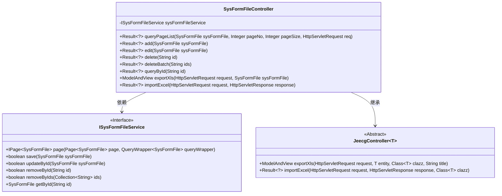
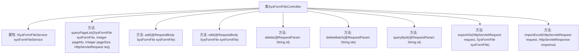

# 基础信息

|      |      |
|------|------|
| 名称 | SysFormFileController |
| 编码语言 | .java |
| 代码路径 | JeecgBoot/jeecg-boot/jeecg-module-system/jeecg-system-biz/src/main/java/org/jeecg/modules/system/controller/SysFormFileController.java |
| 包名 | org.jeecg.modules.system.controller |
| 依赖项 | ['com.baomidou.mybatisplus.core.conditions.query.QueryWrapper', 'com.baomidou.mybatisplus.core.metadata.IPage', 'com.baomidou.mybatisplus.extension.plugins.pagination.Page', 'io.swagger.v3.oas.annotations.Operation', 'io.swagger.v3.oas.annotations.tags.Tag', 'lombok.extern.slf4j.Slf4j', 'org.jeecg.common.api.vo.Result', 'org.jeecg.common.aspect.annotation.AutoLog', 'org.jeecg.common.system.base.controller.JeecgController', 'org.jeecg.common.system.query.QueryGenerator', 'org.jeecg.modules.system.entity.SysFormFile', 'org.jeecg.modules.system.service.ISysFormFileService', 'org.springframework.beans.factory.annotation.Autowired', 'org.springframework.web.bind.annotation', 'org.springframework.web.servlet.ModelAndView', 'javax.servlet.http.HttpServletRequest', 'javax.servlet.http.HttpServletResponse', 'java.util.Arrays'] |
| 概述说明 | 控制器实现评论文件的增删改查及导入导出功能。 |

# 说明

控制器实现了对表单评论文件的增删改查及导入导出功能。通过该控制器，用户可以方便地对表单评论文件进行管理，包括创建新的评论、删除现有评论、修改评论内容以及查询特定评论。此外，控制器还支持将评论数据导入和导出，便于数据的迁移和备份。这些功能确保了表单评论文件的高效管理和操作灵活性。

# 类列表 Class Summary

| 名称   | 类型  | 说明 |
|-------|------|-------------|
| SysFormFileController | class | 控制器实现表单评论文件的增删改查及导入导出功能。 |

## 类 SysFormFileController

|      |      |
|------|------|
| 访问范围 | @Slf4j;@Tag(name = "表单评论文件");@RestController;@RequestMapping("/sys/formFile");public |
| 类型 | class |
| 名称 | SysFormFileController |
| 说明 | 控制器实现表单评论文件的增删改查及导入导出功能。 |

### UML类图

这段代码定义了一个名为 `SysFormFileController` 的控制器类，它继承了 `JeecgController` 并依赖于 `ISysFormFileService` 接口。`SysFormFileController` 提供了多个 RESTful API，用于处理表单评论文件的分页查询、添加、编辑、删除、批量删除、查询、导出和导入操作。`ISysFormFileService` 接口定义了与数据库交互的方法，如分页查询、保存、更新、删除等。`JeecgController` 是一个抽象类，提供了导出和导入 Excel 文件的通用方法。

### 内部方法调用关系图

这段代码定义了一个名为`SysFormFileController`的控制器类，用于处理与表单评论文件相关的HTTP请求。类中包含多个方法，分别用于分页查询、添加、编辑、删除、批量删除、通过ID查询、导出Excel和导入Excel数据。每个方法都通过不同的HTTP请求类型（如GET、POST、PUT、DELETE）来处理相应的业务逻辑，并返回操作结果。这些方法通过调用`ISysFormFileService`接口的实现类来完成具体的数据库操作。

### 字段列表 Field List

| 名称  | 类型  | 说明 |
|-------|-------|------|
| sysFormFileService | ISysFormFileService | 自动注入ISysFormFileService服务实例。 |

### 方法列表 Method List

| 名称  | 类型  | 说明 |
|-------|-------|------|
| importExcel | Result<?> | 处理POST请求，导入Excel文件并返回结果。 |
| exportXls | ModelAndView | 该方法用于导出表单评论文件的Excel文件。 |
| edit | Result<?> | 编辑表单评论文件，通过PUT或POST请求更新数据。 |
| queryPageList | Result<?> | 查询表单评论文件分页列表，支持分页参数和查询条件。 |
| add | Result<?> | 添加表单评论文件接口，保存文件并返回成功信息。 |
| delete | Result<?> | 通过ID删除表单评论文件，返回删除成功结果。 |
| queryById | Result<?> | 通过ID查询表单评论文件，返回结果。 |
| deleteBatch | Result<?> | 表单评论文件批量删除接口，通过ID列表删除文件并返回成功信息。 |

