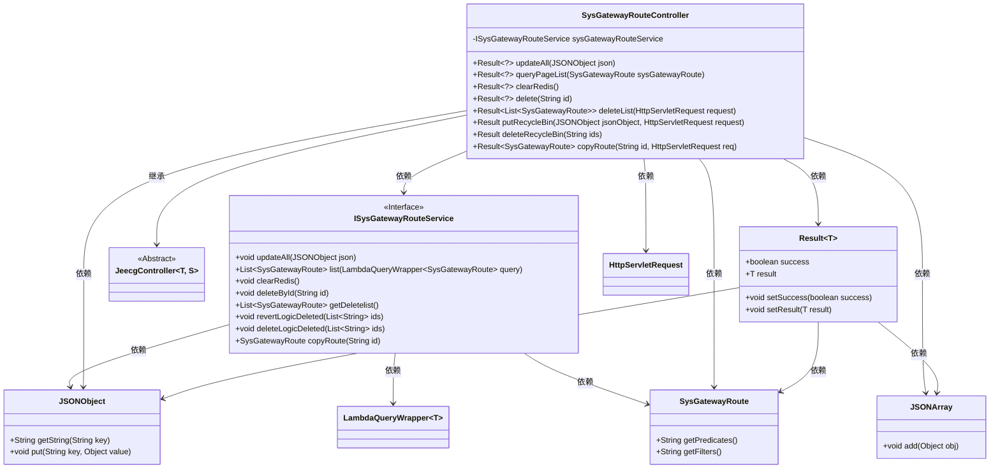

# 基础信息

|      |      |
|------|------|
| 名称 | SysGatewayRouteController |
| 编码语言 | .java |
| 代码路径 | JeecgBoot/jeecg-boot/jeecg-module-system/jeecg-system-biz/src/main/java/org/jeecg/modules/system/controller/SysGatewayRouteController.java |
| 包名 | org.jeecg.modules.system.controller |
| 依赖项 | ['com.alibaba.fastjson.JSONArray', 'com.alibaba.fastjson.JSONObject', 'com.baomidou.mybatisplus.core.conditions.query.LambdaQueryWrapper', 'io.swagger.v3.oas.annotations.tags.Tag', 'lombok.extern.slf4j.Slf4j', 'org.apache.commons.lang.StringUtils', 'org.apache.shiro.authz.annotation.RequiresPermissions', 'org.jeecg.common.api.vo.Result', 'org.jeecg.common.system.base.controller.JeecgController', 'org.jeecg.common.util.oConvertUtils', 'org.jeecg.modules.system.entity.SysGatewayRoute', 'org.jeecg.modules.system.service.ISysGatewayRouteService', 'org.springframework.beans.factory.annotation.Autowired', 'org.springframework.web.bind.annotation', 'javax.servlet.http.HttpServletRequest', 'java.util.Arrays', 'java.util.List'] |
| 概述说明 | 网关路由管理控制器支持更新、查询、删除、还原和复制路由操作。 |

# 说明

网关路由管理控制器提供了一套全面的功能，支持对路由进行多种操作。用户可以通过该控制器更新现有路由的配置，查询当前路由的详细信息，删除不再需要的路由，还原已删除的路由，以及复制现有路由以创建新的路由配置。这些功能确保了路由管理的灵活性和高效性，便于用户根据需求动态调整网络路由设置。

# 类列表 Class Summary

| 名称   | 类型  | 说明 |
|-------|------|-------------|
| SysGatewayRouteController | class | 网关路由管理控制器，支持更新、查询、删除、还原、复制路由操作。 |

## 类 SysGatewayRouteController

|      |      |
|------|------|
| 访问范围 | @Tag(name = "gateway路由管理");@RestController;@RequestMapping("/sys/gatewayRoute");@Slf4j;public |
| 类型 | class |
| 名称 | SysGatewayRouteController |
| 说明 | 网关路由管理控制器，支持更新、查询、删除、还原、复制路由操作。 |

### UML类图

这段代码定义了一个名为 `SysGatewayRouteController` 的控制器类，它继承自 `JeecgController` 并实现了对网关路由的管理功能。控制器通过 `ISysGatewayRouteService` 接口与业务逻辑进行交互，提供了路由的更新、查询、删除、还原、复制等操作。`Result` 类用于封装操作结果，`JSONObject` 和 `JSONArray` 用于处理 JSON 数据。代码结构清晰，职责明确，便于维护和扩展。

### 内部方法调用关系图

```mermaid
graph TD
    A["类SysGatewayRouteController"]
    B["属性: ISysGatewayRouteService sysGatewayRouteService"]
    C["方法: Result<?> updateAll(JSONObject json)"]
    D["方法: Result<?> queryPageList(SysGatewayRoute sysGatewayRoute)"]
    E["方法: Result<?> clearRedis()"]
    F["方法: Result<?> delete(String id)"]
    G["方法: Result<List<SysGatewayRoute>> deleteList(HttpServletRequest request)"]
    H["方法: Result putRecycleBin(JSONObject jsonObject, HttpServletRequest request)"]
    I["方法: Result deleteRecycleBin(String ids)"]
    J["方法: Result<SysGatewayRoute> copyRoute(String id, HttpServletRequest req)"]

    A --> B
    A --> C
    A --> D
    A --> E
    A --> F
    A --> G
    A --> H
    A --> I
    A --> J

    C --> K["sysGatewayRouteService.updateAll(json)"]
    D --> L["sysGatewayRouteService.list(query)"]
    E --> M["sysGatewayRouteService.clearRedis()"]
    F --> N["sysGatewayRouteService.deleteById(id)"]
    G --> O["sysGatewayRouteService.getDeletelist()"]
    H --> P["sysGatewayRouteService.revertLogicDeleted(Arrays.asList(ids.split(',')))"]
    I --> Q["sysGatewayRouteService.deleteLogicDeleted(Arrays.asList(ids.split(',')))"]
    J --> R["sysGatewayRouteService.copyRoute(id)"]
```

这段代码定义了一个名为 `SysGatewayRouteController` 的控制器类，用于管理网关路由的各种操作。类中包含了多个方法，分别用于更新所有路由、查询路由列表、清除Redis缓存、删除路由、查询被删除的路由列表、还原被逻辑删除的路由、彻底删除路由以及复制路由。每个方法都调用了 `sysGatewayRouteService` 中的相应服务方法来完成具体的业务逻辑。这些方法通过不同的HTTP请求类型（如 `POST`、`GET`、`DELETE` 等）来触发，并返回相应的操作结果。

### 字段列表 Field List

| 名称  | 类型  | 说明 |
|-------|-------|------|
| sysGatewayRouteService | ISysGatewayRouteService | 自动注入系统网关路由服务实例。 |

### 方法列表 Method List

| 名称  | 类型  | 说明 |
|-------|-------|------|
| clearRedis | Result<?> | 通过GET请求清除Redis缓存，成功后返回清除成功信息。 |
| deleteList | Result<List<SysGatewayRoute>> | GET请求处理删除列表，返回成功及系统网关路由列表。 |
| queryPageList | Result<?> | 查询网关路由列表并返回JSON格式结果。 |
| deleteRecycleBin | Result | 删除回收站条目，需权限，支持批量删除，返回操作结果。 |
| delete | Result<?> | 删除系统路由接口，需权限，接收ID参数，调用服务删除并返回成功信息。 |
| copyRoute | Result<SysGatewayRoute> | 复制网关路由，需权限验证，返回成功结果。 |
| putRecycleBin | Result | 接口需权限，PUT请求还原回收站中指定ID的路由，成功返回操作成功，失败返回操作失败。 |
| updateAll | Result<?> | 通过POST请求更新所有网关路由，返回操作成功结果。 |

