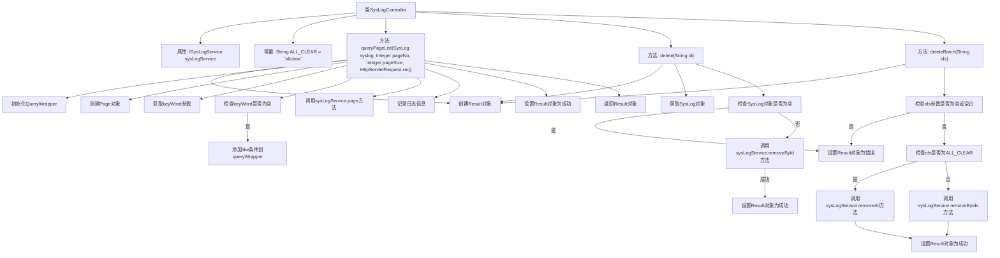

# 基础信息

|      |      |
|------|------|
| 名称 | SysLogController |
| 编码语言 | .java |
| 代码路径 | JeecgBoot/jeecg-boot/jeecg-module-system/jeecg-system-biz/src/main/java/org/jeecg/modules/system/controller/SysLogController.java |
| 包名 | org.jeecg.modules.system.controller |
| 依赖项 | ['java.util.Arrays', 'javax.servlet.http.HttpServletRequest', 'org.apache.shiro.authz.annotation.RequiresPermissions', 'org.jeecg.common.api.vo.Result', 'org.jeecg.common.constant.CommonConstant', 'org.jeecg.common.system.query.QueryGenerator', 'org.jeecg.common.util.oConvertUtils', 'org.jeecg.modules.system.entity.SysLog', 'org.jeecg.modules.system.entity.SysRole', 'org.jeecg.modules.system.service.ISysLogService', 'org.springframework.beans.factory.annotation.Autowired', 'org.springframework.web.bind.annotation.RequestMapping', 'org.springframework.web.bind.annotation.RequestMethod', 'org.springframework.web.bind.annotation.RequestParam', 'org.springframework.web.bind.annotation.RestController', 'com.baomidou.mybatisplus.core.conditions.query.QueryWrapper', 'com.baomidou.mybatisplus.core.metadata.IPage', 'com.baomidou.mybatisplus.extension.plugins.pagination.Page', 'lombok.extern.slf4j.Slf4j'] |
| 概述说明 | SysLogController支持日志查询、删除、批量删除，分页和关键词过滤。 |

# 说明

SysLogController是一个功能全面的日志管理控制器，提供了日志查询、删除和批量删除等核心功能。它支持分页查询，使用户能够高效地浏览大量日志数据。此外，SysLogController还具备关键词过滤功能，帮助用户快速定位和筛选出符合特定条件的日志条目。这些功能共同构成了一个强大的日志管理工具，满足了用户在日志处理中的多样化需求。

# 类列表 Class Summary

| 名称   | 类型  | 说明 |
|-------|------|-------------|
| SysLogController | class | SysLogController提供日志查询、删除和批量删除功能，支持分页和关键词过滤。 |


## 类 SysLogController

|      |      |
|------|------|
| 访问范围 | @RestController;@RequestMapping("/sys/log");@Slf4j;public |
| 类型 | class |
| 名称 | SysLogController |
| 说明 | SysLogController提供日志查询、删除和批量删除功能，支持分页和关键词过滤。 |


### UML类图

```mermaid
classDiagram
    class SysLogController {
        -ISysLogService sysLogService
        -static final String ALL_ClEAR
        +Result~IPage~SysLog~~ queryPageList(SysLog syslog, Integer pageNo, Integer pageSize, HttpServletRequest req)
        +Result~SysLog~ delete(String id)
        +Result~SysRole~ deleteBatch(String ids)
    }

    class ISysLogService {
        <<Interface>>
        +IPage~SysLog~ page(Page~SysLog~ page, QueryWrapper~SysLog~ queryWrapper)
        +SysLog getById(String id)
        +boolean removeById(String id)
        +void removeAll()
        +boolean removeByIds(List~String~ ids)
    }

    class Result~T~ {
        +boolean success
        +T result
        +void setSuccess(boolean success)
        +void setResult(T result)
        +void error500(String message)
        +void success(String message)
    }

    class IPage~T~ {
        +int getCurrent()
        +int getSize()
        +List~T~ getRecords()
        +long getTotal()
    }

    class QueryWrapper~T~ {
        +void like(String column, String value)
    }

    class Page~T~ {
        +Page(Integer pageNo, Integer pageSize)
    }

    class SysLog {
        // SysLog类的内容
    }

    class SysRole {
        // SysRole类的内容
    }

    SysLogController --> ISysLogService : 依赖
    SysLogController --> Result~IPage~SysLog~~ : 依赖
    SysLogController --> Result~SysLog~ : 依赖
    SysLogController --> Result~SysRole~ : 依赖
    ISysLogService --> IPage~SysLog~ : 依赖
    ISysLogService --> SysLog : 依赖
    ISysLogService --> List~String~ : 依赖
    Result~T~ --> T : 依赖
    IPage~T~ --> List~T~ : 依赖
    QueryWrapper~T~ --> T : 依赖
    Page~T~ --> T : 依赖
```

**描述：**  
`SysLogController` 是一个处理系统日志的控制器，依赖于 `ISysLogService` 接口来执行日志的查询、删除和批量删除操作。`ISysLogService` 接口定义了与日志相关的服务方法，如分页查询、根据ID获取日志、删除日志等。`Result` 类用于封装操作结果，包含成功标志和返回的数据。`IPage` 和 `Page` 类用于处理分页数据，`QueryWrapper` 用于构建查询条件。`SysLog` 和 `SysRole` 类分别表示日志和角色实体。


### 内部方法调用关系图



### 描述
这段代码定义了一个名为`SysLogController`的控制器类，用于处理系统日志的相关操作。类中包含三个主要方法：`queryPageList`用于分页查询日志记录，`delete`用于删除单个日志记录，`deleteBatch`用于批量删除或清空日志记录。每个方法都通过调用`sysLogService`的不同方法来实现具体功能，并根据操作结果设置`Result`对象的状态信息。代码中还包含日志记录和参数检查等逻辑，确保操作的准确性和安全性。

### 字段列表 Field List

| 名称  | 类型  | 说明 |
|-------|-------|------|
| sysLogService | ISysLogService | 自动注入系统日志服务实例。 |
| ALL_ClEAR = "allclear" | String | 定义私有静态常量字符串ALL_CLEAR值为"allclear"。 |

### 方法列表 Method List

| 名称  | 类型  | 说明 |
|-------|-------|------|
| delete | Result<SysLog> | 删除日志接口，根据ID删除系统日志，返回操作结果。 |
| deleteBatch | Result<SysRole> | 删除批量日志接口，支持清除全部或指定ID日志。 |
| queryPageList | Result<IPage<SysLog>> | GET请求处理分页查询日志，支持关键词过滤和字段筛选。 |


