# 基础信息

|      |      |
|------|------|
| 名称 | SysPermissionController |
| 编码语言 | .java |
| 代码路径 | JeecgBoot/jeecg-boot/jeecg-module-system/jeecg-system-biz/src/main/java/org/jeecg/modules/system/controller/SysPermissionController.java |
| 包名 | org.jeecg.modules.system.controller |
| 依赖项 | ['com.alibaba.fastjson.JSONArray', 'com.alibaba.fastjson.JSONObject', 'com.baomidou.mybatisplus.core.conditions.query.LambdaQueryWrapper', 'com.baomidou.mybatisplus.core.conditions.query.QueryWrapper', 'lombok.extern.slf4j.Slf4j', 'org.apache.shiro.SecurityUtils', 'org.apache.shiro.authz.annotation.RequiresPermissions', 'org.apache.shiro.subject.Subject', 'org.jeecg.common.api.vo.Result', 'org.jeecg.common.constant.CommonConstant', 'org.jeecg.common.constant.SymbolConstant', 'org.jeecg.common.exception.JeecgBootException', 'org.jeecg.common.system.vo.LoginUser', 'org.jeecg.common.util.Md5Util', 'org.jeecg.common.util.oConvertUtils', 'org.jeecg.config.JeecgBaseConfig', 'org.jeecg.config.shiro.ShiroRealm', 'org.jeecg.modules.base.service.BaseCommonService', 'org.jeecg.modules.system.constant.DefIndexConst', 'org.jeecg.modules.system.entity', 'org.jeecg.modules.system.model.SysPermissionTree', 'org.jeecg.modules.system.model.TreeModel', 'org.jeecg.modules.system.service', 'org.jeecg.modules.system.util.PermissionDataUtil', 'org.springframework.beans.factory.annotation.Autowired', 'org.springframework.web.bind.annotation', 'javax.servlet.http.HttpServletRequest', 'java.util', 'java.util.stream.Collectors'] |
| 概述说明 | 系统权限管理控制器实现菜单、角色、部门权限的增删改查及授权功能。 |

# 说明

该代码实现了一个系统权限管理控制器，具备对菜单、角色和部门权限的全面管理功能。具体功能包括菜单、角色和部门权限的增加、删除、修改和查询操作，同时还提供了授权功能，确保系统权限的灵活配置和精确控制。该控制器为系统权限管理提供了全面的支持，适用于复杂的权限管理需求。

# 类列表 Class Summary

| 名称   | 类型  | 说明 |
|-------|------|-------------|
| SysPermissionController | class | 该代码实现了一个系统权限管理控制器，包含菜单、角色、部门权限的增删改查及授权功能。 |

## 类 SysPermissionController

|      |      |
|------|------|
| 访问范围 | @Slf4j;@RestController;@RequestMapping("/sys/permission");public |
| 类型 | class |
| 名称 | SysPermissionController |
| 说明 | 该代码实现了一个系统权限管理控制器，包含菜单、角色、部门权限的增删改查及授权功能。 |

### UML类图

```mermaid
classDiagram
    class SysPermissionController {
        -ISysPermissionService sysPermissionService
        -ISysRolePermissionService sysRolePermissionService
        -ISysPermissionDataRuleService sysPermissionDataRuleService
        -ISysDepartPermissionService sysDepartPermissionService
        -ISysUserService sysUserService
        -JeecgBaseConfig jeecgBaseConfig
        -BaseCommonService baseCommonService
        -ISysRoleIndexService sysRoleIndexService
        -ShiroRealm shiroRealm
        -String CHILDREN
        +Result~List~SysPermissionTree~~ list(SysPermission sysPermission, HttpServletRequest req)
        +Result~List~SysPermissionTree~~ getSystemMenuList()
        +Result~List~SysPermissionTree~~ getSystemSubmenu(String parentId)
        +Result getSystemSubmenuBatch(String parentIds)
        +Result getUserPermissionByToken(HttpServletRequest request)
        +Result getPermCode()
        +Result~SysPermission~ add(SysPermission permission)
        +Result~SysPermission~ edit(SysPermission permission)
        +Result~String~ checkPermDuplication(String id, String url, Boolean alwaysShow)
        +Result~SysPermission~ delete(String id)
        +Result~SysPermission~ deleteBatch(String ids)
        +Result~Map~String, Object~~ queryTreeList()
        +Result~List~TreeModel~~ queryAsync(String parentId)
        +Result~List~String~~ queryRolePermission(String roleId)
        +Result~String~ saveRolePermission(JSONObject json)
        +void getTreeList(List~SysPermissionTree~ treeList, List~SysPermission~ metaList, SysPermissionTree temp)
        +void getTreeModelList(List~TreeModel~ treeList, List~SysPermission~ metaList, TreeModel temp)
        +void handleFirstLevelMenuHidden(JSONArray jsonArray)
        +void getAllAuthJsonArray(JSONArray jsonArray, List~SysPermission~ allList)
        +void getAuthJsonArray(JSONArray jsonArray, List~SysPermission~ metaList)
        +void getPermissionJsonArray(JSONArray jsonArray, List~SysPermission~ metaList, JSONObject parentJson)
        +JSONObject getPermissionJsonObject(SysPermission permission)
        +boolean isWwwHttpUrl(String url)
        +String urlToRouteName(String url)
        +Result~List~SysPermissionDataRule~~ getPermRuleListByPermId(SysPermissionDataRule sysPermissionDataRule)
        +Result~SysPermissionDataRule~ addPermissionRule(SysPermissionDataRule sysPermissionDataRule)
        +Result~SysPermissionDataRule~ editPermissionRule(SysPermissionDataRule sysPermissionDataRule)
        +Result~SysPermissionDataRule~ deletePermissionRule(String id)
        +Result~List~SysPermissionDataRule~~ queryPermissionRule(SysPermissionDataRule sysPermissionDataRule)
        +Result~List~String~~ queryDepartPermission(String departId)
        +Result~String~ saveDepartPermission(JSONObject json)
    }

    class ISysPermissionService {
        <<Interface>>
        +List~SysPermission~ list(LambdaQueryWrapper~SysPermission~ query)
        +SysPermission getOne(LambdaQueryWrapper~SysPermission~ query)
        +void addPermission(SysPermission permission)
        +void editPermission(SysPermission permission)
        +void deletePermission(String id)
        +boolean checkPermDuplication(String id, String url, Boolean alwaysShow)
        +List~SysPermission~ queryByUser(String userId)
    }

    class ISysRolePermissionService {
        <<Interface>>
        +void saveRolePermission(String roleId, String permissionIds, String lastPermissionIds)
    }

    class ISysPermissionDataRuleService {
        <<Interface>>
        +List~SysPermissionDataRule~ getPermRuleListByPermId(String permissionId)
        +void savePermissionDataRule(SysPermissionDataRule sysPermissionDataRule)
        +void saveOrUpdate(SysPermissionDataRule sysPermissionDataRule)
        +void deletePermissionDataRule(String id)
        +List~SysPermissionDataRule~ queryPermissionRule(SysPermissionDataRule sysPermissionDataRule)
    }

    class ISysDepartPermissionService {
        <<Interface>>
        +void saveDepartPermission(String departId, String permissionIds, String lastPermissionIds)
    }

    class ISysUserService {
        <<Interface>>
        +SysRoleIndex getDynamicIndexByUserRole(String username, String version)
    }

    class JeecgBaseConfig {
        +Firewall getFirewall()
    }

    class BaseCommonService {
        +void addLog(String logContent, int logType, int logLevel)
    }

    class ISysRoleIndexService {
        <<Interface>>
        +SysRoleIndex initDefaultIndex()
    }

    class ShiroRealm {
        +void clearCache(PrincipalCollection principals)
    }

    SysPermissionController --> ISysPermissionService : 依赖
    SysPermissionController --> ISysRolePermissionService : 依赖
    SysPermissionController --> ISysPermissionDataRuleService : 依赖
    SysPermissionController --> ISysDepartPermissionService : 依赖
    SysPermissionController --> ISysUserService : 依赖
    SysPermissionController --> JeecgBaseConfig : 依赖
    SysPermissionController --> BaseCommonService : 依赖
    SysPermissionController --> ISysRoleIndexService : 依赖
    SysPermissionController --> ShiroRealm : 依赖
```

该类图展示了`SysPermissionController`类及其依赖的服务接口和配置类。`SysPermissionController`是一个Spring MVC控制器，负责处理与系统权限相关的HTTP请求。它依赖于多个服务接口，如`ISysPermissionService`、`ISysRolePermissionService`等，用于执行具体的业务逻辑。此外，它还依赖于`JeecgBaseConfig`和`BaseCommonService`等配置类，用于获取系统配置和记录日志。通过这些依赖，`SysPermissionController`能够处理权限的增删改查、角色授权、部门授权等操作。

### 内部方法调用关系图

这段代码是一个Spring Boot控制器类，主要用于管理系统权限相关的操作。它包含了多个方法，用于处理权限列表、菜单列表、子菜单、用户权限、权限树等功能的查询、添加、编辑和删除操作。代码中还涉及到权限数据的处理、权限树的构建、权限规则的增删改查等功能。整体结构清晰，功能模块化，便于维护和扩展。

### 字段列表 Field List

| 名称  | 类型  | 说明 |
|-------|-------|------|
| sysPermissionService | ISysPermissionService | 自动注入系统权限服务实例。 |
| sysRolePermissionService | ISysRolePermissionService | 自动注入系统角色权限服务实例。 |
| baseCommonService | BaseCommonService | 自动注入BaseCommonService实例。 |
| sysPermissionDataRuleService | ISysPermissionDataRuleService | 自动注入权限数据规则服务接口实例。 |
| sysDepartPermissionService | ISysDepartPermissionService | 自动注入部门权限服务实例。 |
| CHILDREN = "children" | String | 定义私有静态常量CHILDREN，值为"children"。 |
| jeecgBaseConfig | JeecgBaseConfig | 使用Autowired注入JeecgBaseConfig实例。 |
| shiroRealm | ShiroRealm | 使用@Autowired注解注入ShiroRealm实例。 |
| sysRoleIndexService | ISysRoleIndexService | 自动注入系统角色索引服务实例。 |
| sysUserService | ISysUserService | 自动注入系统用户服务实例。 |

### 方法列表 Method List

| 名称  | 类型  | 说明 |
|-------|-------|------|
| queryTreeList | Result<Map<String, Object>> | GET请求查询树形权限列表，返回树节点和ID集合。 |
| getTreeModelList | void | 递归构建树结构，根据权限父子关系添加节点。 |
| handleFirstLevelMenuHidden | void | 处理JSON数组，过滤隐藏子项并更新隐藏状态。 |
| getPermRuleListByPermId | Result<List<SysPermissionDataRule>> | 通过权限ID获取权限规则列表，返回成功结果及规则列表。 |
| saveRolePermission | Result<String> | 保存角色权限，记录日志并清除用户授权缓存。 |
| add | Result<SysPermission> | 通过POST请求添加系统权限，处理成功返回成功信息，失败返回错误信息。 |
| saveDepartPermission | Result<String> | 保存部门权限，处理异常并记录耗时。 |
| queryAsync | Result<List<TreeModel>> | 通过父ID异步查询树模型列表，处理异常并返回结果。 |
| queryPermissionRule | Result<List<SysPermissionDataRule>> | 通过GET请求查询权限规则，返回结果或错误信息。 |
| urlToRouteName | String | 将URL转换为路由名称，处理斜杠和冒号。 |
| queryRolePermission | Result<List<String>> | 通过角色ID查询权限列表，返回结果集并处理异常。 |
| getAllAuthJsonArray | void | 方法将权限列表转换为JSON数组，包含动作、状态、类型和描述。 |
| getTreeList | void | 递归构建权限树结构，处理父子节点关系。 |
| getAuthJsonArray | void | 方法将符合条件的权限信息转换为JSON对象并添加到JSON数组中。 |
| getPermissionJsonArray | void | 递归处理权限列表，生成JSON结构，包含菜单和按钮类型。 |
| deleteBatch | Result<SysPermission> | 批量删除系统权限，需权限验证，处理异常并返回结果。 |
| checkPermDuplication | Result<String> | GET请求检查权限重复，返回结果提示可用或需重定义。 |
| isWwwHttpUrl | boolean | 判断URL是否以HTTP、HTTPS或双左花括号开头。 |
| getPermCode | Result<?> | 获取用户权限码，包括用户权限集合、全部权限配置及数据源安全模式。 |
| editPermissionRule | Result<SysPermissionDataRule> | 接口用于编辑权限规则，支持PUT和POST方法，返回操作结果。 |
| getPermissionJsonObject | JSONObject | 根据权限类型生成JSON对象，包含路由、组件、元数据等信息。 |
| delete | Result<SysPermission> | 删除系统权限接口，需权限验证，处理删除请求，返回操作结果。 |
| deletePermissionRule | Result<SysPermissionDataRule> | 删除权限规则接口，需系统权限，根据ID删除，返回操作结果。 |
| getSystemMenuList | Result<List<SysPermissionTree>> | 获取一级菜单列表，查询未删除的菜单，按排序号升序返回。 |
| addPermissionRule | Result<SysPermissionDataRule> | 添加权限规则接口，POST请求，需系统权限，成功返回添加结果，失败记录日志。 |
| getSystemSubmenu | Result<List<SysPermissionTree>> | 通过GET请求获取指定父ID的系统子菜单，返回排序后的权限树列表。 |
| getUserPermissionByToken | Result<?> | 通过token获取用户权限，包括菜单和按钮权限，处理首页路由和权限配置。 |
| edit | Result<SysPermission> | 该方法需权限验证，支持PUT和POST请求，用于编辑系统权限，处理成功返回成功信息，失败返回错误信息。 |
| list | Result<List<SysPermissionTree>> | 获取菜单列表，支持模糊查询和树形结构返回，记录执行时间。 |
| queryDepartPermission | Result<List<String>> | GET请求查询部门权限，返回权限ID列表，成功时标记为true。 |
| getSystemSubmenuBatch | Result | 通过父ID批量查询未删除的系统子菜单，并按排序号升序返回。 |

