# 基础信息

|      |      |
|------|------|
| 名称 | SysPositionController |
| 编码语言 | .java |
| 代码路径 | JeecgBoot/jeecg-boot/jeecg-module-system/jeecg-system-biz/src/main/java/org/jeecg/modules/system/controller/SysPositionController.java |
| 包名 | org.jeecg.modules.system.controller |
| 依赖项 | ['cn.hutool.core.util.RandomUtil', 'com.alibaba.fastjson.JSON', 'com.baomidou.mybatisplus.core.conditions.query.QueryWrapper', 'com.baomidou.mybatisplus.core.metadata.IPage', 'com.baomidou.mybatisplus.extension.plugins.pagination.Page', 'io.swagger.v3.oas.annotations.Operation', 'io.swagger.v3.oas.annotations.tags.Tag', 'lombok.extern.slf4j.Slf4j', 'org.apache.shiro.SecurityUtils', 'org.jeecg.common.api.vo.Result', 'org.jeecg.common.aspect.annotation.AutoLog', 'org.jeecg.common.config.TenantContext', 'org.jeecg.common.constant.CommonConstant', 'org.jeecg.common.system.query.QueryGenerator', 'org.jeecg.common.system.vo.LoginUser', 'org.jeecg.common.util.ImportExcelUtil', 'org.jeecg.common.util.oConvertUtils', 'org.jeecg.config.mybatis.MybatisPlusSaasConfig', 'org.jeecg.modules.system.entity.SysPosition', 'org.jeecg.modules.system.entity.SysUser', 'org.jeecg.modules.system.service.ISysPositionService', 'org.jeecg.modules.system.service.ISysUserPositionService', 'org.jeecg.modules.system.service.ISysUserService', 'org.jeecgframework.poi.excel.ExcelImportUtil', 'org.jeecgframework.poi.excel.def.NormalExcelConstants', 'org.jeecgframework.poi.excel.entity.ExportParams', 'org.jeecgframework.poi.excel.entity.ImportParams', 'org.jeecgframework.poi.excel.view.JeecgEntityExcelView', 'org.springframework.beans.factory.annotation.Autowired', 'org.springframework.web.bind.annotation', 'org.springframework.web.multipart.MultipartFile', 'org.springframework.web.multipart.MultipartHttpServletRequest', 'org.springframework.web.servlet.ModelAndView', 'javax.servlet.http.HttpServletRequest', 'javax.servlet.http.HttpServletResponse', 'java.io.IOException', 'java.io.UnsupportedEncodingException', 'java.net.URLDecoder', 'java.util.ArrayList', 'java.util.Arrays', 'java.util.List', 'java.util.Map', 'java.util.stream.Collectors'] |
| 概述说明 | 职务表控制器具备分页查询、增删改、导出导入及多租户隔离功能。 |

# 说明

职务表控制器具备多种功能，包括分页查询、添加、编辑、删除以及导出和导入操作。该控制器还支持多租户数据隔离，确保不同租户之间的数据独立且安全。这些功能共同提升了系统的灵活性和管理效率，适用于需要多用户数据管理的复杂环境。

# 类列表 Class Summary

| 名称   | 类型  | 说明 |
|-------|------|-------------|
| SysPositionController | class | 职务表控制器提供分页查询、添加、编辑、删除、导出导入等功能，支持多租户数据隔离。 |


## 类 SysPositionController

|      |      |
|------|------|
| 访问范围 | @Slf4j;@Tag(name = "职务表");@RestController;@RequestMapping("/sys/position");public |
| 类型 | class |
| 名称 | SysPositionController |
| 说明 | 职务表控制器提供分页查询、添加、编辑、删除、导出导入等功能，支持多租户数据隔离。 |


### UML类图

```mermaid
classDiagram
    class SysPositionController {
        <<RestController>>
        -ISysPositionService sysPositionService
        -ISysUserPositionService userPositionService
        -ISysUserService userService
        +Result~IPage~SysPosition~~ queryPageList(SysPosition sysPosition, Integer pageNo, Integer pageSize, HttpServletRequest req)
        +Result~SysPosition~ add(@RequestBody SysPosition sysPosition)
        +Result~SysPosition~ edit(@RequestBody SysPosition sysPosition)
        +Result~?~ delete(@RequestParam(name = "id", required = true) String id)
        +Result~SysPosition~ deleteBatch(@RequestParam(name = "ids", required = true) String ids)
        +Result~SysPosition~ queryById(@RequestParam(name = "id", required = true) String id)
        +ModelAndView exportXls(SysPosition sysPosition, HttpServletRequest request, HttpServletResponse response)
        +Result~?~ importExcel(HttpServletRequest request, HttpServletResponse response)
        +Result~SysPosition~ queryByCode(@RequestParam(name = "code", required = true) String code)
        +Result~List~SysPosition~~ queryByIds(@RequestParam(name = "ids") String ids)
        +Result~IPage~SysUser~~ getPositionUserList(@RequestParam(name = "pageNo", defaultValue = "1") Integer pageNo, @RequestParam(name = "pageSize", defaultValue = "10") Integer pageSize, @RequestParam(name = "positionId") String positionId)
        +Result~String~ saveUserPosition(@RequestParam(name = "userIds") String userIds, @RequestParam(name = "positionId") String positionId)
        +Result~String~ removeUserPosition(@RequestParam(name = "userIds") String userIds, @RequestParam(name = "positionId") String positionId)
    }

    interface ISysPositionService {
        <<Interface>>
        +IPage~SysPosition~ page(Page~SysPosition~ page, QueryWrapper~SysPosition~ queryWrapper)
        +boolean save(SysPosition sysPosition)
        +boolean updateById(SysPosition sysPosition)
        +boolean removeById(String id)
        +boolean removeByIds(Collection~?~ ids)
        +SysPosition getById(String id)
        +List~SysPosition~ list(QueryWrapper~SysPosition~ queryWrapper)
    }

    interface ISysUserPositionService {
        <<Interface>>
        +IPage~SysUser~ getPositionUserList(Page~SysUser~ page, String positionId)
        +void saveUserPosition(String userIds, String positionId)
        +void removePositionUser(String userIds, String positionId)
        +void removeByPositionId(String positionId)
    }

    interface ISysUserService {
        <<Interface>>
        +Map~String, String~ getDepNamesByUserIds(List~String~ userIds)
    }

    SysPositionController --> ISysPositionService : 依赖
    SysPositionController --> ISysUserPositionService : 依赖
    SysPositionController --> ISysUserService : 依赖
```

### 描述
`SysPositionController` 是一个基于 Spring Boot 的 REST 控制器，负责处理与职务表相关的请求。它依赖于三个服务接口：`ISysPositionService`、`ISysUserPositionService` 和 `ISysUserService`。控制器提供了分页查询、添加、编辑、删除、批量删除、导出 Excel、导入 Excel、通过 ID 或 Code 查询、获取职位用户列表、添加成员到职位、移除成员等功能。这些功能通过调用相应的服务接口来实现，展示了控制器与服务的紧密协作关系。


### 内部方法调用关系图

```mermaid
graph TD
    A["类SysPositionController"]
    B["属性: ISysPositionService sysPositionService"]
    C["属性: ISysUserPositionService userPositionService"]
    D["属性: ISysUserService userService"]
    E["方法: queryPageList(SysPosition sysPosition, Integer pageNo, Integer pageSize, HttpServletRequest req)"]
    F["方法: add(@RequestBody SysPosition sysPosition)"]
    G["方法: edit(@RequestBody SysPosition sysPosition)"]
    H["方法: delete(@RequestParam(name = 'id', required = true) String id)"]
    I["方法: deleteBatch(@RequestParam(name = 'ids', required = true) String ids)"]
    J["方法: queryById(@RequestParam(name = 'id', required = true) String id)"]
    K["方法: exportXls(SysPosition sysPosition, HttpServletRequest request, HttpServletResponse response)"]
    L["方法: importExcel(HttpServletRequest request, HttpServletResponse response)"]
    M["方法: queryByCode(@RequestParam(name = 'code', required = true) String code)"]
    N["方法: queryByIds(@RequestParam(name = 'ids') String ids)"]
    O["方法: getPositionUserList(@RequestParam(name = 'pageNo', defaultValue = '1') Integer pageNo, @RequestParam(name = 'pageSize', defaultValue = '10') Integer pageSize, @RequestParam(name = 'positionId') String positionId)"]
    P["方法: saveUserPosition(@RequestParam(name = 'userIds') String userIds, @RequestParam(name = 'positionId') String positionId)"]
    Q["方法: removeUserPosition(@RequestParam(name = 'userIds') String userIds, @RequestParam(name = 'positionId') String positionId)"]

    A --> B
    A --> C
    A --> D
    A --> E
    A --> F
    A --> G
    A --> H
    A --> I
    A --> J
    A --> K
    A --> L
    A --> M
    A --> N
    A --> O
    A --> P
    A --> Q
```



这段代码是一个Spring Boot控制器类`SysPositionController`，用于管理职务表的相关操作。它包含了多个HTTP请求处理方法，如分页查询、添加、编辑、删除、批量删除、通过ID查询、导出Excel、导入Excel等。每个方法都通过不同的HTTP方法（如GET、POST、PUT、DELETE）来处理请求，并与服务层进行交互，执行相应的业务逻辑。代码中还涉及多租户数据隔离、职位编码生成、用户职位关系管理等复杂功能。

### 字段列表 Field List

| 名称  | 类型  | 说明 |
|-------|-------|------|
| sysPositionService | ISysPositionService | 自动注入系统职位服务实例。 |
| userPositionService | ISysUserPositionService | 自动注入用户职位服务接口实例。 |
| userService | ISysUserService | 自动注入用户服务实例。 |

### 方法列表 Method List

| 名称  | 类型  | 说明 |
|-------|-------|------|
| add | Result<SysPosition> | 职务表添加接口，生成随机编码并保存职位信息。 |
| getPositionUserList | Result<IPage<SysUser>> | 获取指定职位用户列表，支持分页查询并补充部门信息。 |
| edit | Result<SysPosition> | 职务表编辑接口，支持PUT和POST请求，更新职务信息并返回结果。 |
| queryByIds | Result<List<SysPosition>> | 通过多个ID查询职务表，返回结果列表或错误信息。 |
| saveUserPosition | Result<String> | 保存用户职位信息接口，接收用户ID和职位ID，返回成功结果。 |
| delete | Result<?> | 通过ID删除职务表及相关用户职位关系，成功返回成功信息，失败返回错误信息。 |
| exportXls | ModelAndView | 该方法导出职务表为Excel，支持多租户数据隔离和选择数据导出。 |
| queryByCode | Result<SysPosition> | 通过code查询职务表信息，返回结果或错误提示。 |
| queryById | Result<SysPosition> | 通过ID查询职务表信息，返回结果或错误提示。 |
| deleteBatch | Result<SysPosition> | 职务表批量删除接口，接收ID参数并执行删除操作。 |
| queryPageList | Result<IPage<SysPosition>> | 职务表分页查询接口，支持多租户数据隔离，返回分页结果。 |
| removeUserPosition | Result<String> | 删除指定用户与岗位的关联关系，返回成功信息。 |
| importExcel | Result<?> | POST请求处理Excel导入，记录成功和错误行数，返回结果。 |


