# 基础信息

|      |      |
|------|------|
| 名称 | SysRoleController |
| 编码语言 | .java |
| 代码路径 | JeecgBoot/jeecg-boot/jeecg-module-system/jeecg-system-biz/src/main/java/org/jeecg/modules/system/controller/SysRoleController.java |
| 包名 | org.jeecg.modules.system.controller |
| 依赖项 | ['java.io.File', 'java.io.IOException', 'java.util.ArrayList', 'java.util.Arrays', 'java.util.Date', 'java.util.HashMap', 'java.util.List', 'java.util.Map', 'javax.servlet.http.HttpServletRequest', 'javax.servlet.http.HttpServletResponse', 'cn.hutool.core.util.RandomUtil', 'com.baomidou.mybatisplus.extension.plugins.pagination.PageDTO', 'org.apache.shiro.authz.annotation.RequiresPermissions', 'org.jeecg.common.api.vo.Result', 'org.jeecg.common.base.BaseMap', 'org.jeecg.common.config.TenantContext', 'org.jeecg.common.constant.CommonConstant', 'org.jeecg.common.constant.SymbolConstant', 'org.jeecg.common.modules.redis.client.JeecgRedisClient', 'org.jeecg.common.system.query.QueryGenerator', 'org.jeecg.common.util.oConvertUtils', 'org.jeecg.config.mybatis.MybatisPlusSaasConfig', 'org.jeecg.modules.base.service.BaseCommonService', 'org.jeecg.modules.system.entity', 'org.jeecg.modules.system.model.TreeModel', 'org.jeecg.modules.system.service', 'org.jeecg.modules.system.vo.SysUserRoleCountVo', 'org.jeecgframework.poi.excel.def.NormalExcelConstants', 'org.jeecgframework.poi.excel.entity.ExportParams', 'org.jeecgframework.poi.excel.entity.ImportParams', 'org.jeecgframework.poi.excel.view.JeecgEntityExcelView', 'org.springframework.beans.BeanUtils', 'org.springframework.beans.factory.annotation.Autowired', 'org.springframework.web.bind.annotation.GetMapping', 'org.springframework.web.bind.annotation.PathVariable', 'org.springframework.web.bind.annotation.PostMapping', 'org.springframework.web.bind.annotation.RequestBody', 'org.springframework.web.bind.annotation.RequestMapping', 'org.springframework.web.bind.annotation.RequestMethod', 'org.springframework.web.bind.annotation.RequestParam', 'org.springframework.web.bind.annotation.RestController', 'org.springframework.web.multipart.MultipartFile', 'org.springframework.web.multipart.MultipartHttpServletRequest', 'org.springframework.web.servlet.ModelAndView', 'org.jeecg.common.system.vo.LoginUser', 'org.apache.shiro.SecurityUtils', 'com.alibaba.fastjson.JSONObject', 'com.baomidou.mybatisplus.core.conditions.query.LambdaQueryWrapper', 'com.baomidou.mybatisplus.core.conditions.query.QueryWrapper', 'com.baomidou.mybatisplus.core.metadata.IPage', 'com.baomidou.mybatisplus.extension.plugins.pagination.Page', 'lombok.extern.slf4j.Slf4j'] |
| 概述说明 | 系统角色管理控制器支持分页查询、增删改及租户隔离与权限控制。 |

# 说明

系统角色管理控制器是一个功能全面的模块，具备分页查询、添加、编辑和删除等核心功能。它支持多租户隔离，确保不同租户之间的数据独立性和安全性。此外，该控制器还集成了权限控制机制，能够精细化管理用户对系统角色的访问和操作权限，从而提升系统的安全性和可管理性。

# 类列表 Class Summary

| 名称   | 类型  | 说明 |
|-------|------|-------------|
| SysRoleController | class | 系统角色管理控制器，包含分页查询、添加、编辑、删除等功能，支持租户隔离和权限控制。 |

## 类 SysRoleController

|      |      |
|------|------|
| 访问范围 | @RestController;@RequestMapping("/sys/role");@Slf4j;public |
| 类型 | class |
| 名称 | SysRoleController |
| 说明 | 系统角色管理控制器，包含分页查询、添加、编辑、删除等功能，支持租户隔离和权限控制。 |

### UML类图

```mermaid
classDiagram
    class SysRoleController {
        <<RestController>>
        -ISysRoleService sysRoleService
        -ISysPermissionDataRuleService sysPermissionDataRuleService
        -ISysRolePermissionService sysRolePermissionService
        -ISysPermissionService sysPermissionService
        -ISysUserRoleService sysUserRoleService
        -BaseCommonService baseCommonService
        -JeecgRedisClient jeecgRedisClient
        +Result~IPage~SysRole~~ queryPageList(SysRole role, Integer pageNo, Integer pageSize, Boolean isMultiTranslate, HttpServletRequest req)
        +Result~IPage~SysRole~~ listByTenant(SysRole role, Integer pageNo, Integer pageSize, HttpServletRequest req)
        +Result~SysRole~ add(@RequestBody SysRole role)
        +Result~SysRole~ edit(@RequestBody SysRole role)
        +Result~?~ delete(@RequestParam(name="id",required=true) String id)
        +Result~SysRole~ deleteBatch(@RequestParam(name="ids",required=true) String ids)
        +Result~SysRole~ queryById(@RequestParam(name="id",required=true) String id)
        +Result~List~SysRole~~ queryall()
        +Result~List~SysRole~~ queryallNoByTenant()
        +Result~Boolean~ checkUsername(String id, String roleCode)
        +ModelAndView exportXls(SysRole sysRole, HttpServletRequest request)
        +Result~?~ importExcel(HttpServletRequest request, HttpServletResponse response)
        +Result~?~ loadDatarule(@PathVariable("permissionId") String permissionId, @PathVariable("roleId") String roleId)
        +Result~?~ saveDatarule(@RequestBody JSONObject jsonObject)
        +Result~Map~String,Object~~ queryTreeList(HttpServletRequest request)
        +Result~IPage~SysUserRoleCountVo~~ queryPageRoleCount(Integer pageNo, Integer pageSize)
    }

    class ISysRoleService {
        <<Interface>>
        +IPage~SysRole~ listAllSysRole(Page~SysRole~ page, SysRole role)
        +SysRole getById(String id)
        +void save(SysRole role)
        +boolean updateById(SysRole role)
        +void deleteRole(String id)
        +void deleteBatchRole(String[] ids)
        +SysRole getRoleNoTenant(String roleCode)
        +Long getRoleCountByTenantId(String id, Integer tenantId)
        +void checkAdminRoleRejectDel(String id)
    }

    class ISysPermissionDataRuleService {
        <<Interface>>
        +List~SysPermissionDataRule~ getPermRuleListByPermId(String permissionId)
    }

    class ISysRolePermissionService {
        <<Interface>>
        +SysRolePermission getOne(LambdaQueryWrapper~SysRolePermission~ query)
        +boolean updateById(SysRolePermission sysRolePermission)
    }

    class ISysPermissionService {
        <<Interface>>
        +List~SysPermission~ list(LambdaQueryWrapper~SysPermission~ query)
    }

    class ISysUserRoleService {
        <<Interface>>
        +long count(LambdaQueryWrapper~SysUserRole~ query)
    }

    class BaseCommonService {
        +void addLog(String logContent, Integer logType, Integer operateType)
    }

    class JeecgRedisClient {
        <<Interface>>
    }

    SysRoleController --> ISysRoleService : 依赖
    SysRoleController --> ISysPermissionDataRuleService : 依赖
    SysRoleController --> ISysRolePermissionService : 依赖
    SysRoleController --> ISysPermissionService : 依赖
    SysRoleController --> ISysUserRoleService : 依赖
    SysRoleController --> BaseCommonService : 依赖
    SysRoleController --> JeecgRedisClient : 依赖
```

**描述：**
`SysRoleController` 是一个 Spring Boot 控制器类，负责处理与系统角色相关的请求。它依赖于多个服务接口，如 `ISysRoleService`、`ISysPermissionDataRuleService` 等，用于实现角色的增删改查、权限管理、数据规则处理等功能。控制器通过不同的 HTTP 方法（如 GET、POST、PUT、DELETE）来处理各种请求，并返回相应的结果。类图展示了控制器与其依赖的服务接口之间的关系。

### 内部方法调用关系图

```mermaid
graph TD
    A["类SysRoleController"]
    B["属性: ISysRoleService sysRoleService"]
    C["属性: ISysPermissionDataRuleService sysPermissionDataRuleService"]
    D["属性: ISysRolePermissionService sysRolePermissionService"]
    E["属性: ISysPermissionService sysPermissionService"]
    F["属性: ISysUserRoleService sysUserRoleService"]
    G["属性: BaseCommonService baseCommonService"]
    H["属性: JeecgRedisClient jeecgRedisClient"]
    I["方法: Result<IPage<SysRole>> queryPageList(SysRole role, Integer pageNo, Integer pageSize, Boolean isMultiTranslate, HttpServletRequest req)"]
    J["方法: Result<IPage<SysRole>> listByTenant(SysRole role, Integer pageNo, Integer pageSize, HttpServletRequest req)"]
    K["方法: Result<SysRole> add(@RequestBody SysRole role)"]
    L["方法: Result<SysRole> edit(@RequestBody SysRole role)"]
    M["方法: Result<?> delete(@RequestParam(name='id',required=true) String id)"]
    N["方法: Result<SysRole> deleteBatch(@RequestParam(name='ids',required=true) String ids)"]
    O["方法: Result<SysRole> queryById(@RequestParam(name='id',required=true) String id)"]
    P["方法: Result<List<SysRole>> queryall()"]
    Q["方法: Result<List<SysRole>> queryallNoByTenant()"]
    R["方法: Result<Boolean> checkUsername(String id, String roleCode)"]
    S["方法: ModelAndView exportXls(SysRole sysRole, HttpServletRequest request)"]
    T["方法: Result<?> importExcel(HttpServletRequest request, HttpServletResponse response)"]
    U["方法: Result<?> loadDatarule(@PathVariable('permissionId') String permissionId, @PathVariable('roleId') String roleId)"]
    V["方法: Result<?> saveDatarule(@RequestBody JSONObject jsonObject)"]
    W["方法: Result<Map<String,Object>> queryTreeList(HttpServletRequest request)"]
    X["方法: void getTreeModelList(List<TreeModel> treeList, List<SysPermission> metaList, TreeModel temp)"]
    Y["方法: Result<IPage<SysUserRoleCountVo>> queryPageRoleCount(Integer pageNo, Integer pageSize)"]

    A --> B
    A --> C
    A --> D
    A --> E
    A --> F
    A --> G
    A --> H
    A --> I
    A --> J
    A --> K
    A --> L
    A --> M
    A --> N
    A --> O
    A --> P
    A --> Q
    A --> R
    A --> S
    A --> T
    A --> U
    A --> V
    A --> W
    W --> X
    A --> Y
```

**流程图描述：**
该流程图展示了`SysRoleController`类的结构及其内部方法调用关系。`SysRoleController`是一个Spring Boot的REST控制器，负责处理与系统角色相关的请求。它包含多个自动注入的服务类，如`ISysRoleService`、`ISysPermissionDataRuleService`等，并提供了诸如`queryPageList`、`listByTenant`、`add`、`edit`、`delete`等方法，用于处理角色的分页查询、添加、编辑、删除等操作。每个方法都与特定的HTTP请求方法绑定，并返回相应的结果对象。

### 字段列表 Field List

| 名称  | 类型  | 说明 |
|-------|-------|------|
| sysPermissionDataRuleService | ISysPermissionDataRuleService | 自动注入权限数据规则服务实例。 |
| baseCommonService | BaseCommonService | 使用@Autowired注解自动注入BaseCommonService实例。 |
| sysRoleService | ISysRoleService | 使用@Autowired注解自动注入ISysRoleService实例。 |
| sysUserRoleService | ISysUserRoleService | 自动注入系统用户角色服务接口实例。 |
| sysPermissionService | ISysPermissionService | 自动注入系统权限服务接口实例。 |
| sysRolePermissionService | ISysRolePermissionService | 自动注入系统角色权限服务实例。 |
| jeecgRedisClient | JeecgRedisClient | 自动注入JeecgRedisClient实例。 |

### 方法列表 Method List

| 名称  | 类型  | 说明 |
|-------|-------|------|
| exportXls | ModelAndView | 导出角色列表Excel，支持多租户数据隔离。 |
| loadDatarule | Result<?> | 根据权限和角色ID查询数据规则，返回结果或错误信息。 |
| add | Result<SysRole> | 新增角色接口，自动生成角色编码，支持多租户隔离，返回操作结果。 |
| queryPageRoleCount | Result<IPage<SysUserRoleCountVo>> | 查询分页角色数量，支持多租户数据隔离，返回角色及其用户数量。 |
| queryById | Result<SysRole> | 通过ID查询角色信息，返回结果或错误提示。 |
| checkUsername | Result<Boolean> | 检查角色编码唯一性，返回结果。 |
| queryTreeList | Result<Map<String,Object>> | GET请求处理权限树列表查询，返回树节点数据和ID列表。 |
| deleteBatch | Result<SysRole> | 批量删除角色需权限校验，验证租户和角色归属，成功删除后返回结果。 |
| delete | Result<?> | 删除角色需权限验证，检查租户和角色合法性，禁止删除admin角色。 |
| getTreeModelList | void | 递归构建树模型列表，根据父节点ID匹配子节点并添加到树结构中。 |
| saveDatarule | Result<?> | 保存数据规则接口，校验角色菜单权限后更新数据规则ID。 |
| queryall | Result<List<SysRole>> | GET请求查询所有角色，支持多租户数据隔离，返回结果集或错误信息。 |
| queryPageList | Result<IPage<SysRole>> | GET请求查询角色列表，支持分页和多语言翻译，返回角色分页结果。 |
| edit | Result<SysRole> | 编辑系统角色，需权限验证，处理租户隔离并记录日志。 |
| importExcel | Result<?> | POST请求处理Excel文件导入，检查角色代码并返回结果。 |
| listByTenant | Result<IPage<SysRole>> | 通过租户隔离查询系统角色列表，支持分页参数。 |
| queryallNoByTenant | Result<List<SysRole>> | 通过租户查询所有角色，无数据返回错误500。 |

