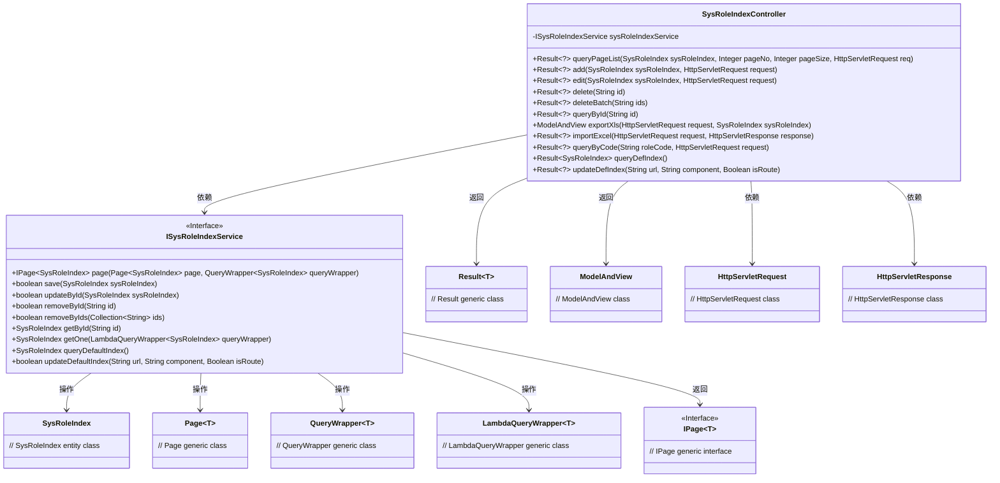

# 基础信息

|      |      |
|------|------|
| 名称 | SysRoleIndexController |
| 编码语言 | .java |
| 代码路径 | JeecgBoot/jeecg-boot/jeecg-module-system/jeecg-system-biz/src/main/java/org/jeecg/modules/system/controller/SysRoleIndexController.java |
| 包名 | org.jeecg.modules.system.controller |
| 依赖项 | ['com.baomidou.mybatisplus.core.conditions.query.LambdaQueryWrapper', 'com.baomidou.mybatisplus.core.conditions.query.QueryWrapper', 'com.baomidou.mybatisplus.core.metadata.IPage', 'com.baomidou.mybatisplus.extension.plugins.pagination.Page', 'io.swagger.v3.oas.annotations.Operation', 'io.swagger.v3.oas.annotations.tags.Tag', 'lombok.extern.slf4j.Slf4j', 'org.apache.shiro.authz.annotation.RequiresPermissions', 'org.jeecg.common.api.vo.Result', 'org.jeecg.common.aspect.annotation.AutoLog', 'org.jeecg.common.system.base.controller.JeecgController', 'org.jeecg.common.system.query.QueryGenerator', 'org.jeecg.modules.system.entity.SysRoleIndex', 'org.jeecg.modules.system.service.ISysRoleIndexService', 'org.springframework.beans.factory.annotation.Autowired', 'org.springframework.web.bind.annotation', 'org.springframework.web.servlet.ModelAndView', 'javax.servlet.http.HttpServletRequest', 'javax.servlet.http.HttpServletResponse', 'java.util.Arrays'] |
| 概述说明 | 角色首页配置控制器提供分页查询、增删改、导入导出功能。 |

# 说明

角色首页配置控制器是一个功能全面的管理工具，支持多种操作以满足用户需求。其主要功能包括分页查询，方便用户快速浏览和定位数据；添加功能，允许用户新增角色配置；编辑功能，支持对现有角色进行修改；删除功能，用于移除不再需要的角色配置。此外，该控制器还提供了导入导出功能，便于用户批量处理数据，提高工作效率。整体设计旨在为用户提供便捷、高效的角色配置管理体验。

# 类列表 Class Summary

| 名称   | 类型  | 说明 |
|-------|------|-------------|
| SysRoleIndexController | class | 角色首页配置控制器，支持分页查询、添加、编辑、删除、导入导出等功能。 |

## 类 SysRoleIndexController

|      |      |
|------|------|
| 访问范围 | @Slf4j;@Tag(name = "角色首页配置");@RestController;@RequestMapping("/sys/sysRoleIndex");public |
| 类型 | class |
| 名称 | SysRoleIndexController |
| 说明 | 角色首页配置控制器，支持分页查询、添加、编辑、删除、导入导出等功能。 |

### UML类图

### 描述
`SysRoleIndexController` 是一个基于Spring Boot的控制器类，负责处理与角色首页配置相关的HTTP请求。它依赖于 `ISysRoleIndexService` 接口来执行具体的业务逻辑，如分页查询、添加、编辑、删除等操作。控制器通过 `Result` 类返回操作结果，并通过 `ModelAndView` 处理Excel导出请求。该控制器与 `HttpServletRequest` 和 `HttpServletResponse` 交互，处理请求和响应。

### 内部方法调用关系图

```mermaid
graph TD
    A["类SysRoleIndexController"]
    B["属性: ISysRoleIndexService sysRoleIndexService"]
    C["方法: Result<?> queryPageList(SysRoleIndex sysRoleIndex, Integer pageNo, Integer pageSize, HttpServletRequest req)"]
    D["方法: Result<?> add(@RequestBody SysRoleIndex sysRoleIndex, HttpServletRequest request)"]
    E["方法: Result<?> edit(@RequestBody SysRoleIndex sysRoleIndex, HttpServletRequest request)"]
    F["方法: Result<?> delete(@RequestParam(name = 'id', required = true) String id)"]
    G["方法: Result<?> deleteBatch(@RequestParam(name = 'ids', required = true) String ids)"]
    H["方法: Result<?> queryById(@RequestParam(name = 'id', required = true) String id)"]
    I["方法: ModelAndView exportXls(HttpServletRequest request, SysRoleIndex sysRoleIndex)"]
    J["方法: Result<?> importExcel(HttpServletRequest request, HttpServletResponse response)"]
    K["方法: Result<?> queryByCode(@RequestParam(name = 'roleCode', required = true) String roleCode, HttpServletRequest request)"]
    L["方法: Result<SysRoleIndex> queryDefIndex()"]
    M["方法: Result<?> updateDefIndex(@RequestParam('url') String url, @RequestParam('component') String component, @RequestParam('isRoute') Boolean isRoute)"]

    A --> B
    A --> C
    A --> D
    A --> E
    A --> F
    A --> G
    A --> H
    A --> I
    A --> J
    A --> K
    A --> L
    A --> M
```

这段代码定义了一个名为 `SysRoleIndexController` 的控制器类，用于处理与角色首页配置相关的请求。该类通过 `@RestController` 和 `@RequestMapping` 注解定义了请求的基本路径，并提供了多个方法来处理不同的请求，如分页查询、添加、编辑、删除、批量删除、查询、导出Excel、导入Excel等。每个方法都通过 `@AutoLog` 和 `@Operation` 注解记录日志和描述操作。类中还注入了 `ISysRoleIndexService` 服务类，用于处理具体的业务逻辑。

### 字段列表 Field List

| 名称  | 类型  | 说明 |
|-------|-------|------|
| sysRoleIndexService | ISysRoleIndexService | 自动注入系统角色索引服务。 |

### 方法列表 Method List

| 名称  | 类型  | 说明 |
|-------|-------|------|
| queryByCode | Result<?> | 通过角色代码查询角色首页配置信息。 |
| add | Result<?> | 角色首页配置添加接口，保存角色首页数据并返回成功信息。 |
| queryById | Result<?> | 通过ID查询角色首页配置并返回结果。 |
| queryDefIndex | Result<SysRoleIndex> | 查询默认角色索引配置并返回结果。 |
| delete | Result<?> | 通过ID删除角色首页配置，调用服务删除并返回成功信息。 |
| edit | Result<?> | 编辑角色首页配置，需权限，支持PUT和POST请求，返回成功信息。 |
| queryPageList | Result<?> | 角色首页配置分页查询接口，支持页码和页大小参数。 |
| importExcel | Result<?> | 处理POST请求，导入Excel文件并返回结果。 |
| deleteBatch | Result<?> | 角色首页配置批量删除接口，通过传入ID列表实现批量删除操作。 |
| updateDefIndex | Result<?> | 更新默认索引接口，需权限，接收URL、组件、路由参数，返回设置结果。 |
| exportXls | ModelAndView | 该方法用于导出角色首页配置的Excel文件。 |

