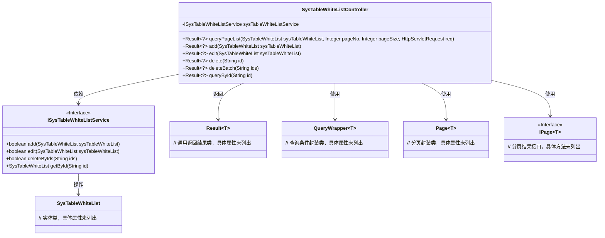

# 基础信息

|      |      |
|------|------|
| 名称 | SysTableWhiteListController |
| 编码语言 | .java |
| 代码路径 | JeecgBoot/jeecg-boot/jeecg-module-system/jeecg-system-biz/src/main/java/org/jeecg/modules/system/controller/SysTableWhiteListController.java |
| 包名 | org.jeecg.modules.system.controller |
| 依赖项 | ['com.baomidou.mybatisplus.core.conditions.query.QueryWrapper', 'com.baomidou.mybatisplus.core.metadata.IPage', 'com.baomidou.mybatisplus.extension.plugins.pagination.Page', 'io.swagger.v3.oas.annotations.Operation', 'io.swagger.v3.oas.annotations.tags.Tag', 'lombok.extern.slf4j.Slf4j', 'org.apache.shiro.authz.annotation.RequiresPermissions', 'org.apache.shiro.authz.annotation.RequiresRoles', 'org.jeecg.common.api.vo.Result', 'org.jeecg.common.aspect.annotation.AutoLog', 'org.jeecg.common.system.base.controller.JeecgController', 'org.jeecg.common.system.query.QueryGenerator', 'org.jeecg.modules.system.entity.SysTableWhiteList', 'org.jeecg.modules.system.service.ISysTableWhiteListService', 'org.springframework.beans.factory.annotation.Autowired', 'org.springframework.web.bind.annotation', 'javax.servlet.http.HttpServletRequest'] |
| 概述说明 | 系统表白名单控制器支持分页、增删改查及批量操作。 |

# 说明

系统表白名单控制器是一个功能全面的管理工具，支持多种操作。它允许用户进行分页查询，方便浏览大量数据。用户可以添加新的表白记录，编辑现有记录的内容，或删除不再需要的记录。此外，该控制器还支持批量删除功能，提高操作效率。用户还可以通过ID精确查询特定表白记录，确保数据的准确性和便捷性。

# 类列表 Class Summary

| 名称   | 类型  | 说明 |
|-------|------|-------------|
| SysTableWhiteListController | class | 系统表白名单控制器，支持分页查询、添加、编辑、删除、批量删除及通过ID查询操作。 |

## 类 SysTableWhiteListController

|      |      |
|------|------|
| 访问范围 | @Slf4j;@Tag(name = "系统表白名单");@RestController;@RequestMapping("/sys/tableWhiteList");public |
| 类型 | class |
| 名称 | SysTableWhiteListController |
| 说明 | 系统表白名单控制器，支持分页查询、添加、编辑、删除、批量删除及通过ID查询操作。 |

### UML类图

### 描述
`SysTableWhiteListController` 是一个Spring Boot的控制器类，负责处理系统表白名单的相关请求。它依赖于 `ISysTableWhiteListService` 接口来执行具体的业务逻辑，如添加、编辑、删除和查询操作。控制器类通过 `QueryWrapper` 和 `Page` 类来封装查询条件和分页信息，并返回 `Result` 对象作为响应。该控制器类通过RESTful API与前端进行交互，确保数据的增删改查操作能够顺利进行。

### 内部方法调用关系图

```mermaid
graph TD
    A["类SysTableWhiteListController"]
    B["属性: ISysTableWhiteListService sysTableWhiteListService"]
    C["方法: queryPageList(SysTableWhiteList sysTableWhiteList, Integer pageNo, Integer pageSize, HttpServletRequest req)"]
    D["方法: add(SysTableWhiteList sysTableWhiteList)"]
    E["方法: edit(SysTableWhiteList sysTableWhiteList)"]
    F["方法: delete(String id)"]
    G["方法: deleteBatch(String ids)"]
    H["方法: queryById(String id)"]
    I["调用: QueryGenerator.initQueryWrapper(sysTableWhiteList, req.getParameterMap())"]
    J["调用: sysTableWhiteListService.page(page, queryWrapper)"]
    K["调用: sysTableWhiteListService.add(sysTableWhiteList)"]
    L["调用: sysTableWhiteListService.edit(sysTableWhiteList)"]
    M["调用: sysTableWhiteListService.deleteByIds(id)"]
    N["调用: sysTableWhiteListService.deleteByIds(ids)"]
    O["调用: sysTableWhiteListService.getById(id)"]
    P["返回: Result.OK(pageList)"]
    Q["返回: Result.OK('添加成功！')"]
    R["返回: Result.error('添加失败！')"]
    S["返回: Result.OK('编辑成功！')"]
    T["返回: Result.error('编辑失败！')"]
    U["返回: Result.OK('删除成功！')"]
    V["返回: Result.error('删除失败！')"]
    W["返回: Result.OK('批量删除成功！')"]
    X["返回: Result.error('批量删除失败！')"]
    Y["返回: Result.OK(sysTableWhiteList)"]

    A --> B
    A --> C
    A --> D
    A --> E
    A --> F
    A --> G
    A --> H
    C --> I
    C --> J
    C --> P
    D --> K
    D --> Q
    D --> R
    E --> L
    E --> S
    E --> T
    F --> M
    F --> U
    F --> V
    G --> N
    G --> W
    G --> X
    H --> O
    H --> Y
```

该流程图展示了`SysTableWhiteListController`类的结构及其方法调用关系。类中包含多个方法，如分页查询、添加、编辑、删除、批量删除和通过ID查询等。每个方法通过调用`sysTableWhiteListService`中的相应方法来实现业务逻辑，并根据操作结果返回不同的`Result`对象。流程图中清晰地展示了每个方法的调用链和返回结果，便于理解代码的执行流程。

### 字段列表 Field List

| 名称  | 类型  | 说明 |
|-------|-------|------|
| sysTableWhiteListService | ISysTableWhiteListService | 自动注入系统表白名单服务实例。 |

### 方法列表 Method List

| 名称  | 类型  | 说明 |
|-------|-------|------|
| add | Result<?> | 系统表白名单添加接口，需权限，返回成功或失败结果。 |
| deleteBatch | Result<?> | 系统表白名单批量删除接口，需权限，返回操作结果。 |
| queryPageList | Result<?> | 查询系统白名单列表，支持分页，返回结果。 |
| edit | Result<?> | 系统表白名单编辑接口，需权限，支持PUT和POST请求，返回编辑结果。 |
| queryById | Result<?> | 通过ID查询系统表白名单，需权限system:tableWhite:queryById。 |
| delete | Result<?> | 系统表白名单通过ID删除接口，需权限，返回删除结果。 |

