# 基础信息

|      |      |
|------|------|
| 名称 | SysTenantController |
| 编码语言 | .java |
| 代码路径 | JeecgBoot/jeecg-boot/jeecg-module-system/jeecg-system-biz/src/main/java/org/jeecg/modules/system/controller/SysTenantController.java |
| 包名 | org.jeecg.modules.system.controller |
| 依赖项 | ['cn.hutool.core.collection.CollectionUtil', 'cn.hutool.core.util.RandomUtil', 'com.baomidou.mybatisplus.core.conditions.query.LambdaQueryWrapper', 'com.baomidou.mybatisplus.core.conditions.query.QueryWrapper', 'com.baomidou.mybatisplus.core.metadata.IPage', 'com.baomidou.mybatisplus.extension.plugins.pagination.Page', 'lombok.extern.slf4j.Slf4j', 'org.apache.shiro.SecurityUtils', 'org.apache.shiro.authz.annotation.RequiresPermissions', 'org.jeecg.common.api.vo.Result', 'org.jeecg.common.aspect.annotation.PermissionData', 'org.jeecg.common.config.TenantContext', 'org.jeecg.common.constant.CommonConstant', 'org.jeecg.common.constant.SymbolConstant', 'org.jeecg.common.system.query.QueryGenerator', 'org.jeecg.common.system.vo.LoginUser', 'org.jeecg.common.util.PasswordUtil', 'org.jeecg.common.util.TokenUtils', 'org.jeecg.common.util.oConvertUtils', 'org.jeecg.config.mybatis.MybatisPlusSaasConfig', 'org.jeecg.modules.base.service.BaseCommonService', 'org.jeecg.modules.system.entity', 'org.jeecg.modules.system.service.ISysTenantPackService', 'org.jeecg.modules.system.service.ISysTenantService', 'org.jeecg.modules.system.service.ISysUserService', 'org.jeecg.modules.system.service.ISysUserTenantService', 'org.jeecg.modules.system.service.ISysDepartService', 'org.jeecg.modules.system.vo.SysUserTenantVo', 'org.jeecg.modules.system.vo.tenant.TenantDepartAuthInfo', 'org.jeecg.modules.system.vo.tenant.TenantPackModel', 'org.jeecg.modules.system.vo.tenant.TenantPackUser', 'org.jeecg.modules.system.vo.tenant.TenantPackUserCount', 'org.springframework.beans.factory.annotation.Autowired', 'org.springframework.web.bind.annotation', 'javax.servlet.http.HttpServletRequest', 'java.util'] |
| 概述说明 | 控制器负责租户管理的查询、添加、编辑、删除及同步默认产品包操作。 |

# 说明

该控制器专门负责处理租户管理的各项操作，涵盖了租户信息的查询、添加、编辑和删除等功能。此外，它还具备同步默认产品包的能力，确保租户在使用过程中能够获得标准化的产品配置。通过该控制器，系统能够高效地管理租户信息，并保持产品包的一致性，从而提升整体管理效率和用户体验。

# 类列表 Class Summary

| 名称   | 类型  | 说明 |
|-------|------|-------------|
| SysTenantController | class | 该控制器处理租户管理相关操作，包括查询、添加、编辑、删除、同步默认产品包等功能。 |

## 类 SysTenantController

|      |      |
|------|------|
| 访问范围 | @Slf4j;@RestController;@RequestMapping("/sys/tenant");public |
| 类型 | class |
| 名称 | SysTenantController |
| 说明 | 该控制器处理租户管理相关操作，包括查询、添加、编辑、删除、同步默认产品包等功能。 |

### UML类图

```mermaid
classDiagram
    class SysTenantController {
        -ISysTenantService sysTenantService
        -ISysUserService sysUserService
        -ISysUserTenantService relationService
        -ISysTenantPackService sysTenantPackService
        -BaseCommonService baseCommonService
        -ISysDepartService sysDepartService
        +Result~IPage~SysTenant~~ queryPageList(SysTenant sysTenant, Integer pageNo, Integer pageSize, HttpServletRequest req)
        +Result~IPage~SysTenant~~ recycleBinPageList(SysTenant sysTenant, Integer pageNo, Integer pageSize, HttpServletRequest req)
        +Result~SysTenant~ add(SysTenant sysTenant)
        +Result~?~ syncDefaultPack(Integer tenantId)
        +Result~SysTenant~ edit(SysTenant tenant)
        +Result~?~ delete(String id)
        +Result~?~ deleteBatch(String ids)
        +Result~SysTenant~ queryById(String id)
        +Result~List~SysTenant~~ queryList(String ids)
        +Result~IPage~SysTenantPack~~ queryPackPageList(SysTenantPack sysTenantPack, Integer pageNo, Integer pageSize, HttpServletRequest req)
        +Result~String~ addPackPermission(SysTenantPack sysTenantPack)
        +Result~String~ editPackPermission(SysTenantPack sysTenantPack)
        +Result~String~ deleteTenantPack(String ids)
        +Result~Map~String,Object~~ getCurrentUserTenant()
        +Result~String~ invitationUserJoin(String ids, String phone)
        +Result~IPage~SysUser~~ getTenantUserList(SysUser user, Integer pageNo, Integer pageSize, String userTenantId, HttpServletRequest req)
        +Result~String~ leaveTenant(String userIds, String tenantId)
        +Result~SysTenant~ editOwnTenant(SysTenant tenant, HttpServletRequest req)
        +Result~Integer~ saveTenantJoinUser(SysTenant sysTenant)
        +Result~Integer~ joinTenantByHouseNumber(SysTenant sysTenant)
        +Result~IPage~SysUserTenantVo~~ getUserTenantPageList(Integer pageNo, Integer pageSize, String userTenantStatus, String type, SysUser user, HttpServletRequest req)
        +Result~List~SysUserTenantVo~~ getTenantListByUserId(String userTenantStatus)
        +Result~String~ updateUserTenantStatus(SysUserTenant userTenant)
        +Result~String~ cancelTenant(SysTenant sysTenant, HttpServletRequest request)
        +Result~Long~ getTenantStatusCount(String status, HttpServletRequest req)
        +Result~String~ cancelApplyTenant(String tenantId)
        +Result~String~ deleteTenantLogic(String ids)
        +Result~String~ revertTenantLogic(String ids)
        +Result~String~ exitUserTenant(SysTenant sysTenant, HttpServletRequest request)
        +Result~String~ changeOwenUserTenant(String userId, String tenantId)
        +Result~String~ invitationUser(String phone, String departId)
        +Result~List~TenantPackUserCount~~ loadAdminPackCount(Integer tenantId)
        +Result~TenantPackModel~ getTenantPackInfo(TenantPackModel packModel)
        +Result~?~ addTenantPackUser(SysTenantPackUser sysTenantPackUser)
        +Result~?~ deleteTenantPackUser(SysTenantPackUser sysTenantPackUser)
        +Result~?~ updateApplyStatus(SysTenant sysTenant)
        +Result~?~ getTenantPackApplyUsers(Integer tenantId)
        +Result~?~ doApplyTenantPackUser(SysTenantPackUser sysTenantPackUser)
        +Result~?~ passApply(SysTenantPackUser sysTenantPackUser)
        +Result~?~ deleteApply(SysTenantPackUser sysTenantPackUser)
        +Result~Long~ getApplySuperAdminCount()
        +Result~TenantDepartAuthInfo~ queryTenantAuthInfo(String id)
        +Result~IPage~TenantPackUser~~ queryTenantPackUserList(String tenantId, String packId, Integer status, Integer pageNo, Integer pageSize)
        +Result~Map~String,Long~~ getTenantCount(HttpServletRequest request)
        +Result~IPage~SysTenant~~ getTenantPageListByUserId(SysUserTenantVo sysUserTenantVo, Integer pageNo, Integer pageSize)
        +Result~String~ agreeOrRefuseJoinTenant(Integer tenantId, String status)
        +Result~String~ deleteUserByPassword(SysUser sysUser, HttpServletRequest request)
        +Result~Map~String,Object~~ getCurrentUserTenantForFile()
    }

    class ISysTenantService {
        <<Interface>>
        +IPage~SysTenant~ page(Page~SysTenant~ page, QueryWrapper~SysTenant~ queryWrapper)
        +IPage~SysTenant~ getRecycleBinPageList(Page~SysTenant~ page, SysTenant sysTenant)
        +SysTenant getById(String id)
        +void saveTenant(SysTenant sysTenant)
        +void removeTenantById(String id)
        +void removeByIds(List~Integer~ idList)
        +List~SysTenant~ queryEffectiveTenant(List~Integer~ tenantIdList)
        +void invitationUserJoin(String ids, String phone)
        +void leaveTenant(String userIds, String tenantId)
        +void deleteTenantLogic(String ids)
        +void revertTenantLogic(String ids)
        +void exitUserTenant(String userId, String username, String tenantId)
        +void changeOwenUserTenant(String userId, String tenantId)
        +Result~String~ invitationUser(String phone, String departId)
        +List~TenantPackUserCount~ queryTenantPackUserCount(Integer tenantId)
        +TenantPackModel queryTenantPack(TenantPackModel packModel)
        +void addBatchTenantPackUser(SysTenantPackUser sysTenantPackUser)
        +void deleteTenantPackUser(SysTenantPackUser sysTenantPackUser)
        +void updateApplyStatus(SysTenant sysTenant)
        +List~TenantPackUser~ getTenantPackApplyUsers(Integer tenantId)
        +void doApplyTenantPackUser(SysTenantPackUser sysTenantPackUser)
        +void passApply(SysTenantPackUser sysTenantPackUser)
        +void deleteApply(SysTenantPackUser sysTenantPackUser)
        +Long getApplySuperAdminCount()
        +TenantDepartAuthInfo getTenantDepartAuthInfo(Integer id)
        +IPage~TenantPackUser~ queryTenantPackUserList(String tenantId, String packId, Integer status, Page~TenantPackUser~ page)
        +Map~String,Long~ getTenantCount(HttpServletRequest request)
        +IPage~SysTenant~ getTenantPageListByUserId(Page~SysTenant~ page, String userId, List~String~ list, SysUserTenantVo sysUserTenantVo)
        +void agreeJoinTenant(String userId, Integer tenantId)
        +void refuseJoinTenant(String userId, Integer tenantId)
        +void deleteUserByPassword(SysUser sysUser, Integer tenantId)
        +List~SysTenant~ getTenantListByUserId(String userId)
    }

    class ISysUserService {
        <<Interface>>
        +SysUser getById(String id)
    }

    class ISysUserTenantService {
        <<Interface>>
        +List~Integer~ getTenantIdsByUserId(String userId)
        +Page~SysUser~ getPageUserList(Page~SysUser~ page, Integer userTenantId, SysUser user)
        +SysUserTenant getUserTenantByTenantId(String userId, Integer tenantId)
        +void updateUserTenantStatus(String userId, String tenantId, String status)
        +long count(LambdaQueryWrapper~SysUserTenant~ query)
        +IPage~SysUserTenantVo~ getUserTenantPageList(Page~SysUserTenantVo~ page, List~String~ userTenantStatus, SysUser user, Integer tenantId)
        +List~SysUserTenantVo~ getTenantListByUserId(String userId, List~String~ list)
        +Long getUserCount(Integer tenantId, String status)
    }

    class ISysTenantPackService {
        <<Interface>>
        +void addTenantDefaultPack(String tenantId)
        +void syncDefaultPack(Integer tenantId)
        +IPage~SysTenantPack~ page(Page~SysTenantPack~ page, QueryWrapper~SysTenantPack~ queryWrapper)
        +List~SysTenantPack~ setPermissions(List~SysTenantPack~ records)
        +void addPackPermission(SysTenantPack sysTenantPack)
        +void editPackPermission(SysTenantPack sysTenantPack)
        +void deleteTenantPack(String ids)
    }

    class BaseCommonService {
        +void addLog(String logContent, String logType, String operateType)
    }

    class ISysDepartService {
        <<Interface>>
        +long count(LambdaQueryWrapper~SysDepart~ query)
    }

    class SysTenant {
        -String id
        -Date beginDate
        -Date endDate
        -String houseNumber
        -String createBy
        -String status
        -String applyStatus
        +String getId()
        +Date getBeginDate()
        +Date getEndDate()
        +String getHouseNumber()
        +String getCreateBy()
        +String getStatus()
        +String getApplyStatus()
        +void setBeginDate(Date beginDate)
        +void setEndDate(Date endDate)
        +void setHouseNumber(String houseNumber)
    }

    class SysUser {
        -String id
        -String username
        -String password
        -String salt
        -String realname
        +String getId()
        +String getUsername()
        +String getPassword()
        +String getSalt()
        +String getRealname()
    }

    class SysUserTenant {
        -String userId
        -Integer tenantId
        -String status
        +String getUserId()
        +Integer getTenantId()
        +String getStatus()
    }

    class SysTenantPack {
        -String id
        -String tenantId
        +String getId()
        +String getTenantId()
    }

    class SysTenantPackUser {
        -String id
        -String tenantId
        -String packId
        -String userId
        +String getId()
        +String getTenantId()
        +String getPackId()
        +String getUserId()
    }

    class TenantPackUserCount {
        -String packId
        -Long userCount
        +String getPackId()
        +Long getUserCount()
    }

    class TenantPackModel {
        -String id
        -String tenantId
        +String getId()
        +String getTenantId()
    }

    class TenantDepartAuthInfo {
        -String id
        -String tenantId
        +String getId()
        +String getTenantId()
    }

    class SysUserTenantVo {
        -String userId
        -Integer tenantId
        -String status
        +String getUserId()
        +Integer getTenantId()
        +String getStatus()
    }

    class TenantPackUser {
        -String id
        -String tenantId
        -String packId
        -String userId
        +String getId()
        +String getTenantId()
        +String getPackId()
        +String getUserId()
    }

    SysTenantController --> ISysTenantService : 依赖
    SysTenantController --> ISysUserService : 依赖
    SysTenantController --> ISysUserTenantService : 依赖
    SysTenantController --> ISysTenantPackService : 依赖
    SysTenantController --> BaseCommonService : 依赖
    SysTenantController --> ISysDepartService : 依赖
    ISysTenantService --> SysTenant : 依赖
    ISysUserService --> SysUser : 依赖
    ISysUserTenantService --> SysUserTenant : 依赖
    ISysTenantPackService --> SysTenantPack : 依赖
    ISysTenantPackService --> SysTenantPackUser : 依赖
    ISysTenantService --> TenantPackUserCount : 依赖
    ISysTenantService --> TenantPackModel : 依赖
    ISysTenantService --> TenantDepartAuthInfo : 依赖
    ISysUserTenantService --> SysUserTenantVo : 依赖
    ISysTenantService --> TenantPackUser : 依赖
```

### 描述：
`SysTenantController` 是一个Spring Boot的RestController，负责处理与租户管理相关的HTTP请求。它依赖于多个服务接口，如`ISysTenantService`、`ISysUserService`、`ISysUserTenantService`等，用于处理租户的增删改查、用户管理、租户产品包管理等操作。控制器中的方法通过调用这些服务接口来完成具体的业务逻辑，如获取租户列表、添加租户、删除租户等。代码中还包含了对租户状态、权限、用户邀请等复杂业务逻辑的处理。

### 内部方法调用关系图

这段代码定义了一个名为 `SysTenantController` 的控制器类，主要用于处理与租户相关的各种操作。类中包含了多个方法，分别用于查询、添加、编辑、删除租户信息，以及管理租户与用户、租户与产品包之间的关系。代码中还涉及到权限控制、分页查询、日志记录等功能。通过这些方法，系统能够实现对租户的全面管理，包括租户的创建、修改、删除、查询等操作，并且支持租户与用户、产品包之间的关联管理。

### 字段列表 Field List

| 名称  | 类型  | 说明 |
|-------|-------|------|
| sysUserService | ISysUserService | 自动注入系统用户服务实例。 |
| sysDepartService | ISysDepartService | 自动注入系统部门服务实例。 |
| sysTenantPackService | ISysTenantPackService | 自动注入系统租户包服务实例。 |
| sysTenantService | ISysTenantService | 自动注入系统租户服务实例。 |
| baseCommonService | BaseCommonService | 自动注入BaseCommonService服务实例。 |
| relationService | ISysUserTenantService | 自动注入系统用户租户服务实例。 |

### 方法列表 Method List

| 名称  | 类型  | 说明 |
|-------|-------|------|
| cancelApplyTenant | Result<String> | 取消租户申请的接口，通过用户ID和租户ID实现。 |
| addPackPermission | Result<String> | 接口`/addPackPermission`用于添加租户产品包权限，需系统权限。 |
| deleteApply | Result<?> | 删除租户包用户申请的API接口，调用服务层方法并返回成功结果。 |
| updateApplyStatus | Result<?> | 更新租户申请状态，检查租户存在性后执行更新操作。 |
| invitationUser | Result<String> | 接口invitationUser通过手机号和部门ID邀请用户。 |
| saveTenantJoinUser | Result<Integer> | 保存租户用户信息并返回成功结果。 |
| updateUserTenantStatus | Result<String> | 更新用户租户状态，需验证租户信息，成功后返回更新结果。 |
| getCurrentUserTenant | Result<Map<String,Object>> | 通过用户ID查询有效租户列表并返回结果。 |
| addTenantPackUser | Result<?> | 通过POST请求添加租户包用户，成功后返回操作成功信息。 |
| queryPackPageList | Result<IPage<SysTenantPack>> | 查询租户套餐分页列表，设置权限后返回结果。 |
| queryTenantAuthInfo | Result<TenantDepartAuthInfo> | 通过ID查询租户部门授权信息，返回结果。 |
| deleteTenantPack | Result<String> | 删除租户产品包的API，需权限验证，返回成功信息。 |
| getTenantListByUserId | Result<List<SysUserTenantVo>> | 通过用户ID获取租户列表，支持过滤租户状态。 |
| agreeOrRefuseJoinTenant | Result<String> | 处理用户同意或拒绝加入租户组织的请求，验证权限并更新状态。 |
| exitUserTenant | Result<String> | 用户退出租户流程：验证用户存在性、密码正确性，成功后退出。 |
| recycleBinPageList | Result<IPage<SysTenant>> | 获取回收站租户分页列表，需系统租户权限，默认页码1，页大小10。 |
| changeOwenUserTenant | Result<String> | 通过用户ID和租户ID更改用户所属租户，并返回成功信息。 |
| loadAdminPackCount | Result<List<TenantPackUserCount>> | 通过租户ID查询管理员套餐用户数量并返回结果。 |
| deleteUserByPassword | Result<String> | 通过密码删除用户，需提供用户信息和租户ID，成功后返回删除成功信息。 |
| deleteTenantLogic | Result<String> | 删除逻辑删除的租户，需权限，返回成功信息。 |
| deleteBatch | Result<?> | 批量删除租户，需权限验证，过滤非创建人操作，删除成功返回结果。 |
| joinTenantByHouseNumber | Result<Integer> | 用户通过门牌号申请加入组织，成功返回ID，失败提示门牌号不存在。 |
| getTenantPageListByUserId | Result<IPage<SysTenant>> | 通过用户ID获取租户分页列表，支持状态过滤和分页参数。 |
| leaveTenant | Result<String> | 用户通过权限验证后，可离开指定租户，系统检查多租户隔离权限。 |
| getTenantStatusCount | Result<Long> | 获取租户状态数量接口，默认状态为1，返回计数结果。 |
| add | Result<SysTenant> | 添加租户接口，检查编号存在性，保存租户并添加默认产品包，返回操作结果。 |
| getUserTenantPageList | Result<IPage<SysUserTenantVo>> | 获取用户租户分页列表接口，支持分页、状态过滤和租户ID查询。 |
| syncDefaultPack | Result<?> | 系统租户同步默认产品包接口，需权限，接收租户ID参数。 |
| getTenantPackApplyUsers | Result<?> | 通过租户ID获取租户套餐申请用户列表并返回结果。 |
| edit | Result<SysTenant> | 系统租户编辑接口，需权限，支持PUT和POST，检查实体存在并更新，成功返回修改成功。 |
| doApplyTenantPackUser | Result<?> | 后端接口处理租户套餐用户申请，调用服务方法并返回成功结果。 |
| delete | Result<?> | 需要权限删除租户，校验操作人是否为创建人或管理员，否则记录日志并报错。 |
| editOwnTenant | Result<SysTenant> | 编辑租户信息，验证权限，检查实体，生成房号，更新成功返回结果。 |
| getTenantUserList | Result<IPage<SysUser>> | GET请求获取租户用户列表，需权限，返回分页结果。 |
| passApply | Result<?> | 处理租户包用户申请通过请求并返回成功结果。 |
| deleteTenantPackUser | Result<?> | 删除租户包用户的API接口，调用服务层方法并返回成功结果。 |
| getCurrentUserTenantForFile | Result<Map<String,Object>> | 获取当前用户租户信息，成功返回租户列表，失败记录错误并提示查询失败。 |
| cancelTenant | Result<String> | 取消租户需验证权限和密码，成功则注销租户。 |
| queryTenantPackUserList | Result<IPage<TenantPackUser>> | 查询租户套餐用户列表，支持分页，返回结果。 |
| queryList | Result<List<SysTenant>> | 通过GET请求查询租户列表，支持按ID过滤，返回状态为1的租户信息。 |
| getTenantCount | Result<Map<String,Long>> | 获取租户用户和部门数量，验证租户ID后返回结果。 |
| invitationUserJoin | Result<String> | API路径为/invitationUserJoin，需系统租户邀请用户权限，通过ids和phone参数邀请用户，返回成功信息。 |
| getTenantPackInfo | Result<TenantPackModel> | 通过`/getTenantPackInfo`接口查询租户包信息并返回结果。 |
| queryPageList | Result<IPage<SysTenant>> | 查询租户列表接口，支持分页和日期范围查询。 |
| editPackPermission | Result<String> | 修改租户产品包权限的API接口，需系统租户编辑权限。 |
| queryById | Result<SysTenant> | 通过ID查询租户信息，验证参数和权限后返回结果。 |
| getApplySuperAdminCount | Result<Long> | 获取超级管理员申请数量的接口，返回结果包含计数。 |
| revertTenantLogic | Result<String> | 该方法用于还原租户逻辑，需系统租户权限，接收ID参数并返回成功信息。 |

