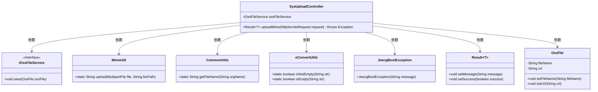
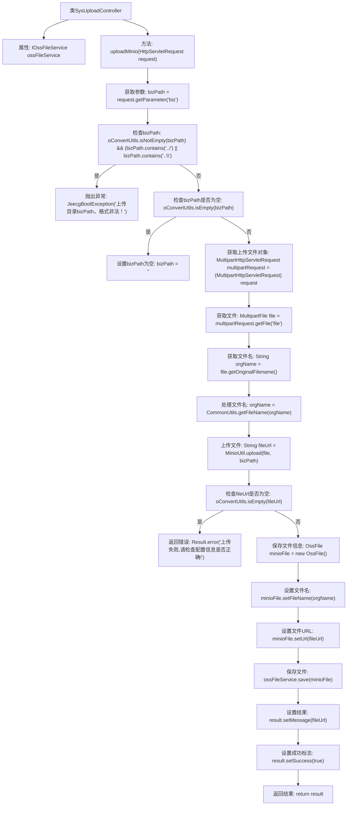

# 基础信息

|      |      |
|------|------|
| 名称 | SysUploadController |
| 编码语言 | .java |
| 代码路径 | JeecgBoot/jeecg-boot/jeecg-module-system/jeecg-system-biz/src/main/java/org/jeecg/modules/system/controller/SysUploadController.java |
| 包名 | org.jeecg.modules.system.controller |
| 依赖项 | ['lombok.extern.slf4j.Slf4j', 'org.jeecg.common.api.vo.Result', 'org.jeecg.common.exception.JeecgBootException', 'org.jeecg.common.util.CommonUtils', 'org.jeecg.common.util.MinioUtil', 'org.jeecg.common.util.oConvertUtils', 'org.jeecg.modules.oss.entity.OssFile', 'org.jeecg.modules.oss.service.IOssFileService', 'org.springframework.beans.factory.annotation.Autowired', 'org.springframework.web.bind.annotation.PostMapping', 'org.springframework.web.bind.annotation.RequestMapping', 'org.springframework.web.bind.annotation.RestController', 'org.springframework.web.multipart.MultipartFile', 'org.springframework.web.multipart.MultipartHttpServletRequest', 'javax.servlet.http.HttpServletRequest'] |
| 概述说明 | SysUploadController处理文件上传，验证路径，保存信息并返回结果。 |

# 说明

SysUploadController负责处理文件上传任务，主要功能包括检查上传路径的合法性，确保路径符合系统要求，防止非法路径导致的潜在安全问题。在路径验证通过后，控制器将文件信息保存到系统中，包括文件名、大小、类型等关键数据。最后，控制器会返回处理结果，通知用户文件上传是否成功，并提供必要的反馈信息。整个过程确保了文件上传的安全性和可靠性。

# 类列表 Class Summary

| 名称   | 类型  | 说明 |
|-------|------|-------------|
| SysUploadController | class | SysUploadController处理文件上传，检查路径合法性，保存文件信息并返回结果。 |

## 类 SysUploadController

|      |      |
|------|------|
| 访问范围 | @Slf4j;@RestController;@RequestMapping("/sys/upload");public |
| 类型 | class |
| 名称 | SysUploadController |
| 说明 | SysUploadController处理文件上传，检查路径合法性，保存文件信息并返回结果。 |

### UML类图

这段代码是一个Spring Boot控制器类 `SysUploadController`，用于处理文件上传请求。它依赖于 `IOssFileService` 接口来保存文件信息，并使用了 `MinioUtil`、`CommonUtils` 和 `oConvertUtils` 等工具类来处理文件上传和验证。代码中还定义了 `Result` 和 `OssFile` 类，分别用于返回上传结果和存储文件信息。`JeecgBootException` 用于处理上传路径非法的情况。整体设计合理，符合分层架构的思想。

### 内部方法调用关系图

这段代码是一个用于文件上传的控制器类 `SysUploadController`，它通过 `uploadMinio` 方法处理文件上传请求。代码首先检查上传路径 `bizPath` 是否合法，如果路径包含非法字符则抛出异常。接着获取上传的文件，处理文件名并上传到 Minio 存储服务。如果上传成功，保存文件信息并返回文件 URL；如果上传失败，返回错误信息。整个流程通过多个条件判断和文件处理步骤确保文件上传的安全性和正确性。

### 字段列表 Field List

| 名称  | 类型  | 说明 |
|-------|-------|------|
| ossFileService | IOssFileService | 自动注入OSS文件服务实例。 |

### 方法列表 Method List

| 名称  | 类型  | 说明 |
|-------|-------|------|
| uploadMinio | Result<?> | 上传文件接口，检查路径合法性，保存文件信息并返回上传结果。 |

