# 基础信息

|      |      |
|------|------|
| 名称 | SysUserAgentController |
| 编码语言 | .java |
| 代码路径 | JeecgBoot/jeecg-boot/jeecg-module-system/jeecg-system-biz/src/main/java/org/jeecg/modules/system/controller/SysUserAgentController.java |
| 包名 | org.jeecg.modules.system.controller |
| 依赖项 | ['java.io.IOException', 'java.io.UnsupportedEncodingException', 'java.net.URLDecoder', 'java.util.Arrays', 'java.util.List', 'java.util.Map', 'javax.servlet.http.HttpServletRequest', 'javax.servlet.http.HttpServletResponse', 'org.apache.shiro.SecurityUtils', 'org.jeecg.common.api.vo.Result', 'org.jeecg.common.system.query.QueryGenerator', 'org.jeecg.common.system.vo.LoginUser', 'org.jeecg.common.util.oConvertUtils', 'org.jeecg.modules.system.entity.SysUserAgent', 'org.jeecg.modules.system.service.ISysUserAgentService', 'org.jeecgframework.poi.excel.ExcelImportUtil', 'org.jeecgframework.poi.excel.def.NormalExcelConstants', 'org.jeecgframework.poi.excel.entity.ExportParams', 'org.jeecgframework.poi.excel.entity.ImportParams', 'org.jeecgframework.poi.excel.view.JeecgEntityExcelView', 'org.springframework.beans.factory.annotation.Autowired', 'org.springframework.beans.factory.annotation.Value', 'org.springframework.web.bind.annotation.DeleteMapping', 'org.springframework.web.bind.annotation.GetMapping', 'org.springframework.web.bind.annotation.PostMapping', 'org.springframework.web.bind.annotation.PutMapping', 'org.springframework.web.bind.annotation.RequestBody', 'org.springframework.web.bind.annotation.RequestMapping', 'org.springframework.web.bind.annotation.RequestMethod', 'org.springframework.web.bind.annotation.RequestParam', 'org.springframework.web.bind.annotation.RestController', 'org.springframework.web.multipart.MultipartFile', 'org.springframework.web.multipart.MultipartHttpServletRequest', 'org.springframework.web.servlet.ModelAndView', 'com.alibaba.fastjson.JSON', 'com.baomidou.mybatisplus.core.conditions.query.LambdaQueryWrapper', 'com.baomidou.mybatisplus.core.conditions.query.QueryWrapper', 'com.baomidou.mybatisplus.core.metadata.IPage', 'com.baomidou.mybatisplus.extension.plugins.pagination.Page', 'lombok.extern.slf4j.Slf4j'] |
| 概述说明 | SysUserAgentController提供用户代理人管理功能，支持查询、增删改、导入导出操作。 |

# 说明

SysUserAgentController是一个用于管理用户代理人的控制器，提供多种功能以支持对用户代理人的操作。这些功能包括分页查询，允许用户按页查看代理人信息；添加功能，用于新增用户代理人；编辑功能，用于修改现有代理人信息；删除功能，用于移除单个代理人；批量删除功能，用于同时移除多个代理人；ID查询功能，通过唯一标识符查找特定代理人；用户名查询功能，通过用户名查找代理人；Excel导出功能，将代理人数据导出为Excel文件；以及Excel导入功能，从Excel文件导入代理人数据。这些功能共同构成了一个全面的用户代理人管理系统。

# 类列表 Class Summary

| 名称   | 类型  | 说明 |
|-------|------|-------------|
| SysUserAgentController | class | SysUserAgentController提供用户代理人管理功能，包括分页查询、添加、编辑、删除、批量删除、ID查询、用户名查询、Excel导出和导入。 |


## 类 SysUserAgentController

|      |      |
|------|------|
| 访问范围 | @RestController;@RequestMapping("/sys/sysUserAgent");@Slf4j;public |
| 类型 | class |
| 名称 | SysUserAgentController |
| 说明 | SysUserAgentController提供用户代理人管理功能，包括分页查询、添加、编辑、删除、批量删除、ID查询、用户名查询、Excel导出和导入。 |


### UML类图

```mermaid
classDiagram
    class SysUserAgentController {
        -ISysUserAgentService sysUserAgentService
        -String upLoadPath
        +Result~IPage~SysUserAgent~~ queryPageList(SysUserAgent sysUserAgent, Integer pageNo, Integer pageSize, HttpServletRequest req)
        +Result~SysUserAgent~ add(@RequestBody SysUserAgent sysUserAgent)
        +Result~SysUserAgent~ edit(@RequestBody SysUserAgent sysUserAgent)
        +Result~SysUserAgent~ delete(@RequestParam String id)
        +Result~SysUserAgent~ deleteBatch(@RequestParam String ids)
        +Result~SysUserAgent~ queryById(@RequestParam String id)
        +Result~SysUserAgent~ queryByUserName(@RequestParam String userName)
        +ModelAndView exportXls(SysUserAgent sysUserAgent, HttpServletRequest request)
        +Result~?~ importExcel(HttpServletRequest request, HttpServletResponse response)
    }

    class ISysUserAgentService {
        <<Interface>>
        +IPage~SysUserAgent~ page(Page~SysUserAgent~ page, QueryWrapper~SysUserAgent~ queryWrapper)
        +boolean save(SysUserAgent sysUserAgent)
        +boolean updateById(SysUserAgent sysUserAgent)
        +boolean removeById(String id)
        +boolean removeByIds(Collection~String~ ids)
        +SysUserAgent getById(String id)
        +SysUserAgent getOne(QueryWrapper~SysUserAgent~ queryWrapper)
        +List~SysUserAgent~ list(QueryWrapper~SysUserAgent~ queryWrapper)
    }

    class Result~T~ {
        +boolean success
        +T result
        +void setSuccess(boolean success)
        +void setResult(T result)
        +void success(String message)
        +void error500(String message)
        +void error(String message)
    }

    class IPage~T~ {
        <<Interface>>
    }

    class Page~T~ {
        +Page(Integer pageNo, Integer pageSize)
    }

    class QueryWrapper~T~ {
        +QueryWrapper~T~ initQueryWrapper(T entity, Map~String, String[]~ parameterMap)
    }

    class LambdaQueryWrapper~T~ {
        +LambdaQueryWrapper~T~ eq(SerializableFunction~T, R~ function, R value)
    }

    class ModelAndView {
        +ModelAndView(View view)
        +void addObject(String key, Object value)
    }

    class JeecgEntityExcelView {
    }

    class ExportParams {
        +ExportParams(String title, String secondTitle, String sheetName)
        +void setImageBasePath(String imageBasePath)
    }

    class ImportParams {
        +void setTitleRows(int titleRows)
        +void setHeadRows(int headRows)
        +void setNeedSave(boolean needSave)
    }

    class ExcelImportUtil {
        +List~T~ importExcel(InputStream inputStream, Class~T~ clazz, ImportParams params)
    }

    SysUserAgentController --> ISysUserAgentService : 依赖
    SysUserAgentController --> Result~IPage~SysUserAgent~~ : 依赖
    SysUserAgentController --> Result~SysUserAgent~ : 依赖
    SysUserAgentController --> ModelAndView : 依赖
    SysUserAgentController --> Result~?~ : 依赖
    ISysUserAgentService --> IPage~SysUserAgent~ : 依赖
    ISysUserAgentService --> QueryWrapper~SysUserAgent~ : 依赖
    ISysUserAgentService --> LambdaQueryWrapper~SysUserAgent~ : 依赖
    QueryWrapper~SysUserAgent~ --> QueryGenerator : 依赖
    LambdaQueryWrapper~SysUserAgent~ --> SerializableFunction : 依赖
    ModelAndView --> JeecgEntityExcelView : 依赖
    ModelAndView --> ExportParams : 依赖
    ImportParams --> ExcelImportUtil : 依赖
```

这段代码定义了一个名为 `SysUserAgentController` 的控制器类，用于处理与用户代理人相关的各种请求。该类依赖于 `ISysUserAgentService` 接口来执行具体的业务逻辑，如分页查询、添加、编辑、删除等操作。控制器通过不同的 HTTP 方法（如 `GET`、`POST`、`PUT`、`DELETE`）来响应客户端请求，并返回 `Result` 对象或 `ModelAndView` 对象。`Result` 类用于封装操作结果，`ModelAndView` 用于处理 Excel 导出和导入操作。代码中还使用了 `QueryWrapper` 和 `LambdaQueryWrapper` 来构建查询条件，`ExportParams` 和 `ImportParams` 用于处理 Excel 文件的导出和导入参数。


### 内部方法调用关系图

```mermaid
graph TD
    A["类SysUserAgentController"]
    B["属性: ISysUserAgentService sysUserAgentService"]
    C["属性: String upLoadPath"]
    D["方法: Result<IPage<SysUserAgent>> queryPageList(SysUserAgent sysUserAgent, Integer pageNo, Integer pageSize, HttpServletRequest req)"]
    E["方法: Result<SysUserAgent> add(@RequestBody SysUserAgent sysUserAgent)"]
    F["方法: Result<SysUserAgent> edit(@RequestBody SysUserAgent sysUserAgent)"]
    G["方法: Result<SysUserAgent> delete(@RequestParam(name='id',required=true) String id)"]
    H["方法: Result<SysUserAgent> deleteBatch(@RequestParam(name='ids',required=true) String ids)"]
    I["方法: Result<SysUserAgent> queryById(@RequestParam(name='id',required=true) String id)"]
    J["方法: Result<SysUserAgent> queryByUserName(@RequestParam(name='userName',required=true) String userName)"]
    K["方法: ModelAndView exportXls(SysUserAgent sysUserAgent, HttpServletRequest request)"]
    L["方法: Result<?> importExcel(HttpServletRequest request, HttpServletResponse response)"]

    A --> B
    A --> C
    A --> D
    A --> E
    A --> F
    A --> G
    A --> H
    A --> I
    A --> J
    A --> K
    A --> L
```



这段代码是一个Spring Boot控制器类`SysUserAgentController`，主要用于管理用户代理人的相关操作。它提供了分页查询、添加、编辑、删除、批量删除、通过ID查询、通过用户名查询、导出Excel和导入Excel等功能。每个方法都通过HTTP请求映射来处理不同的业务逻辑，并通过`Result`对象返回操作结果。代码中使用了`@Autowired`注解进行依赖注入，并通过`@Value`注解获取配置文件中的路径信息。

### 字段列表 Field List

| 名称  | 类型  | 说明 |
|-------|-------|------|
| upLoadPath | String | jeecg配置文件中定义了上传路径的变量。 |
| sysUserAgentService | ISysUserAgentService | 自动注入系统用户代理服务实例。 |

### 方法列表 Method List

| 名称  | 类型  | 说明 |
|-------|-------|------|
| queryByUserName | Result<SysUserAgent> | 通过用户名查询用户信息，返回查询结果或错误提示。 |
| queryById | Result<SysUserAgent> | 通过ID查询用户代理信息，返回结果或错误提示。 |
| deleteBatch | Result<SysUserAgent> | 批量删除用户代理，参数为ID列表，成功返回删除结果。 |
| importExcel | Result<?> | POST请求处理Excel文件导入，解析并保存数据，返回导入结果。 |
| exportXls | ModelAndView | 导出用户代理人设置列表至Excel，包含查询条件组装与数据导出步骤。 |
| edit | Result<SysUserAgent> | 处理代理人编辑请求，验证实体存在后更新并返回结果。 |
| queryPageList | Result<IPage<SysUserAgent>> | GET请求分页查询用户代理列表，默认页数为1，每页10条，返回成功结果。 |
| add | Result<SysUserAgent> | POST请求处理用户代理添加，成功保存返回成功信息，失败返回错误提示。 |
| delete | Result<SysUserAgent> | 删除接口，根据ID删除用户代理，返回操作结果。 |


