# 基础信息

|      |      |
|------|------|
| 名称 | SysUserController |
| 编码语言 | .java |
| 代码路径 | JeecgBoot/jeecg-boot/jeecg-module-system/jeecg-system-biz/src/main/java/org/jeecg/modules/system/controller/SysUserController.java |
| 包名 | org.jeecg.modules.system.controller |
| 依赖项 | ['cn.hutool.core.util.RandomUtil', 'com.alibaba.fastjson.JSON', 'com.alibaba.fastjson.JSONArray', 'com.alibaba.fastjson.JSONObject', 'com.baomidou.mybatisplus.core.conditions.query.LambdaQueryWrapper', 'com.baomidou.mybatisplus.core.conditions.query.QueryWrapper', 'com.baomidou.mybatisplus.core.metadata.IPage', 'com.baomidou.mybatisplus.extension.plugins.pagination.Page', 'lombok.extern.slf4j.Slf4j', 'org.apache.commons.lang.StringUtils', 'org.apache.shiro.SecurityUtils', 'org.apache.shiro.authz.annotation.RequiresPermissions', 'org.apache.shiro.authz.annotation.RequiresRoles', 'org.jeecg.common.api.vo.Result', 'org.jeecg.common.aspect.annotation.PermissionData', 'org.jeecg.common.base.BaseMap', 'org.jeecg.common.config.TenantContext', 'org.jeecg.common.constant.CommonConstant', 'org.jeecg.common.constant.SymbolConstant', 'org.jeecg.common.modules.redis.client.JeecgRedisClient', 'org.jeecg.common.system.query.QueryGenerator', 'org.jeecg.common.system.util.JwtUtil', 'org.jeecg.common.system.vo.LoginUser', 'org.jeecg.common.util', 'org.jeecg.config.mybatis.MybatisPlusSaasConfig', 'org.jeecg.modules.base.service.BaseCommonService', 'org.jeecg.modules.system.entity', 'org.jeecg.modules.system.model.DepartIdModel', 'org.jeecg.modules.system.model.SysUserSysDepartModel', 'org.jeecg.modules.system.service', 'org.jeecg.modules.system.vo.SysDepartUsersVO', 'org.jeecg.modules.system.vo.SysUserRoleVO', 'org.jeecg.modules.system.vo.lowapp.DepartAndUserInfo', 'org.jeecg.modules.system.vo.lowapp.UpdateDepartInfo', 'org.jeecgframework.poi.excel.ExcelImportUtil', 'org.jeecgframework.poi.excel.def.NormalExcelConstants', 'org.jeecgframework.poi.excel.entity.ExportParams', 'org.jeecgframework.poi.excel.entity.ImportParams', 'org.jeecgframework.poi.excel.view.JeecgEntityExcelView', 'org.springframework.beans.factory.annotation.Autowired', 'org.springframework.beans.factory.annotation.Value', 'org.springframework.web.bind.annotation', 'org.springframework.web.multipart.MultipartFile', 'org.springframework.web.multipart.MultipartHttpServletRequest', 'org.springframework.web.servlet.ModelAndView', 'javax.servlet.http.HttpServletRequest', 'javax.servlet.http.HttpServletResponse', 'java.io.IOException', 'java.util', 'java.util.stream.Collectors'] |
| 概述说明 | SysUserController管理用户操作，支持多租户隔离和部门管理。 |

# 说明

SysUserController负责处理用户相关操作，涵盖查询、添加、编辑、删除、冻结、解冻、修改密码、导出导入等功能。该控制器支持多租户隔离和部门管理，确保不同租户之间的数据隔离和部门级别的用户管理。通过这一控制器，用户可以高效地进行各种用户管理操作，满足复杂业务场景下的需求。

# 类列表 Class Summary

| 名称   | 类型  | 说明 |
|-------|------|-------------|
| SysUserController | class | SysUserController处理用户相关操作，包括查询、添加、编辑、删除、冻结、解冻、修改密码、导出导入等，支持多租户隔离和部门管理。 |

## 类 SysUserController

|      |      |
|------|------|
| 访问范围 | @Slf4j;@RestController;@RequestMapping("/sys/user");public |
| 类型 | class |
| 名称 | SysUserController |
| 说明 | SysUserController处理用户相关操作，包括查询、添加、编辑、删除、冻结、解冻、修改密码、导出导入等，支持多租户隔离和部门管理。 |

### UML类图

```mermaid
classDiagram
    class SysUserController {
        -ISysUserService sysUserService
        -ISysDepartService sysDepartService
        -ISysUserRoleService sysUserRoleService
        -ISysUserDepartService sysUserDepartService
        -ISysDepartRoleUserService departRoleUserService
        -ISysDepartRoleService departRoleService
        -RedisUtil redisUtil
        -String upLoadPath
        -BaseCommonService baseCommonService
        -ISysUserAgentService sysUserAgentService
        -ISysPositionService sysPositionService
        -ISysUserTenantService userTenantService
        -JeecgRedisClient jeecgRedisClient
        +Result~IPage~SysUser~~ queryPageList(SysUser user, Integer pageNo, Integer pageSize, HttpServletRequest req)
        +Result~IPage~SysUser~~ queryAllPageList(SysUser user, Integer pageNo, Integer pageSize, HttpServletRequest req)
        +Result~SysUser~ add(JSONObject jsonObject)
        +Result~SysUser~ edit(JSONObject jsonObject)
        +Result~?~ delete(String id)
        +Result~?~ deleteBatch(String ids)
        +Result~SysUser~ frozenBatch(JSONObject jsonObject)
        +Result~SysUser~ queryById(String id)
        +Result~List~String~~ queryUserRole(String userid)
        +Result~Boolean~ checkOnlyUser(SysUser sysUser)
        +Result~?~ changePassword(SysUser sysUser)
        +Result~List~DepartIdModel~~ getUserDepartsList(String userId)
        +Result~String~ generateUserId()
        +Result~List~SysUser~~ queryUserByDepId(String id, String realname)
        +Result~IPage~SysUser~~ queryUserComponentData(Integer pageNo, Integer pageSize, String departId, String realname, String username, String isMultiTranslate, String id)
        +ModelAndView exportXls(SysUser sysUser, HttpServletRequest request)
        +Result~?~ importExcel(HttpServletRequest request, HttpServletResponse response)
        +Result~Collection~SysUser~~ queryByIds(String userIds)
        +Result~Collection~SysUser~~ queryByNames(String userNames)
        +Result~?~ updatePassword(JSONObject json)
        +Result~IPage~SysUser~~ userRoleList(Integer pageNo, Integer pageSize, HttpServletRequest req)
        +Result~String~ addSysUserRole(SysUserRoleVO sysUserRoleVO)
        +Result~SysUserRole~ deleteUserRole(String roleId, String userId)
        +Result~SysUserRole~ deleteUserRoleBatch(String roleId, String userIds)
        +Result~IPage~SysUser~~ departUserList(Integer pageNo, Integer pageSize, HttpServletRequest req)
        +Result~?~ queryByOrgCode(Integer pageNo, Integer pageSize, String orgCode, SysUser userParams)
        +Result~?~ queryByOrgCodeForAddressList(Integer pageNo, Integer pageSize, String orgCode, SysUser userParams)
        +Result~String~ editSysDepartWithUser(SysDepartUsersVO sysDepartUsersVO)
        +Result~SysUserDepart~ deleteUserInDepart(String depId, String userId)
        +Result~SysUserDepart~ deleteUserInDepartBatch(String depId, String userIds)
        +Result~Map~String,Object~~ getCurrentUserDeparts()
        +Result~JSONObject~ userRegister(JSONObject jsonObject, SysUser user)
        +Result~Map~String,String~~ phoneVerification(JSONObject jsonObject)
        +Result~SysUser~ passwordChange(String username, String password, String smscode, String phone)
        +Result~?~ getUserSectionInfoByToken(HttpServletRequest request, String token)
        +Result~?~ appUserList(String keyword, String username, Integer pageNo, Integer pageSize, String syncFlow)
        +Result~List~SysUser~~ getRecycleBin()
        +Result~?~ putRecycleBin(JSONObject jsonObject, HttpServletRequest request)
        +Result~?~ deleteRecycleBin(String userIds)
        +Result~SysUser~ appEdit(HttpServletRequest request, JSONObject jsonObject)
        +Result~SysUser~ saveClientId(HttpServletRequest request, String clientId)
        +Result~?~ queryChildrenByUsername(String userId)
        +Result~List~SysUser~~ appQueryByDepartId(String departId)
        +Result~List~SysUser~~ appQueryUser(String keyword, String username, Integer pageNo, Integer pageSize, HttpServletRequest request)
        +Result~?~ updateMobile(JSONObject json, HttpServletRequest request)
        +Result~List~SysUser~~ getMultiUser(SysUser sysUser)
        +Result~IPage~SysUser~~ getUserInformation(Integer pageNo, Integer pageSize, String departId, String keyword)
        +Result~IPage~SysUser~~ selectUserList(Integer pageNo, Integer pageSize, String departId, String roleId, String keyword, String excludeUserIdList, HttpServletRequest req)
        +Result~String~ userQuitAgent(SysUserAgent sysUserAgent)
        +Result~List~SysUser~~ getQuitList(HttpServletRequest req)
        +Result~String~ putCancelQuit(JSONObject jsonObject, HttpServletRequest request)
        +Result~SysUser~ getUserData(HttpServletRequest request)
        +Result~String~ userEdit(SysUser sysUser, HttpServletRequest request)
        +Result~SysUser~ batchEditUsers(JSONObject jsonObject)
        +Result~DepartAndUserInfo~ searchByKeyword(String keyword)
        +Result~UpdateDepartInfo~ getUpdateDepartInfo(String id)
        +Result~?~ doUpdateDepartInfo(UpdateDepartInfo updateDepartInfo)
        +Result~?~ changeDepartChargePerson(JSONObject json)
        +Result~String~ editTenantUser(SysUser sysUser, HttpServletRequest req)
        +Result~?~ changeLoginTenantId(SysUser sysUser)
        +ModelAndView exportAppUser(HttpServletRequest request)
        +Result~?~ importAppUser(HttpServletRequest request, HttpServletResponse response)
        +Result~String~ changePhone(JSONObject json, HttpServletRequest request)
        +Result~String~ sendChangePhoneSms(JSONObject jsonObject, HttpServletRequest request)
        +Result~String~ sendLogOffPhoneSms(JSONObject jsonObject, HttpServletRequest request)
    }

    class ISysUserService {
        <<Interface>>
        +IPage~SysUser~ queryPageList(HttpServletRequest req, QueryWrapper~SysUser~ queryWrapper, Integer pageSize, Integer pageNo)
        +SysUser getById(String id)
        +void saveUser(SysUser user, String selectedRoles, String selectedDeparts, String relTenantIds)
        +void editUser(SysUser user, String roles, String departs, String relTenantIds, String updateFromPage)
        +void deleteUser(String id)
        +void deleteBatchUsers(String ids)
        +void updateStatus(String id, String status)
        +List~String~ userIdToUsername(List~String~ ids)
        +SysUser getOne(QueryWrapper~SysUser~ queryWrapper)
        +boolean updateById(SysUser user)
        +Result~?~ changePassword(SysUser sysUser)
        +Result~?~ resetPassword(String username, String oldpassword, String password, String confirmpassword)
        +List~SysUser~ list(QueryWrapper~SysUser~ queryWrapper)
        +List~SysUser~ listByIds(Collection~String~ idList)
        +void addUserWithRole(SysUser user, String roleIds)
        +List~SysUser~ queryLogicDeleted()
        +void revertLogicDeleted(List~String~ userIds, SysUser updateUser)
        +void removeLogicDeleted(List~String~ userIds)
        +List~SysUser~ queryByDepIds(List~String~ departIds, String username)
        +Map~String,String~ getDepNamesByUserIds(List~String~ userIds)
        +void batchEditUsers(JSONObject jsonObject)
        +DepartAndUserInfo searchByKeyword(String keyword)
        +UpdateDepartInfo getUpdateDepartInfo(String id)
        +void doUpdateDepartInfo(UpdateDepartInfo updateDepartInfo)
        +void changeDepartChargePerson(JSONObject json)
        +void editTenantUser(SysUser sysUser, String tenantId, String departs, String updateFromPage)
        +ModelAndView exportAppUser(HttpServletRequest request)
        +Result~?~ importAppUser(HttpServletRequest request, HttpServletResponse response)
        +void changePhone(JSONObject json, String username)
        +void sendChangePhoneSms(JSONObject jsonObject, String username, String ipAddress)
        +void sendLogOffPhoneSms(JSONObject jsonObject, String username, String ipAddress)
    }

    class ISysDepartService {
        <<Interface>>
        +SysDepart getById(String id)
        +List~String~ getMySubDepIdsByDepId(String departIds)
        +List~String~ getSubDepIdsByDepId(String depId)
    }

    class ISysUserRoleService {
        <<Interface>>
        +List~SysUserRole~ list(QueryWrapper~SysUserRole~ queryWrapper)
        +SysUserRole getOne(QueryWrapper~SysUserRole~ queryWrapper)
        +boolean remove(QueryWrapper~SysUserRole~ queryWrapper)
        +boolean save(SysUserRole sysUserRole)
    }

    class ISysUserDepartService {
        <<Interface>>
        +List~DepartIdModel~ queryDepartIdsOfUser(String userId)
        +List~SysUser~ queryUserByDepCode(String orgCode, String realname)
        +boolean saveBatch(List~SysUserDepart~ userDepartList)
        +boolean remove(QueryWrapper~SysUserDepart~ queryWrapper)
        +SysUserDepart getOne(QueryWrapper~SysUserDepart~ queryWrapper)
        +IPage~SysUser~ queryDepartUserPageList(String departId, String username, String realname, Integer pageSize, Integer pageNo, String id, String isMultiTranslate)
    }

    class ISysDepartRoleUserService {
        <<Interface>>
        +boolean remove(QueryWrapper~SysDepartRoleUser~ queryWrapper)
        +void removeDeptRoleUser(List~String~ userIds, String depId)
    }

    class ISysDepartRoleService {
        <<Interface>>
        +List~SysDepartRole~ list(QueryWrapper~SysDepartRole~ queryWrapper)
    }

    class RedisUtil {
        +Object get(String key)
        +void set(String key, Object value, long time)
        +void removeAll(String key)
    }

    class BaseCommonService {
        +void addLog(String logContent, String logType, Integer operatetype)
    }

    class ISysUserAgentService {
        <<Interface>>
        +boolean updateById(SysUserAgent sysUserAgent)
        +boolean save(SysUserAgent sysUserAgent)
        +boolean remove(QueryWrapper~SysUserAgent~ queryWrapper)
    }

    class ISysPositionService {
        <<Interface>>
        +List~SysPosition~ getPositionList(String userId)
    }

    class ISysUserTenantService {
        <<Interface>>
        +List~String~ getUserIdsByTenantId(Integer tenantId)
        +void putCancelQuit(List~String~ userIds, Integer tenantId)
        +List~SysUser~ setUserTenantIds(List~SysUser~ users)
    }

    class JeecgRedisClient {
        +Object get(String key)
    }

    SysUserController --> ISysUserService : 依赖
    SysUserController --> ISysDepartService : 依赖
    SysUserController --> ISysUserRoleService : 依赖
    SysUserController --> ISysUserDepartService : 依赖
    SysUserController --> ISysDepartRoleUserService : 依赖
    SysUserController --> ISysDepartRoleService : 依赖
    SysUserController --> RedisUtil : 依赖
    SysUserController --> BaseCommonService : 依赖
    SysUserController --> ISysUserAgentService : 依赖
    SysUserController --> ISysPositionService : 依赖
    SysUserController --> ISysUserTenantService : 依赖
    SysUserController --> JeecgRedisClient : 依赖
```

### 描述
`SysUserController` 是一个处理用户相关请求的控制器类，依赖于多个服务类如 `ISysUserService`、`ISysDepartService` 等，用于处理用户管理、部门管理、角色管理等功能。该类通过调用不同的服务类方法，实现了用户的分页查询、添加、编辑、删除、冻结、解冻等操作，同时还处理了用户与部门、用户与角色之间的关系管理。控制器类通过依赖注入的方式获取所需的服务实例，确保业务逻辑的分离和代码的可维护性。

### 内部方法调用关系图

这段代码是一个Spring Boot的控制器类`SysUserController`，主要用于处理与系统用户相关的请求。它包含了多个方法，涵盖了用户的分页查询、添加、编辑、删除、冻结、密码修改、角色管理、部门管理等功能。代码中还涉及到多租户数据隔离、Redis缓存、日志记录、Excel导入导出等高级功能。通过`@Autowired`注解注入多个服务类，如`ISysUserService`、`ISysDepartService`等，来实现业务逻辑的处理。每个方法都通过`@RequestMapping`或`@GetMapping`等注解来映射到具体的HTTP请求路径，并返回相应的结果。

### 字段列表 Field List

| 名称  | 类型  | 说明 |
|-------|-------|------|
| sysDepartService | ISysDepartService | 自动注入系统部门服务实例。 |
| departRoleUserService | ISysDepartRoleUserService | 自动注入部门角色用户服务实例。 |
| sysUserRoleService | ISysUserRoleService | 自动注入系统用户角色服务实例。 |
| sysUserAgentService | ISysUserAgentService | 自动注入系统用户代理服务实例。 |
| sysUserDepartService | ISysUserDepartService | 自动注入系统用户部门服务接口实例。 |
| redisUtil | RedisUtil | 自动注入Redis工具类实例。 |
| baseCommonService | BaseCommonService | 自动注入BaseCommonService服务实例。 |
| sysUserService | ISysUserService | 自动注入系统用户服务实例。 |
| departRoleService | ISysDepartRoleService | 使用@Autowired注解自动注入ISysDepartRoleService实例。 |
| sysPositionService | ISysPositionService | 自动注入系统职位服务实例。 |
| upLoadPath | String | 定义上传路径变量upLoadPath，值为${jeecg.path.upload}。 |
| jeecgRedisClient | JeecgRedisClient | 自动注入JeecgRedisClient实例。 |
| userTenantService | ISysUserTenantService | 自动注入用户租户服务实例。 |

### 方法列表 Method List

| 名称  | 类型  | 说明 |
|-------|-------|------|
| queryById | Result<SysUser> | 通过ID查询用户信息，返回结果包含用户实体或错误提示。 |
| queryUserRole | Result<List<String>> | 通过用户ID查询用户角色，返回角色列表或错误信息。 |
| checkOnlyUser | Result<Boolean> | 检查用户账号唯一性，存在则返回失败，否则成功。 |
| getCurrentUserDeparts | Result<Map<String,Object>> | 获取当前用户部门信息，返回包含部门和机构代码的Map。 |
| deleteBatch | Result<?> | 该代码实现批量删除用户功能，记录日志并触发同步工作流。 |
| queryPageList | Result<IPage<SysUser>> | 系统用户列表查询接口，支持分页和多租户数据隔离。 |
| changePassword | Result<?> | 系统用户修改密码接口，需权限验证，记录操作日志。 |
| queryByDepartId | Result<?> | 通过组织代码查询用户，支持分页和用户参数。 |
| frozenBatch | Result<SysUser> | 批量冻结用户状态，处理缓存问题，返回操作结果。 |
| getMultiUser | List<SysUser> | 获取多用户信息，过滤冻结用户，隐藏密码和盐值。 |
| searchByKeyword | Result<DepartAndUserInfo> | 通过关键词搜索部门和用户信息并返回结果。 |
| exportXls | ModelAndView | 系统用户导出功能，支持条件查询与选择数据导出，生成Excel文件。 |
| appQueryByDepartId | Result<List<SysUser>> | 通过部门ID查询用户列表并返回结果。 |
| queryAllPageList | Result<IPage<SysUser>> | 该方法通过GET请求查询系统用户分页列表，支持分页参数和查询条件。 |
| add | Result<SysUser> | POST请求添加用户，处理角色、部门、租户信息，记录日志，返回结果。 |
| generateUserId | Result<String> | 通过GET请求生成唯一用户ID并返回结果。 |
| getQuitList | Result<List<SysUser>> | 获取离职用户列表并批量查询部门名称。 |
| queryByNames | Result<Collection<SysUser>> | 通过用户名查询用户信息，返回用户集合。 |
| sendLogOffPhoneSms | Result<String> | 接口验证用户后发送注销手机验证码。 |
| queryByOrgCodeForAddressList | Result<?> | 根据组织代码查询用户地址列表，分页返回合并后的用户信息。 |
| userEdit | Result<String> | 用户编辑接口，验证权限和身份后更新用户信息。 |
| deleteUserInDepartBatch | Result<SysUserDepart> | 批量删除部门用户，需权限验证，处理成功返回成功信息，失败返回错误信息。 |
| saveClientId | Result<SysUser> | 通过GET请求保存客户端ID，验证用户后更新数据库。 |
| getRecycleBin | Result | 获取回收站用户列表并批量查询其部门信息。 |
| appEdit | Result<SysUser> | 移动端编辑用户信息，验证手机号邮箱唯一性，更新用户数据。 |
| changMobile | Result<?> | 更新手机号接口，验证短信码后修改用户手机号。 |
| userQuitAgent | Result<String> | 用户离职接口：根据ID更新或保存用户代理信息，并调用用户离职服务。 |
| passwordChange | Result<SysUser> | 该方法通过验证用户名、密码、短信验证码和手机号，重置用户密码并记录日志。 |
| exportAppUser | ModelAndView | 定义导出App用户接口，调用sysUserService处理请求。 |
| getUserDepartsList | Result<List<DepartIdModel>> | GET请求获取用户部门列表，成功返回部门ID，失败或异常返回错误信息。 |
| deleteUserInDepart | Result<SysUserDepart> | 删除部门用户关联，检查角色并返回结果。 |
| queryUserByDepId | Result<List<SysUser>> | 通过部门ID查询用户信息，返回用户列表及部门名称。 |
| changeDepartChargePerson | Result<?> | PUT请求处理部门负责人变更，调用服务方法并返回成功结果。 |
| getUpdateDepartInfo | Result<UpdateDepartInfo> | 通过ID获取部门更新信息并返回结果。 |
| sendChangePhoneSms | Result<String> | 发送更改手机号验证码的API，验证用户并返回成功信息。 |
| edit | Result<SysUser> | 编辑用户信息接口，处理PUT/POST请求，验证用户存在后更新信息并记录日志。 |
| importAppUser | Result<?> | 定义POST请求接口/importAppUser，调用sysUserService.importAppUser方法处理请求。 |
| deleteRecycleBin | Result | 删除回收站用户，需权限，传入用户ID列表，调用服务逻辑删除。 |
| putCancelQuit | Result<String> | 取消离职操作，更新用户状态并删除代理人信息。 |
| appUserList | Result<?> | 获取用户列表接口，支持关键词、用户名、分页和同步流查询。 |
| phoneVerification | Result<Map<String,String>> | 手机验证码校验，查询用户信息并返回结果。 |
| changePhone | Result<String> | 接口用于修改用户手机号，需提供JSON数据并验证用户身份。 |
| changeLoginTenantId | Result<?> | 方法修改用户登录租户ID，验证用户权限后更新。 |
| updatePassword | Result<?> | 用户通过PUT请求更新密码，需验证身份和旧密码，并记录敏感日志。 |
| userRoleList | Result<IPage<SysUser>> | GET请求获取用户角色列表，支持分页和过滤条件。 |
| deleteUserRoleBatch | Result<SysUserRole> | 批量删除用户角色接口，需权限验证，支持传入角色ID和用户ID列表。 |
| doUpdateDepartInfo | Result<?> | 更新部门信息的API接口，调用服务层方法并返回成功结果。 |
| queryChildrenByUsername | Result | 通过用户ID查询用户信息，若身份为2则获取部门用户信息并返回。 |
| batchEditUsers | Result<SysUser> | 批量编辑用户信息，成功返回操作成功，失败返回操作失败。 |
| deleteUserRole | Result<SysUserRole> | 删除用户角色接口，需权限，传入角色ID和用户ID，成功返回删除成功，失败返回错误信息。 |
| departUserList | Result<IPage<SysUser>> | GET请求获取部门用户列表，支持分页和部门ID过滤，返回用户信息及所属部门。 |
| appQueryUser | Result<List<SysUser>> | 该方法通过关键词、用户名、页码和页数查询用户列表，支持多租户数据隔离和批量查询用户部门信息。 |
| addSysUserRole | Result<String> | 后端接口添加系统用户角色，需权限验证，成功返回成功信息，失败返回错误信息。 |
| delete | Result<?> | 删除用户接口，需权限，记录日志并返回成功信息。 |
| importExcel | Result<?> | 导入Excel文件处理用户数据，包含密码加密、唯一性校验及部门关联。 |
| selectUserList | Result<IPage<SysUser>> | GET接口获取用户列表，支持分页、部门、角色、关键词和排除用户ID筛选。 |
| editTenantUser | Result<String> | 编辑租户用户信息，验证权限后执行修改操作。 |
| getUserInformation | Result<IPage<SysUser>> | 获取用户信息接口，支持分页、部门ID和关键词查询，可选多租户数据隔离。 |
| queryByIds | Result<Collection<SysUser>> | 通过用户ID列表查询用户信息，返回结果集。 |
| userRegister | Result<JSONObject> | 用户注册接口，验证手机号、用户名、邮箱唯一性，检查验证码，生成密码，保存用户信息。 |
| getUserSectionInfoByToken | Result<?> | 通过token获取用户信息并返回用户ID、账号、姓名和部门编号。 |
| putRecycleBin | Result | PUT请求处理逻辑：根据用户ID还原回收站数据，更新操作者和时间，返回成功信息。 |
| queryUserComponentData | Result<IPage<SysUser>> | GET请求查询用户组件数据，包含分页参数和可选过滤条件，防止SQL注入。 |
| getUserData | Result<SysUser> | 通过token获取用户数据，若存在职位信息则拼接职位名称和ID并返回。 |
| editSysDepartWithUser | Result<String> | 方法编辑系统部门用户，需权限，POST请求，处理部门用户关系，返回操作结果。 |

