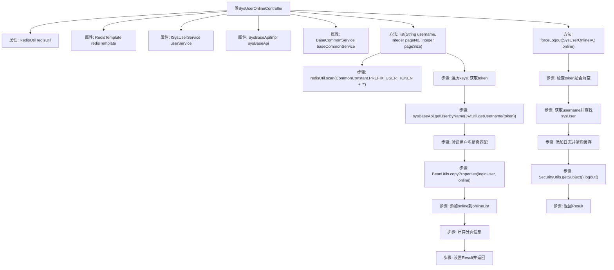

# 基础信息

|      |      |
|------|------|
| 名称 | SysUserOnlineController |
| 编码语言 | .java |
| 代码路径 | JeecgBoot/jeecg-boot/jeecg-module-system/jeecg-system-biz/src/main/java/org/jeecg/modules/system/controller/SysUserOnlineController.java |
| 包名 | org.jeecg.modules.system.controller |
| 依赖项 | ['com.baomidou.mybatisplus.extension.plugins.pagination.Page', 'lombok.extern.slf4j.Slf4j', 'org.apache.commons.lang.StringUtils', 'org.apache.shiro.SecurityUtils', 'org.jeecg.common.api.vo.Result', 'org.jeecg.common.constant.CacheConstant', 'org.jeecg.common.constant.CommonConstant', 'org.jeecg.common.system.util.JwtUtil', 'org.jeecg.common.system.vo.LoginUser', 'org.jeecg.common.util.RedisUtil', 'org.jeecg.common.util.oConvertUtils', 'org.jeecg.modules.base.service.BaseCommonService', 'org.jeecg.modules.system.service.ISysUserService', 'org.jeecg.modules.system.service.impl.SysBaseApiImpl', 'org.jeecg.modules.system.vo.SysUserOnlineVO', 'org.springframework.beans.BeanUtils', 'org.springframework.beans.factory.annotation.Autowired', 'org.springframework.data.redis.core.RedisTemplate', 'org.springframework.web.bind.annotation', 'javax.annotation.Resource', 'java.util.ArrayList', 'java.util.Collection', 'java.util.Collections', 'java.util.List'] |
| 概述说明 | SysUserOnlineController管理在线用户及强制退出，依赖Redis处理令牌和缓存。 |

# 说明

SysUserOnlineController负责管理在线用户列表和强制退出功能。该控制器利用Redis来存储和管理用户令牌及缓存，确保系统能够高效地追踪用户在线状态并执行强制退出操作。通过Redis的缓存机制，系统能够快速响应用户状态变化，提升整体性能和用户体验。

# 类列表 Class Summary

| 名称   | 类型  | 说明 |
|-------|------|-------------|
| SysUserOnlineController | class | SysUserOnlineController处理在线用户列表和强制退出功能，使用Redis管理用户令牌和缓存。 |


## 类 SysUserOnlineController

|      |      |
|------|------|
| 访问范围 | @RestController;@RequestMapping("/sys/online");@Slf4j;public |
| 类型 | class |
| 名称 | SysUserOnlineController |
| 说明 | SysUserOnlineController处理在线用户列表和强制退出功能，使用Redis管理用户令牌和缓存。 |


### UML类图

```mermaid
classDiagram
    class SysUserOnlineController {
        -RedisUtil redisUtil
        -RedisTemplate redisTemplate
        -ISysUserService userService
        -SysBaseApiImpl sysBaseApi
        -BaseCommonService baseCommonService
        +Result~Page~SysUserOnlineVO~~ list(String username, Integer pageNo, Integer pageSize)
        +Result~Object~ forceLogout(SysUserOnlineVO online)
    }

    class RedisUtil {
        +String get(String key)
        +void del(String key)
        +Collection~String~ scan(String pattern)
    }

    class RedisTemplate {
        // Redis操作模板
    }

    class ISysUserService {
        <<Interface>>
        // 用户服务接口
    }

    class SysBaseApiImpl {
        +LoginUser getUserByName(String username)
    }

    class BaseCommonService {
        +void addLog(String logContent, Integer logType, Object[] args, LoginUser user)
    }

    class SysUserOnlineVO {
        +String token
        +void setToken(String token)
        +String getToken()
    }

    class LoginUser {
        +String username
        +String realname
        +String getId()
        +String getUsername()
        +String getRealname()
    }

    class Result~T~ {
        +boolean success
        +T result
        +void setSuccess(boolean success)
        +void setResult(T result)
    }

    class Page~T~ {
        +Integer size
        +Integer current
        +Integer total
        +Integer pages
        +List~T~ records
        +void setSize(Integer size)
        +void setCurrent(Integer current)
        +void setTotal(Integer total)
        +void setPages(Integer pages)
        +void setRecords(List~T~ records)
    }

    SysUserOnlineController --> RedisUtil : 依赖
    SysUserOnlineController --> RedisTemplate : 依赖
    SysUserOnlineController --> ISysUserService : 依赖
    SysUserOnlineController --> SysBaseApiImpl : 依赖
    SysUserOnlineController --> BaseCommonService : 依赖
    SysUserOnlineController --> SysUserOnlineVO : 依赖
    SysUserOnlineController --> LoginUser : 依赖
    SysUserOnlineController --> Result~Page~SysUserOnlineVO~~ : 依赖
    SysUserOnlineController --> Result~Object~ : 依赖
    SysUserOnlineController --> Page~SysUserOnlineVO~ : 依赖
```

### 描述
`SysUserOnlineController` 是一个Spring Boot控制器，用于管理系统中的在线用户。它依赖于多个服务类，如 `RedisUtil`、`RedisTemplate`、`ISysUserService`、`SysBaseApiImpl` 和 `BaseCommonService`，用于处理用户在线状态的查询和强制退出操作。控制器中的 `list` 方法用于获取在线用户列表，`forceLogout` 方法用于强制用户退出。代码中使用了泛型类 `Result` 和 `Page` 来封装返回结果和分页信息。


### 内部方法调用关系图



**流程图描述：**
该流程图展示了`SysUserOnlineController`类的结构和主要方法`list`和`forceLogout`的执行流程。`list`方法通过扫描Redis中的用户token，验证用户名匹配后，生成在线用户列表并进行分页处理，最后返回结果。`forceLogout`方法通过验证token，强制用户退出并清理相关缓存信息，最后返回操作结果。

### 字段列表 Field List

| 名称  | 类型  | 说明 |
|-------|-------|------|
| redisTemplate | RedisTemplate | 自动注入RedisTemplate实例。 |
| redisUtil | RedisUtil | 自动注入Redis工具类实例。 |
| userService | ISysUserService | 自动注入用户服务实例。 |
| baseCommonService | BaseCommonService | 注入BaseCommonService资源实例。 |
| sysBaseApi | SysBaseApiImpl | 自动注入SysBaseApiImpl实例。 |

### 方法列表 Method List

| 名称  | 类型  | 说明 |
|-------|-------|------|
| list | Result<Page<SysUserOnlineVO>> | 通过GET请求获取在线用户列表，支持分页和用户名筛选，返回分页结果。 |
| forceLogout | Result<Object> | 强制退出用户登录，清除缓存并调用Shiro的logout方法。 |


