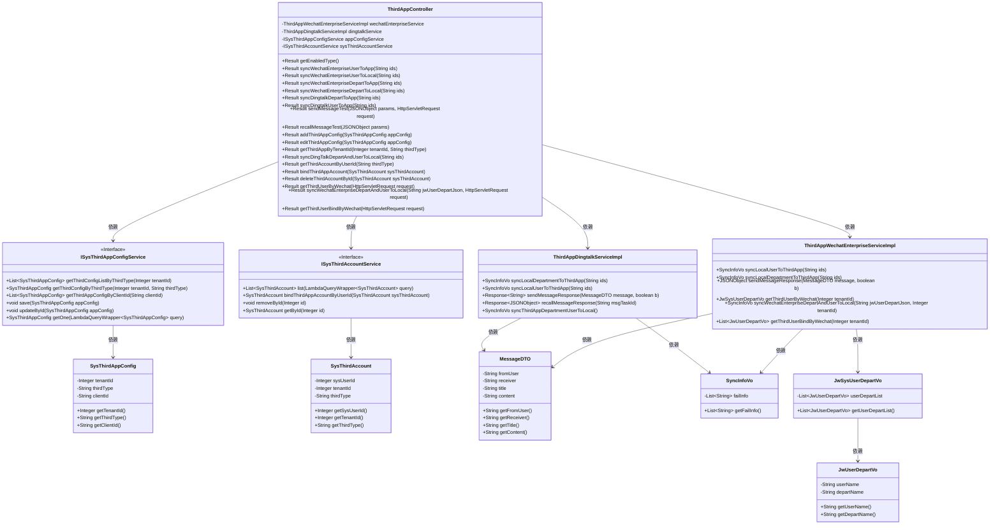

# 基础信息

|      |      |
|------|------|
| 名称 | ThirdAppController |
| 编码语言 | .java |
| 代码路径 | JeecgBoot/jeecg-boot/jeecg-module-system/jeecg-system-biz/src/main/java/org/jeecg/modules/system/controller/ThirdAppController.java |
| 包名 | org.jeecg.modules.system.controller |
| 依赖项 | ['cn.hutool.core.collection.CollectionUtil', 'com.alibaba.fastjson.JSONObject', 'com.baomidou.mybatisplus.core.conditions.query.LambdaQueryWrapper', 'com.jeecg.dingtalk.api.core.response.Response', 'lombok.extern.slf4j.Slf4j', 'org.apache.shiro.SecurityUtils', 'org.jeecg.common.api.dto.message.MessageDTO', 'org.jeecg.common.api.vo.Result', 'org.jeecg.common.config.TenantContext', 'org.jeecg.common.constant.CommonConstant', 'org.jeecg.common.constant.SymbolConstant', 'org.jeecg.common.constant.enums.MessageTypeEnum', 'org.jeecg.common.system.util.JwtUtil', 'org.jeecg.common.system.vo.LoginUser', 'org.jeecg.common.util.TokenUtils', 'org.jeecg.common.util.oConvertUtils', 'org.jeecg.config.mybatis.MybatisPlusSaasConfig', 'org.jeecg.modules.system.entity.SysThirdAccount', 'org.jeecg.modules.system.entity.SysThirdAppConfig', 'org.jeecg.modules.system.service.ISysThirdAccountService', 'org.jeecg.modules.system.service.ISysThirdAppConfigService', 'org.jeecg.modules.system.service.impl.ThirdAppDingtalkServiceImpl', 'org.jeecg.modules.system.service.impl.ThirdAppWechatEnterpriseServiceImpl', 'org.jeecg.modules.system.vo.thirdapp.JwSysUserDepartVo', 'org.jeecg.modules.system.vo.thirdapp.JwUserDepartVo', 'org.jeecg.modules.system.vo.thirdapp.SyncInfoVo', 'org.springframework.beans.factory.annotation.Autowired', 'org.springframework.web.bind.annotation', 'javax.servlet.http.HttpServletRequest', 'java.util.Arrays', 'java.util.HashMap', 'java.util.List', 'java.util.Map'] |
| 概述说明 | 第三方应用控制器管理企业微信和钉钉的配置、同步及消息测试。 |

# 说明

第三方应用控制器主要用于处理企业微信和钉钉的配置、同步及消息测试功能。该控制器能够有效管理企业微信和钉钉的配置信息，确保两者之间的数据同步，并提供消息测试功能以验证消息发送的准确性和及时性。通过这些功能，企业可以更好地整合和优化其在不同平台上的通信和协作流程。

# 类列表 Class Summary

| 名称   | 类型  | 说明 |
|-------|------|-------------|
| ThirdAppController | class | 第三方应用控制器处理企业微信和钉钉的配置、同步及消息测试功能。 |

## 类 ThirdAppController

|      |      |
|------|------|
| 访问范围 | @Slf4j;@RestController("thirdAppController");@RequestMapping("/sys/thirdApp");public |
| 类型 | class |
| 名称 | ThirdAppController |
| 说明 | 第三方应用控制器处理企业微信和钉钉的配置、同步及消息测试功能。 |

### UML类图

这段代码描述了一个名为 `ThirdAppController` 的控制器类，它负责处理与第三方应用（如企业微信和钉钉）相关的各种操作。控制器通过依赖注入的方式使用了多个服务类，如 `ThirdAppWechatEnterpriseServiceImpl` 和 `ThirdAppDingtalkServiceImpl`，来处理具体的业务逻辑。控制器提供了多个接口，用于获取启用的系统、同步用户和部门信息、发送和撤回消息、管理第三方应用配置等。类图展示了控制器与各个服务类之间的关系，以及服务类与数据模型类之间的依赖关系。

### 内部方法调用关系图

```mermaid
graph TD
    A["类ThirdAppController"]
    B["属性: ThirdAppWechatEnterpriseServiceImpl wechatEnterpriseService"]
    C["属性: ThirdAppDingtalkServiceImpl dingtalkService"]
    D["属性: ISysThirdAppConfigService appConfigService"]
    E["属性: ISysThirdAccountService sysThirdAccountService"]
    F["方法: Result getEnabledType()"]
    G["方法: Result syncWechatEnterpriseUserToApp(String ids)"]
    H["方法: Result syncWechatEnterpriseUserToLocal(String ids)"]
    I["方法: Result syncWechatEnterpriseDepartToApp(String ids)"]
    J["方法: Result syncWechatEnterpriseDepartToLocal(String ids)"]
    K["方法: Result syncDingtalkDepartToApp(String ids)"]
    L["方法: Result syncDingtalkUserToApp(String ids)"]
    M["方法: Result sendMessageTest(JSONObject params, HttpServletRequest request)"]
    N["方法: Result recallMessageTest(JSONObject params)"]
    O["方法: Result addThirdAppConfig(SysThirdAppConfig appConfig)"]
    P["方法: Result editThirdAppConfig(SysThirdAppConfig appConfig)"]
    Q["方法: Result getThirdAppByTenantId(Integer tenantId, String thirdType)"]
    R["方法: Result syncDingTalkDepartAndUserToLocal(String ids)"]
    S["方法: Result getThirdAccountByUserId(String thirdType)"]
    T["方法: Result bindThirdAppAccount(SysThirdAccount sysThirdAccount)"]
    U["方法: Result deleteThirdAccountById(SysThirdAccount sysThirdAccount)"]
    V["方法: Result getThirdUserByWechat(HttpServletRequest request)"]
    W["方法: Result syncWechatEnterpriseDepartAndUserToLocal(String jwUserDepartJson, HttpServletRequest request)"]
    X["方法: Result getThirdUserBindByWechat(HttpServletRequest request)"]

    A --> B
    A --> C
    A --> D
    A --> E
    A --> F
    A --> G
    A --> H
    A --> I
    A --> J
    A --> K
    A --> L
    A --> M
    A --> N
    A --> O
    A --> P
    A --> Q
    A --> R
    A --> S
    A --> T
    A --> U
    A --> V
    A --> W
    A --> X
```

这段代码定义了一个名为 `ThirdAppController` 的控制器类，负责处理与第三方应用（如企业微信和钉钉）相关的请求。类中包含多个方法，用于获取启用的系统、同步用户和部门信息、发送和撤回消息、添加和编辑第三方应用配置、绑定和解绑第三方账号等操作。每个方法都通过不同的 HTTP 请求路径进行映射，并返回相应的结果。代码中使用了多个服务类来处理具体的业务逻辑，如 `ThirdAppWechatEnterpriseServiceImpl` 和 `ThirdAppDingtalkServiceImpl`。通过这些方法，控制器能够与第三方应用进行交互，实现数据的同步和配置管理。

### 字段列表 Field List

| 名称  | 类型  | 说明 |
|-------|-------|------|
| wechatEnterpriseService | ThirdAppWechatEnterpriseServiceImpl | 自动注入微信企业服务实现类。 |
| appConfigService | ISysThirdAppConfigService | 自动注入ISysThirdAppConfigService实例。 |
| sysThirdAccountService | ISysThirdAccountService | 自动注入系统第三方账户服务接口实例。 |
| dingtalkService | ThirdAppDingtalkServiceImpl | 自动注入DingTalk服务实现类实例。 |

### 方法列表 Method List

| 名称  | 类型  | 说明 |
|-------|-------|------|
| getEnabledType | Result | 获取租户模式下钉钉和企业微信配置状态。 |
| bindThirdAppAccount | Result<SysThirdAccount> | 绑定第三方应用账户，返回绑定结果。 |
| syncWechatEnterpriseDepartToLocal | Result | 企业微信接口调整，同步本地部门功能失效。 |
| syncWechatEnterpriseUserToLocal | Result | 企业微信接口调整，同步到本地功能失效。 |
| getThirdUserBindByWechat | Result<List<JwUserDepartVo>> | 通过微信获取第三方用户绑定信息并返回结果。 |
| syncDingtalkDepartToApp | Result | 同步钉钉部门到应用，检查配置并返回结果。 |
| syncWechatEnterpriseDepartAndUserToLocal | Result<SyncInfoVo> | 通过GET请求同步微信企业部门及用户数据到本地，返回同步结果。 |
| getThirdAccountByUserId | Result<List<SysThirdAccount>> | 通过用户ID和第三方类型查询第三方账户列表。 |
| deleteThirdAccountById | Result<String> | 删除第三方账户接口，验证用户权限后执行删除操作。 |
| syncWechatEnterpriseUserToApp | Result | 同步企业微信用户至应用，检查配置后执行同步并返回结果。 |
| editThirdAppConfig | Result<String> | 编辑第三方应用配置，检查数据存在性和应用key唯一性，更新配置并返回结果。 |
| syncWechatEnterpriseDepartToApp | Result | 同步企业微信部门到应用，检查配置后执行同步，返回成功或失败信息。 |
| syncDingTalkDepartAndUserToLocal | Result | 通过GET请求同步钉钉部门和用户到本地，根据配置和同步结果返回成功或失败信息。 |
| recallMessageTest | Result | 处理第三方APP消息撤回，支持企业微信和钉钉，检查配置并返回结果。 |
| addThirdAppConfig | Result<String> | 添加第三方应用配置，验证租户和AppKey唯一性，成功返回结果。 |
| getThirdAppByTenantId | Result<SysThirdAppConfig> | 通过租户ID和第三方类型获取第三方应用配置，支持多租户模式。 |
| syncDingtalkUserToApp | Result | 通过租户ID获取钉钉配置，同步用户数据至应用，返回成功或失败结果。 |
| getThirdUserByWechat | Result<JwSysUserDepartVo> | 通过企业微信获取第三方用户信息，若未配置则返回错误提示。 |
| sendMessageTest | Result | 该代码处理第三方APP消息发送，支持企业微信和钉钉，验证配置后发送消息，返回结果或错误提示。 |

