# 基础信息

|      |      |
|------|------|
| 名称 | ThirdLoginController |
| 编码语言 | .java |
| 代码路径 | JeecgBoot/jeecg-boot/jeecg-module-system/jeecg-system-biz/src/main/java/org/jeecg/modules/system/controller/ThirdLoginController.java |
| 包名 | org.jeecg.modules.system.controller |
| 依赖项 | ['cn.hutool.core.collection.CollectionUtil', 'cn.hutool.core.util.RandomUtil', 'com.alibaba.fastjson.JSONObject', 'com.baomidou.mybatisplus.core.conditions.query.LambdaQueryWrapper', 'com.xkcoding.justauth.AuthRequestFactory', 'io.swagger.v3.oas.annotations.Operation', 'lombok.extern.slf4j.Slf4j', 'me.zhyd.oauth.model.AuthCallback', 'me.zhyd.oauth.model.AuthResponse', 'me.zhyd.oauth.request.AuthRequest', 'me.zhyd.oauth.utils.AuthStateUtils', 'me.zhyd.oauth.utils.StringUtils', 'org.jeecg.common.api.vo.Result', 'org.jeecg.common.constant.CommonConstant', 'org.jeecg.common.constant.enums.MessageTypeEnum', 'org.jeecg.common.system.api.ISysBaseAPI', 'org.jeecg.common.system.util.JwtUtil', 'org.jeecg.common.util', 'org.jeecg.modules.base.service.BaseCommonService', 'org.jeecg.modules.system.entity.SysDepart', 'org.jeecg.modules.system.entity.SysThirdAccount', 'org.jeecg.modules.system.entity.SysThirdAppConfig', 'org.jeecg.modules.system.entity.SysUser', 'org.jeecg.modules.system.model.ThirdLoginModel', 'org.jeecg.modules.system.service.ISysDictService', 'org.jeecg.modules.system.service.ISysThirdAccountService', 'org.jeecg.modules.system.service.ISysThirdAppConfigService', 'org.jeecg.modules.system.service.ISysUserService', 'org.jeecg.modules.system.service.ISysDepartService', 'org.jeecg.modules.system.service.impl.ThirdAppDingtalkServiceImpl', 'org.jeecg.modules.system.service.impl.ThirdAppWechatEnterpriseServiceImpl', 'org.springframework.beans.factory.annotation.Autowired', 'org.springframework.stereotype.Controller', 'org.springframework.ui.ModelMap', 'org.springframework.web.bind.annotation', 'javax.servlet.http.HttpServletRequest', 'javax.servlet.http.HttpServletResponse', 'java.io.IOException', 'java.io.UnsupportedEncodingException', 'java.net.URLEncoder', 'java.util.Date', 'java.util.List'] |
| 概述说明 | 第三方登录控制器处理微信、钉钉等认证、回调、用户绑定及Token生成。 |

# 说明

第三方登录控制器是一个专门处理微信、钉钉等第三方平台登录的模块。它涵盖了多个关键功能，包括用户认证、回调处理、用户绑定以及Token生成。该控制器确保用户在通过第三方平台登录时，能够顺利完成身份验证，并与系统进行有效绑定，同时生成必要的Token以维持会话安全。这一模块的设计旨在简化第三方登录流程，提升用户体验和系统安全性。

# 类列表 Class Summary

| 名称   | 类型  | 说明 |
|-------|------|-------------|
| ThirdLoginController | class | 第三方登录控制器，处理微信、钉钉等第三方登录，包括认证、回调、用户绑定、Token生成等功能。 |

## 类 ThirdLoginController

|      |      |
|------|------|
| 访问范围 | @Controller;@RequestMapping("/sys/thirdLogin");@Slf4j;public |
| 类型 | class |
| 名称 | ThirdLoginController |
| 说明 | 第三方登录控制器，处理微信、钉钉等第三方登录，包括认证、回调、用户绑定、Token生成等功能。 |

### UML类图

```mermaid
classDiagram
    class ThirdLoginController {
        -ISysUserService sysUserService
        -ISysThirdAccountService sysThirdAccountService
        -ISysDictService sysDictService
        -BaseCommonService baseCommonService
        -RedisUtil redisUtil
        -AuthRequestFactory factory
        -ISysDepartService sysDepartService
        -ThirdAppWechatEnterpriseServiceImpl thirdAppWechatEnterpriseService
        -ThirdAppDingtalkServiceImpl thirdAppDingtalkService
        -ISysThirdAppConfigService appConfigService
        -ISysBaseAPI sysBaseAPI
        +void render(String source, HttpServletResponse response)
        +String loginThird(String source, AuthCallback callback, ModelMap modelMap)
        +Result~String~ thirdUserCreate(ThirdLoginModel model)
        +Result~String~ checkPassword(JSONObject json)
        -String saveToken(SysUser user)
        +Result~JSONObject~ getThirdLoginUser(String token, String thirdType, String tenantId)
        +Result~String~ bindingThirdPhone(JSONObject jsonObject)
        +String oauth2LoginCallback(String source, String state, HttpServletRequest request, HttpServletResponse response, String tenantId)
        +String oauth2LoginCallback(String source, String code, String authCode, String state, String tenantId, HttpServletResponse response)
        +Result~String~ registerBindThirdAccount(JSONObject jsonObject, SysUser user)
        -void setUserTenantAndDepart(SysUser sysUser, JSONObject obj, Result~JSONObject~ result)
        +String OauthDingDingLogin(String authCode, String state, String tenantId, HttpServletResponse response)
        +Result~SysThirdAppConfig~ getCorpIdClientId(String tenantId)
    }

    class ISysUserService {
        <<Interface>>
        +SysUser getById(String id)
        +SysUser getUserByName(String username)
        +SysUser getUserByPhone(String phone)
        +SysUser getUserByEmail(String email)
        +Result~JSONObject~ checkUserIsEffective(SysUser sysUser)
        +void addUserWithRole(SysUser user, String roleId)
        +void updateById(SysUser user)
        +void updateUserDepart(String username, String orgCode, String departId)
        +void setLoginTenant(SysUser sysUser, JSONObject obj, String username, Result~JSONObject~ result)
    }

    class ISysThirdAccountService {
        <<Interface>>
        +List~SysThirdAccount~ list(LambdaQueryWrapper~SysThirdAccount~ query)
        +SysThirdAccount saveThirdUser(ThirdLoginModel model, int tenantId)
        +void updateThirdUserId(SysUser sysUser, String thirdUserUuid)
        +SysUser createUser(String phone, String thirdUserUuid, int tenantId)
    }

    class ISysDictService {
        <<Interface>>
        +Map~String, List~DictModel~~ queryAllDictItems()
    }

    class BaseCommonService {
        +void addLog(String logContent, int logType, String logTypeStr)
    }

    class RedisUtil {
        +void set(String key, Object value)
        +Object get(String key)
        +void expire(String key, long time)
    }

    class AuthRequestFactory {
        +AuthRequest get(String source)
    }

    class ISysDepartService {
        <<Interface>>
        +List~SysDepart~ queryUserDeparts(String userId)
    }

    class ThirdAppWechatEnterpriseServiceImpl {
        +SysUser oauth2Login(String code, int tenantId)
    }

    class ThirdAppDingtalkServiceImpl {
        +SysUser oauth2Login(String authCode, int tenantId)
        +SysUser oauthDingDingLogin(String authCode, int tenantId)
        +SysThirdAppConfig getCorpIdClientId(int tenantId)
    }

    class ISysThirdAppConfigService {
        <<Interface>>
        +SysThirdAppConfig getThirdConfigByThirdType(int tenantId, int type)
    }

    class ISysBaseAPI {
        <<Interface>>
        +boolean verifyToken(String token, RedisUtil redisUtil)
    }

    ThirdLoginController --> ISysUserService : 依赖
    ThirdLoginController --> ISysThirdAccountService : 依赖
    ThirdLoginController --> ISysDictService : 依赖
    ThirdLoginController --> BaseCommonService : 依赖
    ThirdLoginController --> RedisUtil : 依赖
    ThirdLoginController --> AuthRequestFactory : 依赖
    ThirdLoginController --> ISysDepartService : 依赖
    ThirdLoginController --> ThirdAppWechatEnterpriseServiceImpl : 依赖
    ThirdLoginController --> ThirdAppDingtalkServiceImpl : 依赖
    ThirdLoginController --> ISysThirdAppConfigService : 依赖
    ThirdLoginController --> ISysBaseAPI : 依赖
```

### 描述
`ThirdLoginController` 是一个处理第三方登录请求的控制器类，它依赖于多个服务类来完成用户认证、第三方账号管理、字典查询、日志记录、Redis缓存、认证请求工厂、部门管理、企业微信和钉钉登录服务、第三方应用配置服务以及系统基础API等功能。该类通过多个接口方法处理不同的第三方登录场景，包括渲染登录页面、处理回调、创建新账号、绑定手机号、生成Token等操作。

### 内部方法调用关系图

这段代码是一个Spring Boot控制器类，名为`ThirdLoginController`，主要用于处理第三方登录相关的请求。它包含了多个方法，分别用于处理不同类型的第三方登录请求，如渲染登录页面、处理登录回调、创建新账号、绑定手机号、生成Token等。代码中使用了多个服务类，如`ISysUserService`、`ISysThirdAccountService`等，来执行具体的业务逻辑。此外，代码还处理了企业微信和钉钉的OAuth2登录流程，并提供了相应的回调处理逻辑。

### 字段列表 Field List

| 名称  | 类型  | 说明 |
|-------|-------|------|
| sysThirdAccountService | ISysThirdAccountService | 自动注入系统第三方账户服务接口实例。 |
| sysUserService | ISysUserService | 自动注入系统用户服务接口实例。 |
| redisUtil | RedisUtil | 自动注入RedisUtil工具类实例。 |
| baseCommonService | BaseCommonService | 使用@Autowired注解自动注入BaseCommonService实例。 |
| factory | AuthRequestFactory | 自动注入AuthRequestFactory实例。 |
| thirdAppWechatEnterpriseService | ThirdAppWechatEnterpriseServiceImpl | 自动注入微信企业服务实现类。 |
| sysDepartService | ISysDepartService | 自动注入系统部门服务实例。 |
| sysBaseAPI | ISysBaseAPI | 自动注入ISysBaseAPI接口实例。 |
| appConfigService | ISysThirdAppConfigService | 自动注入系统第三方应用配置服务实例。 |
| sysDictService | ISysDictService | 自动注入系统字典服务实例。 |
| thirdAppDingtalkService | ThirdAppDingtalkServiceImpl | 自动注入钉钉服务实现类实例。 |

### 方法列表 Method List

| 名称  | 类型  | 说明 |
|-------|-------|------|
| render | void | 处理第三方登录请求，生成认证地址并重定向。 |
| getCorpIdClientId | Result<SysThirdAppConfig> | 通过租户ID获取第三方应用配置信息。 |
| thirdUserCreate | Result<String> | 第三方登录创建账号，校验操作码，成功生成token返回。 |
| checkPassword | Result<String> | 验证用户密码，返回校验结果及生成token。 |
| oauth2LoginCallback | String | 处理OAuth2登录，支持企业微信和钉钉，验证租户配置并生成授权URL。 |
| OauthDingDingLogin | String | 钉钉OAuth2登录接口，处理授权码并重定向。 |
| bindingThirdPhone | Result<String> | 手机号登录接口，验证码校验后绑定或创建用户并返回token。 |
| oauth2LoginCallback | String | 处理OAuth2登录回调，支持企业微信和钉钉，验证登录后重定向并返回状态。 |
| registerBindThirdAccount | Result<String> | 注册绑定第三方账号，验证手机、用户名、邮箱，生成密码，保存用户信息并返回令牌。 |
| getThirdLoginUser | Result<JSONObject> | 通过token验证获取第三方登录用户信息，校验用户有效性并补充缺失信息，返回用户详情和字典缓存。 |
| setUserTenantAndDepart | void | 设置用户租户和部门：先设置登录租户，若部门为空则查询并更新为首个部门。 |
| loginThird | String | 第三方登录回调处理，验证用户信息并生成token或提示绑定手机号。 |
| saveToken | String | 生成用户token并存储至Redis，设置超时时间后返回token。 |

