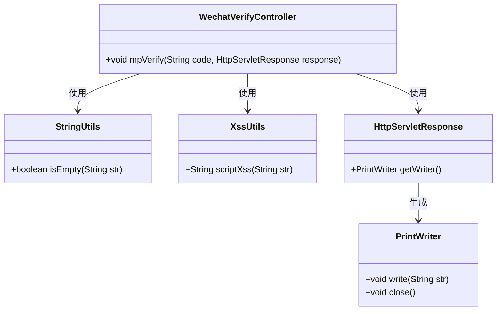
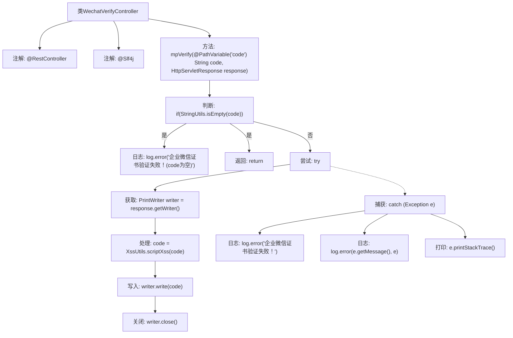

# 基础信息

|      |      |
|------|------|
| 名称 | WechatVerifyController |
| 编码语言 | .java |
| 代码路径 | JeecgBoot/jeecg-boot/jeecg-module-system/jeecg-system-biz/src/main/java/org/jeecg/modules/system/controller/WechatVerifyController.java |
| 包名 | org.jeecg.modules.system.controller |
| 依赖项 | ['javax.servlet.http.HttpServletResponse', 'lombok.extern.slf4j.Slf4j', 'org.apache.commons.lang3.StringUtils', 'org.jeecg.modules.system.util.XssUtils', 'org.springframework.web.bind.annotation.PathVariable', 'org.springframework.web.bind.annotation.RequestMapping', 'org.springframework.web.bind.annotation.RestController', 'java.io.PrintWriter'] |
| 概述说明 | 企业微信证书验证控制器处理验证请求并返回代码。 |

# 说明

企业微信证书验证控制器是一个专门处理验证请求的模块，负责接收来自企业微信的验证请求，并根据请求内容进行验证处理。验证完成后，控制器会生成并返回相应的验证代码，以确保请求的合法性和安全性。该控制器在企业微信的证书验证流程中起到关键作用，保障了通信的安全性和数据的完整性。

# 类列表 Class Summary

| 名称   | 类型  | 说明 |
|-------|------|-------------|
| WechatVerifyController | class | 企业微信证书验证控制器，处理验证请求并返回代码。 |

## 类 WechatVerifyController

|      |      |
|------|------|
| 访问范围 | @RestController;@Slf4j;public |
| 类型 | class |
| 名称 | WechatVerifyController |
| 说明 | 企业微信证书验证控制器，处理验证请求并返回代码。 |

### UML类图

类图描述：  
`WechatVerifyController` 是一个控制器类，用于处理企业微信验证请求。它依赖于 `StringUtils` 和 `XssUtils` 工具类进行字符串处理和XSS过滤，并通过 `HttpServletResponse` 获取 `PrintWriter` 对象来向客户端写入响应数据。该控制器的主要功能是验证企业微信证书，并处理可能的异常情况。

### 内部方法调用关系图

**描述：**  
这段代码是一个用于企业微信验证的控制器类，通过`@RestController`注解标记为RESTful服务。`mpVerify`方法处理验证请求，首先检查`code`是否为空，若为空则记录错误日志并返回。若`code`不为空，则尝试获取响应写入器，对`code`进行XSS过滤后写入响应并关闭写入器。若过程中发生异常，记录错误日志并打印异常堆栈信息。

### 字段列表 Field List

| 名称  | 类型  | 说明 |
|-------|-------|------|

### 方法列表 Method List

| 名称  | 类型  | 说明 |
|-------|-------|------|
| mpVerify | void | 企业微信证书验证接口，处理code并输出，空code报错。 |

