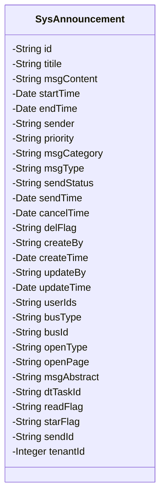

# 基础信息

|      |      |
|------|------|
| 名称 | SysAnnouncement |
| 编码语言 | .java |
| 代码路径 | JeecgBoot/jeecg-boot/jeecg-module-system/jeecg-system-biz/src/main/java/org/jeecg/modules/system/entity/SysAnnouncement.java |
| 包名 | org.jeecg.modules.system.entity |
| 依赖项 | ['com.baomidou.mybatisplus.annotation.IdType', 'com.baomidou.mybatisplus.annotation.TableId', 'com.baomidou.mybatisplus.annotation.TableName', 'com.fasterxml.jackson.annotation.JsonFormat', 'lombok.Data', 'org.jeecg.common.aspect.annotation.Dict', 'org.jeecgframework.poi.excel.annotation.Excel', 'org.springframework.format.annotation.DateTimeFormat', 'java.io.Serializable'] |
| 概述说明 | SysAnnouncement类定义公告，含标题、内容、时间、发布人、优先级、类型、状态等字段。 |

# 说明

SysAnnouncement类用于定义公告信息，包含多个关键字段：标题、内容、时间、发布人、优先级、消息类型和发布状态。这些字段共同构成公告的基本信息结构，确保公告的完整性和可管理性。标题和内容描述公告的具体信息，时间记录发布时间，发布人标识公告的发布者，优先级决定公告的重要程度，消息类型区分公告的类别，发布状态则表明公告的当前状态。通过这一结构，SysAnnouncement类能够全面、详尽地管理和展示公告信息。

# 类列表 Class Summary

| 名称   | 类型  | 说明 |
|-------|------|-------------|
| SysAnnouncement | class | SysAnnouncement类定义公告信息，包含标题、内容、时间、发布人、优先级、消息类型、发布状态等字段。 |

## 类 SysAnnouncement

|      |      |
|------|------|
| 访问范围 | @Data;@TableName("sys_announcement");public |
| 类型 | class |
| 名称 | SysAnnouncement |
| 说明 | SysAnnouncement类定义公告信息，包含标题、内容、时间、发布人、优先级、消息类型、发布状态等字段。 |

### UML类图

**描述：**  
`SysAnnouncement` 类是一个用于管理系统公告的实体类，包含了公告的各类属性，如标题、内容、时间、发布状态等。该类使用了多种注解来定义字段的映射关系、格式化规则以及字典编码。通过这些属性，可以详细描述公告的各个方面，包括发布时间、撤销时间、优先级、消息类型等。此外，类中还包含了一些与业务逻辑相关的字段，如用户ID、业务类型、打开方式等，使得该类能够灵活地适应不同的业务场景。

### 内部方法调用关系图

```mermaid
graph TD
    A["类SysAnnouncement"]
    B["属性: String id"]
    C["属性: String titile"]
    D["属性: String msgContent"]
    E["属性: Date startTime"]
    F["属性: Date endTime"]
    G["属性: String sender"]
    H["属性: String priority"]
    I["属性: String msgCategory"]
    J["属性: String msgType"]
    K["属性: String sendStatus"]
    L["属性: Date sendTime"]
    M["属性: Date cancelTime"]
    N["属性: String delFlag"]
    O["属性: String createBy"]
    P["属性: Date createTime"]
    Q["属性: String updateBy"]
    R["属性: Date updateTime"]
    S["属性: String userIds"]
    T["属性: String busType"]
    U["属性: String busId"]
    V["属性: String openType"]
    W["属性: String openPage"]
    X["属性: String msgAbstract"]
    Y["属性: String dtTaskId"]
    Z["属性: String readFlag"]
    AA["属性: String starFlag"]
    AB["属性: String sendId"]
    AC["属性: Integer tenantId"]

    A --> B
    A --> C
    A --> D
    A --> E
    A --> F
    A --> G
    A --> H
    A --> I
    A --> J
    A --> K
    A --> L
    A --> M
    A --> N
    A --> O
    A --> P
    A --> Q
    A --> R
    A --> S
    A --> T
    A --> U
    A --> V
    A --> W
    A --> X
    A --> Y
    A --> Z
    A --> AA
    A --> AB
    A --> AC
```

**描述：**  
该代码定义了一个名为`SysAnnouncement`的Java类，用于表示系统公告的相关信息。类中包含多个属性，如公告的ID、标题、内容、开始时间、结束时间、发布人、优先级、消息类型、发布状态等。每个属性都通过注解进行标注，以支持数据库映射、Excel导出、日期格式化等功能。类还包含了一些临时属性，如阅读状态、标星状态等，用于处理特定的业务逻辑。整体结构清晰，属性分类明确，适用于公告管理系统的数据模型。

### 字段列表 Field List

| 名称  | 类型  | 说明 |
|-------|-------|------|
| serialVersionUID = 1L | long | 定义序列化版本号为1L的静态常量。 |
| openPage | java.lang.String | 私有字符串变量openPage。 |
| sendId | String | 私有瞬态字符串变量sendId。 |
| starFlag | String | 私有临时字符串变量starFlag。 |
| dtTaskId | String | 定义了一个私有字符串变量dtTaskId。 |
| userIds | java.lang.String | 包含用户ID的私有字符串变量。 |
| openType | java.lang.String | 私有字符串类型变量openType。 |
| busType | java.lang.String | 私有字符串变量busType。 |
| msgContent | java.lang.String | Excel表字段：内容，宽度30，类型为字符串。 |
| titile | java.lang.String | Excel表格列标题字段定义为字符串类型，宽度15。 |
| delFlag | java.lang.String | 私有字符串变量delFlag。 |
| updateBy | java.lang.String | 更新操作者信息，类型为私有字符串。 |
| priority | java.lang.String | Excel字段“优先级”使用字典“priority”进行映射。 |
| createTime | java.util.Date | 定义日期格式为GMT+8，使用"yyyy-MM-dd HH:mm:ss"模式。 |
| msgCategory | java.lang.String | 消息类型字段，使用字典编码msg_category，类型为字符串。 |
| busId | java.lang.String | 私有字符串类型变量busId。 |
| msgAbstract | java.lang.String | 私有字符串变量msgAbstract用于存储摘要信息。 |
| createBy | java.lang.String | 私有字符串类型变量createBy。 |
| msgType | java.lang.String | 通告对象类型字段，使用字典msg_type定义。 |
| sender | java.lang.String | Excel表格中发布人字段，宽度15，类型为字符串。 |
| endTime | java.util.Date | 结束时间字段，格式为yyyy-MM-dd HH:mm:ss，支持JSON和日期格式化。 |
| readFlag | String | 私有临时字符串变量readFlag。 |
| updateTime | java.util.Date | 定义日期类型字段，使用GMT+8时区，格式为yyyy-MM-dd HH:mm:ss。 |
| startTime | java.util.Date | 定义开始时间字段，格式为yyyy-MM-dd HH:mm:ss，时区为GMT+8。 |
| sendTime | java.util.Date | 代码定义了一个日期类型字段sendTime，使用GMT+8时区，格式为yyyy-MM-dd HH:mm:ss。 |
| tenantId | java.lang.Integer | 私有整数类型变量tenantId。 |
| cancelTime | java.util.Date | 撤销时间字段，日期格式为yyyy-MM-dd HH:mm:ss，时区GMT+8。 |
| sendStatus | java.lang.String | Excel字段"发布状态"使用字典"send_status"进行映射。 |
| id | java.lang.String | 使用ASSIGN_ID类型为id字段生成唯一标识符。 |

### 方法列表 Method List

| 名称  | 类型  | 说明 |
|-------|-------|------|

