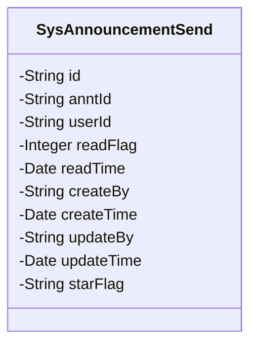
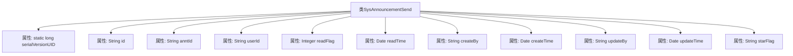

# 基础信息

|      |      |
|------|------|
| 名称 | SysAnnouncementSend |
| 编码语言 | .java |
| 代码路径 | JeecgBoot/jeecg-boot/jeecg-module-system/jeecg-system-biz/src/main/java/org/jeecg/modules/system/entity/SysAnnouncementSend.java |
| 包名 | org.jeecg.modules.system.entity |
| 依赖项 | ['java.io.Serializable', 'java.util.Date', 'com.baomidou.mybatisplus.annotation.IdType', 'com.baomidou.mybatisplus.annotation.TableId', 'com.baomidou.mybatisplus.annotation.TableName', 'lombok.Data', 'com.fasterxml.jackson.annotation.JsonFormat', 'org.springframework.format.annotation.DateTimeFormat'] |
| 概述说明 | 系统公告发送类包含ID、公告ID、用户ID、阅读状态、时间及操作人信息。 |

# 说明

系统公告发送类是一个用于管理和记录公告发送状态的数据结构。它包含多个关键字段：唯一标识的ID，用于关联特定公告的公告ID，接收公告的用户ID，表示用户是否已阅读公告的阅读状态，记录公告发送或阅读时间的时间戳，以及执行相关操作的操作人信息。这些字段共同确保公告的发送和阅读状态能够被准确追踪和管理。

# 类列表 Class Summary

| 名称   | 类型  | 说明 |
|-------|------|-------------|
| SysAnnouncementSend | class | 系统公告发送类，包含ID、公告ID、用户ID、阅读状态、时间及操作人信息。 |

## 类 SysAnnouncementSend

|      |      |
|------|------|
| 访问范围 | @Data;@TableName("sys_announcement_send");public |
| 类型 | class |
| 名称 | SysAnnouncementSend |
| 说明 | 系统公告发送类，包含ID、公告ID、用户ID、阅读状态、时间及操作人信息。 |

### UML类图

这段代码定义了一个名为 `SysAnnouncementSend` 的类，用于表示系统公告发送的相关信息。该类实现了 `Serializable` 接口，表明其实例可以被序列化。类中包含多个私有字段，如 `id`、`anntId`、`userId` 等，分别用于存储公告的唯一标识、公告ID、用户ID、阅读状态、阅读时间、创建人、创建时间、更新人、更新时间以及是否标星等信息。这些字段通过注解（如 `@TableId`、`@JsonFormat` 等）进行了进一步的定义和约束，以确保数据的正确性和一致性。

### 内部方法调用关系图

这段代码定义了一个名为 `SysAnnouncementSend` 的类，该类实现了 `Serializable` 接口，用于序列化对象。类中包含多个属性，如 `id`、`anntId`、`userId`、`readFlag` 等，分别用于存储公告发送的相关信息。每个属性都带有相应的注解，如 `@TableId`、`@JsonFormat` 和 `@DateTimeFormat`，用于指定数据库映射和日期格式。类的主要作用是存储和管理公告发送的相关数据。

### 字段列表 Field List

| 名称  | 类型  | 说明 |
|-------|-------|------|
| anntId | java.lang.String | 私有字符串变量anntId。 |
| userId | java.lang.String | 私有字符串变量userId。 |
| starFlag | String | 声明了一个私有字符串变量starFlag。 |
| id | java.lang.String | 表主键为字符串类型，采用分配ID策略。 |
| serialVersionUID = 1L | long | 定义静态长整型常量serialVersionUID，值为1L。 |
| createBy | java.lang.String | 私有字符串变量createBy。 |
| updateBy | java.lang.String | 更新者字段，类型为私有字符串。 |
| createTime | java.util.Date | 定义日期字段，格式为"yyyy-MM-dd HH:mm:ss"，时区为GMT+8。 |
| readTime | java.util.Date | 定义日期格式为GMT+8，模式为yyyy-MM-dd HH:mm:ss。 |
| readFlag | java.lang.Integer | 私有整型变量readFlag。 |
| updateTime | java.util.Date | 定义日期字段，格式为"yyyy-MM-dd HH:mm:ss"，时区为GMT+8。 |

### 方法列表 Method List

| 名称  | 类型  | 说明 |
|-------|-------|------|

