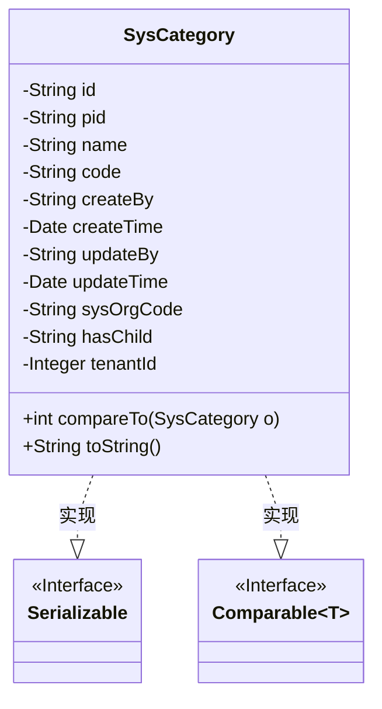

# 基础信息

|      |      |
|------|------|
| 名称 | SysCategory |
| 编码语言 | .java |
| 代码路径 | JeecgBoot/jeecg-boot/jeecg-module-system/jeecg-system-biz/src/main/java/org/jeecg/modules/system/entity/SysCategory.java |
| 包名 | org.jeecg.modules.system.entity |
| 依赖项 | ['com.baomidou.mybatisplus.annotation.IdType', 'com.baomidou.mybatisplus.annotation.TableId', 'com.baomidou.mybatisplus.annotation.TableName', 'com.fasterxml.jackson.annotation.JsonFormat', 'lombok.Data', 'org.jeecgframework.poi.excel.annotation.Excel', 'org.springframework.format.annotation.DateTimeFormat', 'java.io.Serializable'] |
| 概述说明 | SysCategory类表示系统分类，含ID、父节点、名称、编码，支持按编码长度排序。 |

# 说明

SysCategory类用于表示系统分类，包含ID、父节点、名称和编码等关键属性。该类支持按照编码长度进行排序，以便更有效地管理和组织分类数据。通过ID和父节点属性，可以构建分类的层级结构，而名称和编码属性则提供了分类的具体标识和信息。这种设计使得SysCategory类在系统分类管理中具有高效性和灵活性。

# 类列表 Class Summary

| 名称   | 类型  | 说明 |
|-------|------|-------------|
| SysCategory | class | SysCategory类表示系统分类，包含ID、父节点、名称、编码等属性，支持按编码长度排序。 |

## 类 SysCategory

|      |      |
|------|------|
| 访问范围 | @Data;@TableName("sys_category");public |
| 类型 | class |
| 名称 | SysCategory |
| 说明 | SysCategory类表示系统分类，包含ID、父节点、名称、编码等属性，支持按编码长度排序。 |

### UML类图

这段代码定义了一个名为 `SysCategory` 的类，该类实现了 `Serializable` 和 `Comparable<SysCategory>` 接口。`SysCategory` 类包含多个私有属性，如 `id`、`pid`、`name`、`code` 等，用于存储分类信息。类中实现了 `compareTo` 方法，用于比较两个 `SysCategory` 对象的 `code` 长度，并返回比较结果。此外，类中还重写了 `toString` 方法，返回包含 `code` 和 `name` 的字符串表示。通过类图可以清晰地看到 `SysCategory` 类与 `Serializable` 和 `Comparable` 接口之间的关系。

### 内部方法调用关系图

```mermaid
graph TD
    A["类SysCategory"]
    B["属性: java.lang.String id"]
    C["属性: java.lang.String pid"]
    D["属性: java.lang.String name"]
    E["属性: java.lang.String code"]
    F["属性: java.lang.String createBy"]
    G["属性: java.util.Date createTime"]
    H["属性: java.lang.String updateBy"]
    I["属性: java.util.Date updateTime"]
    J["属性: java.lang.String sysOrgCode"]
    K["属性: java.lang.String hasChild"]
    L["属性: java.lang.Integer tenantId"]
    M["方法: int compareTo(SysCategory o)"]
    N["重写方法: String toString()"]

    A --> B
    A --> C
    A --> D
    A --> E
    A --> F
    A --> G
    A --> H
    A --> I
    A --> J
    A --> K
    A --> L
    A --> M
    A --> N
```

**描述：**  
该流程图展示了`SysCategory`类的结构，包括其属性和方法。`SysCategory`类实现了`Serializable`和`Comparable<SysCategory>`接口，包含多个属性如`id`、`pid`、`name`、`code`等，并重写了`compareTo`和`toString`方法。`compareTo`方法根据`code`的长度进行比较，`toString`方法返回包含`code`和`name`的字符串表示。

### 字段列表 Field List

| 名称  | 类型  | 说明 |
|-------|-------|------|
| pid | java.lang.String | 定义了一个私有的字符串类型变量pid。 |
| updateBy | java.lang.String | 更新者信息存储为私有字符串类型。 |
| createBy | java.lang.String | 创建者字段为私有字符串类型。 |
| serialVersionUID = 1L | long | 声明一个静态不可变的序列化版本ID。 |
| tenantId | java.lang.Integer | 私有整型变量tenantId，用于存储租户ID。 |
| sysOrgCode | java.lang.String | 私有字符串变量sysOrgCode。 |
| code | java.lang.String | Excel列名为“类型编码”，宽度15，存储Java字符串类型code。 |
| createTime | java.util.Date | Java类中定义日期时间字段，使用GMT+8时区，格式为yyyy-MM-dd HH:mm:ss。 |
| hasChild | java.lang.String | Excel列名“是否有子节点(1:有)”，宽度15，类型为字符串。 |
| updateTime | java.util.Date | 使用GMT+8时区，格式化为yyyy-MM-dd HH:mm:ss的日期时间字段。 |
| name | java.lang.String | Excel注解定义类型名称字段，宽度为15字符。 |
| id | java.lang.String | 使用ASSIGN_ID类型为id字段生成唯一标识。 |

### 方法列表 Method List

| 名称  | 类型  | 说明 |
|-------|-------|------|
| compareTo | int | 比较SysCategory对象按code长度升序排序。 |
| toString | String | 重写toString方法，返回SysCategory的code和name信息。 |

