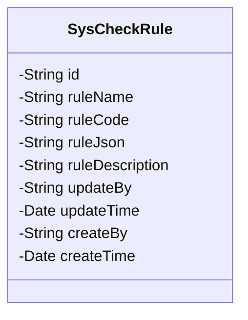
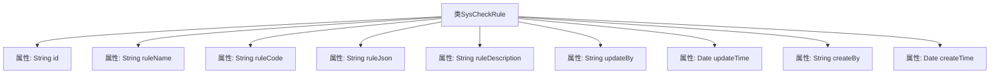

# 基础信息

|      |      |
|------|------|
| 名称 | SysCheckRule |
| 编码语言 | .java |
| 代码路径 | JeecgBoot/jeecg-boot/jeecg-module-system/jeecg-system-biz/src/main/java/org/jeecg/modules/system/entity/SysCheckRule.java |
| 包名 | org.jeecg.modules.system.entity |
| 依赖项 | ['com.baomidou.mybatisplus.annotation.IdType', 'com.baomidou.mybatisplus.annotation.TableId', 'com.baomidou.mybatisplus.annotation.TableName', 'com.fasterxml.jackson.annotation.JsonFormat', 'io.swagger.v3.oas.annotations.media.Schema', 'lombok.Data', 'lombok.EqualsAndHashCode', 'lombok.experimental.Accessors', 'org.jeecgframework.poi.excel.annotation.Excel', 'org.springframework.format.annotation.DateTimeFormat', 'java.util.Date'] |
| 概述说明 | SysCheckRule类定义编码校验规则，包含主键、名称、Code、JSON、描述及时间、人员字段。 |

# 说明

SysCheckRule类用于定义编码校验规则，包含多个关键字段：主键用于唯一标识规则，规则名称和规则Code分别描述规则的名称和代码，规则JSON存储规则的具体内容，规则描述提供规则的详细说明。此外，还包含更新人、更新时间、创建人和创建时间等字段，分别记录规则的更新和创建信息，确保规则的完整性和可追溯性。

# 类列表 Class Summary

| 名称   | 类型  | 说明 |
|-------|------|-------------|
| SysCheckRule | class | SysCheckRule类用于定义编码校验规则，包含主键、规则名称、规则Code、规则JSON、规则描述、更新人、更新时间、创建人、创建时间等字段。 |

## 类 SysCheckRule

|      |      |
|------|------|
| 访问范围 | @Data;@TableName("sys_check_rule");@EqualsAndHashCode(callSuper = false);@Accessors(chain = true);@Schema(description = "编码校验规则");public |
| 类型 | class |
| 名称 | SysCheckRule |
| 说明 | SysCheckRule类用于定义编码校验规则，包含主键、规则名称、规则Code、规则JSON、规则描述、更新人、更新时间、创建人、创建时间等字段。 |

### UML类图

**描述**：`SysCheckRule` 类是一个用于表示编码校验规则的实体类，包含了规则的基本信息，如规则名称、规则代码、规则JSON、规则描述等。此外，还记录了规则的创建和更新时间以及相关的操作人员信息。该类使用了多种注解来定义数据库表名、主键生成策略、字段描述等，确保与数据库的映射关系正确无误。

### 内部方法调用关系图

这段代码定义了一个名为 `SysCheckRule` 的类，主要用于描述编码校验规则的实体。类中包含多个属性，如 `id`、`ruleName`、`ruleCode`、`ruleJson`、`ruleDescription`、`updateBy`、`updateTime`、`createBy` 和 `createTime`，每个属性都通过注解进行了详细的描述和配置。这些属性分别用于存储规则的主键、名称、代码、JSON格式、描述、更新人、更新时间、创建人和创建时间。类通过注解实现了表名映射、链式访问、以及属性的格式化等功能。

### 字段列表 Field List

| 名称  | 类型  | 说明 |
|-------|-------|------|
| ruleJson | String | 规则JSON字段存储规则信息。 |
| id | String | 实体类主键字段使用自定义ID生成策略。 |
| createBy | String | 创建人字段，字符串类型，宽度15。 |
| ruleName | String | 代码定义了一个名为“规则名称”的私有字符串变量。 |
| ruleCode | String | 规则Code字段用于存储规则代码。 |
| createTime | Date | 定义创建时间字段，使用日期格式"yyyy-MM-dd HH:mm:ss"。 |
| updateBy | String | 更新人字段，类型为字符串，宽度15字符。 |
| updateTime | Date | 字段updateTime表示更新时间，格式为yyyy-MM-dd HH:mm:ss，时区为GMT+8。 |
| ruleDescription | String | Excel中规则描述字段，用于存储相关规则信息。 |

### 方法列表 Method List

| 名称  | 类型  | 说明 |
|-------|-------|------|

