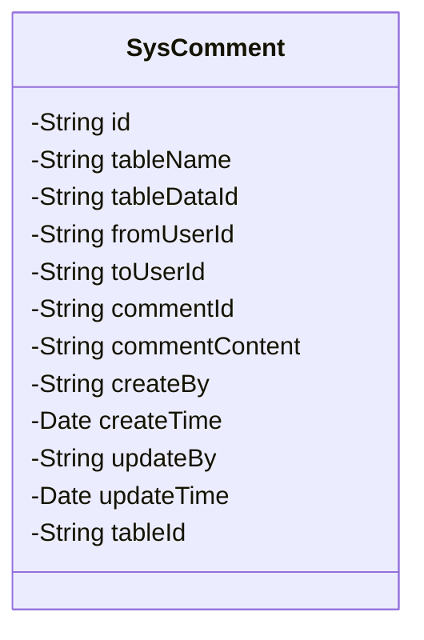
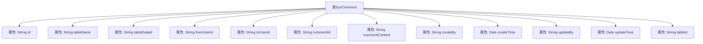

# 基础信息

|      |      |
|------|------|
| 名称 | SysComment |
| 编码语言 | .java |
| 代码路径 | JeecgBoot/jeecg-boot/jeecg-module-system/jeecg-system-biz/src/main/java/org/jeecg/modules/system/entity/SysComment.java |
| 包名 | org.jeecg.modules.system.entity |
| 依赖项 | ['com.baomidou.mybatisplus.annotation.IdType', 'com.baomidou.mybatisplus.annotation.TableField', 'com.baomidou.mybatisplus.annotation.TableId', 'com.baomidou.mybatisplus.annotation.TableName', 'com.fasterxml.jackson.annotation.JsonFormat', 'io.swagger.v3.oas.annotations.media.Schema', 'lombok.Data', 'lombok.EqualsAndHashCode', 'lombok.experimental.Accessors', 'org.jeecg.common.aspect.annotation.Dict', 'org.jeecgframework.poi.excel.annotation.Excel', 'org.springframework.format.annotation.DateTimeFormat', 'java.io.Serializable', 'java.util.Date'] |
| 概述说明 | 系统评论回复表记录ID、表名、数据ID、用户ID、评论ID、回复内容及创建更新信息。 |

# 说明

系统评论回复表用于存储用户对评论的回复信息，包含唯一标识的ID、所属表名、关联的数据ID、用户ID、被回复的评论ID、回复的具体内容，以及记录的创建和更新时间。该表结构清晰，便于管理和查询用户互动数据，确保每条回复都能准确关联到相应的评论和用户。

# 类列表 Class Summary

| 名称   | 类型  | 说明 |
|-------|------|-------------|
| SysComment | class | 系统评论回复表，包含ID、表名、数据ID、用户ID、评论ID、回复内容及创建更新信息。 |

## 类 SysComment

|      |      |
|------|------|
| 访问范围 | @Data;@TableName("sys_comment");@Accessors(chain = true);@EqualsAndHashCode(callSuper = false);@Schema(description="系统评论回复表");public |
| 类型 | class |
| 名称 | SysComment |
| 说明 | 系统评论回复表，包含ID、表名、数据ID、用户ID、评论ID、回复内容及创建更新信息。 |

### UML类图

### 描述
`SysComment` 类是一个用于表示系统评论回复的实体类，包含了评论的各个属性，如 `id`、`tableName`、`tableDataId` 等。该类还包含了创建和更新的时间戳信息，以及一个非数据库字段 `tableId`，用于评论跳转。该类使用了多个注解来定义字段的数据库映射、Excel导出格式、以及数据字典的关联。

### 内部方法调用关系图

这段代码定义了一个名为 `SysComment` 的类，用于表示系统评论回复表的数据结构。类中包含多个属性，如 `id`、`tableName`、`tableDataId` 等，分别用于存储评论的唯一标识、表名、数据ID等信息。此外，类中还包含一些用于时间格式化和数据库映射的注解，如 `@JsonFormat` 和 `@TableField`。这些属性共同构成了评论回复表的基本数据结构，便于在系统中进行数据存储和操作。

### 字段列表 Field List

| 名称  | 类型  | 说明 |
|-------|-------|------|
| serialVersionUID = 1L | long | 定义序列化版本号，确保对象序列化兼容性。 |
| updateBy | String | 更新人字段定义。 |
| tableDataId | String | 数据表ID字段，长度为15字符。 |
| tableId | String | 忽略表字段tableId。 |
| fromUserId | String | 来源用户ID，关联系统用户表，存储用户真实姓名。 |
| tableName | String | Excel表名字段，宽度15，描述为“表名”。 |
| commentContent | String | Excel中定义回复内容字段，类型为字符串。 |
| toUserId | String | 发送给用户ID，允许为空，关联用户表。 |
| id | String | 表ID字段使用ASSIGN_ID类型，描述为"id"。 |
| createBy | String | 字段`createBy`用于记录创建人信息。 |
| commentId | String | 评论ID可为空，非空时为回复，关联系统评论表。 |
| createTime | Date | 字段createTime表示创建日期，格式为yyyy-MM-dd HH:mm:ss，时区为GMT+8。 |
| updateTime | Date | 更新日期字段，使用GMT+8时区，格式为yyyy-MM-dd HH:mm:ss。 |

### 方法列表 Method List

| 名称  | 类型  | 说明 |
|-------|-------|------|

