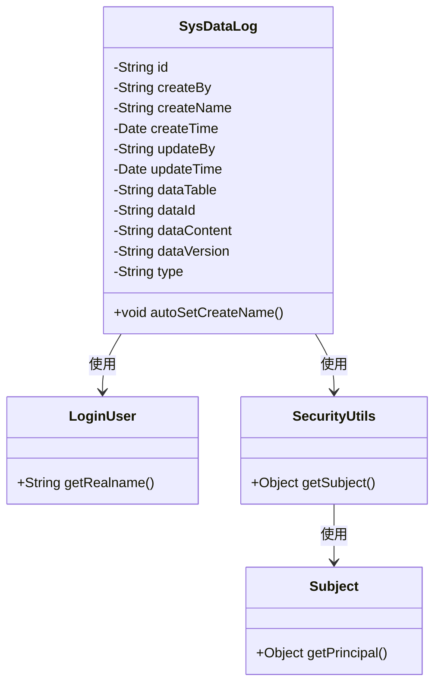
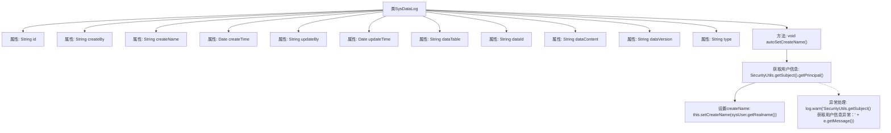

# 基础信息

|      |      |
|------|------|
| 名称 | SysDataLog |
| 编码语言 | .java |
| 代码路径 | JeecgBoot/jeecg-boot/jeecg-module-system/jeecg-system-biz/src/main/java/org/jeecg/modules/system/entity/SysDataLog.java |
| 包名 | org.jeecg.modules.system.entity |
| 依赖项 | ['com.baomidou.mybatisplus.annotation.IdType', 'com.baomidou.mybatisplus.annotation.TableId', 'com.fasterxml.jackson.annotation.JsonFormat', 'lombok.Data', 'lombok.EqualsAndHashCode', 'lombok.experimental.Accessors', 'lombok.extern.slf4j.Slf4j', 'org.apache.shiro.SecurityUtils', 'org.jeecg.common.system.vo.LoginUser', 'org.springframework.format.annotation.DateTimeFormat', 'java.io.Serializable', 'java.util.Date'] |
| 概述说明 | SysDataLog类记录系统数据日志，含创建、更新及数据内容字段。 |

# 说明

SysDataLog类是一个用于记录系统数据日志的工具，其主要功能包括记录数据的创建、更新信息以及数据内容等关键字段。通过该类，用户可以全面追踪和存储系统操作过程中的重要数据变化，确保日志信息的完整性和可追溯性。

# 类列表 Class Summary

| 名称   | 类型  | 说明 |
|-------|------|-------------|
| SysDataLog | class | SysDataLog类用于记录系统数据日志，包含创建、更新信息及数据内容等字段。 |

## 类 SysDataLog

|      |      |
|------|------|
| 访问范围 | @Data;@EqualsAndHashCode(callSuper = false);@Accessors(chain = true);@Slf4j;public |
| 类型 | class |
| 名称 | SysDataLog |
| 说明 | SysDataLog类用于记录系统数据日志，包含创建、更新信息及数据内容等字段。 |

### UML类图

这段代码定义了一个名为 `SysDataLog` 的类，该类用于记录系统数据日志。类中包含多个私有字段，如 `id`、`createBy`、`createName` 等，用于存储日志的相关信息。类中还定义了一个公有方法 `autoSetCreateName`，该方法通过 `SecurityUtils` 获取当前登录用户的信息，并将其真实名称设置为 `createName`。代码中使用了 `SecurityUtils` 和 `LoginUser` 类来获取用户信息，并处理可能的异常情况。

### 内部方法调用关系图

这段代码定义了一个名为 `SysDataLog` 的类，主要用于记录系统数据日志。类中包含多个属性，如 `id`、`createBy`、`createName` 等，用于存储日志的各个字段。`autoSetCreateName` 方法通过 `SecurityUtils.getSubject().getPrincipal()` 获取当前登录用户的信息，并设置 `createName` 属性。如果获取用户信息时发生异常，会通过 `log.warn` 记录警告信息。

### 字段列表 Field List

| 名称  | 类型  | 说明 |
|-------|-------|------|
| dataVersion | String | 定义私有字符串变量dataVersion。 |
| updateBy | String | 更新操作者的私有字符串变量。 |
| dataContent | String | 私有字符串变量dataContent。 |
| createBy | String | 私有字符串变量createBy。 |
| id | String | 使用自定义ID生成策略的私有字符串类型ID字段。 |
| type | String | 定义了一个私有字符串类型的变量type。 |
| dataTable | String | 声明了一个私有字符串变量dataTable。 |
| updateTime | Date | 定义更新日期字段，使用GMT+8时区，格式为yyyy-MM-dd HH:mm:ss。 |
| serialVersionUID = 1L | long | 定义了一个私有的静态长整型常量serialVersionUID，值为1L。 |
| createTime | Date | 使用GMT+8时区，格式化为"yyyy-MM-dd HH:mm:ss"的日期时间字段。 |
| createName | String | 创建私有字符串变量createName。 |
| dataId | String | 定义了一个私有字符串变量dataId。 |

### 方法列表 Method List

| 名称  | 类型  | 说明 |
|-------|-------|------|
| autoSetCreateName | void | 自动设置创建者名称，捕获异常并记录警告。 |

