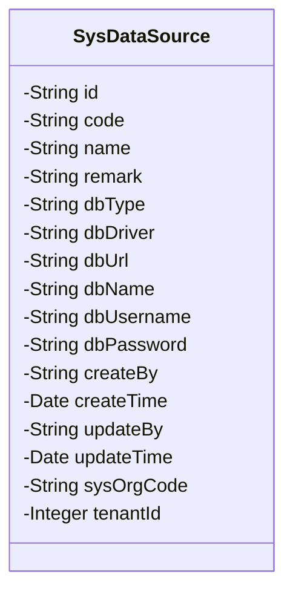

# 基础信息

|      |      |
|------|------|
| 名称 | SysDataSource |
| 编码语言 | .java |
| 代码路径 | JeecgBoot/jeecg-boot/jeecg-module-system/jeecg-system-biz/src/main/java/org/jeecg/modules/system/entity/SysDataSource.java |
| 包名 | org.jeecg.modules.system.entity |
| 依赖项 | ['com.baomidou.mybatisplus.annotation.IdType', 'com.baomidou.mybatisplus.annotation.TableId', 'com.baomidou.mybatisplus.annotation.TableName', 'com.fasterxml.jackson.annotation.JsonFormat', 'io.swagger.v3.oas.annotations.media.Schema', 'lombok.Data', 'lombok.EqualsAndHashCode', 'lombok.experimental.Accessors', 'org.jeecg.common.aspect.annotation.Dict', 'org.jeecgframework.poi.excel.annotation.Excel', 'org.springframework.format.annotation.DateTimeFormat'] |
| 概述说明 | 多数据源管理类，涵盖ID、编码、名称、数据库类型、驱动类、地址、用户名、密码等字段。 |

# 说明

多数据源管理类是一个用于管理和配置多个数据源的工具类，包含多个关键字段。这些字段包括ID，用于唯一标识每个数据源；编码，用于简化数据源的引用；名称，用于描述数据源的具体用途或位置；数据库类型，指定数据源所使用的数据库系统；驱动类，用于连接数据库的驱动程序；地址，即数据库的连接URL；用户名和密码，用于验证和访问数据库。通过这些字段，可以全面配置和管理多个数据源，确保系统能够高效地访问和处理不同数据库中的数据。

# 类列表 Class Summary

| 名称   | 类型  | 说明 |
|-------|------|-------------|
| SysDataSource | class | 多数据源管理类，包含ID、编码、名称、数据库类型、驱动类、地址、用户名、密码等字段。 |

## 类 SysDataSource

|      |      |
|------|------|
| 访问范围 | @Data;@TableName("sys_data_source");@EqualsAndHashCode(callSuper = false);@Accessors(chain = true);@Schema(description = "多数据源管理");public |
| 类型 | class |
| 名称 | SysDataSource |
| 说明 | 多数据源管理类，包含ID、编码、名称、数据库类型、驱动类、地址、用户名、密码等字段。 |

### UML类图

**描述**：`SysDataSource` 类用于管理多数据源的相关信息，包括数据源的基本属性如编码、名称、数据库类型、驱动类、地址、用户名、密码等，以及创建和更新的时间和人员信息。该类还包含租户ID和所属部门等扩展信息，适用于多租户环境下的数据源管理。

### 内部方法调用关系图

```mermaid
graph TD
    A["类SysDataSource"]
    B["属性: String id"]
    C["属性: String code"]
    D["属性: String name"]
    E["属性: String remark"]
    F["属性: String dbType"]
    G["属性: String dbDriver"]
    H["属性: String dbUrl"]
    I["属性: String dbName"]
    J["属性: String dbUsername"]
    K["属性: String dbPassword"]
    L["属性: String createBy"]
    M["属性: Date createTime"]
    N["属性: String updateBy"]
    O["属性: Date updateTime"]
    P["属性: String sysOrgCode"]
    Q["属性: Integer tenantId"]

    A --> B
    A --> C
    A --> D
    A --> E
    A --> F
    A --> G
    A --> H
    A --> I
    A --> J
    A --> K
    A --> L
    A --> M
    A --> N
    A --> O
    A --> P
    A --> Q
```

这段代码定义了一个名为 `SysDataSource` 的类，用于管理多数据源的相关信息。类中包含多个属性，如 `id`、`code`、`name` 等，分别用于存储数据源的唯一标识、编码、名称等关键信息。这些属性通过注解进行了详细的描述和映射，如 `@Schema` 用于生成API文档，`@Excel` 用于Excel导出时的字段映射。代码结构清晰，属性定义完整，适用于多数据源管理的场景。

### 字段列表 Field List

| 名称  | 类型  | 说明 |
|-------|-------|------|
| dbName | java.lang.String | 数据库名称字段，类型为字符串。 |
| createBy | java.lang.String | 创建人字段，类型为字符串。 |
| updateBy | java.lang.String | 更新人字段，类型为字符串。 |
| dbPassword | java.lang.String | 数据库密码字段，类型为字符串。 |
| name | java.lang.String | Excel数据源名称字段定义为Java字符串类型。 |
| remark | java.lang.String | Java代码定义字符串类型备注字段。 |
| id | java.lang.String | 表主键为分配ID，字段描述为ID。 |
| createTime | java.util.Date | 创建日期字段，使用GMT+8时区，格式为yyyy-MM-dd HH:mm:ss。 |
| updateTime | java.util.Date | 更新日期字段，格式为"yyyy-MM-dd HH:mm:ss"，时区GMT+8。 |
| sysOrgCode | java.lang.String | 所属部门字段，类型为字符串，用于存储部门信息。 |
| dbType | java.lang.String | 数据库类型字段，使用字符串类型存储。 |
| tenantId | java.lang.Integer | 租户ID字段，类型为整数。 |
| dbUsername | java.lang.String | 数据库用户名字段定义，类型为字符串。 |
| dbUrl | java.lang.String | 数据源地址字段，类型为字符串，用于存储数据库连接地址。 |
| code | java.lang.String | 数据源编码字段定义。 |
| dbDriver | java.lang.String | 驱动类属性，类型为字符串，用于数据库驱动。 |

### 方法列表 Method List

| 名称  | 类型  | 说明 |
|-------|-------|------|

