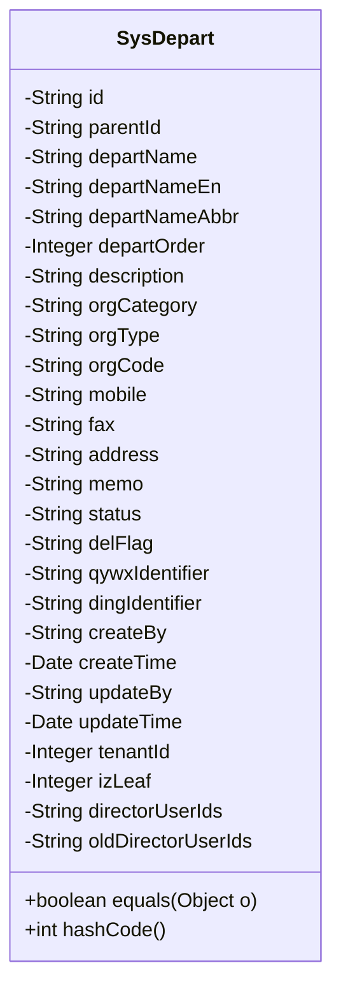

# 基础信息

|      |      |
|------|------|
| 名称 | SysDepart |
| 编码语言 | .java |
| 代码路径 | JeecgBoot/jeecg-boot/jeecg-module-system/jeecg-system-biz/src/main/java/org/jeecg/modules/system/entity/SysDepart.java |
| 包名 | org.jeecg.modules.system.entity |
| 依赖项 | ['com.baomidou.mybatisplus.annotation.IdType', 'com.baomidou.mybatisplus.annotation.TableField', 'com.baomidou.mybatisplus.annotation.TableId', 'com.baomidou.mybatisplus.annotation.TableName', 'com.fasterxml.jackson.annotation.JsonFormat', 'lombok.Data', 'org.jeecg.common.aspect.annotation.Dict', 'org.jeecgframework.poi.excel.annotation.Excel', 'org.springframework.format.annotation.DateTimeFormat', 'java.io.Serializable', 'java.util.Date', 'java.util.Objects'] |
| 概述说明 | SysDepart类管理部门信息，含ID、父部门、名称等字段，支持企业微信和钉钉对接。 |

# 说明

SysDepart类是一个用于管理系统部门信息的类，主要包含部门ID、父部门、名称、排序和状态等关键字段。该类还支持与外部系统的对接，包括企业微信和钉钉，以便在不同平台间同步和管理部门信息。通过这个类，用户可以有效地组织和维护部门结构，确保信息的准确性和一致性。

# 类列表 Class Summary

| 名称   | 类型  | 说明 |
|-------|------|-------------|
| SysDepart | class | SysDepart类用于管理系统部门信息，包含ID、父部门、名称、排序、状态等字段，并支持企业微信和钉钉对接。 |

## 类 SysDepart

|      |      |
|------|------|
| 访问范围 | @Data;@TableName("sys_depart");public |
| 类型 | class |
| 名称 | SysDepart |
| 说明 | SysDepart类用于管理系统部门信息，包含ID、父部门、名称、排序、状态等字段，并支持企业微信和钉钉对接。 |

### UML类图

**描述**：`SysDepart` 类是一个用于表示系统部门或机构的实体类，包含了部门的基本信息、状态、创建和更新时间等属性。该类实现了 `Serializable` 接口，支持序列化操作。类中重写了 `equals` 和 `hashCode` 方法，用于比较两个 `SysDepart` 对象的相等性和生成哈希码。此外，类中还包含了一些注解，用于数据库映射和Excel导出。

### 内部方法调用关系图

该流程图展示了`SysDepart`类的结构，包括其属性和方法。`SysDepart`类是一个用于表示部门信息的实体类，包含了部门的基本信息、状态、创建和更新时间等属性。类中还重写了`equals`和`hashCode`方法，用于比较两个`SysDepart`对象是否相等。该类的属性通过注解与数据库表进行映射，确保数据持久化时的正确性。

### 字段列表 Field List

| 名称  | 类型  | 说明 |
|-------|-------|------|
| delFlag | String | 删除标志字段定义。 |
| izLeaf | Integer | 私有整型变量izLeaf。 |
| description | String | Excel描述字段的私有字符串变量定义。 |
| fax | String | Excel类中定义了一个私有字符串属性fax，宽度为15。 |
| createBy | String | 创建者字段声明为私有字符串类型。 |
| parentId | String | 定义私有字符串变量parentId。 |
| dingIdentifier | String | 定义了一个私有字符串变量dingIdentifier。 |
| address | String | Excel表格中定义了一个名为“地址”的字段，宽度为15字符。 |
| orgType | String | 定义私有字符串变量orgType。 |
| orgCode | String | 机构编码字段，类型为字符串，宽度15字符。 |
| qywxIdentifier | String | 定义私有字符串变量qywxIdentifier。 |
| memo | String | Excel备注字段，宽度15，类型为私有字符串。 |
| departNameAbbr | String | 私有字符串变量departNameAbbr。 |
| oldDirectorUserIds | String | 该代码定义了一个非数据库字段的私有字符串变量。 |
| directorUserIds | String | 忽略字段directorUserIds，不参与数据库映射。 |
| id | String | 表ID字段使用ASSIGN_ID类型，类型为String。 |
| updateBy | String | 私有字符串变量updateBy。 |
| status | String | 部门状态字段定义，存储部门当前状态信息。 |
| mobile | String | Excel表格中定义了一个名为“手机号”的字段，宽度为15字符。 |
| tenantId | java.lang.Integer | 私有整型变量tenantId，用于存储租户ID。 |
| departNameEn | String | Excel中英文部门名字段，宽度15，私有字符串类型。 |
| serialVersionUID = 1L | long | 声明一个静态的最终长整型序列化版本号，值为1。 |
| departOrder | Integer | Excel排序功能使用私有整数departOrder进行排序。 |
| orgCategory | String | Excel列名为"机构类别"，宽度15，关联字典码"org_category"，存储机构类别信息。 |
| departName | String | Excel列名“机构/部门名称”对应私有字符串变量departName。 |
| createTime | Date | 代码定义了一个日期字段，使用GMT+8时区，格式为yyyy-MM-dd HH:mm:ss。 |
| updateTime | Date | 定义日期字段，使用GMT+8时区，格式为"yyyy-MM-dd HH:mm:ss"。 |

### 方法列表 Method List

| 名称  | 类型  | 说明 |
|-------|-------|------|
| hashCode | int | 重写hashCode方法，使用Objects.hash包含所有相关字段。 |
| equals | boolean | 比较两个SysDepart对象的所有属性是否相等。 |

