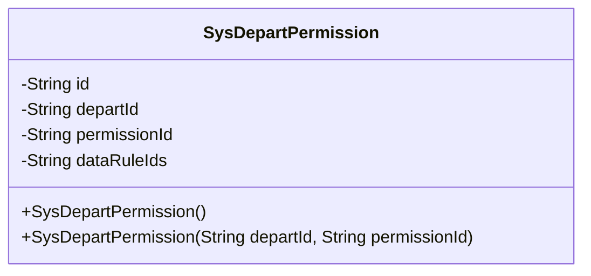
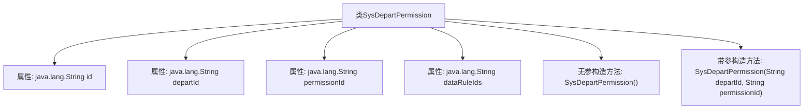

# 基础信息

|      |      |
|------|------|
| 名称 | SysDepartPermission |
| 编码语言 | .java |
| 代码路径 | JeecgBoot/jeecg-boot/jeecg-module-system/jeecg-system-biz/src/main/java/org/jeecg/modules/system/entity/SysDepartPermission.java |
| 包名 | org.jeecg.modules.system.entity |
| 依赖项 | ['java.io.Serializable', 'java.util.Date', 'com.baomidou.mybatisplus.annotation.IdType', 'com.baomidou.mybatisplus.annotation.TableId', 'com.baomidou.mybatisplus.annotation.TableName', 'com.baomidou.mybatisplus.annotation.TableField', 'io.swagger.v3.oas.annotations.media.Schema', 'lombok.Data', 'lombok.EqualsAndHashCode', 'lombok.experimental.Accessors', 'com.fasterxml.jackson.annotation.JsonFormat', 'org.springframework.format.annotation.DateTimeFormat', 'org.jeecgframework.poi.excel.annotation.Excel'] |
| 概述说明 | 部门权限表类包含id、部门id、权限id和数据规则id字段。 |

# 说明

部门权限表类是一个数据结构，用于管理部门与权限之间的关联关系。该类包含四个主要字段：id用于唯一标识每条记录，部门id用于关联具体部门，权限id用于关联具体权限，数据规则id用于定义权限的具体数据规则。通过这些字段，部门权限表类能够有效地维护部门与权限的对应关系，并支持细粒度的权限控制。

# 类列表 Class Summary

| 名称   | 类型  | 说明 |
|-------|------|-------------|
| SysDepartPermission | class | 部门权限表类，包含id、部门id、权限id和数据规则id字段。 |

## 类 SysDepartPermission

|      |      |
|------|------|
| 访问范围 | @Data;@TableName("sys_depart_permission");@EqualsAndHashCode(callSuper = false);@Accessors(chain = true);@Schema(description="部门权限表");public |
| 类型 | class |
| 名称 | SysDepartPermission |
| 说明 | 部门权限表类，包含id、部门id、权限id和数据规则id字段。 |

### UML类图

**描述：**  
`SysDepartPermission` 类表示部门权限表，包含四个私有属性：`id`、`departId`、`permissionId` 和 `dataRuleIds`。类中定义了两个构造函数，一个无参构造函数和一个带有 `departId` 和 `permissionId` 参数的构造函数。该类用于存储和管理部门与权限之间的关系，适用于权限管理系统中的部门权限配置。

### 内部方法调用关系图

这段代码定义了一个名为 `SysDepartPermission` 的类，用于表示部门权限表。该类包含四个属性：`id`、`departId`、`permissionId` 和 `dataRuleIds`，分别用于存储部门权限的唯一标识、部门ID、权限ID和数据规则ID。类中定义了两个构造方法：一个无参构造方法和一个带参构造方法，后者用于初始化 `departId` 和 `permissionId` 属性。代码使用了Lombok注解来简化代码，如 `@Data` 用于自动生成getter和setter方法，`@TableName` 用于指定数据库表名，`@Schema` 用于描述字段的含义。

### 字段列表 Field List

| 名称  | 类型  | 说明 |
|-------|-------|------|
| dataRuleIds | java.lang.String | 数据规则ID字段定义。 |
| departId | java.lang.String | 部门ID字段，类型为字符串。 |
| id | java.lang.String | 表主键ID字段，类型为ASSIGN_ID，描述为id。 |
| permissionId | java.lang.String | 权限ID字段，类型为字符串，用于标识权限。 |

### 方法列表 Method List

| 名称  | 类型  | 说明 |
|-------|-------|------|

