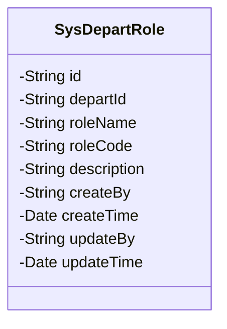
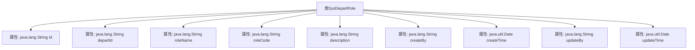

# 基础信息

|      |      |
|------|------|
| 名称 | SysDepartRole |
| 编码语言 | .java |
| 代码路径 | JeecgBoot/jeecg-boot/jeecg-module-system/jeecg-system-biz/src/main/java/org/jeecg/modules/system/entity/SysDepartRole.java |
| 包名 | org.jeecg.modules.system.entity |
| 依赖项 | ['java.io.Serializable', 'java.util.Date', 'com.baomidou.mybatisplus.annotation.IdType', 'com.baomidou.mybatisplus.annotation.TableId', 'com.baomidou.mybatisplus.annotation.TableName', 'com.baomidou.mybatisplus.annotation.TableField', 'io.swagger.v3.oas.annotations.media.Schema', 'lombok.Data', 'lombok.EqualsAndHashCode', 'lombok.experimental.Accessors', 'com.fasterxml.jackson.annotation.JsonFormat', 'org.jeecg.common.aspect.annotation.Dict', 'org.springframework.format.annotation.DateTimeFormat', 'org.jeecgframework.poi.excel.annotation.Excel'] |
| 概述说明 | 部门角色类包含ID、部门ID、角色名称、编码、描述及创建更新信息。 |

# 说明

部门角色类是一个用于管理组织内角色信息的模型，包含多个关键属性。每个角色都有一个唯一标识的ID，用于区分不同角色。部门ID用于关联角色所属的具体部门。角色名称和角色编码分别表示角色的名称和唯一编码，便于识别和引用。描述字段提供了角色的详细说明。创建人和创建时间记录了角色的创建者及其创建时间，而更新人和更新时间则记录了角色的最后修改者及其修改时间。这些信息共同构成了部门角色的完整描述，便于管理和维护。

# 类列表 Class Summary

| 名称   | 类型  | 说明 |
|-------|------|-------------|
| SysDepartRole | class | 部门角色类，包含ID、部门ID、角色名称、角色编码、描述、创建人、创建时间、更新人、更新时间。 |

## 类 SysDepartRole

|      |      |
|------|------|
| 访问范围 | @Data;@TableName("sys_depart_role");@EqualsAndHashCode(callSuper = false);@Accessors(chain = true);@Schema(description="部门角色");public |
| 类型 | class |
| 名称 | SysDepartRole |
| 说明 | 部门角色类，包含ID、部门ID、角色名称、角色编码、描述、创建人、创建时间、更新人、更新时间。 |

### UML类图

该代码定义了一个名为 `SysDepartRole` 的类，用于表示部门角色信息。类中包含多个私有属性，如 `id`、`departId`、`roleName`、`roleCode` 等，分别用于存储部门角色的唯一标识、所属部门ID、角色名称、角色编码等信息。此外，类中还包含创建和更新的相关属性，如 `createBy`、`createTime`、`updateBy` 和 `updateTime`，用于记录角色信息的创建和更新时间。该类主要用于在系统中管理和维护部门角色的数据。

### 内部方法调用关系图

该流程图描述了`SysDepartRole`类的结构，展示了类与其属性之间的关系。`SysDepartRole`类包含多个属性，如`id`、`departId`、`roleName`等，每个属性都有相应的类型和描述。这些属性通过注解进行了进一步的配置，如`@TableId`、`@Excel`、`@Schema`等，用于标识主键、Excel导出格式和数据模型描述。

### 字段列表 Field List

| 名称  | 类型  | 说明 |
|-------|-------|------|
| updateBy | java.lang.String | 更新人字段，类型为字符串，宽度15。 |
| roleName | java.lang.String | 部门角色名称字段，存储角色名称信息。 |
| createBy | java.lang.String | Excel列“创建人”宽15，存储创建人信息。 |
| createTime | java.util.Date | 定义创建时间字段，支持多种时间格式和时区。 |
| departId | java.lang.String | 部门ID字段，关联系统部门表，存储部门名称和ID。 |
| roleCode | java.lang.String | 部门角色编码字段，存储角色编码信息。 |
| id | java.lang.String | 表主键使用自定义ID，字段描述为ID，类型为字符串。 |
| description | java.lang.String | Excel字段描述，使用字符串类型存储。 |
| updateTime | java.util.Date | 更新时间字段，使用日期格式"yyyy-MM-dd HH:mm:ss"，支持GMT+8时区。 |

### 方法列表 Method List

| 名称  | 类型  | 说明 |
|-------|-------|------|

