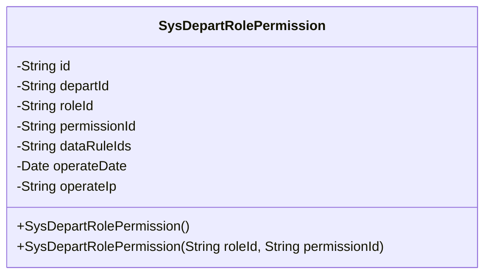
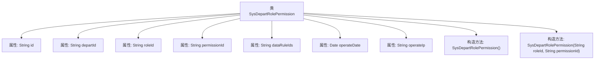

# 基础信息

|      |      |
|------|------|
| 名称 | SysDepartRolePermission |
| 编码语言 | .java |
| 代码路径 | JeecgBoot/jeecg-boot/jeecg-module-system/jeecg-system-biz/src/main/java/org/jeecg/modules/system/entity/SysDepartRolePermission.java |
| 包名 | org.jeecg.modules.system.entity |
| 依赖项 | ['java.io.Serializable', 'java.util.Date', 'com.baomidou.mybatisplus.annotation.IdType', 'com.baomidou.mybatisplus.annotation.TableId', 'com.baomidou.mybatisplus.annotation.TableName', 'com.baomidou.mybatisplus.annotation.TableField', 'io.swagger.v3.oas.annotations.media.Schema', 'lombok.Data', 'lombok.EqualsAndHashCode', 'lombok.experimental.Accessors', 'com.fasterxml.jackson.annotation.JsonFormat', 'org.springframework.format.annotation.DateTimeFormat', 'org.jeecgframework.poi.excel.annotation.Excel'] |
| 概述说明 | 部门角色权限类包含ID、部门ID、角色ID、权限ID、数据规则ID、操作时间和操作IP字段。 |

# 说明

部门角色权限类是一个用于管理权限的数据结构，包含多个关键字段。其中，ID字段用于唯一标识每一条记录。部门ID字段关联具体的部门，角色ID字段关联特定角色，权限ID字段表示具体的权限。数据规则ID字段用于定义数据访问规则。操作时间字段记录权限操作的时间戳，操作IP字段记录执行操作的IP地址。这些字段共同构成了一个完整的权限管理系统，确保权限分配和操作的准确性与可追溯性。

# 类列表 Class Summary

| 名称   | 类型  | 说明 |
|-------|------|-------------|
| SysDepartRolePermission | class | 部门角色权限类，包含ID、部门ID、角色ID、权限ID、数据规则ID、操作时间和操作IP字段。 |

## 类 SysDepartRolePermission

|      |      |
|------|------|
| 访问范围 | @Data;@TableName("sys_depart_role_permission");@EqualsAndHashCode(callSuper = false);@Accessors(chain = true);@Schema( description="部门角色权限");public |
| 类型 | class |
| 名称 | SysDepartRolePermission |
| 说明 | 部门角色权限类，包含ID、部门ID、角色ID、权限ID、数据规则ID、操作时间和操作IP字段。 |

### UML类图

**描述：**
`SysDepartRolePermission` 类用于表示部门角色权限的信息，包含部门ID、角色ID、权限ID等字段。类中定义了两个构造函数，一个无参构造函数和一个接受角色ID和权限ID的构造函数。该类通过注解与数据库表 `sys_depart_role_permission` 进行映射，并使用 `@Schema` 注解为字段添加描述信息。

### 内部方法调用关系图

这段代码定义了一个名为 `SysDepartRolePermission` 的类，用于表示部门角色权限的相关信息。类中包含多个属性，如 `id`、`departId`、`roleId`、`permissionId` 等，分别用于存储不同的权限相关数据。类中还定义了两个构造方法，一个无参构造方法和一个带有 `roleId` 和 `permissionId` 参数的构造方法。通过这些属性和构造方法，可以方便地创建和操作部门角色权限的实例。

### 字段列表 Field List

| 名称  | 类型  | 说明 |
|-------|-------|------|
| permissionId | java.lang.String | 权限id字段，类型为字符串。 |
| id | java.lang.String | 表ID字段，类型为分配ID，描述为id，数据类型为字符串。 |
| dataRuleIds | java.lang.String | dataRuleIds字段为字符串类型，描述数据规则ID。 |
| roleId | java.lang.String | 角色id字段，类型为字符串，用于标识角色。 |
| departId | java.lang.String | 部门ID字段，类型为字符串。 |
| operateIp | java.lang.String | 私有字符串变量operateIp。 |
| operateDate | java.util.Date | 操作时间字段，使用Date类型，格式为yyyy-MM-dd HH:mm:ss，时区GMT+8。 |

### 方法列表 Method List

| 名称  | 类型  | 说明 |
|-------|-------|------|

