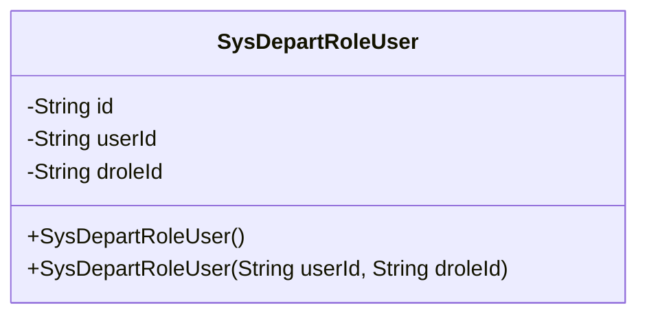
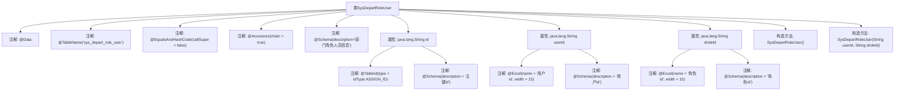

# 基础信息

|      |      |
|------|------|
| 名称 | SysDepartRoleUser |
| 编码语言 | .java |
| 代码路径 | JeecgBoot/jeecg-boot/jeecg-module-system/jeecg-system-biz/src/main/java/org/jeecg/modules/system/entity/SysDepartRoleUser.java |
| 包名 | org.jeecg.modules.system.entity |
| 依赖项 | ['java.io.Serializable', 'java.util.Date', 'com.baomidou.mybatisplus.annotation.IdType', 'com.baomidou.mybatisplus.annotation.TableId', 'com.baomidou.mybatisplus.annotation.TableName', 'com.baomidou.mybatisplus.annotation.TableField', 'io.swagger.v3.oas.annotations.media.Schema', 'lombok.Data', 'lombok.EqualsAndHashCode', 'lombok.experimental.Accessors', 'com.fasterxml.jackson.annotation.JsonFormat', 'org.springframework.format.annotation.DateTimeFormat', 'org.jeecgframework.poi.excel.annotation.Excel'] |
| 概述说明 | 部门角色人员信息类包含主键id、用户id和角色id字段。 |

# 说明

部门角色人员信息类是一个用于管理部门、角色和人员之间关系的数据结构。该类包含三个关键字段：主键id、用户id和角色id。主键id用于唯一标识每一条记录，用户id关联具体的人员信息，角色id则关联具体的角色信息。通过这三个字段，可以有效地建立和维护部门、角色与人员之间的映射关系，确保数据的一致性和完整性。

# 类列表 Class Summary

| 名称   | 类型  | 说明 |
|-------|------|-------------|
| SysDepartRoleUser | class | 部门角色人员信息类，包含主键id、用户id和角色id字段。 |

## 类 SysDepartRoleUser

|      |      |
|------|------|
| 访问范围 | @Data;@TableName("sys_depart_role_user");@EqualsAndHashCode(callSuper = false);@Accessors(chain = true);@Schema(description="部门角色人员信息");public |
| 类型 | class |
| 名称 | SysDepartRoleUser |
| 说明 | 部门角色人员信息类，包含主键id、用户id和角色id字段。 |

### UML类图

这段代码定义了一个名为 `SysDepartRoleUser` 的类，用于表示部门角色人员信息。该类包含三个私有属性：`id`、`userId` 和 `droleId`，分别表示主键ID、用户ID和角色ID。类中提供了两个构造函数，一个无参构造函数和一个带有 `userId` 和 `droleId` 参数的构造函数。该类使用了多个注解，如 `@TableName`、`@EqualsAndHashCode`、`@Accessors` 和 `@Schema`，用于定义表名、生成equals和hashCode方法、支持链式调用以及提供Schema描述。

### 内部方法调用关系图

这段代码定义了一个名为 `SysDepartRoleUser` 的类，用于表示部门角色人员信息。类中包含三个属性：`id`、`userId` 和 `droleId`，分别表示主键、用户ID和角色ID。每个属性都通过注解进行了详细的描述和配置。类中还定义了两个构造方法，一个无参构造方法和一个带参数的构造方法，用于初始化 `userId` 和 `droleId`。注解如 `@Data`、`@TableName` 等提供了类和数据表之间的映射关系以及自动生成的方法。

### 字段列表 Field List

| 名称  | 类型  | 说明 |
|-------|-------|------|
| id | java.lang.String | 主键id字段，使用ASSIGN_ID类型生成。 |
| userId | java.lang.String | 用户ID字段，类型为字符串，宽度15。 |
| droleId | java.lang.String | 角色ID字段，类型为字符串，用于标识角色。 |

### 方法列表 Method List

| 名称  | 类型  | 说明 |
|-------|-------|------|

