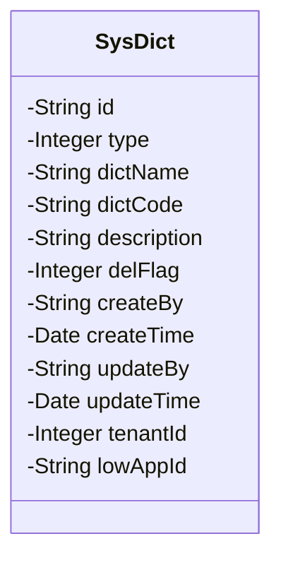
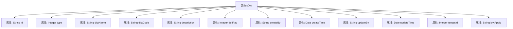

# 基础信息

|      |      |
|------|------|
| 名称 | SysDict |
| 编码语言 | .java |
| 代码路径 | JeecgBoot/jeecg-boot/jeecg-module-system/jeecg-system-biz/src/main/java/org/jeecg/modules/system/entity/SysDict.java |
| 包名 | org.jeecg.modules.system.entity |
| 依赖项 | ['java.io.Serializable', 'java.util.Date', 'com.baomidou.mybatisplus.annotation.IdType', 'com.baomidou.mybatisplus.annotation.TableId', 'com.baomidou.mybatisplus.annotation.TableLogic', 'lombok.Data', 'lombok.EqualsAndHashCode', 'lombok.experimental.Accessors'] |
| 概述说明 | SysDict类包含字典ID、类型、名称、编码、描述、删除状态、创建更新信息、租户ID和低代码应用ID。 |

# 说明

SysDict类是一个包含多个关键属性的数据结构，主要用于管理字典信息。该类包含字典ID、类型、名称、编码、描述、删除状态、创建更新信息、租户ID和低代码应用ID等属性。字典ID用于唯一标识字典，类型和名称描述字典的分类和标识，编码用于字典的编码格式，描述提供字典的详细说明。删除状态标识字典是否被删除，创建更新信息记录字典的创建和更新时间。租户ID用于标识字典所属的租户，低代码应用ID则关联到具体的低代码应用。这些属性共同构成了SysDict类的完整信息结构。

# 类列表 Class Summary

| 名称   | 类型  | 说明 |
|-------|------|-------------|
| SysDict | class | SysDict类包含字典ID、类型、名称、编码、描述、删除状态、创建更新信息、租户ID和低代码应用ID。 |

## 类 SysDict

|      |      |
|------|------|
| 访问范围 | @Data;@EqualsAndHashCode(callSuper = false);@Accessors(chain = true);public |
| 类型 | class |
| 名称 | SysDict |
| 说明 | SysDict类包含字典ID、类型、名称、编码、描述、删除状态、创建更新信息、租户ID和低代码应用ID。 |

### UML类图

这段代码定义了一个名为 `SysDict` 的类，该类实现了 `Serializable` 接口，表明其实例可以被序列化。类中包含多个私有字段，分别用于存储字典的ID、类型、名称、编码、描述、删除状态、创建人、创建时间、更新人、更新时间、租户ID以及关联的低代码应用ID。这些字段通过注解（如 `@TableId` 和 `@TableLogic`）进行配置，表明它们在数据库中的映射关系或逻辑处理方式。该类主要用于管理系统中的字典数据，提供了对字典信息的封装和操作。

### 内部方法调用关系图

**描述：**  
`SysDict`类是一个用于表示系统字典的Java类，包含了多个属性，如`id`、`type`、`dictName`、`dictCode`等。这些属性分别用于存储字典的唯一标识、类型、名称、编码等信息。类中还包含了一些与时间相关的属性，如`createTime`和`updateTime`，用于记录字典的创建和更新时间。此外，类还包含了一些额外的属性，如`tenantId`和`lowAppId`，用于关联租户和低代码应用。整个类通过`@Data`注解自动生成getter和setter方法，并通过`@EqualsAndHashCode`和`@Accessors`注解提供了链式调用和相等性比较的功能。

### 字段列表 Field List

| 名称  | 类型  | 说明 |
|-------|-------|------|
| serialVersionUID = 1L | long | 定义序列化版本号，确保类版本一致性。 |
| lowAppId | java.lang.String | 私有字符串类型的低应用ID。 |
| createTime | Date | 创建时间字段，类型为Date。 |
| tenantId | java.lang.Integer | 私有整数类型的租户ID变量。 |
| delFlag | Integer | 表逻辑字段`delFlag`用于标记删除状态。 |
| id | String | 表主键使用自定义ID生成策略。 |
| createBy | String | 私有字符串变量用于存储创建者信息。 |
| description | String | 定义私有字符串变量description。 |
| dictCode | String | 定义私有字符串变量dictCode。 |
| type | Integer | 定义私有整型变量type。 |
| updateBy | String | 更新操作由指定用户执行。 |
| dictName | String | 定义一个私有字符串变量dictName。 |
| updateTime | Date | 私有日期类型变量updateTime。 |

### 方法列表 Method List

| 名称  | 类型  | 说明 |
|-------|-------|------|

