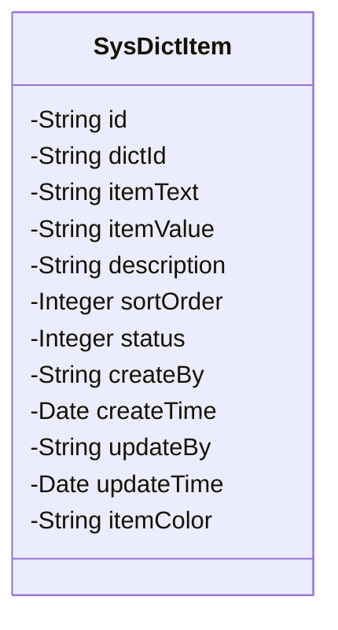
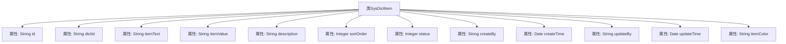

# 基础信息

|      |      |
|------|------|
| 名称 | SysDictItem |
| 编码语言 | .java |
| 代码路径 | JeecgBoot/jeecg-boot/jeecg-module-system/jeecg-system-biz/src/main/java/org/jeecg/modules/system/entity/SysDictItem.java |
| 包名 | org.jeecg.modules.system.entity |
| 依赖项 | ['java.io.Serializable', 'java.math.BigDecimal', 'java.util.Date', 'com.baomidou.mybatisplus.annotation.IdType', 'com.baomidou.mybatisplus.annotation.TableId', 'lombok.Data', 'lombok.EqualsAndHashCode', 'lombok.experimental.Accessors', 'org.jeecg.common.aspect.annotation.Dict', 'org.jeecgframework.poi.excel.annotation.Excel'] |
| 概述说明 | SysDictItem类包含字典项ID、字典ID、文本、值、描述、排序、状态、创建更新信息及颜色。 |

# 说明

SysDictItem类是一个用于管理字典项的实体类，包含了字典项的核心属性。该类的主要字段包括字典项ID、字典ID、文本、值、描述、排序、状态、创建和更新信息以及颜色。字典项ID用于唯一标识每个字典项，字典ID则关联到所属的字典。文本和值分别表示字典项的显示内容和实际值。描述字段用于提供额外的说明信息。排序字段用于控制字典项的显示顺序。状态字段表示字典项的当前状态，如启用或禁用。创建和更新信息记录了字典项的创建时间和最后更新时间。颜色字段用于为字典项指定特定的颜色标识。

# 类列表 Class Summary

| 名称   | 类型  | 说明 |
|-------|------|-------------|
| SysDictItem | class | SysDictItem类包含字典项ID、字典ID、文本、值、描述、排序、状态、创建和更新信息及颜色。 |

## 类 SysDictItem

|      |      |
|------|------|
| 访问范围 | @Data;@EqualsAndHashCode(callSuper = false);@Accessors(chain = true);public |
| 类型 | class |
| 名称 | SysDictItem |
| 说明 | SysDictItem类包含字典项ID、字典ID、文本、值、描述、排序、状态、创建和更新信息及颜色。 |

### UML类图

### 描述
`SysDictItem` 类是一个用于表示系统字典项的实体类，包含了字典项的各种属性，如 `id`、`dictId`、`itemText`、`itemValue`、`description`、`sortOrder`、`status` 等。这些属性分别用于存储字典项的标识、所属字典的标识、字典项的文本、值、描述、排序顺序、状态等信息。此外，类中还包含了创建和更新字典项的相关信息，如 `createBy`、`createTime`、`updateBy`、`updateTime` 等。该类实现了 `Serializable` 接口，表明其实例可以被序列化。

### 内部方法调用关系图

这段代码定义了一个名为 `SysDictItem` 的类，该类实现了 `Serializable` 接口，表明其实例可以被序列化。类中包含多个属性，如 `id`、`dictId`、`itemText`、`itemValue` 等，分别用于存储字典项的不同信息。每个属性都有相应的注释，描述了其用途。类使用了 Lombok 注解 `@Data`、`@EqualsAndHashCode` 和 `@Accessors`，这些注解简化了代码的编写，自动生成了 getter、setter、equals、hashCode 等方法。

### 字段列表 Field List

| 名称  | 类型  | 说明 |
|-------|-------|------|
| serialVersionUID = 1L | long | 声明一个静态不可变的序列化版本号常量。 |
| dictId | String | 定义了一个私有字符串变量dictId。 |
| createTime | Date | 创建时间字段，类型为Date。 |
| createBy | String | 私有字符串变量createBy。 |
| updateBy | String | 更新操作者字段。 |
| id | String | 表ID字段使用ASSIGN_ID类型生成。 |
| status | Integer | 定义了一个私有整型变量`status`，用于表示状态。 |
| itemColor | String | 定义私有字符串变量itemColor。 |
| description | String | Excel字段描述属性，宽度为40字符。 |
| itemValue | String | Excel字段“字典项值”为字符串类型，宽度为30。 |
| updateTime | Date | 私有日期类型变量updateTime。 |
| sortOrder | Integer | Excel列名为"排序"，宽度15，类型为整数，存储排序顺序。 |
| itemText | String | Excel字典项文本字段，宽度20字符。 |

### 方法列表 Method List

| 名称  | 类型  | 说明 |
|-------|-------|------|

