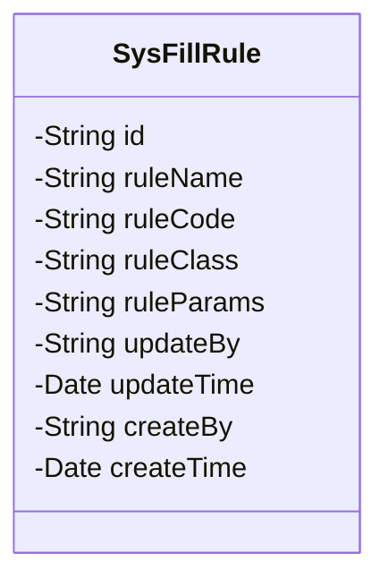
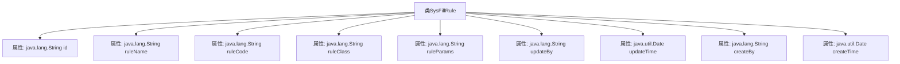

# 基础信息

|      |      |
|------|------|
| 名称 | SysFillRule |
| 编码语言 | .java |
| 代码路径 | JeecgBoot/jeecg-boot/jeecg-module-system/jeecg-system-biz/src/main/java/org/jeecg/modules/system/entity/SysFillRule.java |
| 包名 | org.jeecg.modules.system.entity |
| 依赖项 | ['com.baomidou.mybatisplus.annotation.IdType', 'com.baomidou.mybatisplus.annotation.TableId', 'com.baomidou.mybatisplus.annotation.TableName', 'com.fasterxml.jackson.annotation.JsonFormat', 'io.swagger.v3.oas.annotations.media.Schema', 'lombok.Data', 'lombok.EqualsAndHashCode', 'lombok.experimental.Accessors', 'org.jeecgframework.poi.excel.annotation.Excel', 'org.springframework.format.annotation.DateTimeFormat'] |
| 概述说明 | SysFillRule类定义填值规则，包含ID、名称、Code、实现类、参数及操作信息。 |

# 说明

SysFillRule类用于定义填值规则，包含多个关键字段：ID用于唯一标识规则，名称描述规则用途，Code表示规则编码，实现类指定规则的具体实现，参数用于配置规则行为。此外，类还记录了修改人和创建人信息，分别表示规则的最后修改者和创建者，同时包含修改时间和创建时间，用于跟踪规则的历史变更和创建时间。这些字段共同构成了填值规则的完整定义和管理机制。

# 类列表 Class Summary

| 名称   | 类型  | 说明 |
|-------|------|-------------|
| SysFillRule | class | SysFillRule类定义填值规则，包含ID、名称、Code、实现类、参数、修改人、修改时间、创建人、创建时间等字段。 |

## 类 SysFillRule

|      |      |
|------|------|
| 访问范围 | @Data;@TableName("sys_fill_rule");@EqualsAndHashCode(callSuper = false);@Accessors(chain = true);@Schema(description = "填值规则");public |
| 类型 | class |
| 名称 | SysFillRule |
| 说明 | SysFillRule类定义填值规则，包含ID、名称、Code、实现类、参数、修改人、修改时间、创建人、创建时间等字段。 |

### UML类图

这段代码定义了一个名为 `SysFillRule` 的类，用于表示填值规则的相关信息。类中包含多个私有字段，分别用于存储主键ID、规则名称、规则Code、规则实现类、规则参数、修改人、修改时间、创建人和创建时间。这些字段通过注解与数据库表 `sys_fill_rule` 进行映射，并且部分字段还通过注解与Excel文件的列进行映射。类的主要作用是封装填值规则的相关数据，便于在系统中进行管理和操作。

### 内部方法调用关系图

该流程图展示了`SysFillRule`类的结构，包括其所有属性和注解。`SysFillRule`类是一个用于描述填值规则的实体类，包含主键ID、规则名称、规则Code、规则实现类、规则参数、修改人、修改时间、创建人和创建时间等属性。每个属性都通过不同的注解进行描述和格式化，如`@TableId`、`@Excel`、`@Schema`等。这些注解用于定义数据库映射、Excel导出格式和API文档描述。

### 字段列表 Field List

| 名称  | 类型  | 说明 |
|-------|-------|------|
| ruleName | java.lang.String | 规则名称字段，类型为字符串，用于存储规则名称。 |
| createTime | java.util.Date | 定义创建时间字段，包含日期时间格式和时区信息。 |
| createBy | java.lang.String | 创建人字段，类型为字符串，宽度15。 |
| ruleCode | java.lang.String | 规则Code字段，类型为字符串，用于存储规则代码。 |
| updateBy | java.lang.String | 修改人字段，类型为字符串。 |
| updateTime | java.util.Date | 修改时间字段，格式为yyyy-MM-dd HH:mm:ss，时区GMT+8。 |
| ruleParams | java.lang.String | Excel表规则参数字段，类型为字符串。 |
| ruleClass | java.lang.String | 规则实现类的字符串类型字段。 |
| id | java.lang.String | 主键ID，类型为ASSIGN_ID，数据类型为String。 |

### 方法列表 Method List

| 名称  | 类型  | 说明 |
|-------|-------|------|

