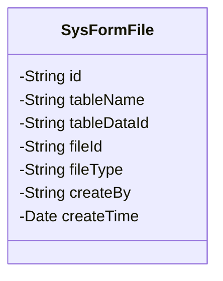

# 基础信息

|      |      |
|------|------|
| 名称 | SysFormFile |
| 编码语言 | .java |
| 代码路径 | JeecgBoot/jeecg-boot/jeecg-module-system/jeecg-system-biz/src/main/java/org/jeecg/modules/system/entity/SysFormFile.java |
| 包名 | org.jeecg.modules.system.entity |
| 依赖项 | ['com.baomidou.mybatisplus.annotation.IdType', 'com.baomidou.mybatisplus.annotation.TableId', 'com.baomidou.mybatisplus.annotation.TableName', 'com.fasterxml.jackson.annotation.JsonFormat', 'io.swagger.v3.oas.annotations.media.Schema', 'lombok.Data', 'lombok.EqualsAndHashCode', 'lombok.experimental.Accessors', 'org.jeecgframework.poi.excel.annotation.Excel', 'org.springframework.format.annotation.DateTimeFormat', 'java.util.Date'] |
| 概述说明 | SysFormFile类存储表单评论文件信息，含ID、表名、数据ID等关键字段。 |

# 说明

SysFormFile类用于存储与表单评论相关的文件信息。该类包含多个关键属性，用于标识和记录文件的详细信息。具体属性包括：ID，用于唯一标识每个文件记录；表名，指明文件所属的表单类型；数据ID，关联表单中的具体数据项；文件ID，唯一标识文件本身；文档类型，描述文件的格式或类型；创建人，记录文件的上传者；创建日期，记录文件的上传时间。通过这些属性，SysFormFile类能够全面管理表单评论中的文件信息，确保数据的完整性和可追溯性。

# 类列表 Class Summary

| 名称   | 类型  | 说明 |
|-------|------|-------------|
| SysFormFile | class | SysFormFile类用于存储表单评论文件信息，包含ID、表名、数据ID、文件ID、文档类型、创建人及创建日期。 |

## 类 SysFormFile

|      |      |
|------|------|
| 访问范围 | @Data;@TableName("sys_form_file");@EqualsAndHashCode(callSuper = false);@Accessors(chain = true);@Schema(description="表单评论文件");public |
| 类型 | class |
| 名称 | SysFormFile |
| 说明 | SysFormFile类用于存储表单评论文件信息，包含ID、表名、数据ID、文件ID、文档类型、创建人及创建日期。 |

### UML类图

这段代码定义了一个名为 `SysFormFile` 的类，用于表示表单评论文件的相关信息。类中包含多个私有属性，如 `id`、`tableName`、`tableDataId`、`fileId`、`fileType`、`createBy` 和 `createTime`，分别用于存储文件的唯一标识、表名、数据ID、关联文件ID、文档类型、创建人登录名称和创建日期。这些属性通过注解与数据库表 `sys_form_file` 进行映射，并提供了对Excel导出和JSON格式化的支持。

### 内部方法调用关系图

```mermaid
graph TD
    A["类SysFormFile"]
    B["注解: @Data"]
    C["注解: @TableName('sys_form_file')"]
    D["注解: @EqualsAndHashCode(callSuper = false)"]
    E["注解: @Accessors(chain = true)"]
    F["注解: @Schema(description='表单评论文件')"]
    G["属性: String id"]
    H["注解: @TableId(type = IdType.ASSIGN_ID)"]
    I["注解: @Schema(description = 'id')"]
    J["属性: String tableName"]
    K["注解: @Excel(name = '表名', width = 15)"]
    L["注解: @Schema(description = '表名')"]
    M["属性: String tableDataId"]
    N["注解: @Excel(name = '数据id', width = 15)"]
    O["注解: @Schema(description = '数据id')"]
    P["属性: String fileId"]
    Q["注解: @Excel(name = '关联文件id', width = 15)"]
    R["注解: @Schema(description = '关联文件id')"]
    S["属性: String fileType"]
    T["注解: @Excel(name = '文档类型（folder:文件夹 excel:excel doc:word pp:ppt image:图片  archive:其他文档 video:视频）', width = 15)"]
    U["注解: @Schema(description = '文档类型（folder:文件夹 excel:excel doc:word pp:ppt image:图片  archive:其他文档 video:视频）')"]
    V["属性: String createBy"]
    W["注解: @Excel(name = '创建人登录名称', width = 15)"]
    X["注解: @Schema(description = '创建人登录名称')"]
    Y["属性: Date createTime"]
    Z["注解: @Excel(name = '创建日期', width = 20, format = 'yyyy-MM-dd HH:mm:ss')"]
    AA["注解: @JsonFormat(timezone = 'GMT+8',pattern = 'yyyy-MM-dd HH:mm:ss')"]
    AB["注解: @DateTimeFormat(pattern='yyyy-MM-dd HH:mm:ss')"]
    AC["注解: @Schema(description = '创建日期')"]

    A --> B
    A --> C
    A --> D
    A --> E
    A --> F
    A --> G
    G --> H
    G --> I
    A --> J
    J --> K
    J --> L
    A --> M
    M --> N
    M --> O
    A --> P
    P --> Q
    P --> R
    A --> S
    S --> T
    S --> U
    A --> V
    V --> W
    V --> X
    A --> Y
    Y --> Z
    Y --> AA
    Y --> AB
    Y --> AC
```

这段代码定义了一个名为 `SysFormFile` 的类，用于表示表单评论文件的相关信息。类中包含多个属性，如 `id`、`tableName`、`tableDataId` 等，每个属性都附带了相应的注解，用于描述其在数据库中的映射关系、Excel导出格式以及数据验证等信息。通过注解，类可以自动生成常用的方法，如 `getter`、`setter`、`toString` 等，简化了代码的编写。

### 字段列表 Field List

| 名称  | 类型  | 说明 |
|-------|-------|------|
| tableDataId | String | 数据id字段，类型为字符串，用于标识数据。 |
| id | String | 表主键为自生成ID，字段描述为ID。 |
| createBy | String | 创建人登录名称字段，用于记录创建者信息。 |
| tableName | String | Excel表名属性，宽度15，描述为表名。 |
| fileId | String | 关联文件ID字段，用于存储关联文件的唯一标识。 |
| fileType | String | 文档类型字段，定义文件类别包括文件夹、excel、word、ppt、图片、其他文档和视频。 |
| createTime | Date | 定义创建日期字段，格式为yyyy-MM-dd HH:mm:ss，时区GMT+8。 |

### 方法列表 Method List

| 名称  | 类型  | 说明 |
|-------|-------|------|

