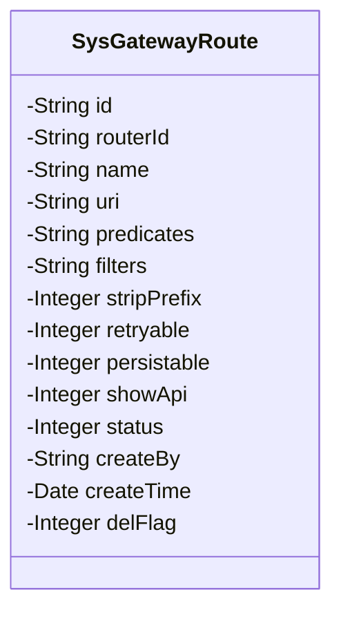

# 基础信息

|      |      |
|------|------|
| 名称 | SysGatewayRoute |
| 编码语言 | .java |
| 代码路径 | JeecgBoot/jeecg-boot/jeecg-module-system/jeecg-system-biz/src/main/java/org/jeecg/modules/system/entity/SysGatewayRoute.java |
| 包名 | org.jeecg.modules.system.entity |
| 依赖项 | ['com.baomidou.mybatisplus.annotation.IdType', 'com.baomidou.mybatisplus.annotation.TableId', 'com.baomidou.mybatisplus.annotation.TableLogic', 'com.baomidou.mybatisplus.annotation.TableName', 'com.fasterxml.jackson.annotation.JsonFormat', 'io.swagger.v3.oas.annotations.media.Schema', 'lombok.Data', 'lombok.EqualsAndHashCode', 'lombok.experimental.Accessors', 'org.jeecg.common.aspect.annotation.Dict', 'org.jeecgframework.poi.excel.annotation.Excel', 'org.springframework.format.annotation.DateTimeFormat', 'java.io.Serializable', 'java.util.Date'] |
| 概述说明 | SysGatewayRoute类管理网关路由，含主键、路由ID等服务配置，支持前缀忽略、重试等功能。 |

# 说明

SysGatewayRoute类负责管理网关路由，包含主键、路由ID、服务名、地址、断言、过滤等关键配置。该类支持前缀忽略、重试机制和数据保留等功能，确保路由管理的灵活性和可靠性。通过这些配置和功能，SysGatewayRoute类能够有效处理网关路由的复杂需求，提升系统的稳定性和可维护性。

# 类列表 Class Summary

| 名称   | 类型  | 说明 |
|-------|------|-------------|
| SysGatewayRoute | class | SysGatewayRoute类用于管理网关路由，包含主键、路由ID、服务名、地址、断言、过滤等配置，支持前缀忽略、重试、数据保留等功能。 |

## 类 SysGatewayRoute

|      |      |
|------|------|
| 访问范围 | @Data;@TableName("sys_gateway_route");@Accessors(chain = true);@EqualsAndHashCode(callSuper = false);@Schema(description="gateway路由管理");public |
| 类型 | class |
| 名称 | SysGatewayRoute |
| 说明 | SysGatewayRoute类用于管理网关路由，包含主键、路由ID、服务名、地址、断言、过滤等配置，支持前缀忽略、重试、数据保留等功能。 |

### UML类图

这段代码定义了一个名为 `SysGatewayRoute` 的类，用于管理网关路由的相关信息。该类包含多个私有属性，如 `id`、`routerId`、`name`、`uri` 等，分别用于存储路由的主键、路由ID、服务名、服务地址等信息。此外，还包含一些布尔类型的属性，如 `stripPrefix`、`retryable`、`persistable` 等，用于控制路由的行为。类中还包含创建人、创建时间、删除标志等字段，用于记录路由的创建和删除状态。

### 内部方法调用关系图

```mermaid
graph TD
    A["类SysGatewayRoute"]
    B["属性: String id"]
    C["属性: String routerId"]
    D["属性: String name"]
    E["属性: String uri"]
    F["属性: String predicates"]
    G["属性: String filters"]
    H["属性: Integer stripPrefix"]
    I["属性: Integer retryable"]
    J["属性: Integer persistable"]
    K["属性: Integer showApi"]
    L["属性: Integer status"]
    M["属性: String createBy"]
    N["属性: Date createTime"]
    O["属性: Integer delFlag"]

    A --> B
    A --> C
    A --> D
    A --> E
    A --> F
    A --> G
    A --> H
    A --> I
    A --> J
    A --> K
    A --> L
    A --> M
    A --> N
    A --> O
```

这段代码定义了一个名为 `SysGatewayRoute` 的类，用于管理网关路由信息。类中包含多个属性，如 `id`、`routerId`、`name`、`uri` 等，分别用于存储路由的主键、路由ID、服务名、服务地址等信息。此外，类中还包含了一些配置属性，如 `predicates`、`filters`，以及状态管理属性，如 `status`、`delFlag` 等。这些属性通过注解与数据库表 `sys_gateway_route` 进行映射，并提供了相应的描述信息。

### 字段列表 Field List

| 名称  | 类型  | 说明 |
|-------|-------|------|
| id | String | 表主键字段，类型为分配ID，描述为主键。 |
| uri | String | 服务地址字段定义，用于存储URI信息。 |
| routerId | String | 路由ID字段定义。 |
| delFlag | Integer | 表逻辑字段，用于标识删除状态。 |
| filters | String | 定义了一个私有字符串变量filters。 |
| serialVersionUID = 1L | long | 声明一个私有的静态常量序列化版本号。 |
| status | Integer | Excel状态字段，宽度15，使用yn字典码。 |
| persistable | Integer | 保留数据字段，使用字典"yn"进行映射。 |
| predicates | String | 定义私有字符串变量predicates。 |
| showApi | Integer | 接口文档展示字段，使用字典代码“yn”表示。 |
| retryable | Integer | 是否重试字段，类型为整数，使用字典代码yn表示。 |
| createBy | String | 字段"createBy"用于记录创建人信息。 |
| name | String | 代码定义了一个服务名字段，使用注解指定字段描述和Excel列名。 |
| createTime | Date | 定义创建日期字段，格式为"yyyy-MM-dd HH:mm:ss"，时区GMT+8。 |
| stripPrefix | Integer | 忽略前缀字段，类型为整数，用于表示是否忽略前缀。 |

### 方法列表 Method List

| 名称  | 类型  | 说明 |
|-------|-------|------|

