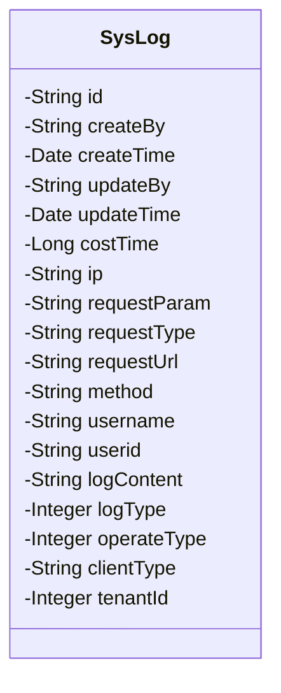

# 基础信息

|      |      |
|------|------|
| 名称 | SysLog |
| 编码语言 | .java |
| 代码路径 | JeecgBoot/jeecg-boot/jeecg-module-system/jeecg-system-biz/src/main/java/org/jeecg/modules/system/entity/SysLog.java |
| 包名 | org.jeecg.modules.system.entity |
| 依赖项 | ['java.util.Date', 'org.jeecg.common.aspect.annotation.Dict', 'org.springframework.format.annotation.DateTimeFormat', 'com.baomidou.mybatisplus.annotation.IdType', 'com.baomidou.mybatisplus.annotation.TableId', 'com.fasterxml.jackson.annotation.JsonFormat', 'java.io.Serializable', 'lombok.Data', 'lombok.EqualsAndHashCode', 'lombok.experimental.Accessors'] |
| 概述说明 | SysLog类记录系统日志，包含ID、时间、操作人、请求、日志和操作类型等字段。 |

# 说明

SysLog类用于记录系统日志，包含多个关键字段，如唯一标识的ID、日志的创建和更新时间、执行操作的操作人、详细的请求信息、日志的类型以及具体的操作类型。这些字段共同构成了系统日志的完整记录，便于后续的查询、分析和问题排查。通过SysLog类，可以全面追踪和监控系统的操作行为，确保系统的稳定性和安全性。

# 类列表 Class Summary

| 名称   | 类型  | 说明 |
|-------|------|-------------|
| SysLog | class | SysLog类记录系统日志，包含ID、创建/更新时间、操作人、请求信息、日志类型、操作类型等字段。 |

## 类 SysLog

|      |      |
|------|------|
| 访问范围 | @Data;@EqualsAndHashCode(callSuper = false);@Accessors(chain = true);public |
| 类型 | class |
| 名称 | SysLog |
| 说明 | SysLog类记录系统日志，包含ID、创建/更新时间、操作人、请求信息、日志类型、操作类型等字段。 |

### UML类图

### 描述
`SysLog` 类是一个用于记录系统日志的实体类，包含多个属性，如日志ID、创建人、创建时间、更新人、更新时间、耗时、IP地址、请求参数、请求类型、请求路径、请求方法、操作人用户名称、操作人用户账户、操作详细日志、日志类型、操作类型、客户终端类型以及租户ID。这些属性用于详细记录系统操作的相关信息，便于后续的日志分析和追踪。

### 内部方法调用关系图

```mermaid
graph TD
    A["类SysLog"]
    B["属性: String id"]
    C["属性: String createBy"]
    D["属性: Date createTime"]
    E["属性: String updateBy"]
    F["属性: Date updateTime"]
    G["属性: Long costTime"]
    H["属性: String ip"]
    I["属性: String requestParam"]
    J["属性: String requestType"]
    K["属性: String requestUrl"]
    L["属性: String method"]
    M["属性: String username"]
    N["属性: String userid"]
    O["属性: String logContent"]
    P["属性: Integer logType"]
    Q["属性: Integer operateType"]
    R["属性: String clientType"]
    S["属性: Integer tenantId"]

    A --> B
    A --> C
    A --> D
    A --> E
    A --> F
    A --> G
    A --> H
    A --> I
    A --> J
    A --> K
    A --> L
    A --> M
    A --> N
    A --> O
    A --> P
    A --> Q
    A --> R
    A --> S
```

这段代码定义了一个名为 `SysLog` 的类，该类实现了 `Serializable` 接口，表示它可以被序列化。类中包含多个属性，分别用于存储日志的相关信息，如日志ID、创建人、创建时间、更新人、更新时间、耗时、IP地址、请求参数、请求类型、请求路径、请求方法、操作人用户名、操作人用户账户、操作详细日志、日志类型、操作类型、客户终端类型和租户ID。这些属性通过注解进行配置，如 `@TableId`、`@JsonFormat`、`@DateTimeFormat` 和 `@Dict`，用于指定数据库映射、日期格式和字典编码等。

### 字段列表 Field List

| 名称  | 类型  | 说明 |
|-------|-------|------|
| updateBy | String | 更新操作的执行者信息。 |
| ip | String | 定义私有字符串变量ip。 |
| logContent | String | 日志内容为私有字符串变量。 |
| username | String | 定义私有字符串变量username。 |
| method | String | 定义了一个私有字符串类型的方法变量。 |
| userid | String | 定义私有字符串变量userid。 |
| requestType | String | 定义了一个私有字符串变量requestType。 |
| serialVersionUID = 1L | long | 声明一个私有的静态常量serialVersionUID，值为1L。 |
| requestUrl | String | 定义了一个私有字符串变量requestUrl。 |
| operateType | Integer | 操作类型字段，用于标识具体操作。 |
| tenantId | Integer | 私有整型变量tenantId。 |
| id | String | 使用ASSIGN_ID类型为字符串id赋值。 |
| logType | Integer | 字典代码"log_type"包含私有整型变量logType。 |
| updateTime | Date | 私有日期类型变量updateTime。 |
| createTime | Date | 定义日期字段，格式为"yyyy-MM-dd HH:mm:ss"，时区GMT+8。 |
| clientType | String | 客户端类型字段定义。 |
| costTime | Long | 记录执行时间的变量。 |
| createBy | String | 创建者字段声明为私有字符串类型。 |
| requestParam | String | 定义了一个私有的字符串类型变量requestParam。 |

### 方法列表 Method List

| 名称  | 类型  | 说明 |
|-------|-------|------|

