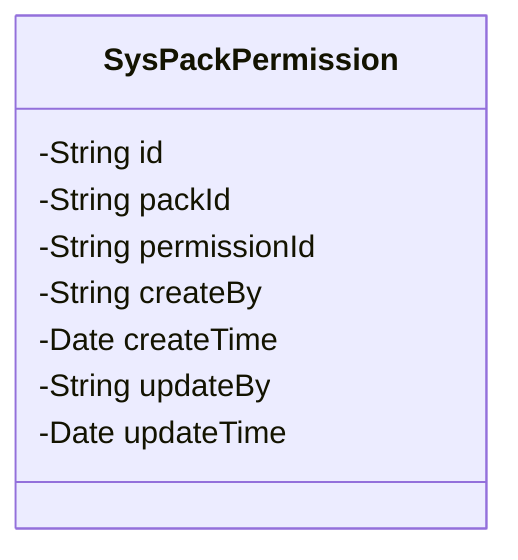
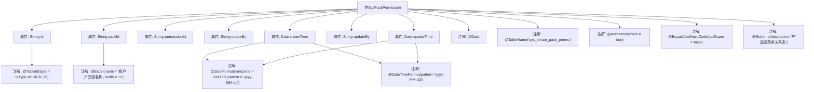

# 基础信息

|      |      |
|------|------|
| 名称 | SysPackPermission |
| 编码语言 | .java |
| 代码路径 | JeecgBoot/jeecg-boot/jeecg-module-system/jeecg-system-biz/src/main/java/org/jeecg/modules/system/entity/SysPackPermission.java |
| 包名 | org.jeecg.modules.system.entity |
| 依赖项 | ['java.io.Serializable', 'java.util.Date', 'com.baomidou.mybatisplus.annotation.IdType', 'com.baomidou.mybatisplus.annotation.TableId', 'com.baomidou.mybatisplus.annotation.TableName', 'io.swagger.v3.oas.annotations.media.Schema', 'lombok.Data', 'com.fasterxml.jackson.annotation.JsonFormat', 'org.springframework.format.annotation.DateTimeFormat', 'org.jeecgframework.poi.excel.annotation.Excel', 'lombok.EqualsAndHashCode', 'lombok.experimental.Accessors'] |
| 概述说明 | SysPackPermission类定义产品包菜单关系，含主键、名称、菜单ID及创建更新信息。 |

# 说明

SysPackPermission类用于表示产品包与菜单的关系表，主要包含以下字段：主键用于唯一标识每条记录，租户产品包名称标识所属的产品包，菜单id关联具体的菜单项，创建人记录数据创建者，创建时间记录数据创建时间，更新人记录最后修改者，更新时间记录最后修改时间。该类用于管理和维护产品包与菜单之间的关联关系。

# 类列表 Class Summary

| 名称   | 类型  | 说明 |
|-------|------|-------------|
| SysPackPermission | class | SysPackPermission类表示产品包菜单关系表，包含主键、租户产品包名称、菜单id、创建人、创建时间、更新人、更新时间等字段。 |

## 类 SysPackPermission

|      |      |
|------|------|
| 访问范围 | @Data;@TableName("sys_tenant_pack_perms");@Accessors(chain = true);@EqualsAndHashCode(callSuper = false);@Schema(description="产品包菜单关系表");public |
| 类型 | class |
| 名称 | SysPackPermission |
| 说明 | SysPackPermission类表示产品包菜单关系表，包含主键、租户产品包名称、菜单id、创建人、创建时间、更新人、更新时间等字段。 |

### UML类图

这段代码定义了一个名为 `SysPackPermission` 的类，该类实现了 `Serializable` 接口，用于表示产品包菜单关系表。类中包含多个私有字段，如 `id`（主键编号）、`packId`（租户产品包名称）、`permissionId`（菜单id）、`createBy`（创建人）、`createTime`（创建时间）、`updateBy`（更新人）和 `updateTime`（更新时间）。这些字段通过注解（如 `@TableId`、`@Excel`、`@Schema` 等）进行了进一步的定义和描述，以便在数据库映射、Excel导出和API文档生成等场景中使用。

### 内部方法调用关系图

这段代码定义了一个名为`SysPackPermission`的Java类，用于表示产品包菜单关系表。该类包含了多个属性，如`id`、`packId`、`permissionId`等，并且使用了多种注解来配置这些属性的行为。例如，`@TableId`注解用于标识主键，`@Excel`注解用于配置Excel导出时的列名和宽度，`@JsonFormat`和`@DateTimeFormat`注解用于配置日期格式。类上还使用了`@Data`、`@TableName`等注解来简化代码和配置表名。

### 字段列表 Field List

| 名称  | 类型  | 说明 |
|-------|-------|------|
| createBy | String | 创建人字段定义。 |
| id | String | 实体类主键字段使用自定义ID生成策略。 |
| serialVersionUID = 1L | long | 定义了一个私有的静态常量serialVersionUID，值为1L。 |
| createTime | Date | 创建时间字段，格式为yyyy-MM-dd，时区GMT+8。 |
| permissionId | String | 菜单ID字段，用于标识菜单的唯一字符串。 |
| updateTime | Date | 更新时间的日期格式为yyyy-MM-dd，时区为GMT+8。 |
| packId | String | 租户产品包名称字段，存储租户产品包的唯一标识。 |
| updateBy | String | 更新人字段用于记录最后修改数据的用户。 |

### 方法列表 Method List

| 名称  | 类型  | 说明 |
|-------|-------|------|

