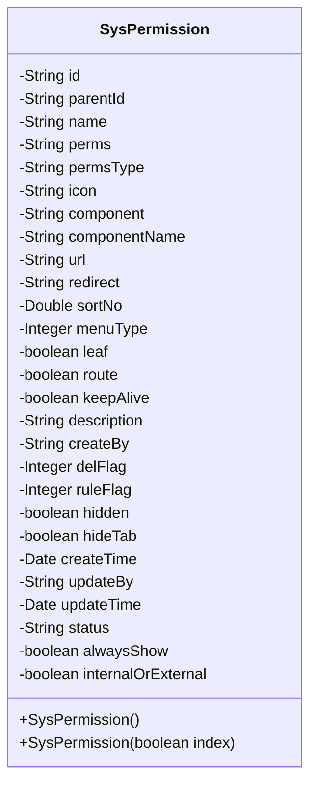

# 基础信息

|      |      |
|------|------|
| 名称 | SysPermission |
| 编码语言 | .java |
| 代码路径 | JeecgBoot/jeecg-boot/jeecg-module-system/jeecg-system-biz/src/main/java/org/jeecg/modules/system/entity/SysPermission.java |
| 包名 | org.jeecg.modules.system.entity |
| 依赖项 | ['java.io.Serializable', 'java.util.Date', 'com.baomidou.mybatisplus.annotation.IdType', 'com.baomidou.mybatisplus.annotation.TableField', 'com.baomidou.mybatisplus.annotation.TableId', 'lombok.Data', 'lombok.EqualsAndHashCode', 'lombok.experimental.Accessors', 'org.jeecg.common.aspect.annotation.Dict', 'org.jeecg.modules.system.constant.DefIndexConst'] |
| 概述说明 | SysPermission类定义系统权限，包含ID、父ID、菜单名等属性。 |

# 说明

SysPermission类用于定义系统权限，包含多个关键属性。这些属性包括ID，用于唯一标识权限；父ID，用于表示权限的层级关系；菜单名，描述权限对应的菜单名称；权限编码，用于标识权限的唯一编码；图标，表示权限的视觉标识；组件，指定权限关联的前端组件；路径，定义权限的访问路径；排序，用于控制权限在系统中的显示顺序；类型，用于区分权限的类别。这些属性共同构成了系统权限的完整定义。

# 类列表 Class Summary

| 名称   | 类型  | 说明 |
|-------|------|-------------|
| SysPermission | class | SysPermission类定义系统权限，包含ID、父ID、菜单名、权限编码、图标、组件、路径、排序、类型等属性。 |

## 类 SysPermission

|      |      |
|------|------|
| 访问范围 | @Data;@EqualsAndHashCode(callSuper = false);@Accessors(chain = true);public |
| 类型 | class |
| 名称 | SysPermission |
| 说明 | SysPermission类定义系统权限，包含ID、父ID、菜单名、权限编码、图标、组件、路径、排序、类型等属性。 |

### UML类图

**描述：**  
`SysPermission` 类是一个用于表示系统权限的实体类，包含了与权限相关的多个属性，如菜单名称、权限编码、菜单类型、是否叶子节点等。该类实现了 `Serializable` 接口，支持序列化。构造函数提供了默认初始化以及根据索引参数进行初始化的功能。这个类通常用于权限管理系统中，用于定义和操作系统的菜单和按钮权限。

### 内部方法调用关系图

```mermaid
graph TD
    A["类SysPermission"]
    B["属性: String id"]
    C["属性: String parentId"]
    D["属性: String name"]
    E["属性: String perms"]
    F["属性: String permsType"]
    G["属性: String icon"]
    H["属性: String component"]
    I["属性: String componentName"]
    J["属性: String url"]
    K["属性: String redirect"]
    L["属性: Double sortNo"]
    M["属性: Integer menuType"]
    N["属性: boolean leaf"]
    O["属性: boolean route"]
    P["属性: boolean keepAlive"]
    Q["属性: String description"]
    R["属性: String createBy"]
    S["属性: Integer delFlag"]
    T["属性: Integer ruleFlag"]
    U["属性: boolean hidden"]
    V["属性: boolean hideTab"]
    W["属性: Date createTime"]
    X["属性: String updateBy"]
    Y["属性: Date updateTime"]
    Z["属性: String status"]
    AA["属性: boolean alwaysShow"]
    AB["属性: boolean internalOrExternal"]
    AC["构造方法: SysPermission()"]
    AD["构造方法: SysPermission(boolean index)"]

    A --> B
    A --> C
    A --> D
    A --> E
    A --> F
    A --> G
    A --> H
    A --> I
    A --> J
    A --> K
    A --> L
    A --> M
    A --> N
    A --> O
    A --> P
    A --> Q
    A --> R
    A --> S
    A --> T
    A --> U
    A --> V
    A --> W
    A --> X
    A --> Y
    A --> Z
    A --> AA
    A --> AB
    A --> AC
    A --> AD
```

**描述：**  
该流程图展示了类`SysPermission`的结构，包括其属性和构造方法。类`SysPermission`包含多个属性，如`id`、`name`、`perms`等，用于描述系统权限的不同特征。类中还定义了两个构造方法，一个为默认构造方法，另一个为带参数的构造方法，用于初始化特定条件下的权限对象。流程图清晰地展示了类中各个属性与构造方法之间的关系，便于理解类的整体结构。

### 字段列表 Field List

| 名称  | 类型  | 说明 |
|-------|-------|------|
| internalOrExternal | boolean | 内部或外部标识符。 |
| createBy | String | 定义私有字符串变量createBy。 |
| hidden | boolean | 隐藏属性用于控制可见性。 |
| icon | String | 定义了一个私有字符串变量icon。 |
| menuType | Integer | 菜单类型字段，数据类型为整型。 |
| ruleFlag | Integer | 定义私有整型变量ruleFlag。 |
| leaf | boolean | 表字段标记为叶子节点，类型为布尔值。 |
| updateBy | String | 更新者字段为私有字符串类型。 |
| status | java.lang.String | Java类中声明了一个私有的字符串类型变量status。 |
| name | String | 定义了一个私有字符串类型变量name。 |
| parentId | String | 定义了一个私有字符串类型的父ID变量。 |
| alwaysShow | boolean | 私有布尔变量，控制是否始终显示。 |
| description | String | 定义了一个私有字符串变量description。 |
| id | String | 表ID字段使用指定ID类型，类型为字符串。 |
| component | String | 组件定义为私有字符串类型。 |
| createTime | Date | 私有日期类型变量createTime。 |
| serialVersionUID = 1L | long | 定义了一个私有的静态长整型常量serialVersionUID，值为1L。 |
| delFlag | Integer | 私有整型变量delFlag用于标识删除状态。 |
| sortNo | Double | 私有双精度浮点数变量sortNo。 |
| componentName | String | 定义了一个私有字符串变量componentName。 |
| keepAlive | boolean | 字段keepAlive用于控制连接保持状态。 |
| hideTab | boolean | 该代码定义了一个私有布尔变量hideTab。 |
| route | boolean | 字段route映射为数据库表字段is_route。 |
| updateTime | Date | 私有日期类型变量updateTime。 |
| url | String | 定义一个私有字符串变量url。 |
| redirect | String | 私有字符串变量redirect。 |
| perms | String | 定义了一个私有字符串变量perms。 |
| permsType | String | 定义私有字符串变量permsType。 |

### 方法列表 Method List

| 名称  | 类型  | 说明 |
|-------|-------|------|

