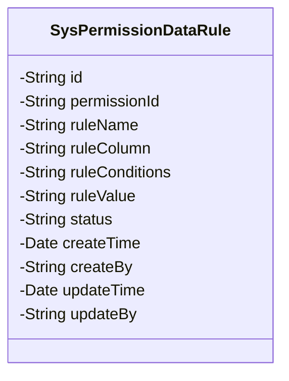
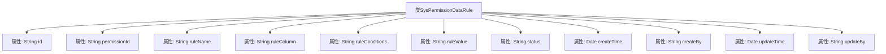

# 基础信息

|      |      |
|------|------|
| 名称 | SysPermissionDataRule |
| 编码语言 | .java |
| 代码路径 | JeecgBoot/jeecg-boot/jeecg-module-system/jeecg-system-biz/src/main/java/org/jeecg/modules/system/entity/SysPermissionDataRule.java |
| 包名 | org.jeecg.modules.system.entity |
| 依赖项 | ['java.io.Serializable', 'java.util.Date', 'com.baomidou.mybatisplus.annotation.IdType', 'com.baomidou.mybatisplus.annotation.TableId', 'lombok.Data', 'lombok.EqualsAndHashCode', 'lombok.experimental.Accessors'] |
| 概述说明 | SysPermissionDataRule类包含权限规则ID、菜单ID、规则名称、字段、条件、规则值、状态及创建修改信息。 |

# 说明

SysPermissionDataRule类主要用于管理权限规则，包含多个关键属性。权限规则ID用于唯一标识每条规则，菜单ID关联特定菜单。规则名称描述规则内容，字段指定应用规则的字段，条件定义规则逻辑，规则值提供具体条件值。状态表示规则是否启用。此外，类中还包含创建和修改信息，记录规则的创建时间和最后修改时间，确保规则的可追溯性和管理性。

# 类列表 Class Summary

| 名称   | 类型  | 说明 |
|-------|------|-------------|
| SysPermissionDataRule | class | SysPermissionDataRule类包含权限规则ID、菜单ID、规则名称、字段、条件、规则值、状态、创建及修改信息。 |

## 类 SysPermissionDataRule

|      |      |
|------|------|
| 访问范围 | @Data;@EqualsAndHashCode(callSuper = false);@Accessors(chain = true);public |
| 类型 | class |
| 名称 | SysPermissionDataRule |
| 说明 | SysPermissionDataRule类包含权限规则ID、菜单ID、规则名称、字段、条件、规则值、状态、创建及修改信息。 |

### UML类图

这段代码定义了一个名为 `SysPermissionDataRule` 的类，该类实现了 `Serializable` 接口，表示该类的实例可以被序列化。类中包含多个私有字段，分别用于存储权限数据规则的相关信息，如 `id`、`permissionId`、`ruleName` 等。这些字段通过注解进行标记，例如 `@TableId` 用于标识主键字段，`@Accessors(chain = true)` 表示支持链式调用。该类主要用于管理系统中权限数据的规则信息，包含规则的名称、条件、值以及创建和修改的时间和人等属性。

### 内部方法调用关系图

这段代码定义了一个名为 `SysPermissionDataRule` 的类，该类实现了 `Serializable` 接口，表示它可以被序列化。类中包含了多个属性，如 `id`、`permissionId`、`ruleName` 等，分别用于存储权限数据规则的相关信息。每个属性都有对应的注释，解释了其用途。类使用了 Lombok 注解 `@Data`、`@EqualsAndHashCode` 和 `@Accessors`，自动生成了 getter、setter、equals、hashCode 等方法，并且支持链式调用。

### 字段列表 Field List

| 名称  | 类型  | 说明 |
|-------|-------|------|
| permissionId | String | 私有字符串变量permissionId。 |
| createBy | String | 私有字符串变量createBy。 |
| ruleColumn | String | 定义私有字符串变量ruleColumn。 |
| status | String | 定义了一个私有字符串变量status。 |
| updateTime | Date | 私有日期类型变量updateTime。 |
| ruleName | String | 私有字符串变量ruleName。 |
| id | String | 表主键使用自定义ID生成策略。 |
| ruleValue | String | 定义一个私有字符串变量ruleValue。 |
| ruleConditions | String | 私有字符串变量用于存储规则条件。 |
| serialVersionUID = 1L | long | 定义序列化版本号的静态常量，值为1L。 |
| createTime | Date | 私有日期类型变量createTime。 |
| updateBy | String | 私有字符串变量updateBy用于记录更新者信息。 |

### 方法列表 Method List

| 名称  | 类型  | 说明 |
|-------|-------|------|

