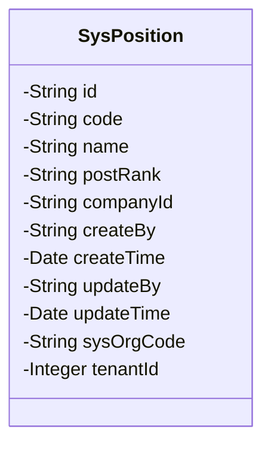

# 基础信息

|      |      |
|------|------|
| 名称 | SysPosition |
| 编码语言 | .java |
| 代码路径 | JeecgBoot/jeecg-boot/jeecg-module-system/jeecg-system-biz/src/main/java/org/jeecg/modules/system/entity/SysPosition.java |
| 包名 | org.jeecg.modules.system.entity |
| 依赖项 | ['com.baomidou.mybatisplus.annotation.IdType', 'com.baomidou.mybatisplus.annotation.TableId', 'com.baomidou.mybatisplus.annotation.TableName', 'com.fasterxml.jackson.annotation.JsonFormat', 'io.swagger.v3.oas.annotations.media.Schema', 'lombok.Data', 'lombok.EqualsAndHashCode', 'lombok.experimental.Accessors', 'org.jeecg.common.aspect.annotation.Dict', 'org.jeecgframework.poi.excel.annotation.Excel', 'org.springframework.format.annotation.DateTimeFormat'] |
| 概述说明 | 职务表类含ID、编码、名称、职级、公司ID，支持链式调用。 |

# 说明

职务表类是一个数据结构，用于存储和管理职务相关信息。该类包含多个关键字段，包括ID、编码、名称、职级和公司ID等。ID用于唯一标识每个职务记录，编码和名称分别表示职务的编号和具体名称，职级则用于表示职务的等级或层级，公司ID用于关联该职务所属的公司。此外，该类支持链式调用，这意味着可以连续调用多个方法，以简化代码编写和提高可读性。

# 类列表 Class Summary

| 名称   | 类型  | 说明 |
|-------|------|-------------|
| SysPosition | class | 职务表类，包含ID、编码、名称、职级、公司ID等字段，支持链式调用。 |

## 类 SysPosition

|      |      |
|------|------|
| 访问范围 | @Data;@TableName("sys_position");@EqualsAndHashCode(callSuper = false);@Accessors(chain = true);@Schema(description = "职务表");public |
| 类型 | class |
| 名称 | SysPosition |
| 说明 | 职务表类，包含ID、编码、名称、职级、公司ID等字段，支持链式调用。 |

### UML类图

**描述：**  
`SysPosition` 类是一个表示职务信息的实体类，包含了职务的编码、名称、职级、公司ID、创建人、创建时间、修改人、修改时间、组织机构编码和租户ID等属性。该类使用了多个注解来标记数据库表名、主键生成策略、字段描述等信息，适用于与数据库交互的场景。通过类图可以清晰地看到类的结构和属性，便于理解类的设计和使用。

### 内部方法调用关系图

```mermaid
graph TD
    A["类SysPosition"]
    B["属性: java.lang.String id"]
    C["属性: java.lang.String code"]
    D["属性: java.lang.String name"]
    E["属性: java.lang.String postRank"]
    F["属性: java.lang.String companyId"]
    G["属性: java.lang.String createBy"]
    H["属性: java.util.Date createTime"]
    I["属性: java.lang.String updateBy"]
    J["属性: java.util.Date updateTime"]
    K["属性: java.lang.String sysOrgCode"]
    L["属性: java.lang.Integer tenantId"]

    A --> B
    A --> C
    A --> D
    A --> E
    A --> F
    A --> G
    A --> H
    A --> I
    A --> J
    A --> K
    A --> L
```

这段代码定义了一个名为`SysPosition`的类，用于表示职务信息。类中包含多个属性，如`id`、`code`、`name`、`postRank`等，分别用于存储职务的唯一标识、编码、名称、职级等信息。每个属性都通过注解进行描述和映射，如`@Schema`用于描述字段的含义，`@TableId`用于标识主键，`@JsonFormat`和`@DateTimeFormat`用于格式化日期字段。这些属性和注解共同构成了一个完整的职务数据模型。

### 字段列表 Field List

| 名称  | 类型  | 说明 |
|-------|-------|------|
| companyId | java.lang.String | 公司ID字段，类型为字符串。 |
| updateBy | java.lang.String | 修改人字段定义为字符串类型。 |
| name | java.lang.String | 职务名称字段，类型为字符串。 |
| id | java.lang.String | 表ID字段，类型为分配ID，描述为ID，数据类型为字符串。 |
| tenantId | java.lang.Integer | 租户ID字段，类型为整型。 |
| postRank | java.lang.String | 职级字段，使用字典代码"position_rank"。 |
| updateTime | java.util.Date | 修改时间字段，使用GMT+8时区，格式为yyyy-MM-dd HH:mm:ss。 |
| createBy | java.lang.String | 字段`createBy`用于存储创建人信息。 |
| sysOrgCode | java.lang.String | 组织机构编码字段定义为系统组织代码。 |
| code | java.lang.String | 职务编码字段定义为字符串类型，宽度为15。 |
| createTime | java.util.Date | 定义创建时间字段，使用GMT+8时区，格式为yyyy-MM-dd HH:mm:ss。 |

### 方法列表 Method List

| 名称  | 类型  | 说明 |
|-------|-------|------|

